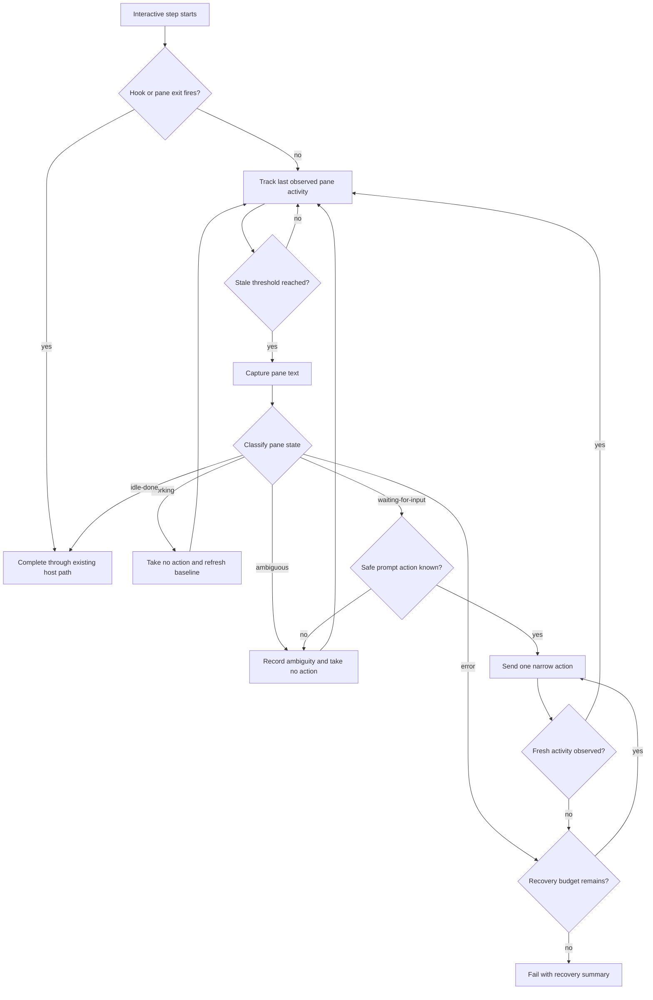

# Agent Error Recovery - Interactive Watchdog and Remediation

## Summary

Add a Phase 2 interactive recovery layer for unattended interactive steps. It keeps the live tmux-pane experience, but gives orch an external watchdog that can tell the difference between a working pane, a deliberately finished pane, a pane waiting for input, and a pane stuck on an error; only the stuck/error cases enter bounded remediation. Phase 1's headless recovery supplies the shared policy vocabulary and audit expectations, but interactive recovery uses pane-native detection and action primitives.

---

## Problem Frame

The original error-recovery requirements correctly identified that interactive runs fail differently from headless runs: the process may not produce a clean terminal event, and the workflow can sit forever at a pane that looks finished, stuck, errored, or waiting for a human. The original Phase 2 shape proposed staleness detection, pane capture, classification, and send-keys remediation, but it treated the headless recovery loop as if it could mostly carry over.

Phase 1 implementation changed the substrate. Headless recovery now lives at the autonomous `runRunner` seam: it classifies structured runner events, waits, forks from a clean checkpoint, runs a new subprocess attempt, watches per-attempt events for progress, and persists a recovery log. Interactive steps do not expose that same attempt stream. They are foreground tmux-pane sessions owned by the host, currently using auto-stop hooks as the happy-path completion signal. The code also explicitly rejects `recovery` on interactive steps until Phase 2 gives that option real semantics.

That means Phase 2 should be reframed around the problem interactive users actually have: unattended interactive workflows need a reliable external observer that knows when to complete, when to leave the pane alone, and when to remediate. Reusing Phase 1's policy concepts is useful; reusing Phase 1's execution loop directly would force a headless shape onto a pane-native problem.

---

## Key Decisions

- **Watchdog first, recovery second.** The core Phase 2 value is a pane watchdog that closes the known silent-hang gap left by signal-only auto-stop. Remediation is layered on top only after the watchdog has classified the pane as requiring action.
- **Interactive recovery is primarily for unattended interactive steps.** The default target is `autoStop: true` or an equivalent unattended interactive run. Human-driven interactive sessions should not be poked just because they are quiet.
- **Reuse Phase 1 policy and audit semantics, not the headless loop mechanics.** The interactive layer should share the concepts of classified errors, bounded attempts, no nudge stacking, and recovery logs, but its detection and actions are tmux-pane based.
- **Local pane-text classification is the first line.** Start with deterministic capture heuristics over pane text and activity timestamps. Screenshot or LLM judgment is an escalation path only when text is ambiguous.
- **Completion is also a watchdog outcome.** A pane classified as deliberately finished should let the workflow advance, not be treated as an error path that needs a "continue" nudge.
- **No-stacking still matters.** If orch sends input into a pane, it must never pile up repeated nudges while the previous action is unresolved.

---

## Actors

- A1. **Workflow author:** opts into unattended interactive behavior and expects the run to progress without manual pane cleanup.
- A2. **Human observer:** may watch the live pane and should not have normal interactive work interrupted by an over-eager watchdog.
- A3. **Interactive host:** owns the tmux pane, stop-channel wait, pane lifecycle, capture, and send-keys action surface.
- A4. **Runner adapter:** provides CLI-specific lifecycle signals and, where needed, resume/fork capabilities already exposed through the runner port.
- A5. **Interactive watchdog:** tracks last activity, captures pane state, classifies it, and decides whether to complete, wait, or remediate.
- A6. **Recovery strategy:** provides shared retry/fail/give-up policy and audit vocabulary, without depending on headless runner events.

---

## Algorithm Sketch

The interactive algorithm is a pane-state loop, not a headless subprocess retry loop. The watchdog lets existing hook and pane-exit signals win first, only classifies after real staleness, and only sends input for clearly actionable `waiting-for-input` or `error` states.

---

## Key Flows

- F1. **Hook completes the step fast path**
  - **Trigger:** An unattended interactive step's agent finishes normally and its stop hook signals orch.
  - **Actors:** A3, A4, A5
  - **Steps:** orch races the existing pane-exit wait against the stop signal. The stop signal wins. orch terminates the pane through the existing auto-stop path and completes the step.
  - **Outcome:** Phase 2 does nothing extra; it does not duplicate or second-guess the hook path.
  - **Covered by:** R1, R2, R3

- F2. **Watchdog completes a silently idle-done pane**
  - **Trigger:** An unattended interactive pane has no observed activity past the staleness threshold and no hook signal arrived.
  - **Actors:** A3, A5
  - **Steps:** The watchdog captures pane text, classifies the state as `idle-done`, and asks the host to complete the step through the same pane termination path used by auto-stop.
  - **Outcome:** The workflow advances without a human closing the pane. The run log records that the watchdog, not the hook, completed the step.
  - **Covered by:** R4, R5, R6, R11, R12

- F3. **Watchdog leaves a working pane alone**
  - **Trigger:** A pane crosses the staleness threshold, but capture/classification shows it is still doing legitimate work or is momentarily quiet.
  - **Actors:** A2, A3, A5
  - **Steps:** The watchdog records the classification, refreshes its activity baseline as appropriate, and takes no action.
  - **Outcome:** Long-running commands, spinners, streaming output, and human-observed sessions are not interrupted.
  - **Covered by:** R4, R5, R6, R7, R8

- F4. **Watchdog remediates a recoverable error or prompt**
  - **Trigger:** A stale unattended pane is classified as `error` or `waiting-for-input`.
  - **Actors:** A3, A4, A5, A6
  - **Steps:** The watchdog converts the pane state into a classified recovery condition, consults the bounded strategy policy, waits if required, and sends exactly one action into the pane: either a continue-style nudge for an error or the minimal key/input required to clear a recognized prompt. The watchdog then waits for fresh activity before any further action.
  - **Outcome:** The pane resumes work, completes, or eventually gives up with a legible recovery summary.
  - **Covered by:** R9, R10, R13, R14, R15, R16

- F5. **Recovery gives up**
  - **Trigger:** Remediation attempts exceed the configured attempt or wall-clock budget.
  - **Actors:** A3, A5, A6
  - **Steps:** The watchdog stops acting, fails the step, and persists the interactive recovery log.
  - **Outcome:** A genuinely broken pane cannot hold the run open indefinitely, and a future reader can see what orch observed and tried.
  - **Covered by:** R14, R15, R16, R17

---

## Requirements

**Scope and API**

- R1. Interactive recovery applies to unattended interactive steps, with `autoStop: true` as the primary v1 target. Manual human-driven interactive sessions remain quiet by default unless a later option explicitly opts them into watchdog action.
- R2. The existing signal-only auto-stop behavior remains the fast path. A stop hook that fires should complete the step without waiting for watchdog staleness.
- R3. Phase 2 gives interactive `recovery` semantics instead of treating it as a headless option. Until those semantics are present, interactive steps must continue rejecting unsupported recovery configuration rather than accepting a no-op.

**Watchdog detection**

- R4. The watchdog measures staleness as wall-clock time since last observed pane activity, not as a fixed number of unchanged polls. New output or a changed capture refreshes `lastActivityAt`.
- R5. The staleness threshold and poll cadence are separate settings. The threshold defines "quiet too long"; the poll cadence only controls sampling granularity.
- R6. When a pane is stale, the watchdog classifies it into exactly one state: `working`, `idle-done`, `waiting-for-input`, or `error`.
- R7. `working` means no action. A quiet pane that still has credible signs of active work must not be nudged or closed.
- R8. `idle-done` means complete the step, not recover it. This closes the signal-missed auto-stop gap without polluting the agent session with continuation text.
- R9. `waiting-for-input` means orch may send a narrow, state-specific action only when the prompt is recognizable and safe to clear. Ambiguous prompts are not guessed through.
- R10. `error` means orch may enter bounded remediation using the shared recovery policy vocabulary.

**Capture and classification**

- R11. Text capture is the default classifier input. It should reuse the pane text already available from tmux and ignore visual noise such as ghost composer text, stale prompt fragments, or an unchanged spinner frame.
- R12. Screenshot capture is an escalation path for ambiguous text, not a required first step. If a screenshot classifier is added, it must be optional and bounded so the watchdog remains cheap.
- R13. Classification must not depend on the same overloaded provider that may have caused the pane to stall. If heuristic classification cannot decide, orch records ambiguity and avoids destructive action.

**Remediation policy**

- R14. Interactive remediation is bounded by the same product promise as headless recovery: a broken provider or stuck pane cannot hold the workflow open indefinitely.
- R15. No-stacking applies to pane input. orch may send at most one remediation action per unresolved attempt, and it must observe fresh activity before sending another.
- R16. Remediation actions are conservative and visible in logs: the captured classification, chosen action kind, wait duration, and outcome are auditable.
- R17. On give-up, the step fails with a legible summary that names the dominant state/error class, attempts, and elapsed recovery time.

**Completion and audit**

- R18. The watchdog's completion, no-action, remediation, and give-up paths are observable in lifecycle logs. A reader should be able to tell whether a step ended by hook, pane exit, watchdog idle-done completion, or recovery give-up.
- R19. Interactive recovery logs should align with Phase 1 recovery-log concepts where practical, but the schema may include pane-specific fields such as captured state and action kind.
- R20. The top-level run status model remains unchanged: recovered steps complete normally; unrecovered steps fail normally.

**Testing**

- R21. The watchdog state machine is tested deterministically with a fake clock and scripted pane captures. Tests cover stale idle-done completion, working no-op, waiting-for-input action, error remediation, no-stacking, and give-up.
- R22. Host-level tests cover the race between pane exit, stop signal, staleness, and watchdog action so Phase 2 does not regress the signal-only auto-stop path.

---

## Acceptance Examples

- AE1. **Covers R2, R18.** Given an auto-stop interactive step whose stop hook fires, when orch receives the signal, then the step completes through the existing auto-stop path and the watchdog does not send any pane input.
- AE2. **Covers R4, R6, R8, R18.** Given an auto-stop interactive pane that returns to an idle prompt but no stop hook fires, when the pane remains unchanged past the staleness threshold and is classified `idle-done`, then orch completes the step and records watchdog completion.
- AE3. **Covers R4, R5, R7.** Given a pane running a long command whose output changes periodically, when the watchdog polls it, then each fresh observation refreshes `lastActivityAt` and no classification action fires.
- AE4. **Covers R6, R7, R13.** Given a stale pane with ambiguous text that cannot be confidently classified, when the watchdog evaluates it, then orch records ambiguity and does not send a destructive key or continue nudge.
- AE5. **Covers R9, R15, R16.** Given a pane waiting at a recognizable prompt that can be safely dismissed, when remediation runs, then orch sends one narrow action and waits for fresh activity before considering another action.
- AE6. **Covers R10, R14, R15, R17.** Given a pane stuck on a recoverable provider error, when remediation repeatedly fails without fresh activity, then orch stops at the give-up envelope and fails the step with a legible recovery summary.
- AE7. **Covers R1, R3.** Given a manual interactive step without unattended recovery enabled, when the pane is quiet because a human paused work, then orch does not classify or poke the pane.
- AE8. **Covers R18, R19, R20.** Given a step that recovered after one watchdog action, when the run completes, then state/logs show the classification, action, and outcome while the step itself is recorded as completed.

---

## Success Criteria

- An unattended multi-step interactive workflow no longer hangs forever when a completion hook is missed but the pane is visibly idle-done.
- The watchdog does not interrupt legitimately working panes or manual human-driven interactive sessions.
- Recoverable interactive errors are remediated within a bounded envelope, with no repeated nudge stack.
- A failed interactive recovery leaves enough logged evidence for a human to understand what orch saw, what it did, and why it stopped.
- A downstream planner can build Phase 2 without inventing the product boundary between completion, no-op, prompt-clearing, and recovery.

---

## Scope Boundaries

### In Scope

- External watchdog for unattended interactive steps.
- Staleness tracking based on last observed pane activity.
- Text-first pane classification into `working`, `idle-done`, `waiting-for-input`, or `error`.
- Conservative send-keys remediation for clearly classified `waiting-for-input` and `error` states.
- Shared recovery budgets, no-stacking semantics, and recovery audit concepts adapted from Phase 1.

### Deferred for Later

- General-purpose recovery for manual interactive sessions.
- Screenshot or LLM classifier as the default path.
- Rich interactive transcript capture beyond what is needed for watchdog classification and audit.
- Provider-specific prompt libraries for every possible permission or approval flow.
- A fully supported Codex fork RPC replacing rollout-copy emulation.

### Out of Scope

- Replacing headless recovery with interactive recovery.
- Treating a pane as failed solely because it is quiet.
- Sending repeated blind "continue" prompts into a live interactive session.
- Solving all first-run trust, auth, sandbox, MCP, or permission-prompt setup problems in this feature. Those can be prerequisites or separate unattended-run hardening work.

---

## Dependencies / Assumptions

- Phase 1 headless recovery exists and provides the shared vocabulary for classification, bounded attempts, no-stacking, and recovery logs.
- Signal-only interactive auto-stop exists and remains the fast path for normal turn completion.
- The tmux host owns enough pane lifecycle control to capture text, send keys, terminate panes, and record lifecycle events.
- Text capture is sufficient for the first useful classifier slice. Ambiguous cases are allowed to decline action.
- Workflow authors who want unattended interactive behavior already configure their agent steps to avoid known human prompts where possible.

---

## Outstanding Questions

### Resolve Before Planning

- (none)

### Deferred to Planning

- [Affects R1, R3][API] Whether interactive recovery is enabled by extending `recovery` to interactive steps, by a new `interactiveRecovery` option, or implicitly when `autoStop: true` is set.
- [Affects R4, R5][Policy] Default staleness threshold and poll cadence for unattended interactive steps.
- [Affects R6-R13][Classifier] Exact local heuristic rules for `working`, `idle-done`, `waiting-for-input`, `error`, and `ambiguous`.
- [Affects R8, R18][Host behavior] Whether watchdog `idle-done` completion should reuse the exact auto-stop termination path or have a distinct host outcome.
- [Affects R9, R15][Prompt clearing] Which `waiting-for-input` prompts are safe to clear in v1, and which must remain manual/ambiguous.
- [Affects R16, R19][Persistence] Exact recovery-log fields for pane classification, pane capture excerpts, and action kinds.
- [Affects R21, R22][Testing] Best scripted-pane fixture shape for deterministic host/watchdog tests.

---

## Sources & Research

- Original requirements: `docs/brainstorms/2026-06-02-feat-agent-error-recovery-requirements.md`
- Phase 1 plan and review notes: `docs/plans/2026-06-02-002-feat-agent-error-recovery-headless-plan.md`
- Interactive auto-stop requirements: `docs/brainstorms/2026-05-25-feat-interactive-auto-stop-brainstorm.md`
- Interactive auto-stop research: `docs/brainstorms/2026-05-25-interactive-auto-stop-research.md`
- Interactive user guide: `docs/public/guides/interactive-steps.md`
- Current Phase 1 recovery loop: `src/core/recovery/loop.ts`
- Current interactive step seam: `src/core/workflow.ts`
- Runner recovery and auto-stop capabilities: `src/runners/types.ts`
- Tmux host interactive lifecycle: `src/hosts/two-pane/tmux-host.ts`
- Tmux capture/send-keys primitives: `src/services/tmux/tmux-service.ts`
