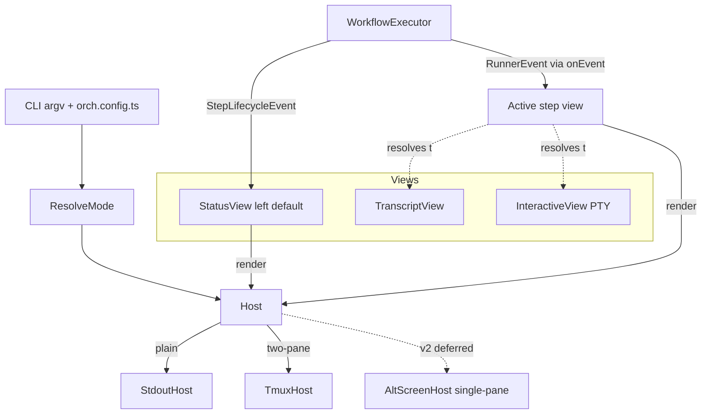
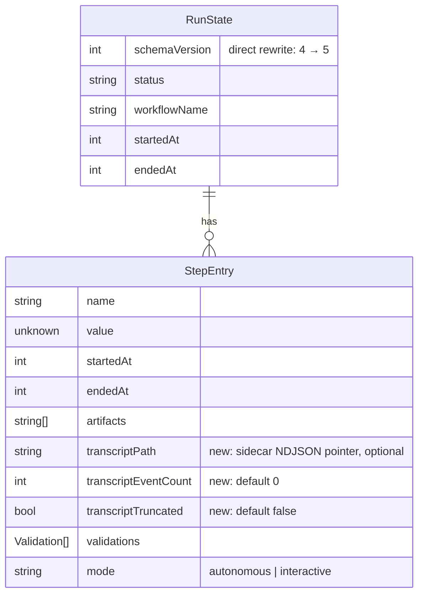

# orch reframe — step-declared views + run modes

## Enhancement Summary

**Deepened on:** 2026-04-18
**Sections enhanced:** 4 phases + cross-cutting (Phase C / single-pane deferred to v2 — see Phase C section for rationale)
**Agents used:** tmux/alt-screen/PTY/schema/NDJSON/registry researchers; architecture/typescript/simplicity/performance/security/races/spec-flow/patterns reviewers (13 total)

**Prerelease posture:** orch has no external users yet. This plan **rewrites things directly** — no schema migrations, no deprecation aliases, no back-compat shims. If state shape changes, old `.orch/state/` is wiped by the user; if flags change, the old ones are removed outright.

### Starting state (as of 2026-04-23)

The pre-Phase-13 WIP was wrapped into seven commits on `feat/phase-5-claude-runner` and is the baseline this plan builds on. No `origin` remote is configured; this is local-only history.

**Baseline commit range:** `15f8ef3..1d45c4b` (after `983f094` "restore colors in interactive Claude sessions").

| Commit | Scope |
|---|---|
| `15f8ef3` | docs: Phase 13/14 plans + reframe brainstorms + tmux-commands reference |
| `7fae790` | Phase 13b: `TmuxService` port + `detect-tmux` |
| `ce1594d` | Phase 13c: `status-pane` + `status-loop` |
| `c118867` | Phase 14: state schema v4 with `PersistedWorkflowArgs` |
| `f1432ee` | `WorkflowArgs` + `onEvent` / `tmuxActive` on `WorkflowDeps`, `IS_SANDBOX` env allowlist, relaxed `CLAUDE_FLAG_DENYLIST` |
| `40f2125` | Phase 13d + 14: `--tmux`/`--observe` CLI wiring (`src/cli/tmux-wiring.ts`), `--prompt` positional, resume prompt overwrite |
| `1d45c4b` | Examples (`compound`, `riddle-solver-proper`, `two-pane-demo`, `multi-task-demo`, `orch.config.ts`), riddle-solver prompt seed, `implementation-phases.md` updates |

**Surface area that exists on this baseline (and is already touched by the reframe):**

| Reframe touchpoint | Current form on baseline | Reframe's move |
|---|---|---|
| `--tmux`, `--observe` flags | Accepted in `parseArgv` (`src/cli/main.ts`); exposed via `CliOpts` | Phase A **removes outright** → `--mode=two-pane` |
| `src/cli/tmux-wiring.ts` | Composes `maybeSetupTmux` + `tmuxDepsFromHandles` | Phase D **deletes**; logic migrates into `src/hosts/two-pane/tmux-host.ts` |
| `WorkflowDeps.onEvent` + `.tmuxActive` + `onStepEvent` | Parallel callback hooks on the deps bag | Phase A **removes all three** — the new `Host` port replaces them |
| Interactive-under-tmux refusal (`src/core/workflow.ts:244-250`) | `throw new Error(...)` when `deps.tmuxActive === true` | Phase D **deletes** — interactive steps go through `respawn-pane -k` |
| Raw `runnerEvent:JSON` line to right pane (`src/cli/tmux-wiring.ts:158`) | `tmux.sendKeys` with `${evt.kind}:${evt.type} ${JSON.stringify(evt)}` | Phase D **deletes** — replaced by `renderTranscriptLine` output |
| `src/services/tmux/*` (11-method service) | `TmuxService` port + `RealTmuxService` + `FakeTmuxService` + `initOrchSession` | Phase D **reuses** as-is via `TmuxHost`; no port changes |
| `src/observability/status-{pane,loop}.ts` | Pure `renderStatusPane` + event-driven loop | Phase D **reuses** as the default `StatusView` implementation |
| `src/state/state-store.ts` | `schemaVersion: 4` with `parseV2`/`parseV3`/`parseV4` branches | Phase E **bumps to v5** and deletes all three legacy parsers (prerelease rewrite; no migration) |
| `examples/{compound,riddle-solver-proper,two-pane-demo,multi-task-demo}` | All present, documented; `two-pane-demo` / `multi-task-demo` bypass the workflow DSL on purpose | Phase E decides per example: fold into `examples/compound` or delete |
| `src/core/workflow.ts` `WorkflowArgs` / `WorkflowFn` | `workflow(name, (run, args) => ...)` with optional two-arg callback | **Untouched.** Reframe doesn't alter the DSL shape. |

**What the reframe does *not* touch on this baseline:** `Runner` interface, `runRunner` / `runInteractive` signatures, `ProcessService`, `GitService`, `FsService`, `AsyncLocalStorage` parallel guard, `step.define` overloads, validators, config discovery (extended, not replaced), CLI commands `runs` / `status` / `dry-run`.

**Blockers on the baseline that the plan's 🔴 list already flagged:**

1. `src/state/state-store.ts:39` is at `schemaVersion: z.literal(4)` — the plan's "v5" bump is exactly right (confirmed, not speculative). `parseV2` / `parseV3` / `parseV4` all live at `state-store.ts:176-222`; Phase E deletes all three.
2. Runner validation via `runId()` smart constructor exists at `src/state/run-id.ts:7-18` — Phase E just has to call it before any fs access in `orch logs`.
3. No import-time registry side effects exist yet — nothing to fix, only a shape to keep.
4. Fire-and-forget `void tmux.sendKeys(...).catch(...)` is live at `src/cli/tmux-wiring.ts:158` — Phase D's per-pane serial chain is required before the `respawn-pane -k` interactive path can land.

**Notes for the next session starting Phase A:**

- `bun run check` is green on the baseline (668 pass / 5 skip / 0 fail).
- Branch to cut from: `feat/phase-5-claude-runner` at `1d45c4b`. Name suggestion: `feat/phase-a-run-modes`.
- No `origin` is configured; running `git push` requires adding one first.
- `CLAUDE_FLAG_DENYLIST` no longer denies `--dangerously-skip-permissions`; sandboxed workflows opt in explicitly. Keep this in mind when reading Phase A's banner / mode resolution copy.

### 🔴 Blockers (must fix before Phase A lands)

1. **Schema version must be v5, not v3.** Plan originally said bump `schemaVersion` 2 → 3, but `src/state/state-store.ts:39` already defines v4. Using version `3` would collide with the existing v3 parser. **Change every "v2 → v3" in this plan to "v5" (direct rewrite)** (risk table, Phase E deliverables, ERD). Since prerelease, **delete** the v2/v3/v4 parser branches at `state-store.ts:228–242` and replace with a single `parseV5`. Users with pre-v5 state nuke `.orch/state/` and re-run.
2. **Path traversal in `orch logs <runId>`.** Phase E does not specify runId validation. `orch logs "../../../etc/passwd"` would traverse. **Fix:** call the existing `runId()` smart constructor (`src/state/run-id.ts:7-18`, regex `/^r-\d{4}-\d{2}-\d{2}-[a-z0-9]{6}$/`) before any fs access; exit CONFIG_ERROR on mismatch. Add integration test `tests/integration/cli/logs-path-traversal.test.ts`.
3. **Registry side-effects contradict CLAUDE.md rule #8.** Phase E line 251 says "registers `transcript`/`interactive` at module import time" but line 357 says "no side effects at module import time." **Fix:** export `registerBuiltinViews(registry)` and call it from the single composition root (`src/cli/deps.ts`). Same for `registerBuiltinHosts`. No auto-registration on import.
4. **Fire-and-forget `sendKeys` race with `respawn-pane -k`.** Current `tmux-wiring.ts:158` uses `void tmux.sendKeys(...).catch(...)` — a pending transcript line can land on the replacement interactive agent's stdin (Claude receives `▸ tool: write_file(...)` as literal keystrokes). **Fix:** per-pane serial promise chain (`paneQueues[paneId] = paneQueues[paneId].then(...)`); `respawn-pane -k` enqueues behind any pending `sendKeys`. Eliminates the entire class of R2/R5/R9 races enumerated in the race review.

### 🟠 High-impact should-fix

5. **ANSI / C0 / OSC poisoning of transcript.** Assistant messages and tool results are stored raw in `StepEntry.transcript`. A malicious MCP tool returning `\x1b]52;c;<base64>\x07` hijacks the clipboard when `orch logs` prints it. **Fix:** strip on print (not on store) — keep `\n`/`\t`, drop C0/C1 controls, CSI `\x1b[...`, OSC `\x1b]...\x07|\x1b\\`, DCS. Apply to `renderTranscriptLine` output and every TTY write path. Add acceptance: "text-mode output contains no bytes < 0x20 except `\n` and `\t`."
6. **Transcript inline in `state.json` causes write amplification.** `FileStateStore.#doSaveStep` does full read-modify-write on every `saveStep`. With 1000 events × ~2KB × 10 steps ≈ 20 MB rewritten per event. **Fix:** sidecar append-only `.orch/<runId>/steps/<name>.transcript.ndjson`; `state.json` stores only `{transcriptPath, eventCount, truncated}`. `orch logs` streams the NDJSON; no Zod-parse the whole buffer. Add `.max(10_000)` poison guard on any inline variant.
7. **Placeholder `cat` in Phase D must stay a non-interpreting passthrough.** If a future refactor swaps `cat` for `bash`/`sh`, every transcript line becomes shell input. Add an inline comment in `interactive-pane.ts` + runtime assertion.
8. **Transcript fan-out spawns one `tmux` per event.** `sendKeys` shells out per call; at 50 events/sec that's 50 forks/sec (~5-15 ms each on macOS). **Fix:** 50 ms debounce + max-1-inflight coalescer (mirrors `status-loop.ts:77-106`); batch via `tmux load-buffer -b <id> -; paste-buffer -t <pane> -b <id> -d` — one fork per batch.
9. **SIGWINCH during PTY takeover scribbles over the child.** Parent's resize handler re-paints the host header into territory the child owns. **Fix:** host state machine `{RENDERING_TRANSCRIPT, DRAINING_EVENTS, PTY_OWNS_SCREEN, RESTORING}`; parent SIGWINCH is a no-op in `PTY_OWNS_SCREEN` and only forwards `resize(cols, rows)` to the child.
10. **Alt-screen leaks on SIGINT/exception.** `process.stdout.write('\x1b[?1049l')` in an async handler may not land before exit. **Fix:** `fs.writeSync(1, '\x1b[?1049l\x1b[?25h')` synchronously from `process.on('SIGINT'|'SIGTERM'|'uncaughtException'|'exit')`, guarded by a `teardownOnce` flag.
11. **Exit code table undefined.** Plan says "exits non-zero" in multiple places without distinguishing step failure vs. config error vs. SIGINT. **Fix:** 0 ok, 1 step runtime failure, 2 CONFIG_ERROR, 130 SIGINT, 143 SIGTERM. Add to Acceptance Criteria.
12. **Resume flow per mode not specified.** Add Story 1.6 "Resume after failure in each mode." Mode resolves against the resuming terminal, not the original run. Document transcript replay semantics (likely: left pane rebuilds status rollup from prior `step:complete` events; right pane starts empty until the next step).
13. **`parallel:branch-update` breaks `step:*` invariant.** Existing `StepLifecycleEvent` variants all use the `step:` prefix; status-loop switches don't handle a `parallel:*` event, so it silently drops. **Fix:** rename to `step:parallel-branch-update` OR extract a separate `ParallelLifecycleEvent` type with its own `onParallelEvent` hook. Document the `applyEvent` touchpoints in Phase D deliverables.

### 🟡 Trim / defer (simplicity)

14. **Brand language is premature.** `PaneRole = 'left' | 'right'` is a two-literal union; "brand" adds no safety. Drop the word in lines 106, 149. `ViewKind` also skips the brand in v1 — add the open-union `ViewKindRegistry` interface-augmentation pattern (cost-free, prevents breaking API change when v2 widens it).
15. **Drop `RunModeSource + reason` as call-site metadata.** The banner consumes them once. Compose the banner string where each branch fires. Saves a type and fields threaded through every call site.
16. **Banner default-silent with `--verbose` gate.** Printing on every TTY invocation is noise once users know their setup. (Or, if kept: stderr not stdout, matching `gh`/`kubectl` convention.)
17. **`--tmux`/`--observe` removed in Phase A (hard error, no deprecation aliases).** Prerelease — no users to warn. `parseArgv` rejects with "unknown flag; use --mode=two-pane" and links docs.
18. **`ViewSink` abstraction is over-layered.** `StepView.render(event, host, pane)` — host already knows how to write. Drops a type + thread-through.
19. **`resolveView` → tagged union or singleton `SilentView`.** `{view, pane} | 'silent'` mixes object and string discriminants. Either `{kind: 'silent'}` tagged or always return a `{view, pane}` where `SilentView` is a no-op implementation.
20. **Single-switch host selection instead of `HostRegistry` in v1.** Three built-in hosts selected by `switch(mode)` is enough; registry lands when the first third-party host exists.

### Key findings cross-cutting the phases

- **Sidecar NDJSON for transcripts** (#6) is the single biggest architectural improvement — propagates to performance (#8), migration (#1), security (#5), and `orch logs` ergonomics.
- **Host as sole seam** — **remove** `onStepEvent`/`onEvent` callbacks alongside `--tmux`/`--observe` (prerelease — no deprecation window). Keeping both violates CLAUDE.md rule #3 (tests end up mocking both).
- **Failure rendering is host-specific, not observability.** `failure-render.ts` under `src/observability/` miscategorizes. Split into pure `FailureSummary` value (core) + per-host renderers (`src/hosts/{plain,two-pane}/failure-*.ts`; `single-pane` variant lands with Phase C when it's revisited).
- **Bun PTY (`terminal:` option) is POSIX-only.** Windows fallback path = `stdio: 'inherit'` + `FORCE_COLOR=3`. Document the platform limit; runtime-guard in `runInteractive`.
- **Derived idle clock.** `idle = now() - lastEventAt` eliminates the reset-vs-tick race entirely (R3). No mutable tick state.
- **Atomic state.json writes.** Write to `<path>.tmp.<pid>`, then `fs.rename` — POSIX-atomic on same filesystem. Guard against kill-during-write corruption (R11).

### References captured

- [tmux 3.2 CHANGES](https://raw.githubusercontent.com/tmux/tmux/3.2/CHANGES) — `respawn-pane -c`, `wait-for -S`, reliable hooks
- [tmux Issue #2679](https://github.com/tmux/tmux/issues/2679) — zombie race on pane exit (timeout mitigation)
- [tmux Issue #3090](https://github.com/tmux/tmux/issues/3090) — orphaned ANSI escape sequences
- [Bun Terminal API](https://bun.com/reference/bun/Terminal) — 1.3.5+ PTY option, POSIX-only
- [NDJSON Best Practices](https://ndjson.com/best-practices/) — flat envelope, ISO 8601 timestamps
- [ci-info](https://github.com/watson/ci-info) — reference detector list (50+ CI platforms)
- [NO_COLOR standard](https://no-color.org/) + `FORCE_COLOR` precedence
- [Claude Code subagents](https://code.claude.com/docs/en/sub-agents) — priority-resolved, file-backed registry shape
- [Zod v3 `.optional().default([])` field ordering](https://github.com/colinhacks/zod/issues/2491)
- [chalk supports-color](https://github.com/chalk/supports-color#info) — TTY detection rules

---

## Overview

Re-frame `orch` around two orthogonal concepts:

1. **Views** — each step declares *what* to show while it runs (`interactive` | `transcript`), or opts out with `silent: true`. Agents ship a default view.
2. **Run modes** — `plain` | `two-pane` define *where* views render (v1). `single-pane` is reserved in the type but deferred to v2. One workflow file, two host targets in v1, zero edits.

The existing core (runners, state, validators, workflow DSL, tmux service) stays; the mental model around observability and interactivity changes. **Not a rewrite** — a renaming + wiring shift that collapses the current `--tmux` / `--observe` forks into a shared view model, deletes the interactive-under-tmux refusal (`workflow.ts:249`), and replaces the raw `runnerEvent:{...}` dump on the observe pane with a readable transcript.

**v1 ships four phases (A, B, D, E).** Phase C (`single-pane` alt-screen host) is **deferred to v2** — too much hand-rolled terminal machinery for a mode `--mode=plain` already covers; when we revisit, we'll reach for a TUI library (opentui / Ink / blessed) instead of reimplementing ~30% of a TUI runtime by hand. v2 (single-pane via TUI lib, sidecars, custom view plugins, layout trees, tmux hotkeys, IPC) stays deliberately out of scope — every v1 API is designed so v2 is additive.

**Prerelease posture:** orch has no external users. Any shape change in this plan is applied directly — no deprecation aliases, no schema migration code, no rollback runbooks, no back-compat shims. If a user has old state or old flags, they wipe and re-run.

## Problem Statement

Phase 13's tmux shape drifted from the DX the user actually wants:

- **Observation is unreadable.** The right pane dumps `runnerEvent:JSON` via `tmux-wiring.ts:158`. Parsers can consume it; humans can't.
- **Interactive refuses to run under tmux.** `workflow.ts:249` throws when `deps.tmuxActive === true`. The `examples/compound/` workflow documents the conflict. Users have to pick: observability or interactivity.
- **No per-step "show this step like *this*" knob.** Today every autonomous step is observed via a single global pane; every interactive step takes the foreground. There is no middle ground and no per-step override.
- **Parallel branches share one observe pane.** `tests/integration/cli/tmux-wiring.integration.test.ts` proves all branches stream into the same pane in arrival order — garbage for any real parallel debug session.
- **`two-pane-demo.ts` and `multi-task-demo.ts` work, but bypass orch.** They prove the target UX (swappable right pane, status left, `respawn-pane` to swap tasks) but none of their code runs through the workflow DSL. orch should *be* the thing that wires this.
- **CI / piped runs are awkward.** The `--tmux` flag is either "on" or "off"; there is no declared CI-native mode. GitHub Actions users currently get raw `[orch]` / `[stepname]` lines that aren't structured for ingestion.

## Proposed Solution

**Three-mode mental model backed by a host-agnostic view model.**

| Concept | Shape in v1 | Where it's resolved |
|---|---|---|
| **View kind** | `'interactive' \| 'transcript'` (open union), plus `silent: true` | step-level, agent default |
| **Pane** | `'left' \| 'right'` | step-level override, agent default |
| **Run mode** | `'plain' \| 'single-pane' \| 'two-pane'` (v1 wires only `plain` + `two-pane`; `single-pane` reserved, exits 2 with deferral message) | CLI flag > env (`CI`) > TTY + tmux detect |
| **Host** | `plain`=stdout, `two-pane`=tmux (`single-pane`=alt screen deferred to v2) | run mode picks the host |
| **Agent** | ships default view + default pane | `defineRunner()` config |
| **Config** | `orch.config.ts` with `defaultMode` knob | discovered upward from cwd |

**Mode resolution order (v1):** `--mode=<x>` > `CI=true → plain` > TTY + tmux ≥ 3.2 → `two-pane` > anything else → `plain`. Autodetect **never picks `single-pane`** in v1 (deferred); `TTY only` (no tmux) falls to `plain`. Explicit `--mode=single-pane` exits 2 with "single-pane mode deferred to v2 — use --mode=plain or --mode=two-pane".

**View/pane resolution order:** step-level override > agent default (`claude`/`codex` each expose one) > built-in default (`transcript` on `right`).

Both v1 modes share a single `RunnerEvent`-consuming `TranscriptRenderer`, a single `StepLifecycleEvent` consumer, and a single `View` interface. `plain` renders to stdout. `two-pane` renders into tmux panes. `single-pane` (alt screen) is deferred to v2 — the `Host` seam is designed so it slots in without touching workflow files or existing hosts. Swapping hosts does not touch the workflow file.

## Technical Approach

### Architecture



Key seam: `StepView` (new) is the thing steps declare; `Host` (new) is the thing modes pick. Existing `TmuxService`, `ProcessService`, `runRunner`, `runInteractive`, workflow state — untouched in shape.

### Mapping: existing code → reframe

| Today | After reframe | Notes |
|---|---|---|
| `--tmux` flag | `--mode=two-pane` | `--tmux` **removed outright** in Phase A (prerelease, no deprecation period). |
| `--observe` flag | `--mode=two-pane` (transcript default on right pane) | `--observe` **removed outright** in Phase A. Raw JSON dump deleted. |
| `src/observability/status-pane.ts` (`renderStatusPane`) | `StatusView` — `left` pane's default `View` implementation | Pure renderer reused verbatim. |
| `src/observability/status-loop.ts` | `StatusView.attach(host)` | Loop semantics survive; wired through the `Host` port. |
| `src/cli/tmux-wiring.ts` (`setupTmux`) | `TmuxHost` implementation behind `Host` interface | 80% of body reused; raw-JSON `sendKeys` replaced with `TranscriptRenderer` output. |
| `workflow.ts:249` interactive-under-tmux refusal | **deleted** | Interactive steps get their pane via `tmux respawn-pane`, matching `two-pane-demo.ts`. |
| `RunnerEvent → JSON string → right pane` | `RunnerEvent → TranscriptRenderer → lines → right pane` | `TranscriptRenderer` is pure; all three modes share it. |

### Implementation Phases

#### Phase A — Run-mode scaffolding + `plain` mode

**Goal:** define the `RunMode` discriminant, autodetect, mode banner, and the `plain` host — a pure line-prefixing renderer of `RunnerEvent`s + `StepLifecycleEvent`s. Ships CI-native on day one, no tmux, no panes.

**Deliverables:**

- `src/core/run-mode.ts` — `RunMode = 'plain' | 'single-pane' | 'two-pane'`; `RunModeSource = 'flag' | 'env' | 'auto'`; `resolveRunMode({ flag, env, tty, tmuxAvailable }) → { mode, source, reason }`.
- `src/cli/main.ts` — `parseArgv` accepts `--mode=plain|single-pane|two-pane` and `--format=text|json` (plain only). `--mode=single-pane` is parsed but exits 2 with `single-pane mode deferred to v2 — use --mode=plain or --mode=two-pane`. **Delete** `--tmux` and `--observe` outright — passing either exits 2 with `unknown flag "--tmux"; use --mode=two-pane` (prerelease, no alias/deprecation period). First-run banner emitted by CLI entry point: `[orch] mode=<m> (<source>: <reason>) · --mode=... to override`. Suppressed under `--format=json`.
- `src/hosts/host.ts` — `Host` interface: `attach(view: StepView, pane: PaneRole): PaneAttachment`, `teardown(): Promise<void>`, `mode: RunMode`, `writeBanner(line: string): void`. `PaneRole = 'left' | 'right'` (v1 only these two).
- `src/hosts/plain/plain-host.ts` — `createPlainHost({ stdout, format: 'text' | 'json' }): Host`. In `text` mode emits `[orch] ...` lines for `StepLifecycleEvent`s and `[<stepname>] ...` lines for `RunnerEvent`s (matches Story 2 / Mode 1). In `json` mode emits one JSONL object per event: `{ts, run, ev, step, ...payload}`.
- `src/hosts/plain/transcript-text.ts` — `renderTranscriptLine(event: RunnerEvent, step: StepName): string`. Pure function; emits `assistant> …`, `▸ tool: name(args)`, `✗ error: …`. Reused verbatim by two-pane in Phase D (and by the future single-pane host when Phase C lands in v2).
- `src/hosts/index.ts` — single public barrel (`Host`, `createPlainHost`, `renderTranscriptLine`, `PaneRole`).
- `src/core/workflow.ts` — `WorkflowDeps.host: Host` becomes the sole observability seam. Default is `createPlainHost({ stdout: process.stdout, format: 'text' })`. **Delete** the existing `onStepEvent` / `onEvent` fields on `WorkflowDeps` and every call site (prerelease — no facade, no forwarding). Internal event dispatch inside the executor stays; it just feeds the host instead of parallel callbacks.
- `src/cli/commands/{run,resume}.ts` — wire `host = createPlainHost(opts.format)` for `--mode=plain`. `two-pane` defers to Phase D; `single-pane` exits 2 with the deferral message (see above).
- `docs/plans/implementation-phases.md` — replace Phase 13 with Phase 14–18 entries for A–E; keep Phase 13 history in place (landed).

**Tests:**

- **Unit** — `resolveRunMode`: flag wins, `CI=true` → `plain`, no TTY → `plain`, TTY + no tmux → `plain` (autodetect never picks single-pane in v1), TTY + tmux ≥ 3.2 → `two-pane`, TTY + tmux < 3.2 → `plain` + stderr warning (7 tests). First-run banner content + `--format=json` suppression (3 tests). `--tmux` / `--observe` rejected with `unknown flag` error + exit 2 (2 tests). Explicit `--mode=single-pane` exits 2 with the deferral message (1 test).
- **Unit** — `renderTranscriptLine` emits expected shapes for every `RunnerEvent` variant (`assistant`, `tool_use`, `tool_result`, `error`, `turn-complete`) including ANSI-strip round-trip (8 tests).
- **Unit** — `PlainHost`: `writeBanner` lines to stdout, `StepLifecycleEvent` → `[orch] step.start plan`, `RunnerEvent` → `[plan] assistant> …`, `--format=json` emits single-line JSON with `ts`, `run`, `ev`, `step`, payload (10 tests).
- **Integration (mocked)** — `tests/integration/cli/plain-mode.test.ts`: run a two-step `FakeRunner` workflow with `--mode=plain`; assert stdout snapshot matches golden; same run with `--format=json` emits parseable NDJSON with `run.start` → `step.start` → `step.end` → `run.end` in order (2 tests).
- **Integration (mocked)** — `tests/integration/cli/unknown-flag.test.ts`: `--tmux` and `--observe` each exit 2 with `unknown flag` message pointing at `--mode=two-pane`; no workflow starts (2 tests).
- **E2E (gated `RUN_REAL_CLAUDE=1`)** — `tests/e2e/plain-mode-real-claude.test.ts`: run the `riddle-solver` example in `--mode=plain --format=json`, assert structured envelopes land on stdout.

**Acceptance:**

- [x] `orch run compound "task" --mode=plain` produces the stdout shape in Story 2 / Mode 1 for a `FakeRunner`-backed workflow.
- [x] `orch run compound "task" --mode=plain --format=json` emits valid NDJSON, one event per line, `--format=json` suppresses the banner.
- [x] `--tmux` and `--observe` are removed outright; passing either exits 2 with `unknown flag "--tmux"; use --mode=two-pane` (prerelease — no alias/deprecation period).
- [x] First-run banner prints on every TTY invocation with the auto-detected mode, source, and override hint.
- [x] `bun run check` green.

**Out of scope for Phase A:** any `StepView` interface, any pane concept, any host other than `plain`, any non-text transcript.

### Research Insights (Phase A)

**NDJSON envelope — canonical shape (flat, time-first):**

```json
{"ts":"2026-04-18T14:30:00.123Z","run":"r-2026-04-18-a1b2c3","ev":"step.start","step":"plan"}
{"ts":"2026-04-18T14:30:01.456Z","run":"r-2026-04-18-a1b2c3","ev":"event","step":"plan","type":"assistant","text":"..."}
```

- ISO 8601 timestamps (not epoch ms) — matches GCP Cloud Logging, Heroku Logplex, Datadog conventions.
- Field order: `ts`, `run`, `ev`, `step`, then payload — enables fast discrimination without payload parse.
- Keep payload flat (no deep nesting) for query indexing.
- Line-buffered writes; `process.stdout.write(line + '\n')` is atomic on TTY for lines < 8 KB.

**CI detection — pragmatic list (no new 2025-2026 conventions):**

```ts
const CI_DETECTORS = [
  { name: 'github',  env: 'GITHUB_ACTIONS' },
  { name: 'gitlab',  env: 'GITLAB_CI' },
  { name: 'circle',  env: 'CIRCLECI' },
  { name: 'buildkite', env: 'BUILDKITE' },
  { name: 'azure',   env: 'TF_BUILD' },       // note uppercase on Azure DevOps
  { name: 'jenkins', env: 'JENKINS_URL' },
  { name: 'travis',  env: 'TRAVIS' },
  { name: 'generic', env: 'CI' },             // de facto fallback
]
```

Check `process.env.CI === 'true'` (string equality), not truthiness — some test runners set `CI=false` explicitly.

**Color flag precedence (lift from [no-color.org](https://no-color.org/) + chalk):**

`NO_COLOR` > `CLICOLOR_FORCE` > `FORCE_COLOR` > `CLICOLOR` > TTY check.

**Banner to stderr, not stdout.** Matches `gh`, `kubectl`, `cargo`. Preserves stdout for piping/NDJSON consumers. `--format=json` should reject at `parseArgv` when combined with `--mode≠plain` (no silent ignore).

**No deprecation flag collision to handle.** `--tmux` / `--observe` are removed in Phase A (prerelease); `parseArgv` treats them as unknown flags and exits 2.

**Transcript stripper scope (security).** `renderTranscriptLine` must strip C0 controls (0x00-0x1F except `\n`, `\t`), C1 controls (0x80-0x9F), CSI sequences `\x1b[...`, OSC sequences `\x1b]...(\x07|\x1b\\)`, and DCS. Not just SGR (`\x1b[...m`). Test fixture: feed `\x1b]52;c;cG93bmVk\x07` (OSC 52 clipboard); assert output contains no escape.

**Mode resolution — explicit override with missing capability errors (not falls back).** `--mode=two-pane` on tmux < 3.2 or no tmux → exit 2 with clear message. Silent fallback on explicit flag is a footgun. Auto-detect path stays as documented (demotes quietly).

**First-run banner edge cases:**
- banner prints once in two-pane; rendered as first line of left pane (not duplicated)
- (single-pane banner-before-alt-screen ordering is a Phase C / v2 concern)
- `--format=json` suppresses on stdout only; stderr still shows the banner

**Exit code table (load-bearing — referenced by Stories 1.5, 2):**

| Code | Meaning |
|---|---|
| 0 | Run completed, all steps ok |
| 1 | Step runtime failure |
| 2 | Config / validation error (including `ViewResolutionError`) |
| 130 | SIGINT |
| 143 | SIGTERM |

Add as a full table row in Acceptance Criteria.

**References:**
- https://ndjson.com/best-practices/
- https://github.com/watson/ci-info
- https://no-color.org/
- https://docs.github.com/en/actions/using-workflows/workflow-commands-for-github-actions (future v2 `::group::` emission)

---

#### Phase B — View abstraction (`transcript`, `interactive`, `silent`)

**Goal:** introduce the `StepView` seam. Two built-in view kinds for v1; `silent: true` as a separate opt-out. Agent default + step override resolution. Still no tmux; `two-pane` mode stays stubbed.

**Deliverables:**

- `src/core/view.ts` — `ViewKind = 'interactive' | 'transcript'` (open union with brand for future kinds). `StepView` interface: `kind: ViewKind`, `render(event: RunnerEvent | StepLifecycleEvent, sink: ViewSink): void`, `close(): void`. `ViewSink` is host-supplied (a line-writer on `plain`, a pane-writer on tmux).
- `src/core/view-registry.ts` — `resolveView({ stepConfig, agent, runMode }) → { view: StepView, pane: PaneRole } | 'silent'`. Resolution: `stepConfig.silent === true` → `'silent'` (no rendering, no pane allocation); otherwise step override > agent default > built-in. Throws `ViewResolutionError` if an interactive step resolves in `plain` mode (with the clear message from the brainstorm).
- `src/core/step.ts` — `AgentStepConfig` gains optional `view?: ViewKind` and `pane?: PaneRole` and `silent?: boolean`. Mutually exclusive: `silent: true` rejects with `view`/`pane`. Type remains backwards-compatible (all optional).
- `src/runners/runner.ts` — `Runner` gains `defaultView: { kind: ViewKind; pane: PaneRole }` (required on new runners; existing `claude` / `codex` get defaults wired in the same PR).
- `src/runners/claude/claude-runner.ts` — sets `defaultView: { kind: 'transcript', pane: 'right' }` for autonomous; interactive mode still resolves to `kind: 'interactive', pane: 'right'` at the executor level (not on the runner default).
- `src/runners/codex/codex-runner.ts` — same default as `claude`.
- `src/core/workflow.ts` — `runAgentStep` and `runInteractiveStep` both call `resolveView` and hand the resolved view to `deps.host.attach(...)`. Interactive parallel guard + capability guard stay. **Delete the `tmuxActive` interactive refusal** — moves to Phase D where tmux interactive is actually wired. For now, interactive under `two-pane` is still a `NotImplementedError` with a clear "wait for Phase D" message. Interactive under `--mode=plain` errors with the `ViewResolutionError` ("this step is interactive; use --mode=two-pane"). `single-pane` is deferred — not tested end-to-end in Phase B.
- `src/hosts/plain/plain-host.ts` — `attach(view, pane)`: `plain` ignores the pane, renders every non-silent view's output to stdout with the step-prefixed line format. `silent: true` never produces output.
- `src/core/types.ts` — `StepMode` unchanged; add `PaneRole = 'left' | 'right'` brand.

**Tests:**

- **Unit** — `resolveView`: step override wins over agent default, agent default wins over built-in, `silent: true` short-circuits, interactive in `plain` throws with the documented message, `silent + view` rejects at `step.define` parse time (8 tests).
- **Unit** — `step.define` new fields: accepts `view: 'transcript'`, `pane: 'left'`, `silent: true`; rejects `silent` + `view` combination; rejects unknown view kinds with list of accepted values (6 tests).
- **Unit** — Claude + Codex runner defaults wired; `defaultView` present with expected shape on both (2 tests).
- **Unit** — `PlainHost.attach` honors `silent: true` (no output) and the step-prefix for transcript views (3 tests).
- **Integration (mocked)** — `tests/integration/core/view-resolution.test.ts`: two-step workflow with one `silent: true` step; `plain` host stdout contains no output for the silent step, full output for the other. Same workflow with one step overriding to `view: 'transcript', pane: 'left'` — `plain` ignores the pane, logs still appear (2 tests).
- **Integration (mocked)** — `tests/integration/cli/interactive-plain-error.test.ts`: interactive step in `--mode=plain` emits the "this step is interactive; use --mode=two-pane" error to stderr and exits `CONFIG_ERROR` (1 test).

**Acceptance:**

- [ ] `step.define('refresh', { agent: claude(), silent: true })` compiles and produces no output in any mode.
- [ ] `step.define('plan', { agent: claude(), view: 'transcript', pane: 'left' })` is accepted; override resolves against agent + built-in defaults correctly.
- [ ] Interactive step in `--mode=plain` errors with the brainstorm's verbatim message and exits 2.
- [ ] Existing workflows (compound, riddle-solver) compile and run unchanged — the new fields are all optional.
- [ ] `bun run check` green.

**Out of scope:** any host other than `plain`; `files` / `approval` / `exec` view kinds; tmux anything.

### Research Insights (Phase B)

**`StepView.render` should split into two methods.** The `RunnerEvent | StepLifecycleEvent` union invites miscasts and `event as any` inside views that only care about one. Preferred:

```ts
interface StepView {
  readonly kind: ViewKind
  onRunnerEvent(event: RunnerEvent, host: Host, pane: PaneRole): void
  onLifecycleEvent(event: StepLifecycleEvent, host: Host, pane: PaneRole): void
  close(): void
}
```

Drop the `ViewSink` layer — the host already exposes `writeLine(pane, line)` or similar; views don't need a bespoke sink type.

**`silent` as a tagged result (no string-literal discriminant):**

```ts
type ViewResolution =
  | { readonly kind: 'attached'; readonly view: StepView; readonly pane: PaneRole }
  | { readonly kind: 'silent' }
```

Or simpler: make `SilentView` a no-op singleton implementation of `StepView`; `resolveView` always returns a view; callers never branch.

**Mutually exclusive `silent` + `view`/`pane` at the type level** (under `exactOptionalPropertyTypes`):

```ts
type AgentStepConfig = BaseStepConfig & (
  | { readonly silent: true;  readonly view?: never; readonly pane?: never }
  | { readonly silent?: false; readonly view?: ViewKind; readonly pane?: PaneRole }
)
```

Still keep Zod runtime check for `orch.config.ts` payloads.

**`ViewKind` — open-union via interface augmentation (pattern Fastify/Pinia use):**

```ts
// src/views/types.ts
export interface ViewKindRegistry {
  interactive: true
  transcript: true
}
export type ViewKind = keyof ViewKindRegistry

// A v2 plugin (future):
declare module '@orch/views' {
  interface ViewKindRegistry { approval: true }
}
```

Free to add now; retrofitting later is a breaking API change. Skip the opaque "brand" — only built-ins need autocompletion in v1, and a literal union already prevents accidental strings.

**`Runner.defaultView` should be optional with resolver fallback:**

```ts
interface Runner {
  // ... existing
  readonly defaultView?: { kind: ViewKind; pane: PaneRole }
}
// resolveView falls back to { kind: 'transcript', pane: 'right' }
```

Making it required breaks third-party runners. `defineRunner` can stamp the default when the field is absent:

```ts
export const defineRunner = (spec: RunnerSpec): Runner => ({
  defaultView: { kind: 'transcript', pane: 'right' },
  ...spec,
})
```

**`PaneAttachment` — not defined in the plan; must be.** RAII-style disposable handle:

```ts
interface PaneAttachment {
  readonly pane: PaneRole
  detach(): Promise<void>
}
// Or, TS 5.2+ Disposable:
interface PaneAttachment extends AsyncDisposable { readonly pane: PaneRole }
```

Required by Phase D's `respawn-pane -k` lifecycle — without an explicit `detach()`, the hand-off has no clean seam.

**Error class family.** `ViewResolutionError` extends a shared base with a typed code:

```ts
export class ViewResolutionError extends Error {
  readonly code = 'VIEW_RESOLUTION' as const
}
```

Consistent with `RunnerCapabilityError`, `InteractiveParallelError`, `RunNotFoundError`. Phase B's "NotImplementedError for interactive under two-pane" should become a named `ViewUnsupportedInModeError(stepName, mode, viewKind)` — mirrors the existing `RunnerCapabilityError` shape.

**Single shared layered resolver.** `resolveRunMode` and `resolveView` both implement `flag > config > agent-default > built-in`. Extract `resolveLayered<T>(layers, fallback) → {result, source, reason}` into `src/core/resolve-layered.ts`; three callers (modes, views, future `defaultMode`) share one envelope. Prevents drift.

**Registry wiring (resolves Blocker #3):** `src/views/view-registry.ts` exports `createViewRegistry()` (empty) + `registerBuiltinViews(reg)` (idempotent). Composition root (`src/cli/deps.ts`) calls `registerBuiltinViews(reg)` once — no import-time side effects.

**Edge cases:**
- `silent + view` rejected at `step.define` parse time (not first runtime use).
- Unknown view kind: error message must list accepted values (copy from brainstorm verbatim).
- Agent with no `defaultView`: resolver uses `{ kind: 'transcript', pane: 'right' }` and logs a one-time warning.

---

#### Phase C — `single-pane` mode (alt-screen host) — **DEFERRED to v2**

**Status:** deferred. orch v1 ships only `plain` and `two-pane`. The `single-pane` full-screen alt-screen TUI (htop/lazygit shape) is out of scope for v1 — too much hand-rolled terminal machinery (alt-screen enter/exit lifecycle, SIGWINCH/SIGINT signal-safe cleanup, PTY handoff state machine, cursor addressing, 40-col wrapping, nested-alt-screen guards) for a mode users can already cover with `--mode=plain` (CI, piped runs, TTY without tmux) or `--mode=two-pane` (TTY with tmux).

**When we revisit:** reach for a TUI library — [opentui](https://github.com/anomalyco/opentui) (Bun-native, React-style) is the current candidate; Ink and blessed are alternatives — rather than reimplementing ~30% of a TUI runtime by hand. The `Host` port shipped in Phase A stays unchanged; a future `createSinglePaneHost` wires the library to the same event stream and `attach(view, pane)` seam. No v1 code needs to change to enable this.

**Forward-compat shipped in v1:**

- `RunMode` type union keeps the `'single-pane'` slot (`src/core/run-mode.ts`).
- `parseArgv` accepts `--mode=single-pane` but exits 2 with `single-pane mode deferred to v2 — use --mode=plain or --mode=two-pane`.
- Autodetect **never** selects `single-pane` in v1 — `TTY + no tmux` falls to `plain`, not single-pane.
- `renderTranscriptLine` (Phase A) is written host-agnostic so the future single-pane host can reuse it unchanged.
- `StatusView` (Phase D) is written against the `Host` port — the future single-pane host attaches it on `left` the same way tmux does.

**Originally planned (kept as a checklist for when Phase C returns in v2):** `src/hosts/single-pane/{alt-screen-host,renderer,interactive-pane,ansi}.ts`; host state machine `{RENDERING_TRANSCRIPT, DRAINING_EVENTS, PTY_OWNS_SCREEN, RESTORING}`; SIGWINCH 100 ms debounce; synchronous `fs.writeSync` signal cleanup; Bun `terminal:` PTY wiring; 40-col wrap via ANSI-aware width; nested-alt-screen guard when running inside tmux. A TUI library subsumes most of this — re-evaluate the list at that time rather than treating it as work to do.

**References (preserved for the v2 revisit):**
- https://github.com/anomalyco/opentui (Bun-native TUI runtime — current preferred library)
- https://bun.com/reference/bun/Terminal (if we end up going lower-level anyway)
- xterm control sequences: https://invisible-island.net/xterm/ctlseqs/ctlseqs.html#h2-The-Alternate-Screen-Buffer

---

#### Phase D — `two-pane` mode (tmux host)

**Goal:** port the existing tmux wiring to the `Host` port. Fixed `left` + `right`; left defaults to `StatusView`; right defaults to the active step's declared view. Interactive steps get their pane via `tmux respawn-pane` — deleting the current `tmuxActive` refusal. Readable `TranscriptView` replaces the raw `runnerEvent:JSON` dump.

**Deliverables:**

- `src/hosts/two-pane/tmux-host.ts` — `createTmuxHost({ tmux, processService, clock, runId, workflowName, stderr }): Host`. Wraps the existing `setupTmux` in a `Host` shape. `attach(view, pane)` routes to `left` or `right`; on `two-pane`, attaching an `interactive` view calls `tmux respawn-pane -k -t right <argv>` and wires `wait-for pane-exit-<id>` to detect exit. Teardown prints the attach + kill hints and stops the status loop.
- `src/hosts/two-pane/transcript-pane.ts` — consumes `RunnerEvent`s via `onEvent`, renders via `renderTranscriptLine` (Phase A), sends lines into the target pane via `tmux.sendKeys`. **Replaces** the raw `${evt.kind}:${evt.type} ${JSON.stringify(evt)}` line in `tmux-wiring.ts:158`.
- `src/hosts/two-pane/interactive-pane.ts` — `respawn-pane` mechanics. On interactive view attach: `tmux respawn-pane -k -t <right> <runner-argv>`; register a wait for `pane-exit-<pane_id>`; on exit, `respawn-pane -k -t <right> 'cat'` to restore the default `cat` placeholder before the next step's transcript pane attaches.
- `src/cli/tmux-wiring.ts` — **deleted** (logic migrated into `tmux-host.ts`). The CLI now calls `createTmuxHost(...)` in `run`/`resume` handlers instead of `setupTmux`. `maybeSetupTmux` shrinks into a thin `maybeCreateHost(mode, opts)` helper.
- `src/core/workflow.ts` — **delete lines 249-255** (the interactive-under-tmux refusal). `runInteractiveStep` no longer checks `deps.tmuxActive` — it asks the host to attach an interactive view and lets the host handle the pane mechanics.
- `src/observability/status-loop.ts` — reused; now driven by `TmuxHost.attach(StatusView, 'left')`. `StatusView` adds an `idle` field derived from the last `RunnerEvent` timestamp; matches Story 1 / Moment A.
- `src/observability/failure-render.ts` — **new**. On `StepLifecycleEvent { type: 'step:failed' }`: renders the inline failure frame (Story 1.5) to the step's right pane (traceback, resume hints, `orch logs` hint). The left `StatusView` marks the step `✗ failed` and downstream steps `· skipped`. Host freezes the layout; the run exits non-zero. No modal, no overlay.
- **Parallel rollup:** `TranscriptPane` detects the active step is a `parallel(...)` call (via a new `StepLifecycleEvent` variant `parallel:branch-update`) and renders the compact rollup from Story 3 instead of per-branch transcripts. Per-branch transcripts are available in `plain` mode and via `orch logs <runId>` (implemented in Phase E).

**Tests:**

- **Unit** — `TmuxHost.attach(transcript, 'right')` composes the right argv for `sendKeys` with `renderTranscriptLine` output; never emits raw JSON (3 tests).
- **Unit** — `TmuxHost.attach(interactive, 'right')` fires `respawn-pane -k` with the runner's interactive argv; on exit, swaps back to `cat` (3 tests). Uses `FakeTmuxService`.
- **Unit** — failure renderer: `step:failed` lifecycle produces the Story 1.5 frame shape — traceback + `orch resume` hint + `orch logs` hint + left pane marks failed/skipped (4 tests).
- **Unit** — parallel rollup: `parallel:branch-update` events aggregate into the compact frame with per-branch status + tool counts + cost + idle (4 tests).
- **Integration (mocked)** — `tests/integration/hosts/two-pane-mocked.test.ts`: drive a two-step `FakeRunner` workflow through `TmuxHost` backed by `FakeTmuxService`; assert `sendKeys` payloads on `left` (status frames) and `right` (transcript lines). No raw JSON present anywhere (3 tests).
- **Integration (mocked)** — `tests/integration/hosts/two-pane-interactive.test.ts`: an interactive step under `two-pane`; assert `respawn-pane -k -t right <argv>` fires, pane-exit wait registered, final `respawn-pane -k -t right cat` fires on step end (2 tests).
- **Integration (real, gated `tmux -V`)** — `tests/integration/hosts/two-pane-real.test.ts`: real tmux session, two-step `FakeRunner` workflow; `capture-pane` on `right` confirms readable transcript lines (not raw JSON); `capture-pane` on `left` confirms the StatusView frame. A third test drives an interactive `claude` step (gated `RUN_REAL_CLAUDE=1`) and asserts the real PTY lands on the right pane.

**Acceptance:**

- [ ] `orch run compound "task" --mode=two-pane` produces Story 1 / Moments A–C frame shape.
- [ ] Observing a step's progress in the right pane shows `claude> …` / `▸ tool: …` / `codex> …` — **zero raw JSON**.
- [ ] `workflow.ts:249` is deleted; an interactive step under `--mode=two-pane` actually runs and takes the right pane via `respawn-pane`.
- [ ] A failing step renders the Story 1.5 inline failure frame; run exits non-zero.
- [ ] A `parallel([a, b])` step renders the compact rollup from Story 3 / Moment A; the interactive review step takes the right pane for Moment B.
- [ ] `bun run check` green, `tmux -V` gated real tests green on the dev machine.

**Out of scope:** per-step sidecars, global sidecars, hotkeys, layout trees, non-tmux multiplexers, split-pane-per-branch.

### Research Insights (Phase D)

**Phase D is large — recommend splitting:**

- **Phase D1** — `TmuxHost` port, transcript pane, delete `workflow.ts:249` refusal, delete `tmux-wiring.ts:158` raw-JSON line, interactive pane via `respawn-pane -k`.
- **Phase D2** — `FailureSummary` value + per-host failure renderers; `step:parallel-branch-update` event + rollup.

D2 is host-agnostic work (`FailureSummary` data shape serves all three hosts); bundling it into the tmux-only D is the wrong scope seam.

**`respawn-pane` argv — array only, never shell-quoted string:**

```ts
// src/services/tmux/tmux-service.ts — new method mirroring splitPane shape
respawnPane(opts: {
  socket: SocketName
  target: PaneId
  argv: readonly string[]     // array, not string
  killRunning: boolean         // -k flag
}): Promise<void>
```

Implementation passes argv to `ProcessService.spawn(['tmux', '-L', socket, 'respawn-pane', '-k', '-t', target, ...argv])`. No shell interpolation; step names containing `;`, `$()`, `\n`, backticks cannot inject. **Test:** fire `respawnPane` with a step name `"plan; rm -rf ~"`; assert runner launches with that literal step name; nothing executes.

**Pane-exit detection:**

```
# global hook at tmux init (already shipping via tmux-wiring.ts:78)
set-hook -g pane-died 'run-shell "tmux wait-for -S pane-exit-#{hook_pane}"'
```

Then from the parent:

```ts
await Promise.race([
  tmux.waitFor({ socket, channel: `pane-exit-${paneId}` }),
  sleep(3_600_000).then(() => { throw new TmuxWaitTimeout(paneId) }),
])
```

**Always include the timeout** — per-pane hooks have a documented race on instant-exit panes ([tmux Issue #2679](https://github.com/tmux/tmux/issues/2679)) where the hook fires before `wait-for` arms, leaving the parent hung.

**Placeholder MUST be `cat` (or `tail -f /dev/null`), NEVER a shell.** `sendKeys -l` delivers transcript bytes literally to the pane's stdin; if that stdin is `bash`, every transcript line is shell input. Inline comment + runtime assertion in `interactive-pane.ts`.

**Per-pane serial send queue (closes R2/R5/R9, required):**

```ts
// src/hosts/two-pane/pane-queue.ts
class PaneQueue {
  private chains = new Map<PaneId, Promise<void>>()
  enqueue(pane: PaneId, op: () => Promise<void>): Promise<void> {
    const prev = this.chains.get(pane) ?? Promise.resolve()
    const next = prev.catch(() => {}).then(op)
    this.chains.set(pane, next)
    return next
  }
}
```

- `sendKeys` goes through the queue.
- `respawn-pane -k` goes through the **same queue** — guarantees no pending write lands on the replacement process's stdin.
- Stamp each in-memory transcript event with a monotonic sequence id so `orch logs` can reconcile if serialization ever slips.

**Transcript write coalescer (perf budget: ≤ 10 forks/sec per pane):**

```ts
// Matches src/observability/status-loop.ts:77-106 shape
const BATCH_WINDOW_MS = 50
let pending: string[] = []
let flushTimer: Cancelable | undefined

function schedule(): void {
  if (flushTimer) return
  flushTimer = scheduleCancelable(() => {
    const batch = pending.join('\n') + '\n'
    pending = []
    flushTimer = undefined
    paneQueue.enqueue(rightPaneId, async () => {
      await tmux.loadBuffer({ socket, bufferId, data: batch })
      await tmux.pasteBuffer({ socket, target: rightPaneId, bufferId, delete: true })
    })
  }, BATCH_WINDOW_MS)
}
```

Per-event cost drops from ~10 ms (one fork) to ~1 ms (enqueue + debounce). Rendering stays readable up to 200 events/sec.

**Idle tick via cursor-addressed micro-write:**

```
\x1b[s              # save cursor
\x1b[<row>;<col>H   # move to idle-clock position
<digits>            # overwrite
\x1b[u              # restore cursor
```

~40 bytes total — no full status-frame repaint; idle tick collapses to ≤ 1 sendKeys/sec on the left pane.

**Double-cleanup guard (closes R7/R6b).** Both the SIGINT handler and the `wait-for pane-exit` completion call teardown; guard with `teardownOnce` boolean.

**Failure rendering — per-host, not `src/observability/`:**

- `src/core/failure-summary.ts` — pure value: `{ stepName, errorMessage, stackTrace?, resumeHint, logsHint, failedAt, downstream: ['a','b'] }`.
- `src/hosts/plain/failure-text.ts` — stderr block.
- `src/hosts/two-pane/failure-pane.ts` — writes into the step's right pane; left `StatusView` marks `✗ failed` / `· skipped`.
- (`src/hosts/single-pane/failure-frame.ts` — deferred with Phase C.)

**`step:parallel-branch-update` (renamed from `parallel:branch-update`) — all consumers must handle:**

Audit required touchpoints: `src/cli/tmux-wiring.ts:21` event handling, `src/observability/status-loop.ts:applyEvent` switch, every test that exhaustively handles `StepLifecycleEvent`. Under `strict: true`, adding a variant is a compile-time break — list each touchpoint explicitly in Phase D deliverables.

**Parallel branch failure semantics — spec gap, decide now:**

Recommended: rollup frame stays; failed branch shows `✗`; sibling marked `· cancelled`; run halts; final display is the rollup (not a single-step failure frame). Document + test.

**Tmux ≥ 3.2 is mandatory.** Required features: `set-hook` for `pane-died` (3.2), `wait-for -S` channel signal (3.2), `respawn-pane -c` working-directory (3.2). `tmux -V` probe already in `src/cli/detect-tmux.ts`.

**Capture-pane for ANSI tests.** Real-tmux integration test: `tmux capture-pane -p -e -t <pane>` preserves escape codes — assert no raw `runnerEvent:` JSON anywhere in captured output.

**External tmux kill.** If user runs `tmux kill-server` from another terminal, orch hangs on `wait-for`. Add a session-existence heartbeat (`tmux list-panes -t <session>` every 5 s); on failure, exit 1 with a clear message.

**References:**
- https://github.com/tmux/tmux/issues/2679 (pane-exit race)
- https://github.com/tmux/tmux/issues/2882 (per-pane hooks unreliable; use global)
- https://github.com/tmux/tmux/issues/3090 (orphaned ANSI escape sequences)
- https://raw.githubusercontent.com/tmux/tmux/3.2/CHANGES

---

#### Phase E — Plugin seam + `orch.config.ts` + `orch logs` + cleanup

**Goal:** land the `View` and `Host` types as *real* interfaces with only built-ins registered; extend `orch.config.ts` discovery; wire `orch logs <runId>`. No user-facing plugin registry yet, but the shape is correct so v2 is additive. Finalize the Phase 13 → reframe cleanup: bump schema to v5 (direct, no migration — prerelease), update docs, delete bypass demos or fold them into examples. No deprecated-flag cleanup needed here — Phase A already removed `--tmux` / `--observe`.

**Deliverables:**

- `src/views/view-registry.ts` — `registerView(name: ViewKind, impl: StepViewFactory): void` and `resolveViewByName(name: ViewKind): StepViewFactory`. At module import time, registers `'transcript'` and `'interactive'` only. `'silent'` is *not* a view — it's the `silent: true` field. Shape for v2: `~/.orch/views/*.ts` and `.orch/views/*.ts` resolver stubs behind a feature flag (not wired).
- `src/hosts/host-registry.ts` — same shape for hosts: `registerHost(mode, factory)`, `resolveHostByMode(mode)`. Built-ins registered at import.
- `src/config/orch-config.ts` — extend existing `defineConfig()` with `defaultMode?: RunMode` (used when autodetect can't pick). Config discovery is already upward from cwd; re-used.
- `src/cli/commands/logs.ts` — `orch logs <runId>` — reads from `state.json` + the per-step transcript record, prints as `--format=text` or `--format=json`. Required for Story 3's "full transcripts available via `orch logs`" promise and Story 1.5's `orch logs <runId>` hint.
- `src/state/state-store.ts` — **bump `schemaVersion` to `5` directly** (prerelease, no migration). `StepEntry` replaces inline transcript storage with sidecar pointers: `transcriptPath?: string`, `transcriptEventCount: number (default 0)`, `transcriptTruncated: boolean (default false)`. Populated by `runAgentStep` when the host asks for it; otherwise left at defaults. **Delete** the `parseV2` / `parseV3` / `parseV4` branches at `state-store.ts:228–242` and replace with a single `parseV5`. Users with pre-v5 state wipe `.orch/state/` and re-run.
- **Cleanup (not migration — prerelease):**
  - Delete `examples/two-pane-demo.ts` and `examples/multi-task-demo.ts` (or fold them into `examples/compound/` as reference).
  - `docs/getting-started.md` — update the tmux section to describe `--mode=two-pane` and the three-mode mental model.
  - `docs/plans/implementation-phases.md` — collapse the obsolete Phase 13a–13d deliverables section where they describe the raw-JSON observe pane; link to this plan.
  - Update `examples/compound/index.ts` to drop `claudeFor(sessionName)` hand-rolling — the reframe is the right moment since agents now expose `defaultView`. (Cross-cut with `agent-runner-redesign` brainstorm; narrowly: just rename conflicts, not `.override()` work.)
  - **No deprecation flag cleanup needed here** — Phase A already deleted `--tmux` / `--observe` outright.

**Tests:**

- **Unit** — `view-registry`: registering a duplicate throws, resolve by unknown name throws `ViewResolutionError` (2 tests). `host-registry`: same shape (2 tests).
- **Unit** — `orch-config`: `defaultMode` accepted, invalid value throws, discovery walks upward (4 tests).
- **Unit** — `orch logs`: text + JSON formats, missing `runId` → `RunNotFoundError` + exit code 2, step ordering preserved (4 tests).
- **Integration (mocked)** — `tests/integration/state/transcript-persistence.test.ts`: agent step appends events to `.orch/state/<runId>/steps/<name>.transcript.ndjson`; `state.json` stores only the pointer + count; `orch logs <runId>` streams the NDJSON back as text + JSON (2 tests).
- **Integration (mocked)** — `tests/integration/config/default-mode.test.ts`: `orch.config.ts` with `defaultMode: 'two-pane'` overrides autodetect when `--mode` is absent (1 test). `defaultMode: 'single-pane'` is accepted by the config schema (forward-compat) but exits 2 with the deferral message when consumed (1 test).
- **E2E (gated `RUN_REAL_CLAUDE=1`)** — full compound workflow runs in `--mode=two-pane`, then `orch logs` against the persisted transcript returns readable content.

**Acceptance:**

- [ ] `View` and `Host` are real interfaces exported from `src/views/index.ts` / `src/hosts/index.ts` with built-ins only.
- [ ] `orch.config.ts` accepts `defaultMode`; discovery walks upward.
- [ ] `orch logs <runId>` streams the sidecar NDJSON in text + JSON formats.
- [ ] `state.json` is at `schemaVersion: 5`; v2/v3/v4 parsers are deleted from `state-store.ts`; opening pre-v5 state exits 2 with "unsupported schema version — prerelease, wipe .orch/state/".
- [ ] `examples/compound/` works under all three modes unchanged; `two-pane-demo.ts` / `multi-task-demo.ts` either deleted or folded into examples.
- [ ] `docs/getting-started.md` + `docs/plans/implementation-phases.md` updated; `bun run check` green.

**Out of scope:** user-facing plugin discovery (`~/.orch/views/*.ts`), IPC socket, tmux hotkey binds, sidecars, layout trees.

### Research Insights (Phase E)

**🔴 Schema version must be v5, not v3.** Head is v4 (`src/state/state-store.ts:39` — `schemaVersion: z.literal(4)`). Original plan said 2 → 3; using version 3 would collide with the existing v3 parser. Bump directly to **v5**.

**No migration function — prerelease, direct rewrite.** orch has no external users yet, so there is no pre-v5 state we need to load. Implementation:

- Replace `schemaVersion: z.literal(4)` with `z.literal(5)`.
- **Delete** `parseV2`, `parseV3`, `parseV4` and their helper schemas from `state-store.ts:228–242`. Replace with a single `parseV5` that accepts only `{ schemaVersion: 5, ... }`.
- On a state file with any other `schemaVersion`, fail fast: exit 2 with `unsupported schema version N — wipe .orch/state/ and re-run (prerelease, no migrations)`.
- No `migrateV4ToV5` function, no migration fixtures, no rollback runbook — the wipe is the runbook.

**Storage — sidecar NDJSON (not inline in state.json):**

```
.orch/state/<runId>/
├── state.json                    # schemaVersion 5, step metadata + transcript pointer
└── steps/
    ├── plan.transcript.ndjson    # append-only; one RunnerEvent per line
    ├── build.transcript.ndjson
    └── review.transcript.ndjson
```

Reasons (compound-weighted across architecture, performance, security, migration reviewers):

- `state.json` stays small → `saveStep` full-rewrite stays fast (current p99 target: ≤ 20 ms).
- Append-only NDJSON is crash-tolerant — half-written line is a single discarded event, not a corrupt file.
- Parallel branches write their own files → no contention.
- `orch logs` streams the file (no Zod parse over MB of events).
- Strip-on-print (not on store) preserves fidelity for machine consumers.

Schema change on `StepEntry`:

```ts
transcriptPath: z.string().optional(),
transcriptEventCount: z.number().int().nonneg().default(0),
transcriptTruncated: z.boolean().default(false),
```

Ring buffer (bounded 10_000 events default) lives in-memory; flushes to the sidecar on every `saveStep`. Cap configurable via `orch.config.ts`.

**Poison guard on any inline variant.** If the plan keeps inline for the 200-event tail, add `.max(10_000)` on the array — rejects a hand-edited state file with a 10M-event array instead of OOMing the loader.

**Atomic state.json writes (closes R11):**

```ts
const tmp = `${path}.tmp.${process.pid}`
await fs.writeFile(tmp, json)   // full write
await fs.rename(tmp, path)       // atomic on same fs
```

POSIX rename is atomic; kill-during-write yields either the old file or the new file, never a corrupt partial. A per-run write queue serializes parallel branches' writes to `state.json` (same shape as the pane queue).

**`RunnerEventSchema` must be a discriminated union**, not `z.unknown()`. `z.discriminatedUnion('type', [...])` over every variant (`assistant`, `tool_use`, `tool_result`, `error`, `turn-complete`). Rejects malicious state files at load time. Needed even with sidecar storage — loader still parses the last 200 events for the status rollup.

**`orch logs <runId>` — path traversal guard (Blocker #2):**

```ts
// src/cli/commands/logs.ts
import { runId } from '@orch/state/run-id'

export async function logsCommand(rawId: string, opts: LogsOptions): Promise<number> {
  let id: RunId
  try {
    id = runId(rawId)  // throws on mismatch of /^r-\d{4}-\d{2}-\d{2}-[a-z0-9]{6}$/
  } catch {
    opts.stderr.write(`orch: invalid runId "${rawId}"\n`)
    return 2  // CONFIG_ERROR
  }
  // ... safe to concatenate path from here
}
```

Test: `tests/integration/cli/logs-path-traversal.test.ts` passes `../../etc/passwd`; asserts exit 2 with no fs access (inject a `FakeFsService` and assert zero reads).

**`orch logs` on pre-v5 runs:** no special handling — `state-store.ts` rejects the file at load, `logs` inherits the exit-2 error with the wipe hint. Prerelease, no need for graceful degradation.

**No migration fixtures, no frozen state-v{2,3,4} test corpus.** The prior plan kept v2/v3/v4 parsers + fixtures to prove migration. Prerelease: delete all of them.

**No rollback runbook.** Schema changes are one-way for the prerelease window. The wipe-and-rerun loop is the expected workflow if a dev downgrades orch.

**Registry shape (resolves Blocker #3 — no import-time side effects):**

```ts
// src/views/view-registry.ts
export interface ViewRegistry {
  register(name: ViewKind, impl: StepViewFactory): void
  resolve(name: ViewKind): StepViewFactory
  list(): readonly ViewKind[]
}

export function createViewRegistry(): ViewRegistry { /* ... */ }

export function registerBuiltinViews(reg: ViewRegistry): void {
  reg.register('transcript', transcriptViewFactory)
  reg.register('interactive', interactiveViewFactory)
}

// src/views/index.ts — barrel, no side effects
export { createViewRegistry, registerBuiltinViews } from './view-registry.ts'

// src/cli/deps.ts — composition root calls registration once
const viewRegistry = createViewRegistry()
registerBuiltinViews(viewRegistry)
```

Same shape for `createHostRegistry` / `registerBuiltinHosts`.

**Plugin discovery priority (v2, documented now via the Claude Code subagents model):** project `.orch/views/*.ts` > user `~/.orch/views/*.ts` > built-ins. Same-name silent override (visible via `orch views list`). Hard error only on duplicates within the same tier.

**`ViewKindRegistry` interface augmentation.** Ship in v1 — the open-union pattern is free now and breaking if retrofitted later:

```ts
// src/views/types.ts
export interface ViewKindRegistry { interactive: true; transcript: true }
export type ViewKind = keyof ViewKindRegistry

// v2 plugin — declared externally, widens the union without editing core:
declare module '@orch/views' { interface ViewKindRegistry { approval: true } }
```

**Deletion visibility.** In each phase's Deliverables, add an explicit `Deleted:` sub-bullet (Phase D deletes `src/cli/tmux-wiring.ts`; Phase E deletes `examples/two-pane-demo.ts`, `examples/multi-task-demo.ts`). Prose bullets hide removal scope from reviewers.

**Sub-barrels.** Each host sub-module gets its own `index.ts`: `src/hosts/plain/index.ts`, `src/hosts/two-pane/index.ts` (v1). Top-level `src/hosts/index.ts` re-exports. Matches the `src/services/tmux/index.ts` pattern. `src/hosts/single-pane/index.ts` lands with Phase C in v2.

**Test file suffix.** Real/gated integration tests use `*.integration.test.ts` (matches `tests/integration/cli/tmux-real.integration.test.ts`, `tests/integration/observability/status-real.integration.test.ts`). Rename plan's `two-pane-real.test.ts` → `two-pane-real.integration.test.ts` etc. (lines 193, 230). Confirms against the current vitest glob gating.

**References:**
- https://github.com/colinhacks/zod/issues/2491 (optional + default ordering)
- https://stack.convex.dev/intro-to-migrations (schema evolution patterns)
- https://code.claude.com/docs/en/sub-agents (priority-resolved registry shape)

---

### Phase-to-story coverage

| Story | Phase ships it |
|---|---|
| 1 — compound two-pane | D1 (transcript + StatusView + idle clock + banner verification under two-pane) |
| 1.5 — step fails | D2 (inline failure frame + resume/logs hints per host) |
| 1.6 — **resume per mode** (new, added by deepen-plan review) | Covered across A/C/D; gated by Phase E's transcript persistence |
| 2 / Mode 1 — plain (text + JSONL) | A |
| 2 / Mode 2 — single-pane alt-screen | **v2 (Phase C deferred — will land via a TUI library like opentui)** |
| 2 / Mode 3 — two-pane | D1 |
| 3 — duel parallel in two-pane (compact rollup) | D2; full parallel transcripts land in A/C |
| 4 — drive + lazygit | v2 (hotkeys + IPC + tmux bind-key) |
| 5 — approval view kind | v2 (new `ViewKind` plugged into Phase E registry; `ViewKindRegistry` augmentation shipped in v1) |
| 6 — files sidecar | v2 (per-step sidecar reuses global-sidecar mechanism) |

### Data model change — `StepEntry` transcript pointer (Phase E)



Schema version bumps **directly from 4 to 5** — prerelease, no migration function, no fixtures. Transcripts move to sidecar `.orch/state/<runId>/steps/<name>.transcript.ndjson` (append-only); `state.json` keeps only the pointer + counts. Pre-v5 state files are rejected at load with a wipe hint.

## Alternative Approaches Considered

1. **"Just lift the ban and prettify observe."** Fixes today's pain but leaves the fixed model — no per-step view, no parallel multi-pane future, and still forks autonomous vs. interactive in the codebase. **Rejected.**
2. **"Fully declarative config file only."** Over-designed. Most workflows want `orch run compound "prompt"` to just work. Config is for overrides, not required ceremony. **Rejected.**
3. **Rewrite `claude` / `codex` runners on a `cli()` base in the same PR.** Couples this reframe to the `agent-runner-redesign` brainstorm (2026-04-17). Those adapters encode hard-won edge cases; rewriting them risks regressions. **Rejected for this plan** — tracked separately, blocked on Phase E merging so `defaultView` lands first.
4. **Phase the reframe behind a feature flag.** Rejected. orch is prerelease — no users, no support window to manage. Direct rewrite is cheaper than a flag + eventual flag removal. Same reasoning kills any deprecation-alias path for `--tmux`/`--observe`: Phase A deletes them outright; there is nothing to deprecate *to*.

## Acceptance Criteria

### Functional Requirements

- [ ] `RunMode = 'plain' | 'single-pane' | 'two-pane'` resolves via `--mode` > `CI` env > TTY+tmux > TTY > no-TTY. In v1 autodetect never selects `single-pane`; explicit `--mode=single-pane` exits 2 with the deferral message.
- [ ] First-run banner prints on every TTY invocation, suppressed under `--format=json`.
- [ ] `step.define({ view, pane, silent })` resolves step → agent default → built-in; `silent: true` is mutually exclusive with `view`/`pane`.
- [ ] `plain` and `two-pane` each render a canonical two-step workflow and match the stories' frame shapes (single-pane deferred).
- [ ] Interactive step works in `two-pane` (stdin + PTY via `respawn-pane`); `CONFIG_ERROR` with verbatim message in `plain`; `single-pane` path deferred.
- [ ] Right pane's transcript contains `assistant>`, `▸ tool:`, `codex>` lines — **zero raw JSON**.
- [ ] Failing step renders inline failure frame with `orch resume` + `orch logs` hints; run exits non-zero.
- [ ] `parallel(...)` renders the compact rollup under `two-pane`; interleaved prefixed output under `plain`.
- [ ] `idle` clock runs alongside `elapsed` in status view; resets on any `RunnerEvent`; freezes on step end.
- [ ] `--tmux` / `--observe` are removed at Phase A (prerelease — no alias window); `--mode=two-pane` is the only path.
- [ ] `orch logs <runId>` reads the persisted transcript as text or JSON.
- [ ] `orch.config.ts` accepts `defaultMode` for users whose autodetect is wrong.
- [ ] **Exit codes match the documented table:** 0 ok, 1 step runtime failure, 2 CONFIG_ERROR (incl. `ViewResolutionError`), 130 SIGINT, 143 SIGTERM.
- [ ] **Resume per mode (Story 1.6):** `orch resume <runId>` resolves mode against the current terminal (not the original run); completed-step history rebuilds the left pane rollup; right pane starts empty until the next step; interactive-mid-suspend restarts the step.
- [ ] **Path traversal guard:** `orch logs ../../etc/passwd` exits 2 with "invalid runId" before any fs access.
- [ ] **Transcript stripper:** text-mode output contains no bytes < 0x20 except `\n` and `\t`; OSC 52 clipboard-hijack fixture passes (escape never lands on TTY).
- [ ] **Atomic state writes:** state.json is written via `tmp.pid → rename`; kill -9 mid-write leaves either old or new state, never corrupt.
- [ ] **Explicit-mode-with-missing-capability:** `--mode=two-pane` with tmux < 3.2 or no tmux exits 2 (no silent demote to plain). `--mode=single-pane` always exits 2 in v1 with the deferral message.
- [ ] **Parallel failure semantics:** failed branch marked `✗`; in-flight sibling marked `· cancelled`; rollup frame is the final display; run exits 1.
- [ ] **External tmux kill heartbeat:** orch detects `tmux kill-server` within 5 s and exits 1 with a clear message (no infinite `wait-for`).

### Non-Functional Requirements

- [ ] Every file stays under the 300-line soft cap; every function under the 60-line cap (exceed-with-comment is allowed per CLAUDE.md, but new code should not need it).
- [ ] No `mock.module` / `vi.mock` in `src/core`, `src/runners`, `src/state`, `src/hosts`, `src/views`. Fakes live in `src/services/**/fake-*.ts` or `src/runners/fake/`.
- [ ] No direct `child_process` / `node-pty` / `Bun.spawn` outside `src/services/process/`.
- [ ] `StateStore` schema bumps directly from 4 → 5 (prerelease — no migration, no fixtures); pre-v5 state files exit 2 with wipe hint.
- [ ] Tmux version requirement stays at ≥ 3.2.
- [ ] No side effects at module import time (registries gain side-effect-free `register(...)` calls).

### Quality Gates

- [ ] `bun run check` green after every phase.
- [ ] Each phase PR lists tests at unit / integration-mocked / integration-real / e2e layers.
- [ ] Real-CLI tests gated by `RUN_REAL_CLAUDE=1` / `RUN_REAL_CODEX=1` / `tmux -V`.
- [ ] Story 1, Story 1.5, Story 2, Story 3 each have a matching integration test that asserts the frame shape (golden snapshot or structural comparison).

## Dependencies & Prerequisites

- Phase 13a–d landed (tmux service + status pane already exist; we reuse, don't rewrite).
- Phase 12 CLI landed (command dispatch + flag parsing already exists).
- Phase 7 schema + Phase 8 parallel landed (reframe doesn't change their shape — parallel just renders differently in `two-pane`).
- `agent-runner-redesign` (2026-04-17 brainstorm) is **not** a prerequisite; they can land in either order. If `cli()` + `.override()` lands first, the `defaultView` wiring in Phase B becomes one more option the override merges; if the reframe lands first, `defaultView` becomes part of the `Runner` shape that `cli()` adopts.

## Risk Analysis & Mitigation

| Risk | Likelihood | Impact | Mitigation |
|---|---|---|---|
| `respawn-pane` interactive mechanics leak terminal state | medium | medium | Phase D dedicated interactive-pane test on real tmux; on-exit `respawn-pane -k cat` restores the default placeholder; validated against `two-pane-demo.ts`. |
| Idle clock drift under heavy event streams | low | low | Idle tick is independent of render loop; rerun on every `RunnerEvent`; tested explicitly in Phase D (single-pane idle tick lands with Phase C in v2). |
| `--tmux` / `--observe` removal surprises a dev mid-run | low | low | Prerelease — acceptable. `docs/getting-started.md` updated alongside Phase A; error message names the replacement flag. |
| Transcript buffer grows unbounded on long runs | medium | medium | Sidecar NDJSON + bounded in-memory ring buffer (default 10_000 events) in Phase E; tests cover eviction ordering. |
| Interactive view fights tmux for stdin | medium | high | Phase D delegates stdin fully to the PTY (`respawn-pane` takes it); orch's status loop only writes via `sendKeys` to the left pane, never reads. Covered by the real-tmux interactive test. |
| Dev has stale `.orch/state/` from pre-v5 orch | low | low | Prerelease, no migration. Loader exits 2 with `unsupported schema version N — wipe .orch/state/ and re-run`; README notes the expected wipe-and-rerun loop during the prerelease window. |
| Schema version bump collides with existing v4 | medium | medium | Bump to **v5** (not v3). Prerelease — delete v2/v3/v4 parsers outright; single `parseV5` replaces them. |
| Path traversal via `orch logs <runId>` | medium | **high** | Phase E must call `runId()` smart constructor before any fs access; add `tests/integration/cli/logs-path-traversal.test.ts`. |
| `respawn-pane -k` + pending `sendKeys` race (transcript keystrokes delivered to interactive child) | **high** | **critical** | Per-pane serial promise chain in `TmuxHost`; `respawn-pane` enqueues behind pending writes; fire-and-forget dies. |
| `state.json` write amplification from inline transcript | high | medium | Sidecar NDJSON `.orch/state/<runId>/steps/<name>.transcript.ndjson`; state.json keeps pointer + metadata only. Atomic rename for all state writes. |
| ANSI / OSC 52 injection via tool output into `orch logs` output | medium | medium | Strip-on-print: C0/C1 controls + CSI + OSC + DCS (not just SGR); acceptance test asserts no bytes < 0x20 except `\n`/`\t`. |
| `state.json` corruption on kill-during-write | medium | high | Atomic write pattern: `writeFile(tmp.pid)` + `rename(tmp, path)` + per-run write queue. |
| Alt-screen leak on SIGINT (scrollback trapped) | medium | medium | `fs.writeSync(1, '\x1b[?1049l\x1b[?25h')` from signal handler; `teardownOnce` guard. |
| Registry import-time side effects violate CLAUDE.md rule #8 | medium | low | Replace "registered at module import time" with explicit `registerBuiltinViews()` called from `src/cli/deps.ts`. |
| SIGWINCH during PTY takeover paints over child | medium | medium | Host state machine `{RENDERING, DRAINING, PTY_OWNS, RESTORING}`; SIGWINCH no-op when PTY owns screen. |

## Resource Requirements

- Four PRs, one per phase (A, B, D, E), each PR-sized (Phase 13 pattern: ≤ 600 LoC net, ≤ 20 test files each). Phase C lands as a separate v2 PR when revisited.
- No new dependencies.
- No new secrets.
- Dev-machine tmux ≥ 3.2 required for gated real tests (already true for Phase 13).

## Future Considerations (v2+)

The four-phase v1 (A, B, D, E) deliberately lands below the point where any of the following become load-bearing:

- **Phase C — `single-pane` alt-screen host (deferred)** — one-terminal full-screen TUI (htop/lazygit shape). Revisit via a TUI library such as [opentui](https://github.com/anomalyco/opentui) (Bun-native, React-style), Ink, or blessed rather than hand-rolling alt-screen lifecycle + state machine + signal-safe cleanup. `Host` port + `renderTranscriptLine` from Phase A are already library-agnostic; only a new `createSinglePaneHost` is needed. `RunMode` type already reserves the `'single-pane'` slot.
- **Per-step sidecars** — `sidecar: { kind, command, pane }` reuses the pane-view-stack mechanism (introduced in Phase D as internal state) and the host's `attach` seam. No orch-internal refactor; just new view kinds registered via Phase E's registry.
- **Global sidecars with tmux hotkeys** — needs `tmux bind-key` + a local IPC socket (`$XDG_RUNTIME_DIR/orch/<runId>.sock`). The socket is v2's one hard prerequisite; don't add it yet.
- **Custom view plugins in `~/.orch/views/*.ts` + `.orch/views/*.ts`** — Phase E ships the registry; v2 adds the discovery walker (same shape as Claude Code subagents).
- **Layout trees** — v1's flat `left`/`right` is a degenerate case of a nested `{ split: 'h'|'v', children: [...] }`. v2's `orch.config.ts` accepts either; left/right stays a valid shorthand forever.
- **Non-tmux hosts** — `wezterm`, `zellij`, `kitty`. Only `two-pane` needs a multiplexer; the `Host` port already abstracts it.
- **Approval / files / exec view kinds** — Story 5, 6. Additive; plug into Phase E's registry.
- **Parallel split-pane** — Story 3's Moment A v2 extension (tmux auto-splits the right pane into N, merges back on completion). Lands with the layout-tree work.

## Documentation Plan

- `docs/getting-started.md` — rewrite the tmux section as "run modes"; add a three-mode decision tree.
- `docs/plans/implementation-phases.md` — append Phases A, B, D, E to the phase list; mark Phase C as v2-deferred; retain Phase 13 history.
- `docs/recipes/first-run.md` — new, walks through Story 1 + Story 2.
- `docs/recipes/failure-and-resume.md` — new, walks through Story 1.5 + `orch resume`.
- Inline comments on `Host`, `StepView`, `resolveRunMode`, `resolveView` explain the seam (not the what — CLAUDE.md says only WHY comments).

## References & Research

### Source brainstorms

- `docs/brainstorms/2026-04-16-orch-reframe-brainstorm.md` — the reframe itself, decisions, open questions, and the five-phase suggestion consumed here.
- `docs/brainstorms/2026-04-16-orch-reframe-brainstorm_storeis.md` — six user stories (three v1 + three v2) defining the DX target.

### Internal references

- `src/core/workflow.ts:249` — the interactive-under-tmux refusal deleted by Phase D.
- `src/cli/tmux-wiring.ts:158` — the raw-JSON observe-pane line deleted by Phase D.
- `src/observability/status-pane.ts` — `renderStatusPane` reused verbatim by `StatusView`.
- `src/observability/status-loop.ts` — reused as `StatusView.attach` plumbing.
- `src/services/tmux/*` — `TmuxService` port + real/fake adapters untouched.
- `src/runners/execute.ts` — `runRunner` and `runInteractive` untouched in shape; `onEvent` already takes care of the transcript-in stream.
- `examples/two-pane-demo.ts`, `examples/multi-task-demo.ts` — proof the target UX works; deleted/folded in Phase E.
- `docs/plans/implementation-phases.md` — Phase 13a–13d landed; this plan follows on.

### External references

- [Claude Code subagents docs](https://code.claude.com/docs/en/sub-agents) — folder-backed, frontmatter-declared, priority-resolved registry shape. Referenced by v2 plugin registry design; not required for v1.
- [tmux man page — `respawn-pane`, `display-menu`, `bind-key`](https://man7.org/linux/man-pages/man1/tmux.1.html) — primitives Phase D uses (`respawn-pane -k`) and v2 will extend (`bind-key`, `display-menu`).
- [Pi (Mario Zechner)](https://addyosmani.com/blog/code-agent-orchestra/) — validates "start small, grow via plugins." Mental reference for the Phase E plugin seam shape.

### Related work

- `docs/brainstorms/2026-04-17-agent-runner-redesign-brainstorm.md` — `cli()` + `.override()`. Independent; Phase B's `defaultView` field is the only touchpoint. Can land in either order.
- `docs/brainstorms/2026-04-14-workflow-cli-args-brainstorm.md` — `WorkflowArgs` landed in Phase 12/13; this reframe doesn't change it.
- `docs/brainstorms/2026-04-14-interactive-mode-tty-colors-brainstorm.md` — interactive PTY color restoration (landed in `983f094`). Phase D's interactive pane rides on top unchanged.
