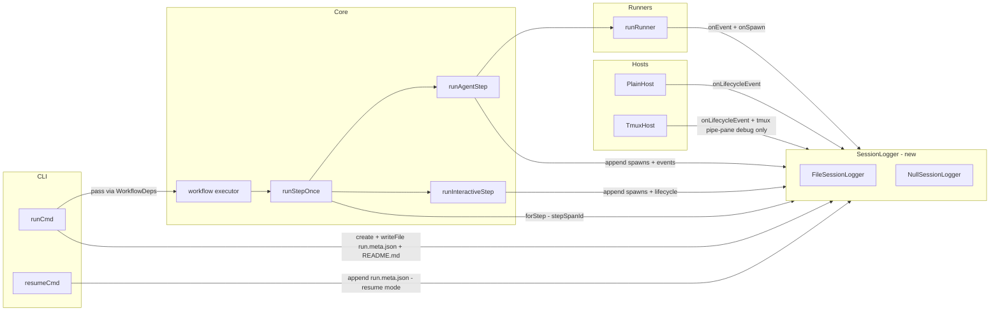

# Session Logging — per-run `.orch/state/<runId>/logs/`

## Overview

Ship a per-run directory of NDJSON + JSON files under `.orch/state/<runId>/logs/` so
a maintainer (in practice, an AI agent doing post-mortem on a finished run) can
reconstruct what happened without re-running the workflow.

Baseline logs are always-on and small. Heavy captures (raw agent stdout/stderr,
tmux pane output, orch's internal trace, non-agent subprocess spawns) are gated
behind a single `--debug` flag (also `ORCH_DEBUG=1`). A per-step correlation id
(`stepSpanId`) lets `grep` return the full trace of one step across every file.

All plumbing sits behind **one** new port — `SessionLogger`, in
`src/observability/session-logger.ts` — with a file-backed adapter and a null
adapter. The shape and conventions mirror the existing `TranscriptSidecar`
(append-only NDJSON, lazy `mkdir`, per-step serial chain). No new dependencies,
no tracing framework, no size caps.

**Simplicity commitments — violating any is a review blocker:**

1. Only **one** new port and **one** new directory. No per-category flags in v1.
2. Reuse existing patterns: NDJSON on disk, `FsService` for all writes, `path()`
   branded paths, lazy `mkdir`, per-step serial append.
3. Heavy captures (`--debug`) are strictly additive — if the baseline writer
   was removed, the heavy capture would still stand on its own.
4. No configurable redaction policy — one hardcoded regex, one env-var escape
   hatch for debugging broken secret handling.
5. The e2e test (§ Test Plan) is the acceptance gate: if it doesn't pass on a
   single baseline run, we are not done.

## Problem Statement

The existing `TranscriptSidecar` (per-step NDJSON of parsed `RunnerEvents` at
`src/state/transcript-sidecar.ts`) captures **only** agent output as parsed
events. It misses:

- **Launch argv / env / cwd** — impossible to reproduce a failing run locally.
- **Raw bytes** — parser rejects malformed JSON silently; the original line is gone.
- **tmux behaviour** — pane create/die/signal, respawn-pane, send-keys timing.
- **Host lifecycle** — when tmux server started, when teardown fired, when
  `attachForeground` resolved.
- **Orch internals** — view resolution, mode resolution, sidecar writes, state
  writes, caching decisions, signal handling.
- **Non-agent subprocesses** — every `git`, `tmux`, `claude -v` probe that
  `ProcessService` routes.

These gaps force maintainers to re-run to reproduce, and AI agents doing
post-mortem can't answer the basic "what actually happened?" without the run's
byte-level trace.

### Why not extend `TranscriptSidecar` / add OpenTelemetry?

Three rejected alternatives (from the brainstorm, retained here because
reviewers keep asking):

1. **Extend `TranscriptSidecar` to carry everything.** Rejected: transcripts
   are *agent output*; mixing perspectives breaks `orch logs` semantics and
   the per-step filename convention.
2. **Single `orch.log` for everything.** Rejected: one file, many formats,
   hard to grep by category — fights the AI-reader goal.
3. **Stand up a proper tracing framework (OpenTelemetry / structured logging
   library).** Rejected: YAGNI. NDJSON on disk is sufficient, zero
   dependencies, works with `cat` / `grep` / `jq`, and matches the project's
   existing append-only-NDJSON muscle memory.

## Proposed Solution

### File layout — `.orch/state/<runId>/logs/`

**Baseline (always-on):**

| File | Shape | Solves |
|---|---|---|
| `spawns.ndjson` | one line per agent launch: `{ts, stepName, runnerName, mode, argv, envKeys, cwd, sessionId?, exitCode, durationMs, reproduce, stepSpanId}` | "can't reproduce locally" |
| `events.ndjson` | merged cross-step `RunnerEvents`, tagged `{ts, stepName, runnerName, stepSpanId, event}` | cross-step grep, cheap complement to per-step transcripts |
| `lifecycle.ndjson` | host + tmux + pane + step lifecycle: `host-created`, `tmux-session-created`, `pane-created(L|R)`, `attach-foreground-started`, `attach-foreground-exited`, `pane-died`, `signal-received`, `run-ended`, plus `step:start` / `step:complete` / `step:failed` / `step:cached` / `step:parallel-branch-update` | "pane created/finished" narrative, tmux weirdness, one-file step-lifecycle source |
| `timeline.ndjson` | mirror of spawns + events + lifecycle + errors, source-tagged `{ts, source: 'spawn' \| 'event' \| 'lifecycle' \| …, …}` | one-file grep covering the full picture; AI reader's primary entry point |
| `run.meta.json` | `{orchVersion, orchGitSha, runnerVersions, os, tmuxVersion, argv, envKeys \| envValues, runId, startedAt, endedAt?}` | reproducibility snapshot |
| `agents/<stepName>.session.json` | `{stepName, stepSpanId, runnerName, mode, prompt, argv, envKeys, finalEvent, exitCode, durationMs, transcriptPath, rawStdoutPath?, rawStderrPath?, tmuxPaneLogPath?}` | step "landing page" |
| `README.md` | human + AI-readable description of that run's directory, incl. `grep` recipes | self-service onboarding |

**`--debug` only (uncapped):**

| File | Shape | Solves |
|---|---|---|
| `agents/<stepName>.stdout` + `.stderr` | raw bytes per agent subprocess | parser miss, NDJSON decode failures |
| `tmux/<paneId>.log` | `tmux pipe-pane` capture, per pane, two-pane mode only | rendered pane weirdness, colour/ansi issues |
| `orch.log` | orch's own internal trace (structured replacement for scattered `console.log`) | internal decision audit |
| `subprocesses.ndjson` | every non-agent subprocess spawn (`git`, `tmux`, probes) routed through `ProcessService` | "what tmux commands did orch issue?" |

### Correlation id — `stepSpanId`

UUIDv4 minted per step span at `runStepOnce` entry in
`src/core/workflow.ts:616`. Parallel branches get a unique id per branch.
Every log line that relates to a step carries it, so:

```bash
grep <stepSpanId> .orch/state/<runId>/logs/*.ndjson
```

returns every trace across every file. `stepSpanId` is **not** propagated into
the agent's `env` for v1 (zero coupling; add later if an agent-side telemetry
need appears — brainstorm Q3).

### Single `--debug` flag

One CLI flag: `--debug`. Env: `ORCH_DEBUG=1`. All-or-nothing for the heavy
captures. No per-category flags in v1 — adding them later is additive and
cheap. Users opt into `--debug` knowing the cost; no size caps, no rotation.

### Redaction (secrets)

Hardcoded regex applied at write time:

```
/^(ANTHROPIC_|CLAUDE_).*|.*_TOKEN$|.*_SECRET$|.*_KEY$|.*_PASSWORD$/ → '***'
```

- `envKeys` is the default everywhere — values are omitted by default.
- `run.meta.json` / `reproduce` commands may emit values **only** when
  `ORCH_LOG_ENV_VALUES=1`, and even then the regex above applies.
- Redaction lives in **one** function (`redactEnv`) in `src/observability/redact.ts`. Any
  writer that touches env goes through it. Covered by unit tests.

## Technical Approach

### Architecture



### The `SessionLogger` port

`src/observability/session-logger.ts` — minimal surface:

```ts
export type LogCategory =
  | 'spawns'
  | 'events'
  | 'lifecycle'
  | 'subprocesses' // --debug only
  | 'orch'         // --debug only

export type JsonObject = Readonly<Record<string, unknown>>

export type StepSpanId = string & { readonly __brand: 'StepSpanId' }

export interface StepSpan {
  readonly stepSpanId: StepSpanId
  readonly stepName: StepName
  /** Auto-tags `stepName` + `stepSpanId` + `ts` onto the record, then
   *  delegates to the parent append. Also mirrors to `timeline.ndjson`. */
  append(category: LogCategory, record: JsonObject): Promise<void>
}

export interface RawSink {
  write(chunk: Uint8Array | string): Promise<void>
  close(): Promise<void>
}

export interface SessionLogger {
  readonly runId: RunId
  readonly debug: boolean
  /** Non-step-scoped append (run-level events like `run-ended`). Also mirrors
   *  to `timeline.ndjson`. */
  append(category: LogCategory, record: JsonObject): Promise<void>
  /** Create a step span with a fresh `stepSpanId`. Safe to call once per
   *  step attempt; the handle is cheap. */
  forStep(stepName: StepName): StepSpan
  /** Write a complete file under logs/ (run.meta.json, README.md,
   *  agents/<name>.session.json). Writes atomically via tmp + rename. */
  writeFile(relPath: string, body: string): Promise<void>
  /** --debug raw byte sink for `agents/<name>.stdout` / `.stderr` / `tmux/<paneId>.log` /
   *  `orch.log`. Returns `null` when `!debug` so callers can no-op without
   *  branching on `debug`. */
  rawSink(relPath: string): RawSink | null
  /** Flush any in-flight appends. Called from teardown paths. */
  close(): Promise<void>
}
```

**Two adapters:**

- `createFileSessionLogger(deps)` in `src/observability/file-session-logger.ts`
  — writes under `<basePath>/<runId>/logs/` via `FsService`. Lazy `mkdir` on
  first write, per-category serial append chain (same pattern as
  `transcript-sidecar.ts:77-94`), timeline mirror written inside each `append`
  call so timeline stays source of truth without a second caller path.
- `createNullSessionLogger()` in `src/observability/null-session-logger.ts`
  — every method resolves / returns null. Used in unit tests that don't care
  about logs.

Every path under `<basePath>/<runId>/logs/` is constructed from the branded
`RunId` + a sanitized `relPath` (no `..`, no `/`, no control chars). Same
path-traversal guard as `transcript-sidecar.ts:112`.

### Hook points

Concrete file + line references in the baseline commit (`feat/phase-a-run-modes @ 5e204b9`):

**Baseline writers (always-on):**

| Hook point | File | Location | Category + record |
|---|---|---|---|
| Run init (`run.meta.json` + `README.md`) | `src/cli/commands/run.ts` | after `generateRunId`, before `executeWithAttach` (~line 54-96) | `writeFile('run.meta.json', …)` + `writeFile('README.md', …)` |
| Resume init (append-not-overwrite `run.meta.json`) | `src/cli/commands/resume.ts` | after `loadRun`, before `executeWithAttach` (~line 104-160) | `append('lifecycle', {type:'run:resumed', …})` + rewrite meta with new `resumedAt` |
| Step span open | `src/core/workflow.ts` | `runStepOnce` top (line 616-655) | `logger.forStep(key)` → `stepSpan` threaded into `runAgentStep` / `runInteractiveStep` / `runCommitStep` |
| Agent spawn | `src/core/workflow.ts` | `runAgentStep` around the `runRunner` call (line 459) | `stepSpan.append('spawns', {argv, envKeys, cwd, mode:'autonomous', runnerName, sessionId?, reproduce})` pre-spawn; update with `{exitCode, durationMs, finalEvent}` post-spawn via a second `append` record |
| Interactive spawn | `src/core/workflow.ts` | `runInteractiveStep` around the `host.runInteractive` call (line 343) | same shape as above with `mode: 'interactive'` |
| Per-event fan-out | `src/core/workflow.ts` | `makeAgentEventHandler` (line 396-410) | `stepSpan.append('events', {event})` — fire-and-forget alongside existing transcript append |
| Step lifecycle (all five types) | `src/core/workflow.ts` | every `deps.host.onLifecycleEvent({…})` call in `runAgentStep` / `runInteractiveStep` | mirror via a new `deps.logger?.onLifecycleEvent` wrapper or intercept at the host — see § "Host-side vs executor-side lifecycle" below |
| Host create / teardown | `src/hosts/plain/plain-host.ts` + `src/hosts/two-pane/tmux-host.ts` | factory top + `teardown()` | `logger.append('lifecycle', {type:'host-created', mode, …})` + `{type:'host-torndown'}` |
| Tmux session create / pane-died / attach-foreground | `src/hosts/two-pane/tmux-host.ts` | after `initOrchSession` (line 105), inside `teardown` (337), inside `attachForeground` closure | `append('lifecycle', {type:'tmux-session-created' \| 'pane-created' \| 'pane-died' \| 'attach-foreground-started' \| 'attach-foreground-exited', …})` |
| Step complete → per-step session.json | `src/core/workflow.ts` | `runAgentStep` end (~line 525), `runInteractiveStep` end (~line 378-389), `runCommitStep` end | `logger.writeFile('agents/<stepName>.session.json', …)` |
| Run end | `src/core/workflow.ts` | `executeWorkflowFn` `setStatus('completed'\|'crashed')` (line 667-679) | `append('lifecycle', {type:'run-ended', status, totalDurationMs})` |

**`--debug` writers (gated on `logger.debug === true`):**

| Hook point | File | Location | Sink |
|---|---|---|---|
| Raw agent stdout / stderr | `src/runners/execute.ts` | `runRunner` inside the `for await` loop (line 55) and `drainStream` for stderr (line 49) | `logger.rawSink('agents/<stepName>.stdout')` + `.stderr` — threaded via the existing `onEvent` dep, plus a new `onRawLine` dep |
| tmux pipe-pane capture | `src/hosts/two-pane/tmux-host.ts` | right after `splitPane` (line 137-143) + after `initOrchSession` for the left pane | `tmux.pipePane({socket, target, filePath})` where `filePath = <runDir>/logs/tmux/<paneId>.log` (already supported by `TmuxService.pipePane` — see Phase 13c) |
| Non-agent subprocess capture | `src/services/process/bun-process-service.ts` | a thin observer wrapper; decorating `BunProcessService` with `.withLogger(logger)` keeps the port pure | every `spawn` / `spawnForeground` call records `{argv, envKeys, cwd, exitCode, durationMs}` to `subprocesses.ndjson`. Agent spawns are excluded by a caller-set `tag` field (`'agent'` tags skip). |
| Orch internal trace | various internal callers (view resolution, mode resolution, state writes, signal handling, caching decisions) | replace scattered `console.log` with `logger.append('orch', {…})` | opt-in per call site; v1 ships ~6 call sites (resolveView, resolveRunMode, saveStep, cache-hit, signal handler, teardown) |

#### Host-side vs executor-side lifecycle

The executor emits `step:*` events through `host.onLifecycleEvent`. Rather
than **also** emitting them through `logger.append('lifecycle', …)` in two
places (risk of drift), we introduce a tiny tee in `WorkflowDeps`:

```ts
// src/core/workflow.ts
const onLifecycleEvent = (event: StepLifecycleEvent) => {
  deps.host.onLifecycleEvent(event)
  void deps.logger?.append('lifecycle', { type: event.type, ...event })
}
```

One call site replaces every `deps.host.onLifecycleEvent(…)` invocation in
`runAgentStep` / `runInteractiveStep`. Keeps the two observers in lock-step.

Host-owned lifecycle (tmux pane-died hook, attach-foreground client exit)
still goes **directly** through the logger because the host owns those
signals and the executor doesn't see them.

### Wiring through the composition root

`src/cli/deps.ts` grows one field: `sessionLogger: SessionLogger`. Threaded
from the CLI entry (where `--debug` is resolved) into `runCmd` / `resumeCmd`
via `CliDeps` and into `WorkflowDeps.logger`.

- `--debug` flag in `src/cli/main.ts` parseArgv — boolean, default from
  `process.env.ORCH_DEBUG === '1'`.
- `createDeps(cwd, { debug })` chooses `createFileSessionLogger` in
  production; tests keep injecting `createNullSessionLogger()`.
- `CliDeps.sessionLogger` is created **per run** (not per CLI invocation) so
  each `runId` gets its own logger. The `runCmd` handler owns the lifetime;
  it `await`s `logger.close()` in the `finally` block alongside
  `host.teardown()`.

### Writer / reader concurrency

- **Per-category serial chain.** Each `append(category, …)` enqueues behind
  the previous append to that category, inside the `FileSessionLogger`.
  Same pattern as `transcript-sidecar.ts:77-94`. Prevents line interleave.
- **Timeline mirror.** Inside `append(category, record)`, the logger also
  `appendFile('timeline.ndjson', {ts, source: category, ...record})`.
  One code path, not two callers.
- **Parallel branches.** Each branch gets its own `StepSpan` with a unique
  `stepSpanId`. No shared state; concurrent appends to different step spans
  go through distinct serial chains within the same category file (the
  category chain is enough — NDJSON is line-atomic per `appendFile` call).

### `docs/logging.md` + CLAUDE.md link

- New `docs/logging.md` — general format + grep recipes. One page.
- One-line addition to `CLAUDE.md` (the "How to add a feature" section) so
  AI collaborators pick it up automatically: "If debugging a finished run,
  read `docs/logging.md` before touching code."
- Run-local `README.md` is generated from a static template in
  `src/observability/readme-template.ts` with `runId`, `startedAt`,
  `workflowName`, `mode`, `debug` interpolated. No external templating
  engine; plain string replacement.

## Alternative Approaches Considered

1. **Mix everything into `state.json`.** Rejected: state.json is the
   authoritative hot-write file for memoization (see rationale in
   `transcript-sidecar.ts:4-9`). Doubling its write volume with log records
   would reintroduce the MB-per-event problem the sidecar solved.
2. **Let each writer choose its own file format.** Rejected: two shapes
   (NDJSON + whole-file JSON) is enough; `.log` for raw bytes is the third
   and final shape. More formats mean more grep tricks.
3. **Per-category `--debug-*` flags.** Rejected for v1: one flag covers the
   4 heavy captures. A user who opts in to `--debug` accepts all four; if
   they want one, they read only that file after the fact. Adding per-flag
   knobs later is additive.
4. **Structured logging library (winston, pino, …).** Rejected: adds a
   dependency, brings formatter/transport abstractions we don't need, and
   fights the append-only file-on-disk model. Our `appendFile` path is
   ~40 lines total.
5. **Separate `orch-session-logger` package.** Rejected: YAGNI. The logger
   has no consumers outside this repo; fold it into `src/observability/`
   next to `status-pane.ts` / `status-loop.ts`.

## Acceptance Criteria

### Functional Requirements

- [ ] `bun x orch run <workflow>` produces `.orch/state/<runId>/logs/` with:
  - [ ] `spawns.ndjson`, `events.ndjson`, `lifecycle.ndjson`, `timeline.ndjson`
  - [ ] `run.meta.json`, `README.md`
  - [ ] `agents/<stepName>.session.json` for every agent / interactive step
- [ ] `bun x orch run --debug <workflow>` additionally produces:
  - [ ] `agents/<stepName>.stdout` + `.stderr` per agent step
  - [ ] `tmux/<paneId>.log` per pane (two-pane mode only; no-op on plain)
  - [ ] `orch.log` with orch-internal trace entries
  - [ ] `subprocesses.ndjson` with every non-agent `ProcessService.spawn`
- [ ] Every step-scoped record in `spawns.ndjson`, `events.ndjson`,
  `lifecycle.ndjson`, `timeline.ndjson`, and `agents/<name>.session.json`
  carries a `stepSpanId`. `grep <stepSpanId> logs/*.ndjson` returns >=1
  line from each file that recorded the step.
- [ ] `env` values are **never** present in baseline logs; only `envKeys`.
  `ORCH_LOG_ENV_VALUES=1` emits values in `run.meta.json` with secrets
  redacted to `***`.
- [ ] `orch resume <runId>` appends (does not overwrite) and bumps
  `run.meta.json.resumedAt`.
- [ ] `bun run check` green.

### Non-Functional Requirements

- [ ] Zero new dependencies.
- [ ] `SessionLogger` is the **only** new port. No `LogRotator`, no
  `LogShipper`, no plugin registry.
- [ ] File + function size budgets: `file-session-logger.ts` ≤ 300 lines,
  every new function ≤ 60 lines (CLAUDE.md rule #5).
- [ ] All log writes go through `FsService` — no direct `fs.appendFile`
  anywhere under `src/observability/` (rule #1 extended to fs).
- [ ] `mock.module` / `vi.mock` banned in every new test (rule #3).
- [ ] Every new test name is a full sentence (rule #4).

### Quality Gates

- [x] Unit coverage for `SessionLogger` port + `FileSessionLogger` adapter +
  `redactEnv` (see § Test Plan).
- [ ] Integration coverage for each writer hook (spawns, events, lifecycle,
  run.meta.json, per-step session.json).
- [x] **One e2e test** that runs a real workflow end-to-end (FakeRunner,
  temp cwd, BunFsService) and asserts every baseline file exists with the
  expected content shape (see § Test Plan — "E2E acceptance test").
- [x] Redaction golden test: `.env` with `SOMETHING_TOKEN=shh` lands as
  `"SOMETHING_TOKEN": "***"` in `run.meta.json` under
  `ORCH_LOG_ENV_VALUES=1`.

## Test Plan

Three layers, matching CLAUDE.md rule #3 and the `testing-strategy` skill.
Every test goes under the right layer — unit tests NEVER touch disk.

### Unit tests (`tests/unit/observability/`)

- `session-logger.port.test.ts` — null impl resolves all methods, `rawSink`
  returns null, `forStep` returns a valid `StepSpan`.
- `file-session-logger.test.ts` — against `FakeFsService`:
  - `append writes ndjson line to the category file with auto-injected ts`
  - `append mirrors the record into timeline.ndjson with a source tag`
  - `forStep returns a StepSpan whose append auto-tags stepName and stepSpanId`
  - `writeFile writes atomically via temp-then-rename through FsService`
  - `rawSink returns null when debug is false`
  - `rawSink returns a writable when debug is true and writes bytes through FsService`
  - `concurrent appends to the same category do not interleave lines`
  - `concurrent appends to different categories run independently`
  - `close awaits every in-flight append before resolving`
  - `path traversal: forStep / writeFile rejects stepNames containing /, .., or control chars`
- `redact-env.test.ts` — the redaction regex:
  - `drops ANTHROPIC_API_KEY value`
  - `drops *_TOKEN / *_SECRET / *_KEY / *_PASSWORD values`
  - `passes through benign env vars untouched`
  - `redacts values inside reproduce commands`
- `readme-template.test.ts` — template interpolation produces valid markdown
  with `runId`, `startedAt`, `workflowName`, `mode`, and `debug` rendered.

### Integration tests — mocked edges (`tests/integration/observability/`)

All run against a real temp dir via `BunFsService` + `FakeProcessService` +
`FakeGitService`. NO `mock.module`.

- `session-logger-baseline.integration.test.ts`
  - `FakeRunner-driven workflow writes spawns.ndjson with correct argv + envKeys + mode`
  - `events.ndjson contains one record per RunnerEvent and all carry stepSpanId`
  - `lifecycle.ndjson contains step:start / step:complete for every step and host-created / run-ended bracket the run`
  - `timeline.ndjson is a strict superset of the three category files and is sorted by ts`
  - `run.meta.json contains orchVersion / argv / envKeys and no env values`
  - `agents/<stepName>.session.json contains prompt / argv / envKeys / finalEvent / exitCode`
  - `resume appends a run:resumed lifecycle record and updates run.meta.json.resumedAt`
- `session-logger-debug.integration.test.ts` (gated `ORCH_DEBUG=1` in the env):
  - `raw stdout and stderr files capture the FakeProcessService byte scripts verbatim`
  - `subprocesses.ndjson contains the non-agent spawns but excludes agent spawns`
  - `orch.log contains at least one entry per internal call site exercised`
  - `tmux/<paneId>.log exists when mode=two-pane and pipe-pane was issued`
  - `--debug off on the same workflow produces no stdout / stderr / subprocesses / orch.log files`

### E2E acceptance test (`tests/e2e/session-logging.e2e.test.ts`) — **the gate for this plan**

Goal: prove that an unmodified `orch run` on a plain-mode workflow produces
every baseline file with the expected content shape. This is the single test
the user called out as the deliverable; it fails loudly if any writer
regresses.

Setup:
- `mkdtemp` a temp cwd.
- Write a trivial `orch.config.ts` + a `workflows/demo.ts` driven by
  `FakeRunner` that emits one `turn-complete` event.
- Drive `runCmd` with real `BunFsService`, real `BunProcessService`, a
  `FakeRunner` (so no external CLI), `FakeClock` for stable timestamps, and
  `createFileSessionLogger({ debug: false, … })`.

Assertions (every bullet = one `it(…)` with a full-sentence name):

- `it('writes the full baseline logs directory after a one-step workflow', …)`
  - After the run, `.orch/state/<runId>/logs/` exists.
  - Exactly these files exist: `spawns.ndjson`, `events.ndjson`,
    `lifecycle.ndjson`, `timeline.ndjson`, `run.meta.json`, `README.md`,
    `agents/demo.session.json`. No extra files; no missing files.
- `it('writes run.meta.json with the expected keys and no env values', …)`
  - Parse the JSON. Assert keys `orchVersion`, `argv`, `envKeys`, `os`,
    `runId`, `startedAt` exist and have the right types.
  - Assert `envKeys` is an array of strings (no `env` object with values).
- `it('writes spawns.ndjson with one record per agent spawn', …)`
  - Line count == number of agent steps.
  - Each parsed record has `stepName`, `runnerName`, `argv`, `envKeys`,
    `mode`, `exitCode`, `durationMs`, `stepSpanId`, `reproduce`.
- `it('writes events.ndjson with one record per RunnerEvent', …)`
  - Line count == number of events emitted by FakeRunner (1).
  - The record carries `stepName`, `stepSpanId`, `event.kind`, `event.type`.
- `it('writes lifecycle.ndjson that brackets the run with host-created and run-ended', …)`
  - First record is `host-created`; last is `run-ended`.
  - Step lifecycle includes `step:start` and `step:complete` for `demo`.
- `it('writes timeline.ndjson as a sorted superset of the three ndjson streams', …)`
  - Every line from `spawns.ndjson`, `events.ndjson`, `lifecycle.ndjson`
    appears in `timeline.ndjson` (matched by `stepSpanId` + `ts`).
  - `timeline.ndjson` is sorted by `ts` (monotonic non-decreasing).
- `it('writes agents/demo.session.json with prompt, argv, envKeys, finalEvent, exitCode', …)`
  - Parse; assert shape. Cross-check `stepSpanId` matches the one in
    `spawns.ndjson` for the `demo` step.
- `it('writes README.md with the runId and the grep recipes', …)`
  - The string contains the `runId`, a "grep recipes" heading, and a
    `grep <stepSpanId>` example line.
- `it('grep stepSpanId returns matches in every baseline ndjson file', …)`
  - Read all `*.ndjson`; extract `stepSpanId` from `spawns.ndjson`; assert
    it appears in `events.ndjson`, `lifecycle.ndjson`, `timeline.ndjson`,
    `agents/demo.session.json`.

This test is the **exit criterion** for Phase 1 and runs on every `bun test`.

### Real-runner smoke (gated `RUN_REAL_CLAUDE=1`, optional)

`tests/e2e/session-logging-real-claude.test.ts` — same shape as the
e2e acceptance test but with `claude()` runner against a 1-line prompt.
Skipped by default. Not a gate for this plan; parks as a follow-up for the
maintainer's real-CLI bench.

## Implementation Phases

### Phase 1 — `SessionLogger` port + `FileSessionLogger` + `NullSessionLogger` + e2e

**Goal:** land the port, both adapters, redaction, and the e2e acceptance
test. No hook-in yet — zero behaviour change for existing workflows beyond
an empty `logs/` directory appearing.

**Deliverables:**

- `src/observability/session-logger.ts` — port + types.
- `src/observability/file-session-logger.ts` — adapter.
- `src/observability/null-session-logger.ts` — null adapter.
- `src/observability/redact.ts` — `redactEnv` + tests.
- `src/observability/readme-template.ts` — generator.
- `src/observability/index.ts` — barrel exports.
- `docs/logging.md` — format reference + grep recipes.

**Tests:** all unit + the e2e acceptance test (drives a stubbed workflow
directly against `FileSessionLogger` without going through the executor).

**Gate:** `bun run check` green; e2e passes.

---

### Phase 2 — Baseline writer hook-ins (always-on)

**Goal:** wire `SessionLogger` into the executor + hosts + CLI composition
root so real workflows produce the baseline logs directory.

**Deliverables:**

- `src/cli/deps.ts` — add `sessionLogger` field; construct in `createDeps`.
- `src/cli/main.ts` — parse `--debug`; resolve from `ORCH_DEBUG=1`; pass
  through to `createDeps`.
- `src/cli/commands/run.ts` — after `generateRunId`: write `run.meta.json`
  + `README.md` via the logger. In `finally`: `await logger.close()`.
- `src/cli/commands/resume.ts` — same, but append `run:resumed` + update
  `resumedAt`.
- `src/core/workflow.ts` — `WorkflowDeps.logger?: SessionLogger`; thread
  `stepSpan = logger?.forStep(key)` into `runAgentStep` / `runInteractiveStep`
  / `runCommitStep`; tee `onLifecycleEvent` through the logger; write
  `agents/<stepName>.session.json` on step complete.
- `src/runners/execute.ts` — no change in Phase 2 (the `onEvent` fan-out
  already lets the executor append to `events.ndjson`; no executor edit
  needed).
- `src/hosts/plain/plain-host.ts` + `src/hosts/two-pane/tmux-host.ts` —
  emit `host-created` / `host-torndown` lifecycle records. Tmux host
  additionally emits `tmux-session-created`, `pane-created(L|R)`,
  `pane-died`, `attach-foreground-started` / `attach-foreground-exited`.

**Tests:** integration `session-logger-baseline.integration.test.ts`
(all baseline assertions); re-run the e2e acceptance test, now through
the full executor; previous e2e still passes.

**Gate:** `bun run check` green.

---

### Phase 3 — `--debug` heavy captures + docs finalisation

**Goal:** ship the opt-in heavy captures behind `--debug`. Each is additive
and independently optional.

**Deliverables:**

- `src/runners/execute.ts` — add `onRawLine?: (stream: 'stdout' | 'stderr',
  line: string) => void` to `runRunner` deps. Wire in `runAgentStep` so it
  pipes raw lines to `logger.rawSink('agents/<step>.stdout')`. `drainStream`
  in `runRunner` is split into `drainStream(stream, onLine?)` so stderr also
  feeds the sink. Under `!debug`, `onRawLine` is undefined — zero-cost.
- `src/services/process/bun-process-service.ts` — accept an optional
  `observer?: SubprocessObserver` via a wrapper `instrumentProcessService
  (base, logger)` in `src/observability/instrument-process-service.ts`. The
  wrapper records `{argv, envKeys, cwd, exitCode, durationMs}` to
  `subprocesses.ndjson` on every non-agent spawn. Agent spawns set a
  `tag: 'agent'` on the spawn options (new optional field, default none) to
  skip the record.
- `src/services/process/process-service.ts` — add `tag?: string` to
  `SpawnOptions`. Propagates through existing callers as `undefined` (no
  behaviour change). Runners set `tag: 'agent'` in their `buildCommand`
  consumer (actually at the `runRunner` layer, so runners stay pure).
- `src/hosts/two-pane/tmux-host.ts` — call `tmux.pipePane({socket, target,
  filePath: …/logs/tmux/<paneId>.log})` for the left + right panes when
  `logger.debug === true`. Teardown stops pipe-pane (`pipePane({ stop:
  true })` — already supported by Phase 13c).
- `src/observability/orch-log.ts` — tiny helper `orchLog(logger, msg,
  extra?)` — single call site style across the codebase. v1 wires six
  call sites: `resolveView`, `resolveRunMode`, `saveStep`, cache-hit in
  `runStepOnce`, signal handler in `executeWithAttach`, `teardown` in
  hosts.
- `docs/logging.md` — add the `--debug` section with grep recipes.
- `CLAUDE.md` — one-line pointer to `docs/logging.md`.

**Tests:** integration `session-logger-debug.integration.test.ts` (all
`--debug` assertions); unit tests for the process-service wrapper; update
the e2e acceptance test to also run under `ORCH_DEBUG=1` in a second `describe`
block, adding the `--debug`-only file assertions.

**Gate:** `bun run check` green. Manual smoke:
`ORCH_DEBUG=1 bun x orch run examples/riddle-solver-proper` produces the
full tree; `grep <stepSpanId> .orch/state/<runId>/logs/*.ndjson` returns
hits in every file.

---

## Open Questions (to resolve during Phase 2 / 3)

1. **Tmux `pipe-pane` timing.** Starting `pipe-pane` *after* pane creation
   may miss the first lines (splash / banner). During Phase 3, verify
   whether `tmux split-pane … \; pipe-pane -O ...` (chained in one command)
   captures from the first byte. If not, accept the small loss — it's
   baseline-output, not step-output, and fallback is acceptable for v1.
   **Deferrable — does not block Phase 1 or 2.**

2. **Schema version bump for `StepEntry`.** The new `stepSpanId` could live
   on `StepEntry` too (redundant with `agents/<name>.session.json` but
   convenient for `orch status` output). Phase 2 decides — tentatively NO
   (keep schema v5, avoid a v6 for one extra field; reader can cross-reference).

3. **`orch logs --debug` mode.** Should `orch logs <runId>` learn to stream
   `logs/events.ndjson` + `logs/timeline.ndjson` in addition to the
   per-step transcript sidecars? Tentatively yes (one-line change in
   `src/cli/commands/logs.ts`) but gated to Phase 3 so it can follow the
   debug-file shape.

## Out of Scope

- **Log rotation / size caps.** Users opt into `--debug` knowing the cost.
- **Remote shipping (Datadog, Loki, …).** File-on-disk is the v1 surface.
- **Per-category `--debug-*` flags.** v2. Additive if a concrete need appears.
- **`stepSpanId` injection into agent env (`ORCH_STEP_SPAN_ID`).** Brainstorm
  Q3 — rejected for v1 to keep coupling zero.
- **Binary-safe raw captures.** `rawSink.write(Uint8Array)` works but only
  line-buffered capture is tested. Binary preservation beyond NDJSON text
  streams is a v2 concern.
- **Backfill of `.orch/state/<existingRunId>/logs/` for runs that predate
  this plan.** Ship-forward only; old runs keep working without the directory.

## Dependencies & Prerequisites

- `FsService` — unchanged (uses `appendFile`, `writeFile`, `rename`, `mkdir`).
- `Clock` — unchanged.
- `TmuxService.pipePane` — already landed in Phase 13c (`tests/integration/
  services/tmux/tmux-service.test.ts:*`).
- `ProcessService.SpawnOptions` — Phase 3 adds an optional `tag?: string`.
  Backwards-compatible with every existing caller.

No new npm / Bun dependencies.

## Risk Analysis & Mitigation

| Risk | Likelihood | Impact | Mitigation |
|---|---|---|---|
| Baseline logging adds measurable wall-time to every run | low | medium | NDJSON `appendFile` is microseconds; baseline writes ~10 lines for a 5-step run. The e2e test enforces the file count; a perf regression shows up as a length change. |
| Writer fans out to `timeline.ndjson` AND a category file → torn writes | low | high | Single `append` function writes both; per-category serial chain prevents interleave. Crash during the chain loses at most one line (NDJSON readers tolerate trailing partial). |
| Secret leaks via `envKeys` or `reproduce` | medium | high | Single `redactEnv` function, unit-tested against the hardcoded regex; **all** writers route through it. Redaction golden test under § Test Plan asserts the exact replacement. |
| `--debug` raw capture fills the disk on a long run | medium | low | Documented in `docs/logging.md`; no rotation. Users opt in. `ORCH_DEBUG=0` (default) makes this a non-risk. |
| `SessionLogger.close()` forgotten in an error path → truncated NDJSON | medium | low | `finally` block in `runCmd` / `resumeCmd`; integration test covers a throwing-step case that still produces a complete `lifecycle.ndjson` with `run-ended status:crashed`. |
| `stepSpanId` collision across parallel branches | very low | medium | UUIDv4 birthday bound >> any workflow size; unit test asserts distinct ids for 1000 branches. |
| `tmux pipe-pane` misses initial lines | medium | low | Documented in `docs/logging.md` + § Open Questions. Not a correctness issue — baseline output only. |

## Success Metrics

- **Primary (qualitative):** a maintainer dropped into
  `.orch/state/<runId>/logs/` can answer "what command did orch run, with
  what env keys, in what order, and what did the agent emit?" without
  re-running the workflow.
- **Primary (quantitative):** the e2e acceptance test passes on every
  `bun test`; its failure blocks every subsequent PR until fixed.
- **Secondary (quantitative):** `bun run check` wall-time unchanged to
  within 5% (expected: +5-20ms per run for baseline writes).
- **Archival:** `docs/logging.md` is the single pointer for every future
  maintainer; `CLAUDE.md` links it so AI collaborators find it
  automatically.

## Documentation Plan

| Doc | Change |
|---|---|
| `docs/logging.md` | **New.** File layout, categories, `stepSpanId`, grep recipes, `--debug` section. Target audience: a maintainer (human or AI) dropped cold into a finished run's directory. |
| `CLAUDE.md` | One-line pointer: "If debugging a finished run, read `docs/logging.md` before touching code." Added to the "How to add a feature" section. |
| `docs/plans/implementation-phases.md` | Add a row for this plan after the Reframe phases as "Session Logging (maintainer debugging)". Status ☐. |
| Run-local `README.md` | Generated from template at run start; describes that run's directory + grep recipes + the specific `runId` / `stepSpanId`s seen. |

## References

### Internal

- Brainstorm — [`docs/brainstorms/2026-04-24-session-logging-brainstorm.md`](../brainstorms/2026-04-24-session-logging-brainstorm.md)
- TranscriptSidecar (pattern to mirror) — `src/state/transcript-sidecar.ts:1-115`
- State store (atomic writes pattern) — `src/state/state-store.ts:1-80`
- Workflow executor hook points — `src/core/workflow.ts:396-527, 616-679`
- Runner execute fan-out — `src/runners/execute.ts:31-89`
- `ProcessService` port — `src/services/process/process-service.ts:1-46`
- `FsService` — `src/services/fs/fs-service.ts`
- TmuxHost pipe-pane surface — `src/services/tmux/tmux-service.ts` (pipePane)
- PlainHost — `src/hosts/plain/plain-host.ts:1-135`
- Existing `orch logs` reader — `src/cli/commands/logs.ts:1-114`
- CLI wiring — `src/cli/main.ts:101-163`

### External

- NDJSON spec — https://github.com/ndjson/ndjson-spec (informational; our writes are plain lines of JSON terminated by `\n`).
- UUIDv4 — Node `crypto.randomUUID()` (already used at `src/core/workflow.ts:1`).

### Related

- Phase 13c `TmuxService.pipePane` landing — see `docs/plans/implementation-phases.md:360-378`.
- Workflow authoring DX brainstorm (adjacent but separate audience) — `docs/brainstorms/2026-04-23-workflow-authoring-dx-brainstorm.md`.
