# Plan: History-Step Resume for Interactive Sessions (Claude + Codex)

## Summary

Wire the two-pane host's right pane to spawn the active runner's own `--resume`/`resume` CLI when the user presses Enter on a past interactive step, replacing today's generic "resume unavailable" placeholder. For Codex, add post-spawn `thread_id` capture (per-workflow lock + snapshot-diff of `~/.codex/sessions/`) since Codex has no pre-set ID flag.

The work spans five layers: state schema (additive fields for `runnerName` on interactive steps + a three-value `sessionIdCaptureError` enum), a new live **resume registry** owned by the workflow executor and keyed by `StepName`, the host stack (plumb a live `resumeRegistry` reference through registry → tmux host → right-pane controller), the Codex runner (capture helper, capture-lock factory, `Runner.captureSessionId`), and a small `Clock.sleep()` addition that makes the poll loop test-controllable. The `resolveReplaySpec` dispatch shape stays unchanged — only its inputs change: a live registry reaches the controller, and Codex steps carry real ids.

(see origin: `docs/brainstorms/2026-05-13-feat-history-step-resume-requirements.md`)

---

## Problem Frame

orch's right pane already routes past-step Enter to `resolveReplaySpec`, but two things are broken for interactive steps today:

1. `src/hosts/host-registry.ts:123` calls `createTmuxHost({...})` without forwarding any resume runner. The `TmuxHostOptions.resumeRunner` field exists and is wired internally (`src/hosts/two-pane/tmux-host.ts:180-186`, spread at `:371`), but the CLI factory never supplies it. Every interactive step therefore hits the first `describeResumeRefusal` branch (`src/hosts/two-pane/pane-map/right-pane-controller.ts:743-744`) — "no runner wired into this host" — even though the workflow has the runner in scope.
2. For Codex interactive steps the stored `sessionId` (`src/core/workflow.ts:386,487`) is an orch-generated UUID Codex never saw. Codex has no pre-set-id flag (`src/runners/codex/codex-runner.ts:206-218`); its `thread_id` only exists once it writes the first line of a new `~/.codex/sessions/YYYY/MM/DD/rollout-*.jsonl`. Even with the wiring fixed, `codex resume <orch-uuid>` would fail.

Today the user sees a single dead-end string regardless of cause: "resume unavailable". They don't know whether the runner isn't wired, the step pre-dates this feature, capture failed, or Codex specifically can't be resumed. The cost compounds — every interactive past step is a dead end.

Two CLI behaviors make this tractable: `claude --resume <id>` empirically re-renders prior turns as scrollback before allowing continuation (verified, Claude Code v2.1.140), and `codex resume <thread_id>` is documented to behave the same way (pre-implementation spot-check planned in U10).

**Architectural choice resolved in deepening.** A first draft of this plan proposed a `ReadonlyMap<string, Runner>` keyed by runner name, populated at host-factory time from a `WorkflowExecutor.runners` accessor. Two correctness problems killed that shape:

- **Timing inversion.** `hostFactory({...})` runs in `src/cli/commands/run.ts:127` BEFORE `executor.execute(wfDeps)` at line 171. `WorkflowExecutor` wraps a callback (`WorkflowFn = (run, args) => Promise<void>`, `workflow.ts:208`) — runners are only encountered when the workflow author invokes `run(step)` inside `fn`. At host-factory time `fn` has not been called and any `runners` accessor is empty.
- **Name collision.** Two distinct `claude({...})` instances with different model configs in different steps both register as `name === 'claude'`. Last-write-wins on the map silently routes some past steps to the wrong config when resumed.

The plan instead introduces a **live `ResumeRegistry`** owned at the CLI layer and shared by reference with both the host and the workflow executor. The executor's `runStepOnce` registers the active runner against the step's `StepName` at start (including cache hits, so resumed runs populate progressively). The right-pane controller dereferences the registry live on every Enter press. Resume lookup is step-keyed, never name-keyed — two `claude({...})` instances with different configs each resolve to their own runner.

The same shape resolves the resume race: on `orch resume`, past completed interactive steps haven't been replayed yet when the user first opens the steps view. The registry is empty for those steps until the executor's loop reaches them. Pressing Enter before then yields a distinct "not yet replayed" refusal with a retry prompt, not the generic "no runner wired" string.

---

## Requirements

Traced from origin doc Requirements section. R-IDs preserved verbatim. R11 is plan-introduced for the resume-race refusal that the step-keyed registry makes visible.

| R-ID | Owner Unit(s) | Notes |
| --- | --- | --- |
| R1 — Enter spawns runner's resumeCommand in right pane | U4, U5 | Step-keyed lookup via live `ResumeRegistry` |
| R2 — Claude's `--session-id` capture path is sufficient | (no change) | Already works at `src/runners/claude/claude-runner.ts:174-187` |
| R3 — Codex `sessionId` MUST be the real `payload.id` | U6, U7 | Replaces orch UUID on success |
| R4 — Per-workflow lock + snapshot diff of `~/.codex/sessions/YYYY/MM/DD/` matching `payload.cwd` from `session_meta` | U5, U6 | cwd-match by reading first line of each candidate |
| R5 — Lock scopes to capture window only | U5, U6 | Lock releases on first new-file observation OR timeout — never lifetime |
| R6 — CLI MUST forward a live `ResumeRegistry` into the two-pane host | U2, U3, U4 | Plumbed as a live reference, not a snapshot |
| R7 — Capture failure is a typed field; no fallback heuristic | U1, U6, U7 | `sessionIdCaptureError?: 'ambiguous' \| 'empty' \| 'error'` |
| R8 — Legacy-step refusal message names the legacy cause | U9 | Pre-feature steps lack both `sessionId` and `runnerName` |
| R9 — Codex capture-failure refusal distinguishes ambiguous / empty / error | U9 | Three distinct messages |
| R10 — Existing "no runner wired" path preserved when `resumeRegistry` is omitted | U9 | Tests intentionally omit it |
| **R11 (new) — Past step has `runnerName` but no registry entry → "not yet replayed" refusal** | U9 | The resume-race surface created by the live-registry shape |

Acceptance Examples AE1–AE4 from origin are covered by test scenarios in U10 (Tier-1 end-to-end). The Codex resume re-renders prior turns assumption (Outstanding Question 1) is resolved by a manual spot-check during U6/U7 implementation; the Tier-4 test in U10 is a regression guard for that spot-check (see Key Technical Decisions).

---

## High-Level Technical Design

*This illustrates the intended approach and is directional guidance for review, not implementation specification. The implementing agent should treat it as context, not code to reproduce.*

### Interactive Codex step — explicit snapshot-before-spawn ordering

```mermaid
sequenceDiagram
    participant W as Workflow<br/>(runStepOnce)
    participant R as ResumeRegistry<br/>(live, shared)
    participant C as Codex runner<br/>(captureSessionId)
    participant L as captureLock<br/>(per-workflow factory)
    participant F as FsService
    participant H as Host.runInteractive
    participant CLI as Codex CLI
    participant FS as ~/.codex/sessions/

    W->>R: register(stepName, config.agent)
    W->>C: captureSessionId({ cwd, lock, ... })
    activate C
    C->>L: acquire()
    L-->>C: releaseToken
    C->>F: readDir(today)
    F-->>C: snapshot { rollout-A.jsonl, ... }
    C-->>W: snapshotReady ✓  (ordering barrier)
    Note over W: only NOW spawn the PTY

    par Capture polling (continues)
        loop until new file OR timeout
            C->>F: readDir(today) + readDir(tomorrow if clock crossed)
            F-->>C: current
        end
        C->>F: readFile(new file)
        F-->>C: { type: "session_meta", payload: { id, cwd, ... } }
        Note over C: parse-failure / empty / missing fields → continue polling<br/>1 cwd-match → payload.id<br/>≥2 cwd-matches → ambiguous<br/>0 cwd-matches at timeout → empty<br/>unexpected throw → error
        C->>L: release()
        C-->>W: { sessionId } OR { error: ambiguous|empty|error }
    and Interactive session lifetime
        W->>H: runInteractive(codex argv)
        H->>CLI: spawn PTY
        CLI->>FS: writes rollout-*.jsonl (first line: session_meta)
        Note over CLI: user types for as long as they want
        CLI-->>H: exit
        H-->>W: { exitCode, durationMs }
    end
    deactivate C

    W->>W: StepEntry.runnerName = "codex" (interactive only)<br/>StepEntry.sessionId = captured OR omitted<br/>StepEntry.sessionIdCaptureError = error tag OR omitted
```



The snapshot-ready barrier is explicit: the workflow does not call `host.runInteractive` until the capture helper signals it has taken the initial snapshot. This prevents the race where Codex writes its rollout file before `readDir` returns and the file ends up in the snapshot set instead of the new-files set.

### Right-pane lookup — step-keyed live registry

```
HostFactoryInputs.resumeRegistry?: ResumeRegistry      ┐
                                                       │ same live reference
WorkflowDeps.resumeRegistry?: ResumeRegistry           ┘
    │
    ▼ (registerBuiltinHosts spread)
TmuxHostOptions.resumeRegistry?: ResumeRegistry
    │
    ▼ (createRightPaneController spread)
RightPaneControllerOptions.resumeRegistry?: ResumeRegistry
    │
    ▼ (resolveInteractiveReplaySpec)
const runner = opts.resumeRegistry?.getRunnerForStep(step.name)
describeResumeRefusal({
  registryProvided: opts.resumeRegistry !== undefined,
  runner,
  runnerName: step.runnerName,
  sessionId: step.sessionId,
  sessionIdCaptureError: step.sessionIdCaptureError,
})
```

Refusal branches in order of evaluation:

1. `registryProvided === false` → "no runner wired" (R10, unchanged text).
2. `runner === undefined && step.runnerName === undefined` → legacy step, pre-feature (R8).
3. `runner === undefined && step.runnerName !== undefined` → resume race (R11, "not yet replayed").
4. `runner.resumeCommand === undefined` → runner does not support resume (existing).
5. `sessionIdCaptureError === 'ambiguous'` → Codex ambiguity (R9).
6. `sessionIdCaptureError === 'empty'` → Codex empty-snapshot (R9).
7. `sessionIdCaptureError === 'error'` → orch programming error during capture (R9, new).
8. Happy path — proceed to PTY.

---

## Output Structure

New files plus small additions to existing service ports. Per-unit `**Files:**` sections remain authoritative.

- New: `src/core/resume-registry.ts` — live, step-keyed runner registry shared between executor and host.
- New: `src/runners/codex/capture-thread-id.ts`
- New: `src/runners/codex/capture-lock.ts` (factory, not module singleton)
- Modify: `src/services/clock/clock.ts` — add `sleep(ms: number): Promise<void>` to the port.
- Modify: `src/services/clock/bun-clock.ts` — real-timer implementation.
- Modify: `src/services/clock/fake-clock.ts` — `advance()` resolves due sleepers.
- New: `tests/unit/core/resume-registry.test.ts`
- New: `tests/unit/runners/codex/capture-thread-id.test.ts`
- New: `tests/unit/runners/codex/capture-lock.test.ts`
- New: `tests/unit/services/clock/sleep.test.ts`
- New: `tests/unit/hosts/two-pane/pane-map/resume-refusal.test.ts`
- New: `tests/integration/hosts/two-pane/tier-1/interactive-resume-claude.real.integration.test.ts`
- New: `tests/integration/hosts/two-pane/tier-1/interactive-resume-codex-refusal.real.integration.test.ts`
- New: `tests/integration/hosts/two-pane/tier-1/interactive-resume-legacy-step.real.integration.test.ts`
- New: `tests/integration/hosts/two-pane/tier-1/interactive-resume-name-collision.real.integration.test.ts` (proves step-keyed lookup handles two distinct `claude({...})` instances)
- New: `tests/e2e/tier-4/codex-resume-renders-prior-turns.real.e2e.test.ts` (env-gated, regression for the U6/U7 spot-check)

---

## Key Technical Decisions

- **Step-keyed live `ResumeRegistry`, not a name-keyed Map populated at construction.** Resolves two correctness problems with the earlier name-keyed-map shape: (a) `WorkflowExecutor` wraps a callback — at host-factory call time runners haven't been encountered yet, so any "runners accessor" returns empty; (b) two `claude({...})` instances with different model configs collide on `name === 'claude'` and last-write-wins silently routes some resumes to the wrong config. The registry is created at the CLI layer, shared by reference with both the host and the executor, and populated by `runStepOnce` at the start of each interactive agent step (including cache-hit replays on `orch resume`).
- **Distinct "registry has step's name but no runner yet" refusal (R11).** The live-registry shape creates a visible race surface: on `orch resume`, completed interactive steps haven't been replayed when the user first opens the view. The "not yet replayed" message tells them to wait, not that resume is broken.
- **`Clock.sleep(ms): Promise<void>` added to the port.** The U6 poll loop polls at 100ms intervals up to a 5s timeout and needs a test-controllable yield. `setTimeout` makes unit tests either slow (real wait) or race against `FakeClock.advance()`. Adding `sleep` to the port lets `BunClock` use real timers, `FakeClock.advance()` resolve due sleepers, and `captureCodexThreadId` poll deterministically.
- **Capture-lock as factory, with one instance per workflow execution.** Module-scoped state poisons `bun test --watch` and creates an opaque shared singleton across the process. The executor calls `createCaptureLock()` once at execution start and threads the same lock instance into every Codex `captureSessionId` invocation in that workflow. Parallel Codex captures in one workflow serialize through this lock; different workflows (different runs, different test instances) get independent locks.
- **New optional `Runner.captureSessionId` method, not workflow-side runner-specific branching.** Keeps CLAUDE.md rule #2 intact (core never imports a concrete runner). Codex implements; Claude leaves undefined. Parallels the existing optional `resumeCommand` (`src/runners/types.ts:120-130`) and `supports` capability flags.
- **Explicit snapshot-before-spawn ordering primitive.** `captureSessionId` exposes a `snapshotReady: Promise<void>` (or equivalent two-phase API) that resolves when the helper has taken its initial directory listing. The workflow awaits `snapshotReady` before calling `host.runInteractive`. This eliminates the race where the Codex rollout lands in the snapshot set rather than the new-files set.
- **`sessionIdCaptureError` is a three-value enum: `'ambiguous' | 'empty' | 'error'`.** The earlier two-value enum coerced "helper threw" into "empty," which actively misled users (R9's "empty" message says "Codex may have failed to start"). The `'error'` variant routes to a distinct refusal naming the orch bug class and ensures error-level logging picks it up in `.orch/state/<runId>/logs/`. `os.homedir()` failures (per F7) also surface as `'error'`.
- **Codex `session_meta` field shape verified against a real rollout file.** First line is `{type: "session_meta", payload: {id, timestamp, cwd, originator, cli_version, source, model_provider, ...}}`. The thread_id lives at `payload.id`, the working directory at `payload.cwd`. The first draft of this plan cited a non-existent `SessionMeta.conversation_id`; corrected throughout. `payload.originator` (e.g. `"codex-tui"`) is parsed and may be logged for debug, but is not persisted on `StepEntry` for v1 (deferred — could later distinguish orch-launched from external sessions without disambiguation guesswork).
- **`runnerName` persisted on interactive StepEntries only.** Autonomous-step replay is explicitly out of scope (uses `formatted_output.ansi` tail) and no origin requirement consumes `runnerName` there. Restricting writes to the interactive branch keeps the schema honest about which steps participate in this feature.
- **Treat partial reads as "not ready yet" — continue polling.** On slow filesystems (APFS delayed allocation, NFS-backed homes, encrypted overlays) `readDir` can report the new file before its first-line `session_meta` is visible to a reader. The helper treats `readFile`-empty, JSON parse failure, or missing required fields (`payload.id`, `payload.cwd`) as "not yet ready" and continues polling until timeout. The corresponding U6 test exercises the empty-then-populated transition.
- **Recompute today's date each poll iteration; watch both today and tomorrow when near midnight.** A capture invoked at 23:59:58 would otherwise miss its file because the rollout lands in `YYYY/MM/(DD+1)/`. Two `readDir`s per iteration is cheap.
- **`ORCH_CODEX_SESSIONS_ROOT` env override for sessions-root.** Default is `os.homedir() + '/.codex/sessions'`; the override exists for containers, sandboxed CI, and tests. `os.homedir()` returning empty is treated as a programming/environment error → `sessionIdCaptureError = 'error'`.
- **No fallback heuristic when capture is genuinely ambiguous.** Guessing by pid, mtime tie-break, or "most likely" would silently load the wrong conversation on resume — strictly worse than a clean refusal.
- **Codex resume re-renders prior turns: pre-implementation manual spot-check, then Tier-4 regression test.** Origin marked this as a planning-time spot-check. Plan executes it as a manual one-minute test before U6/U7 implementation proceeds. If it passes, U10 adds a Tier-4 test as a regression guard. If it fails, v1 is re-scoped before rollout — not deferred to "v1.1 after shipping."

---

## System-Wide Impact

- **State-store schema (additive).** Two new optional fields on `StepEntry`: `runnerName?: string` (interactive only), `sessionIdCaptureError?: 'ambiguous' | 'empty' | 'error'`. Both spread-when-defined; old state files load with both undefined.
- **`Runner` interface (additive).** New optional `captureSessionId?` method. Existing runners unaffected.
- **`Clock` port (additive).** New `sleep(ms: number): Promise<void>` method. Implemented in `BunClock`; `FakeClock.advance()` resolves due sleepers.
- **New `ResumeRegistry` port** under `src/core/`. Constructor: `createResumeRegistry(): ResumeRegistry`. Methods: `register(stepName, runner)`, `getRunnerForStep(stepName): Runner | undefined`. No persistence — pure in-memory, scoped to one execution.
- **`WorkflowDeps` and `HostFactoryInputs` both gain `resumeRegistry?: ResumeRegistry`.** The CLI creates one instance, passes the same reference to both. `RegisterBuiltinHostsDeps.tmuxOverrides`, `TmuxHostOptions`, `RightPaneControllerOptions` inherit the same field. Tests that intentionally exercise the no-registry path omit the field.
- **`CaptureLock` factory.** New module `src/runners/codex/capture-lock.ts` exporting `createCaptureLock(): CaptureLock`. The executor creates one instance per execution and threads it into every Codex `captureSessionId` call.
- **Right-pane refusal messages.** Six branches: registry-not-provided (R10), legacy-no-runnerName (R8), runnerName-present-but-not-yet-replayed (R11), runner-without-resume-support (existing), and three capture-error variants (R9, all). No existing test asserts on the current refusal text (verified by repo grep), so the rename is non-breaking.
- **Workflow interactive-step branch.** New ordering: register runner in the registry → call `captureSessionId` with the per-workflow lock → await `snapshotReady` → call `host.runInteractive` → await both. No change to the autonomous path. No change to the `onInteractive` agent-native handler — agents that integrate Codex would call `captureSessionId` themselves.
- **Codex runner.** New `captureSessionId` implementation plus two new files (`capture-thread-id.ts`, `capture-lock.ts`). Existing argv builders and autonomous-mode `session-started` synthesis path unchanged.

No change to: `resolveReplaySpec` dispatch shape, autonomous-step replay, Claude session-id capture, env-passthrough policy, the plain host or single-pane stub.

---

## Implementation Units

### U1. Extend `StepEntry` schema: `runnerName` (interactive only) + three-value `sessionIdCaptureError`

**Goal:** Persist the runner's `name` on interactive StepEntries (diagnostic label for refusals) and any Codex capture failure as a typed three-value enum.

**Requirements:** R7. Enables R6, R8, R9, R11.

**Dependencies:** none.

**Files:**
- `src/state/state-store.ts` — add two optional fields to the `StepEntry` TypeScript interface, the Zod schema, and `rebuildSteps` (spread-when-defined).
- `tests/unit/state/state-store.test.ts` — additive coverage.

**Approach:**
- Mirror the additive pattern documented at `state-store.ts:7-49` for `sessionId`. Two new optional fields: `runnerName?: string`, `sessionIdCaptureError?: 'ambiguous' | 'empty' | 'error'`.
- Zod: `runnerName: z.string().min(1).optional()`, `sessionIdCaptureError: z.enum(['ambiguous', 'empty', 'error']).optional()`.
- `rebuildSteps`: spread-when-defined; never inject `null`.
- No `schemaVersion` bump — additive precedent.

**Test scenarios:**
- A `StepEntry` with all three fields (`sessionId`, `runnerName`, `sessionIdCaptureError`) present round-trips unchanged.
- A `StepEntry` with none of the new fields round-trips without injecting null keys (assert via JSON.stringify).
- Loading a pre-feature `state.json` fixture (no `runnerName`, no `sessionIdCaptureError`) succeeds; both fields read as `undefined`.
- Zod rejects `sessionIdCaptureError: 'unknown-value'`.
- Zod accepts all three valid enum values (`ambiguous`, `empty`, `error`).

**Verification:** `bun test tests/unit/state/state-store.test.ts` passes.

---

### U2. `ResumeRegistry` module + executor wiring

**Goal:** Introduce a live, step-keyed runner registry shared between the workflow executor (writer) and the host stack (reader). Populate it from `runStepOnce` for interactive agent steps, including cache-hit replays.

**Requirements:** R6. Enables R1, R11.

**Dependencies:** none structurally; consumed by U3, U4, U5.

**Files:**
- `src/core/resume-registry.ts` — new module. Exports `ResumeRegistry` interface and `createResumeRegistry()` factory.
- `src/core/workflow.ts` — modify `runStepOnce` (or whichever function dispatches interactive agent steps) to call `wfDeps.resumeRegistry?.register(stepName, config.agent)` at the start of the agent-interactive branch, BEFORE any spawn or short-circuit. Cache hits (steps already complete and skipped) must also register so resumed runs progressively populate the registry. Add `resumeRegistry?: ResumeRegistry` to `WorkflowDeps`.
- `src/core/index.ts` — re-export `ResumeRegistry` and `createResumeRegistry`.
- `tests/unit/core/resume-registry.test.ts` — new unit test for the registry itself.

**Approach:**
- Interface shape: `register(stepName: StepName, runner: Runner): void`; `getRunnerForStep(stepName: StepName): Runner | undefined`. Internal storage: `Map<StepName, Runner>`.
- No persistence. The registry is per-execution and lives in memory only. Resumed runs rebuild it via the executor's replay of `run(step)` calls.
- Also persist `entry.runnerName = config.agent.name` on the interactive `StepEntry` (per F8: interactive-only). This is a diagnostic label for refusal messages; lookup goes through the registry, not the name.
- The autonomous branch does NOT register and does NOT write `runnerName`.

**Patterns to follow:** the existing capability check pattern at `workflow.ts:487` for conditional `sessionId`. Mirror for `runnerName` but on the interactive branch only.

**Test scenarios:**
- `createResumeRegistry()` returns an empty registry.
- `register(stepName, runner)` followed by `getRunnerForStep(stepName)` returns the runner.
- `getRunnerForStep('never-registered')` returns `undefined`.
- Two `register` calls for the same `stepName` keep the most recent runner (last-write-wins is fine — replays should never see the same step twice in one execution, but tolerate it).
- Two distinct runner instances with the same `name` (`claude({modelA})`, `claude({modelB})`) registered against different step names both resolve correctly via their respective step names. **Covers F6's name-collision regression at the unit level.**
- A workflow execution that registers steps A, B, C produces a registry where all three resolve.
- After running an interactive agent step, the persisted `StepEntry.runnerName === config.agent.name`.
- After running an autonomous agent step, the persisted `StepEntry.runnerName === undefined`.
- Covers AE1 (Claude name persisted), AE2 (Codex name persisted).

**Verification:** `bun test tests/unit/core/resume-registry.test.ts` and `bun test tests/unit/core/workflow.test.ts` pass.

---

### U3. Plumb `resumeRegistry` through host registry, two-pane host, and right-pane controller

**Goal:** Add `resumeRegistry?: ResumeRegistry` as a live-reference field on every layer from `HostFactoryInputs` down to `RightPaneControllerOptions`.

**Requirements:** R6, R10.

**Dependencies:** U2.

**Files:**
- `src/hosts/host-registry.ts` — add `resumeRegistry` to `HostFactoryInputs` and `RegisterBuiltinHostsDeps.tmuxOverrides`. Spread into `createTmuxHost({...})` at lines 123-135 when defined.
- `src/hosts/two-pane/tmux-host.ts` — replace the `resumeRunner?: Runner` field on `TmuxHostOptions` with `resumeRegistry?: ResumeRegistry`. Forward into `createRightPaneController(...)` at the existing spread site (line 371).
- `src/hosts/two-pane/pane-map/right-pane-controller.ts` — replace `RightPaneControllerOptions.resumeRunner` with `resumeRegistry?: ResumeRegistry`. Lookup behavior and refusal-text changes land in U5/U9; this unit only changes the type and threading.
- `tests/unit/hosts/host-registry.test.ts` — assert the new field is forwarded.
- Existing tests at `tests/integration/hosts/two-pane/resume-launcher-mocked.integration.test.ts` and `resume-failure-mocked.integration.test.ts` — migrate fixtures to construct a registry: `const reg = createResumeRegistry(); reg.register(stepName, runner); pass reg as resumeRegistry`.

**Approach:**
- Pure rename + retype. No behavior change in this unit.
- `HostFactoryInputs.resumeRegistry` is optional so tests can intentionally omit it (R10).
- Update doc comments to describe the live-reference shape ("registry held live by reference; populated by the executor during runStepOnce; read by the controller on every Enter press").

**Patterns to follow:** the existing `stateStore` and `logger` optional spread pattern.

**Test scenarios:**
- `HostFactoryInputs` accepts `resumeRegistry: ResumeRegistry` and forwards it to `tmuxOverrides` (compile-time contract test).
- Existing resume-launcher-mocked tests pass after migrating fixtures.
- Omitting `resumeRegistry` entirely (R10 path) produces a working host that refuses interactive resume with the existing "no runner wired" message.

**Verification:** `bun run typecheck` clean; existing two-pane integration suite green.

---

### U4. CLI creates the registry and forwards it to both host and executor

**Goal:** At the CLI layer, instantiate the registry once and thread the same live reference into both `hostFactory({...})` and `executor.execute(wfDeps)` so writer and reader share state.

**Requirements:** R6.

**Dependencies:** U2, U3.

**Files:**
- `src/cli/commands/run.ts` — between `loadWorkflow` and `hostFactory(...)` at line 127, add `const resumeRegistry = createResumeRegistry()`. Pass it as `resumeRegistry` in the `hostFactory` inputs AND as `resumeRegistry` on `wfDeps` for `executor.execute(wfDeps)` at line 171.
- `src/cli/commands/resume.ts` — same change at the equivalent call sites (lines ~202 and the `loaded.executor.resume(...)` call).
- `src/cli/main.ts` — no change to `pickHostFactory` itself; update the comment block at lines 328-332 to note that `transcriptRenderer` is still a Claude default while `resumeRegistry` is now per-workflow-correct.
- `tests/integration/cli/` — adjust the smallest end-to-end fixture exercising `runCmd` to spy on a fake `HostFactory` and assert `resumeRegistry` reaches it.

**Test scenarios:**
- CLI `run` of a single-Claude workflow forwards a registry that, after execute, contains the workflow's step.
- CLI `run` of a mixed-runner workflow forwards a registry with all interactive steps' runners registered after execute.
- CLI `resume` forwards a registry. Replay registers steps progressively as the workflow function re-calls `run(step)`.
- A workflow with zero agent steps forwards an empty-but-defined registry (host gets a real reference even when there's nothing to register).

**Verification:** integration test asserts the spied-on `HostFactory` received `resumeRegistry`; after `execute` completes, `getRunnerForStep(<step>)` returns the runner.

---

### U5. Right-pane controller looks up runner by `step.name` from the live registry

**Goal:** Switch `resolveInteractiveReplaySpec` from any singular-runner / map shape to a step-keyed registry lookup, and expand the refusal-context signature to drive the new branches.

**Requirements:** R1, R6, R8, R10, R11. (R9 capture-error text lands in U9.)

**Dependencies:** U1 (`runnerName` field), U3 (registry plumbing).

**Files:**
- `src/hosts/two-pane/pane-map/right-pane-controller.ts` — modify `resolveInteractiveReplaySpec` (lines 679-716) and `describeResumeRefusal` (lines 739-753).

**Approach:**
- Lookup: `const runner = opts.resumeRegistry?.getRunnerForStep(step.name)`.
- New signature: `describeResumeRefusal({ registryProvided, runner, runnerName, sessionId, sessionIdCaptureError })`. The full text content lands in U9; this unit threads inputs and the branch order.
- Branch order (only mechanics in this unit; final strings in U9):
  1. `registryProvided === false` → R10.
  2. `runner === undefined && runnerName === undefined` → R8 (legacy).
  3. `runner === undefined && runnerName !== undefined` → R11 (not yet replayed).
  4. `typeof runner.resumeCommand !== 'function'` → unsupported-runner (existing branch, preserved).
  5. `sessionIdCaptureError !== undefined` → R9 dispatch (handled in U9 by enum value).
  6. `sessionId === undefined` (defensive — should not happen with registry + no capture-error) → fall through to generic "no captured sessionId" message.
  7. Happy path — refusal returns `undefined`, controller spawns PTY via `runner.resumeCommand`.

**Test scenarios:**
- Given a populated registry and a step with `runnerName` + `sessionId`, the controller calls `runner.resumeCommand(ctx, sessionId)` and yields a `pty` PaneSpec.
- Given `resumeRegistry === undefined`, controller refuses with R10 text.
- Given a registry that does NOT contain the step but the step has `runnerName`, controller refuses with R11 ("not yet replayed").
- Given a registry that does NOT contain the step and the step has no `runnerName`, controller refuses with R8 (legacy).
- Given a registry containing a runner WITHOUT `resumeCommand`, controller refuses with the existing unsupported-runner message.
- Happy path preserved — existing `resume-launcher-mocked.integration.test.ts` continues to pass after migration.

**Verification:** `bun run typecheck` clean; existing happy-path integration tests pass.

---

### U6. Codex `thread_id` capture helper + capture-lock factory + `Clock.sleep`

**Goal:** Implement the pure-logic snapshot-diff polling against `~/.codex/sessions/YYYY/MM/DD/` with explicit snapshot-ready barrier, midnight-aware directory watching, three-value error result, and the small `Clock.sleep` addition that makes the poll loop test-controllable. Also implement the lock as a factory (not module-scoped).

**Requirements:** R3, R4, R5, R7.

**Execution note:** Implement test-first. The race conditions and timing semantics are subtle; lead with `FakeFsService` + `FakeClock`-driven unit tests.

**Dependencies:** none (pure logic).

**Files:**
- `src/services/clock/clock.ts` — add `sleep(ms: number): Promise<void>` to the `Clock` interface.
- `src/services/clock/bun-clock.ts` — implement via `new Promise(r => setTimeout(r, ms))`.
- `src/services/clock/fake-clock.ts` — internal queue of `{ dueAt, resolve }`; `advance(ms)` resolves due sleepers in dueAt order.
- `tests/unit/services/clock/sleep.test.ts` — new file covering `BunClock` (real timer) and `FakeClock` (advance-drives-resolution).
- `src/runners/codex/capture-thread-id.ts` — new. Exports `captureCodexThreadId({ fs, clock, sessionsRoot, cwd, signal?, timeoutMs?, intervalMs? }): { snapshotReady: Promise<void>; result: Promise<{ sessionId: string } | { error: 'ambiguous' | 'empty' | 'error' }> }`.
- `src/runners/codex/capture-lock.ts` — new. Exports `createCaptureLock(): CaptureLock`. Each instance is independent; module has no mutable state.
- `src/runners/codex/index.ts` — internal exports (not part of the module barrel).
- `tests/unit/runners/codex/capture-thread-id.test.ts` — new.
- `tests/unit/runners/codex/capture-lock.test.ts` — new.

**Approach:**

*Clock.sleep:*
- `BunClock`: standard `setTimeout`-backed promise.
- `FakeClock`: maintain a min-heap (or sorted list) of `{ dueAt, resolve }`. `advance(deltaMs)` advances `_now`, then resolves every pending entry with `dueAt <= _now` in dueAt order.

*Capture helper — two-phase API for the ordering barrier:*
- Returns immediately with `{ snapshotReady, result }`.
- `snapshotReady` resolves after the initial `readDir` of today's directory completes (and the snapshot set is fixed).
- `result` resolves with `{ sessionId }` or `{ error }` after polling completes.
- The caller (U8) awaits `snapshotReady` before spawning Codex, then awaits `result` in parallel with `host.runInteractive`.

*Sessions-root resolution:*
- If `process.env.ORCH_CODEX_SESSIONS_ROOT` is set and non-empty, use it.
- Otherwise compute from `os.homedir() + '/.codex/sessions'`.
- If `os.homedir()` returns an empty string and the env override is not set, return `{ error: 'error' }` immediately (no polling).

*Snapshot:*
- Compute today's path from `clock.now()` (UTC date — match Codex's behavior; verify during implementation). Tolerate ENOENT on `readDir` as empty set.

*Poll loop:*
- Each iteration: recompute today AND tomorrow paths from `clock.now()`. Diff each against its snapshot. New files = candidates.
- For each candidate, `fs.readFile(path)`. If empty, JSON.parse fails, or the parsed object lacks `payload.id` or `payload.cwd`, treat as "not ready yet" and continue without consuming the candidate from the new-files set on the next iteration.
- Filter candidates by `payload.cwd === cwd`.
- 1 cwd-match → `{ sessionId: payload.id }`. ≥2 cwd-matches → `{ error: 'ambiguous' }`. 0 cwd-matches after `timeoutMs` → `{ error: 'empty' }`. Unexpected throw (network FS errors, helper bug) → `{ error: 'error' }`.
- Between iterations, `await clock.sleep(intervalMs)`.
- Honor `AbortSignal` if provided — return `{ error: 'empty' }` and stop polling.
- Optionally log `payload.originator` at debug level (D2 deferred — parse but don't persist).
- All filesystem access through `FsService`. All paths are `Path`.

*Lock factory:*
- `createCaptureLock()` returns an object with `acquire(): Promise<() => void>`. Internal: `let tail: Promise<void> = Promise.resolve()`. Each `acquire` chains. Each instance is independent — no module-scoped state.

**Test scenarios:**

*Clock.sleep:*
- BunClock sleep(50) resolves after ≥50ms real time.
- FakeClock sleep(50): promise unresolved at t=0; advance(49) unresolved; advance(1) resolves.
- FakeClock with multiple sleepers resolves in dueAt order.
- FakeClock advance past multiple due times resolves all due sleepers exactly once.

*Capture helper:*
- Happy path: snapshot has `[A.jsonl]`. Workflow awaits `snapshotReady` (resolves). New file `B.jsonl` appears with `payload.id='real'`, `payload.cwd === ctx.cwd`. `result` resolves `{sessionId:'real'}`.
- Ambiguous: snapshot has `[A.jsonl]`. Two new files appear, both with matching `payload.cwd`. `result` resolves `{error:'ambiguous'}`.
- Empty: snapshot has `[A.jsonl]`. No new files within timeout. `result` resolves `{error:'empty'}`.
- Error (helper throws): inject an `fs.readDir` that throws on iteration 3; `result` resolves `{error:'error'}` (does NOT throw out).
- Cwd mismatch only: new file appears with non-matching `payload.cwd`. Continues polling; timeout → `{error:'empty'}`.
- Not-ready transitions: new file `B.jsonl` appears with empty content; next iteration its first line parses successfully with matching cwd. `result` resolves `{sessionId}`.
- Parse failure: first line is malformed JSON. Treat as not-ready; if the line is eventually written correctly, succeed.
- Missing `payload.id`: parses but field missing. Treat as not-ready (defensive — this should not happen in practice).
- Today's directory does not exist when capture starts. `snapshotReady` resolves (empty set). New file appears; succeed.
- Midnight crossing: capture starts at 23:59:58 with `timeoutMs=5000`. New file lands in `YYYY/MM/(DD+1)/` 3 seconds later. Helper recomputes paths each iteration and observes the file. `result` resolves `{sessionId}`. Drive via `FakeClock`.
- `ORCH_CODEX_SESSIONS_ROOT` override: env-var-set path is used instead of `os.homedir()`.
- `os.homedir()` empty AND env not set: `result` resolves `{error:'error'}` immediately without polling.
- AbortSignal fires mid-loop → `{error:'empty'}`, polling stops.
- Covers AE2 (single-cwd success), AE3 (≥2 matches → ambiguous).

*Lock:*
- `createCaptureLock()` returns independent instances — two locks acquired concurrently do not interfere.
- Within one lock: two `acquire()` calls resolve in FIFO order. Second resolves only after first's release.
- Three concurrent acquires within one lock are strictly FIFO.
- Releasing twice does not corrupt subsequent acquires.
- A test that acquires-without-releasing in one test does NOT poison another test's lock (lock is a separate factory instance).

**Verification:** `bun test tests/unit/runners/codex/` and `bun test tests/unit/services/clock/` pass.

---

### U7. Codex runner implements `Runner.captureSessionId`

**Goal:** Add the new optional port method to the `Runner` interface and implement it in Codex, composing the U6 capture helper with a per-workflow lock instance passed in via context.

**Requirements:** R3, R4, R5, R7.

**Dependencies:** U6.

**Files:**
- `src/runners/types.ts` — add to `Runner`: `captureSessionId?(ctx: CaptureSessionIdContext): { snapshotReady: Promise<void>; result: Promise<{ sessionId: string } | { error: 'ambiguous' | 'empty' | 'error' }> }`. Define `CaptureSessionIdContext = { cwd: Path; fs: FsService; clock: Clock; lock: CaptureLock; signal?: AbortSignal; timeoutMs?: number }`. Update the Zod schema slot accordingly — confirm during implementation whether the existing schema enforces strict / non-strict; the plan's claim of strict rejection was unverified (FYI from review).
- `src/runners/codex/codex-runner.ts` — implement `captureSessionId(ctx)`. Body: `const release = await ctx.lock.acquire(); const helper = captureCodexThreadId({ ... }); return { snapshotReady: helper.snapshotReady, result: helper.result.finally(release) }`. Resolve `sessionsRoot` from `process.env.ORCH_CODEX_SESSIONS_ROOT` or `os.homedir() + '/.codex/sessions'`. Wrap in try/finally semantics so the lock releases even if the helper rejects (which it shouldn't — it returns `{error:'error'}` instead).
- `src/runners/claude/claude-runner.ts` — no change.
- `src/runners/fake/fake-runner.ts` — add `withCaptureSessionId(fn)` mirroring `withResumeCommand` (lines 128-141). Useful in U8/U10 tests.
- `tests/unit/runners/codex/codex-runner.test.ts` — extend.

**Test scenarios:**
- Codex `captureSessionId` returns `{ sessionId }` and releases the lock when one matching file appears.
- Codex `captureSessionId` returns `{ error: 'ambiguous' }` and releases the lock when ≥2 matching files appear.
- Codex `captureSessionId` returns `{ error: 'empty' }` and releases the lock on timeout.
- Codex `captureSessionId` returns `{ error: 'error' }` and releases the lock when the helper would otherwise throw (homedir empty, fs throws unexpectedly).
- Claude's runner does NOT declare `captureSessionId` — `typeof claudeRunner.captureSessionId === 'undefined'`.
- Two concurrent Codex `captureSessionId` calls within the SAME lock instance serialize their capture windows; with DIFFERENT lock instances (simulating separate workflow executions) they run concurrently. Covers R5.
- `snapshotReady` of one call resolves before `snapshotReady` of the next within the same lock (windows serialize, not just final results).

**Verification:** `bun test tests/unit/runners/codex/` passes; `bun run typecheck` clean.

---

### U8. Workflow orchestrates capture, ordering, and StepEntry persistence

**Goal:** In the interactive-step branch, create the per-workflow capture lock once at execute() start, then for each Codex interactive step: register the runner → start capture → await `snapshotReady` → spawn via `host.runInteractive` → await both → persist outcome.

**Requirements:** R3, R4, R5, R7. Drives R8, R9, R11 through schema population.

**Execution note:** Implement test-first. The ordering primitive and the dual-promise wait are subtle; an integration test with `FakeRunner.withCaptureSessionId` driving a controlled timeline catches mistakes early.

**Dependencies:** U1, U2, U6, U7.

**Files:**
- `src/core/workflow.ts` — modify the interactive-step branch (lines 412-488). New behavior:
  1. At execute() start (before any steps run), create `const captureLock = createCaptureLock()` once.
  2. In `runStepOnce` interactive branch:
     - Register: `wfDeps.resumeRegistry?.register(stepName, config.agent)`.
     - If `typeof config.agent.captureSessionId === 'function'`:
       - Invoke `const { snapshotReady, result: capturePromise } = config.agent.captureSessionId({ cwd, fs, clock, lock: captureLock, signal, timeoutMs: 5000 })`.
       - `await snapshotReady`.
       - Start `const interactivePromise = host.runInteractive({...})`.
       - `await interactivePromise`, then `await capturePromise` (already resolved in the common case).
     - Else (no capture): existing path — start runInteractive immediately and await.
  3. Persist outcome:
     - On capture success: `entry.sessionId = capture.sessionId` (replaces the orch UUID); `entry.runnerName = config.agent.name`.
     - On capture failure: omit `entry.sessionId`; set `entry.sessionIdCaptureError = capture.error`; still `entry.runnerName = config.agent.name`.
     - Runner without `captureSessionId` (Claude): `entry.sessionId = <orch UUID>` (today's behavior); `entry.runnerName = config.agent.name`.
- `tests/integration/core/codex-thread-id-capture.integration.test.ts` — new integration test using `FakeRunner.withCaptureSessionId`.

**Approach:**
- The captureLock is created at execute() start so all Codex captures within one execution share it. Different executions (different test runs, different real invocations) get independent locks via the factory.
- `snapshotReady` is the ordering primitive — the spawn does not happen until the helper has taken its initial directory listing.
- If `snapshotReady` rejects (helper construction error), treat as `sessionIdCaptureError = 'error'`, skip the spawn, and complete the step as failed (or, more conservatively, surface and abort the step — pick at implementation time and document the chosen behavior).
- For runners without `captureSessionId`, preserve today's exact code path verbatim.

**Test scenarios:**
- Codex interactive: capture resolves `{sessionId:'real-id'}` before runInteractive exits → `StepEntry.sessionId === 'real-id'`, `runnerName === 'codex'`, no error. Covers AE2.
- Codex interactive: capture resolves `{error:'ambiguous'}` → no `sessionId`, `sessionIdCaptureError === 'ambiguous'`, `runnerName === 'codex'`. Covers AE3.
- Codex interactive: capture resolves `{error:'empty'}` → `sessionIdCaptureError === 'empty'`.
- Codex interactive: capture resolves `{error:'error'}` → `sessionIdCaptureError === 'error'`. Distinguishable from `'empty'`.
- Claude interactive (no `captureSessionId`): `sessionId === <orch UUID>`, no error, `runnerName === 'claude'`. Covers AE1's persistence half.
- `snapshotReady` resolves before `host.runInteractive` is called — assert via order of fake-fixture spy events.
- Parallel Codex interactive steps in one workflow: their capture windows serialize through the shared lock; their interactive sessions run concurrently. Verify by asserting capture-completion order is sequential while interactive completion order is independent. Covers R5.
- Two distinct `claude({modelA})` and `claude({modelB})` instances used by two different steps both resolve to their own runner on Enter. Covers F6 at the integration level.
- Autonomous step is unaffected — no `runnerName` written, no `captureSessionId` call.

**Verification:** `bun test tests/integration/core/codex-thread-id-capture.integration.test.ts` passes.

---

### U9. Refusal-message branching: legacy, not-yet-replayed, ambiguous, empty, error, plus preserved messages

**Goal:** Finalize the refusal text so the user sees a specific cause in every refusal case, including R11's resume-race surface.

**Requirements:** R8, R9, R10, R11.

**Dependencies:** U1, U5.

**Files:**
- `src/hosts/two-pane/pane-map/right-pane-controller.ts` — finalize `describeResumeRefusal`.
- `tests/unit/hosts/two-pane/pane-map/resume-refusal.test.ts` — new.

**Approach (final text — implementer may tighten):**
1. `registryProvided === false` → `"resume unavailable — no runner wired into this host"` (R10, unchanged).
2. `runner === undefined && runnerName === undefined` → `"resume unavailable — this step pre-dates the resume feature; only newer steps are resumable"` (R8).
3. `runner === undefined && runnerName !== undefined` → `"resume not ready yet — orch has not replayed this step in the current run; try again in a moment"` (R11).
4. `typeof runner.resumeCommand !== 'function'` → `\`resume unavailable — runner "${runner.name}" does not support resume\`` (existing).
5. `sessionIdCaptureError === 'ambiguous'` → `"resume unavailable — Codex thread_id was not captured for this step (multiple Codex sessions started in the capture window; orch cannot tell which is yours)"` (R9).
6. `sessionIdCaptureError === 'empty'` → `"resume unavailable — Codex thread_id was not captured for this step (no rollout file appeared within the capture window; Codex may have failed to start)"` (R9).
7. `sessionIdCaptureError === 'error'` → `"resume unavailable — orch hit an internal error capturing the Codex thread_id; check the run logs"` (R9, new).
8. `sessionId === undefined` and no capture-error (defensive) → `"resume unavailable — no captured sessionId"`.
9. Happy path — return `undefined`, controller spawns PTY.

**Test scenarios:**
- One test per branch (1-8 above). Each writes the expected refusal text to the replay file.
- Mirror `tests/integration/hosts/two-pane/resume-failure-mocked.integration.test.ts:121-178`'s pattern (read replay file via `Bun.file().text()`, assert on substring).
- Covers AE3 (ambiguous), AE4 (legacy).

**Verification:** `bun test tests/unit/hosts/two-pane/pane-map/resume-refusal.test.ts` passes.

---

### U10. Manual spot-check, harness extension, Tier-1 + Tier-4 end-to-end resume tests

**Goal:** Verify `codex resume <thread_id>` re-renders prior turns via a manual spot-check before implementation commits, extend the real-tmux harness with `resumeRegistry` pass-through, and add Tier-1 / Tier-4 tests that exercise the visible right pane.

**Requirements:** R1, R3, R6, R8, R9, R11. Covers AE1 visibly, AE2 + AE3 + AE4 end-to-end.

**Dependencies:** U2, U3, U4, U5, U7, U8, U9.

**Execution note:** Before any test code, perform the manual Codex spot-check (see Approach). If it fails, halt and re-scope the plan; do not proceed.

**Files:**
- `tests/helpers/real-tmux/workflow-driver.ts` — extend `MountTmuxHostOptions` (around line 96) with `resumeRegistry?: ResumeRegistry`. Forward into the `createTmuxHost({...})` call at line 112 alongside the existing `transcriptRenderer` slot.
- `tests/integration/hosts/two-pane/tier-1/interactive-resume-claude.real.integration.test.ts` — new. FakeRunner with `withResumeCommand`. Real tmux. Assert visible right-pane content includes a recognizable marker from the fake resume argv.
- `tests/integration/hosts/two-pane/tier-1/interactive-resume-codex-refusal.real.integration.test.ts` — new. FakeRunner with `withCaptureSessionId` that returns `{error:'ambiguous'}`. Assert R9 ambiguous-specific text in the right pane.
- `tests/integration/hosts/two-pane/tier-1/interactive-resume-legacy-step.real.integration.test.ts` — new. State.json fixture with a pre-feature step (no `runnerName`, no `sessionId`). Assert R8 legacy text.
- `tests/integration/hosts/two-pane/tier-1/interactive-resume-name-collision.real.integration.test.ts` — new. Workflow with two distinct `claude({modelA})` and `claude({modelB})` instances used by two different interactive steps. Press Enter on each past step; assert each resolves its own runner's resumeCommand argv (F6 regression at the Tier-1 level).
- `tests/e2e/tier-4/codex-resume-renders-prior-turns.real.e2e.test.ts` — new, env-gated by the existing `RUN_REAL_TMUX_E2E=1` plus a real `codex` binary. Regression for the manual spot-check.

**Approach:**

*Manual spot-check (before any code in this unit):*
- Launch `codex` in a terminal; have a brief exchange; note the `payload.id` from the latest rollout file in `~/.codex/sessions/YYYY/MM/DD/`.
- Exit Codex.
- Run `codex resume <id>`. Verify the prior conversation re-renders as scrollback visibly before the prompt is presented.
- If yes: proceed with the unit. If no: stop and re-scope v1; the plan's Codex F2 acceptance example fails with a blank scrollback, and the right pane would launch an empty resume TUI — not the user goal.

*Tests:*
- All Tier-1 tests use `createRealTmuxFixture` + `mountTmuxHost` + `FakeRunner` per the harness README.
- Each Tier-1 test passes the triage rule: fails if the visible pane is empty, wrong, or shows generic refusal text.
- The Tier-4 test is env-gated (`RUN_REAL_TMUX_E2E=1` plus a real Codex binary) and skipped in CI.

**Test scenarios:**
- Tier-1 Claude resume: a finished interactive step with `runnerName='claude'` and `sessionId='fake-claude-id'` resumes; the fake Claude's `resumeCommand` emits a recognizable marker visible in the right pane. Covers AE1.
- Tier-1 Codex refusal — ambiguous: step with `runnerName='codex'`, `sessionId=undefined`, `sessionIdCaptureError='ambiguous'` shows R9 ambiguous text visibly. Covers AE3.
- Tier-1 legacy refusal: step with `runnerName=undefined`, `sessionId=undefined`, no error shows R8 legacy text visibly. Covers AE4.
- Tier-1 name collision: two interactive steps using differently-configured `claude({})` instances each resume to their own runner's argv. Proves step-keyed registry handles same-name distinct-instance correctly.
- Tier-1 R11 race: registry omits a step that has `runnerName` set → R11 "not yet replayed" text visible.
- Tier-1 negative: omit `resumeRegistry` entirely → R10 "no runner wired" text. Preserves existing behavior.
- Tier-4 (`RUN_REAL_TMUX_E2E=1`): a real two-step workflow — step 1 starts Codex interactive, types "hello", exits. Step 2 is a sentinel. Press Enter on step 1 in the steps view. Assert the right pane contains "hello" from the prior session. Regression for the manual spot-check. Covers AE2 fully.

**Verification:** Manual spot-check passes; `bun test tests/integration/hosts/two-pane/tier-1/` passes; Tier-4 runs locally with `RUN_REAL_TMUX_E2E=1` and is skipped in CI.

---

## Scope Boundaries

### In scope
Items listed in Implementation Units above.

### Deferred to Follow-Up Work (this product, separate PR)
- Persisting `runnerName` on autonomous steps. Currently restricted to interactive steps (F8 per origin scope). If a future feature needs autonomous-step runner identity, add it with an explicit origin requirement at that time.
- Backfilling pre-feature `state.json` files. Old runs simply yield R8 legacy refusals.
- Persisting `payload.originator` from Codex rollouts. The helper parses it; logging only at debug level for now. A future feature could use it to disambiguate orch-launched sessions from external ones without ambiguity guesswork.
- A `single-pane` host implementation of resume. The single-pane stub still throws.
- A plain-host resume path. The plain host has no "past step" notion.

### Out of scope (origin doc — preserved verbatim)
- Parsing Claude or Codex JSONL files directly to render a transcript (origin Approach B, rejected).
- Migrating pre-feature interactive steps to retrofit IDs.
- Coordinating with externally-launched (non-orch) Codex sessions. Ambiguity surfaces as a capture failure.
- File-locking across orch processes (`~/.orch/codex-capture.lock`). v1 uses an in-process per-workflow lock.
- Any change to autonomous-step replay (`formatted_output.ansi` tail / JSON re-render).
- Any change to Claude's session-id capture.
- Any change to `resolveReplaySpec` dispatch shape.

### Known v1 limitation: same-cwd multi-orch ambiguity
If a developer runs two simultaneous orch invocations from the same project root (e.g., `orch run` in two terminals against the same cwd), both processes will observe each other's new rollout file during their capture windows. Cwd-matching does not disambiguate same-cwd peers. Both will record `sessionIdCaptureError = 'ambiguous'` even though each spawned exactly one session. Workaround: don't run parallel orch invocations against the same project root during the few-second capture window. Future work could capture spawned-process pid for ancestor-based disambiguation — explicitly out of v1.

---

## Risk Analysis & Mitigation

**Risk: Codex resume does not actually re-render prior turns in TTY mode.**
- *Likelihood:* Low. Documented behavior per official Codex docs.
- *Impact:* High. If false, AE2's user goal fails — the resume TUI opens with blank scrollback.
- *Mitigation:* U10 begins with a manual spot-check. If it fails, halt and re-scope v1 (not "defer to v1.1 after shipping"). If it passes, the Tier-4 test guards against regression.

**Risk: Resume race makes the user think the feature is broken on `orch resume`.**
- *Likelihood:* Medium for resumed runs (the user is more likely to press Enter on past steps right away).
- *Impact:* Low — the R11 message tells them to retry; the registry populates as the executor replays.
- *Mitigation:* R11 refusal text explicitly says "not ready yet... try again in a moment." U10 Tier-1 race test asserts the text appears.

**Risk: Snapshot-before-spawn race producing a wrong-id or ambiguous capture.**
- *Likelihood:* Was high under the first-draft concurrent design. Eliminated by the explicit `snapshotReady` ordering primitive.
- *Impact:* High if the race were possible.
- *Mitigation:* U6's two-phase API and U8's `await snapshotReady` before spawn make the ordering an invariant in the workflow code path. U6 tests explicitly verify `snapshotReady` resolves before any candidate could appear.

**Risk: Parallel Codex captures starve under sustained load.**
- *Likelihood:* Low — capture is seconds; parallel Codex spawns are rare.
- *Impact:* Medium — a second Codex capture waits on the first, delaying the second's window. The interactive session itself is never blocked once capture completes.
- *Mitigation:* Lock scopes to capture-only. U7 test asserts capture-windows serialize while interactive sessions remain concurrent.

**Risk: Same-cwd multi-orch invocations both fail with 'ambiguous'.**
- *Likelihood:* Low-medium (developer workflow with two parallel orch terminals).
- *Impact:* Medium — both invocations record `'ambiguous'` and refuse resume for those steps, even though each spawn was unambiguous in isolation.
- *Mitigation:* Documented as known v1 limitation in Scope Boundaries. Pid-based disambiguation deferred. No code change in v1.

**Risk: `~/.codex/sessions/` directory layout or `session_meta` shape changes in a future Codex release.**
- *Likelihood:* Medium. The format changed once (Codex PR #3380).
- *Impact:* Medium — capture starts failing silently; users see R9 'empty' refusals.
- *Mitigation:* U6 unit tests assert on the exact `session_meta` shape (`payload.id`, `payload.cwd`, type `session_meta`). A future format change breaks tests visibly. Capture the shape dependency in `docs/solutions/` after the feature ships.

**Risk: `bun test --watch` poisons a module-scoped lock across test reruns.**
- *Likelihood:* Eliminated by F2 modify decision — lock is a factory, not a singleton.
- *Impact:* Would have been high (mysterious test hangs).
- *Mitigation:* `createCaptureLock()` factory; each consumer (workflow execution, test fixture) creates its own. U6 lock test explicitly covers "acquire-without-release in one test does not affect another test's lock."

**Risk: `os.homedir()` returns empty in containers / sandboxed CI.**
- *Likelihood:* Medium for non-developer-machine environments.
- *Impact:* Would silently surface as `sessionIdCaptureError = 'error'` (per D4+F7 joint resolution), which is the truthful diagnostic.
- *Mitigation:* Helper validates and returns `{error:'error'}` (not `'empty'`). `ORCH_CODEX_SESSIONS_ROOT` env override for containers / tests. Documented in Risk Analysis.

**Risk: Midnight boundary misses the rollout file.**
- *Likelihood:* Low frequency; deterministic when hit.
- *Impact:* Captures from any session starting near midnight silently return `'empty'`.
- *Mitigation:* U6 recomputes today's directory each poll iteration and watches both today and tomorrow when near the boundary. U6 test drives this with `FakeClock`.

**Risk: `codex resume` forks the conversation, so a second Enter on the same past Codex step loads the wrong scrollback.**
- *Likelihood:* Unknown until U10's spot-check + Tier-4 test exercises it.
- *Impact:* Medium — first use looks fine, second silently degraded.
- *Mitigation:* Add a sibling Tier-4 scenario "press Enter twice on the same past Codex step" to U10. If it fails, document the limitation in v1.

---

## Dependencies / Prerequisites

- No new third-party packages.
- No env-var contracts changed for users. `ORCH_CODEX_SESSIONS_ROOT` is a new optional override; `RUN_REAL_TMUX_E2E=1` is reused.
- No `schemaVersion` bump on `state.json` — additive fields only.
- Real-tmux harness (`tests/helpers/real-tmux/`) must accept `resumeRegistry` pass-through (U10 owns this edit).
- `Clock.sleep()` added to the port; both `BunClock` and `FakeClock` must implement before U6's tests can run.

---

## Documentation Plan

- Update `docs/logging.md` to mention the new debug events: capture-start (with `payload.originator` if parsed), capture-result, capture-error (which `sessionIdCaptureError` value), and resume-registry-not-ready (R11 hits).
- After ship, add a `docs/solutions/` learning covering:
  - The step-keyed live `ResumeRegistry` pattern (why name-keyed maps are wrong here).
  - The snapshot-diff + cwd-match technique for Codex thread_id capture.
  - The `session_meta` format dependency (specific fields, expected shape).
  - The capture-lock factory pattern (vs. module-scoped state) and why.
- Update `docs/plans/implementation-phases.md` to reference this plan if the work corresponds to a named phase.

---

## Verification (end-to-end)

The plan is implementable when:
- `bun run check` is green (lint + typecheck + unit + mocked-integration).
- Manual Codex spot-check (U10 prerequisite) confirms `codex resume <thread_id>` re-renders prior turns visibly.
- Tier-1 tests for refusal cases (R8, R9 each variant, R10, R11) and happy-path (R1) pass under real tmux.
- Tier-1 name-collision test (two distinct `claude({...})` instances) proves step-keyed resolution.
- Pressing Enter on a Claude-interactive step in a real run launches `claude --resume <id>` with prior turns visible.
- Pressing Enter on a Codex-interactive step in a real run (capture succeeded) launches `codex resume <thread_id>` similarly.
- Pressing Enter on a legacy step shows R8 text.
- Pressing Enter on a not-yet-replayed step during `orch resume` shows R11 text.
- Autonomous-step replay is unchanged.

---

## Outstanding Questions (Deferred to Implementation)

- *Exact wording of each refusal message.* Drafted in U9; implementer may tighten after seeing rendered output.
- *Exact NDJSON shape for capture-lifecycle debug events.* Implementation-time choice.
- *Whether `snapshotReady` rejection should fail the step or proceed without capture.* Implementer to pick and document at the point of decision.
- *Codex resume-fork behavior on re-resume.* If U10's "press Enter twice" Tier-4 scenario fails, document as a known limitation; if it passes, no further action.
