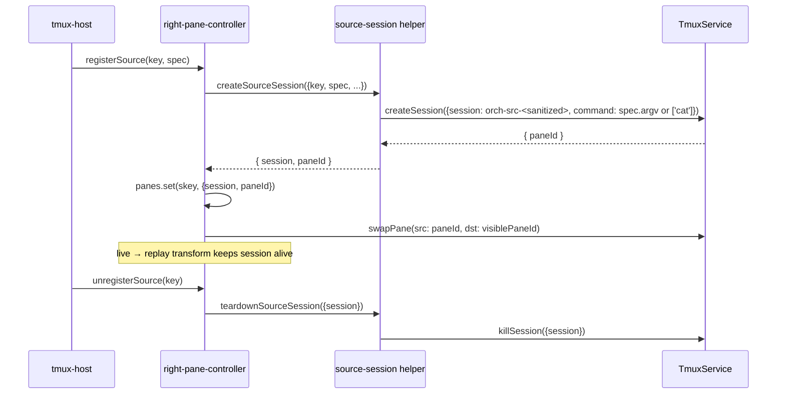

# refactor: One tmux session per source (replaces shared scratch session)

## Summary

Replace the single shared `orch-scratch` tmux session — which holds every hidden source pane via repeated `split-window` calls in one window — with **one tmux session per source**, each containing exactly one pane (the source's process). The visible `orch` session is unchanged; `swap-pane` continues to drive the right-pane UI because pane ids are server-wide and `swap-pane` works cross-session.

This removes the "no space for new pane" failure mode by design: `split-window` is no longer called inside the hidden-pane substrate, so the minimum-pane-size constraint that bit us in run `r-2026-05-22-135756-tc` cannot fire.

## Problem Frame

Run `r-2026-05-22-135756-tc` cascaded 12+ `TmuxCommandError: tmux split-window failed (exit 1): no space for new pane` events, each accompanied by a banner the user saw atop the steps grid. Root cause (see `src/hosts/two-pane/pane-map/right-pane-controller.ts:310-358`):

1. Every source — `live:<step>`, `replay:<step>`, `interactive:<step>`, `rollup`, `placeholder` — is added by horizontal `split-window` inside the `orch-scratch` session's active window.
2. After ~5 splits the active pane is narrower than tmux's minimum splittable width; the next `split-window` fails with `no space for new pane`.
3. The rotation-recovery added in commit `bfb828f` creates a new window with `new-window -d -a` (the `-d` flag explicitly does *not* make the new window active) and retries with `split-window -t <session>` (no window specifier, resolves to the session's *active* window — still the old full one). The retry hits the same wall. Both calls fail; both fire banners.
4. The bug was missed because `FakeTmuxService.splitPane` has no model of window-with-space-vs-without — the failure-recovery unit test passed by queuing a successful pane id after a queued error, regardless of which window the retry would have targeted on a real server.

The implicit design contract — "scratch session must fit all sources of one run inside one window" — was never explicit and never enforced. Workflows with more than ~5 source-producing steps walk off the cliff.

## Goals

- Eliminate the "no space for new pane" failure mode by removing `split-window` from the hidden-pane spawn path.
- Preserve the swap-pane UI contract and the visible-slot invariant (pane ids change after every swap; controller tracks `visiblePaneId`).
- Preserve teardown ordering: hidden source panes must die before the visible `orch` session, mirroring the current `teardownScratchSession`-before-`killSession(orch)` rule.
- Improve failure isolation: a single source's session-create failure must not poison sibling sources.
- Land with a faithful `FakeTmuxService` model and real-tmux regression coverage so the seam-bug class that hid the rotation problem cannot hide its successor.

## Non-Goals

- Bounding the warm-cache size (LRU eviction of stale `replay:` panes). Per-session removes the *failure*, not the *memory pressure*. Tracked separately under Deferred to Follow-Up Work.
- Changing the UI model (e.g., `switch-client` between sessions instead of `swap-pane`). The user must see steps-view + source simultaneously; `swap-pane` is correct.
- Touching the steps-view (Ink) projection. This is a substrate refactor; the left pane is unaffected.
- Renaming public lifecycle event types beyond what's required (i.e., `scratch-*` becomes `source-session-*`). Other event types (`pane-spawned`, `right-pane-swap`, etc.) are preserved verbatim so replay tooling and finding docs continue to grep.

## Scope Boundaries

### In scope (this plan)

- New `source-session.ts` module under `src/hosts/two-pane/pane-map/` (replaces `scratch-session.ts`).
- `right-pane-controller.ts` spawn path refactored to create one session per source.
- `tmux-host.ts` bootstrap and teardown updates.
- `FakeTmuxService` extended with a minimal pane-to-session tracking table.
- `TmuxService.createSession` extended to return `Promise<{ paneId: PaneId }>` so the spawn path can register the initial (holder) pane without a follow-up `listPanes`.
- All test files asserting `'orch-scratch'` session shape — ported to per-source assertions.
- The obsolete failure-recovery test (`right-pane-controller-failure-recovery.test.ts` § "Bug A — scratch window rotation") deleted; its "Bug B" / "Bug C" tests retained.
- Real-tmux Tier 1 test exercising ≥6 sources (one beyond the historical split-window threshold) as the explicit regression anchor.
- Tier 5 lifecycle cell walking a 10-step workflow end-to-end.
- `docs/logging.md` and `docs/getting-started.md` vocabulary updates.

### Deferred to Follow-Up Work

- LRU cap on the `panes` map (the `replay:` warm cache still grows unbounded; revisit after this lands).
- A `docs/solutions/per-source-tmux-sessions.md` post-mortem covering session-naming sanitization and the per-source pattern. The learnings researcher flagged this as greenfield ground worth capturing, but it's documentation-only and can land in a follow-up PR.
- Auditing other tmux-pane caches (per finding `docs/findings/2026-05-20-lifecycle-campaign-findings.md:87` — "External tmux probe pane cache was stale across swap-pane") for cross-session-aware variants.

### Outside this product's identity

- Replacing tmux as the substrate.
- Per-source UI customization (each source still appears in the same right-pane slot via swap).

---

## High-Level Technical Design

*This illustrates the intended approach and is directional guidance for review, not implementation specification.*

### Architecture transition

**Today:**

```
tmux server (socket: orch-<runId>)
├── session "orch" (visible, attached)
│   └── window 0
│       ├── pane %1: steps-view (Ink)
│       └── pane %2: visible right (swap target)
└── session "orch-scratch" (hidden, never attached)
    └── window 0
        ├── pane %3: cat (holder)
        ├── pane %4: live:command:assign-roles-1 (file-tail)
        ├── pane %5: live:command:init-board-1 (file-tail)
        ├── pane %6: interactive:move-1-1-codex (PTY)
        ├── pane %7: live:check-1-1 (file-tail)
        ├── pane %8: live:check-1-2 (file-tail)
        └── pane %9: split-window FAILS → "no space for new pane"
```

**After:**

```
tmux server (socket: orch-<runId>)
├── session "orch" (visible, attached) — unchanged
│   └── window 0: %1 (steps-view) + %2 (visible right)
├── session "orch-src-live-command-assign-roles-1"
│   └── window 0: pane %3 (file-tail, the only pane)
├── session "orch-src-live-command-init-board-1"
│   └── window 0: pane %4 (file-tail)
├── session "orch-src-interactive-move-1-1-codex"
│   └── window 0: pane %5 (PTY)
├── session "orch-src-live-check-1-1"
│   └── window 0: pane %6 (file-tail)
└── … one session per source, never splits, no upper bound.
```

`swap-pane -s %3 -t %2` still works because pane ids are server-wide. The visible slot's pane id mutates after every swap; the controller already tracks this.

### Lifecycle of one source



### Session-name sanitization

`source-key-string → session-name`. tmux session names forbid `.`, `:`, whitespace; reuse the existing `paneId`-style branded-type discipline. Mapping rule (Phase 5.3 testing will pin):

| Input | Sanitized | Why |
|---|---|---|
| `live:command:assign-roles-1` | `orch-src-live-command-assign-roles-1` | `:` → `-` |
| `interactive:move-1-1-codex` | `orch-src-interactive-move-1-1-codex` | unchanged shape |
| `replay:step.with.dots` | `orch-src-replay-step-with-dots` | `.` → `-` |
| `live:step name` (illegal but defensive) | `orch-src-live-step-name` | space → `-` |
| `placeholder` | `orch-src-placeholder` | singleton |
| `rollup` | `orch-src-rollup` | singleton |

Truncate at 64 chars (tmux is more permissive but long names confuse `tmux ls`). Append a short hash suffix if truncation would collide.

---

## Key Technical Decisions

### KTD1. `createSession` returns the initial pane id

`TmuxService.createSession` today returns `Promise<void>`. With per-source sessions we need the holder pane's id immediately so the controller can register it for swaps without an extra `listPanes` round-trip.

**Decision:** extend `createSession` to return `Promise<{ paneId: PaneId }>` and add `-P -F '#{pane_id}'` to the `new-session` argv. This mirrors the existing pattern in `newWindow` (returns `{ windowId, paneId }`) and `splitPane` (returns `PaneId`).

**Rationale:** consistency with adjacent methods; one fewer subprocess per source; deterministic pane discovery.

**Migration cost:** every existing `createSession` caller ignores the return — Phase 6 tests assert it now. Drop-in change.

### KTD2. The hidden-pane substrate is owned by the controller, not the host

Today: `tmux-host.ts` calls `createScratchSession` once at boot and threads a `ScratchSessionHandle` into the controller. The host owns the substrate's lifecycle.

**Decision:** lazy per-source creation lives inside the controller. The host no longer owns a scratch handle; the controller owns a `Map<SourceKey, { session, paneId }>` and creates sessions on first `registerSource(key)`. Teardown drains the map via a new `controller.teardownSessions()` method called before `killSession(orch)`.

**Rationale:** the host has no concept of "source" — it threads opaque events into the controller. Putting session lifecycle next to source lifecycle removes one indirection (the `ScratchSessionHandle` interface goes away) and matches Pattern B (per-step lazy resource map with drain) called out by repo research.

**Trade-off:** the controller grows new responsibility. Net file LOC is roughly flat — `spawnHiddenPane` shrinks (no rotation block) while `teardownSessions` is added.

### KTD3. Failure isolation is by design

A `createSession` failure for one source raises the same `pane-spawn-failed` lifecycle event + error banner as today's `split-window` failure. The difference: no other source's lifecycle is affected. Today's cascade is gone because there is no shared substrate to corrupt.

**Decision:** the existing `try { spawnHiddenPane() } catch { logLifecycle('pane-spawn-failed', ...); throw }` shape at `right-pane-controller.ts:383-395` is preserved. The catch in the registration path already disposes of the partial pending-registration promise. No retry, no rotation.

### KTD4. Lifecycle event vocabulary

| Old | New | Notes |
|---|---|---|
| `scratch-session-created` | `source-session-created` | per-source, fires N times not 1 |
| `scratch-session-teardown-start` | `source-session-teardown-start` | per-source |
| `scratch-session-teardown-failed` | `source-session-teardown-failed` | per-source |
| `scratch-session-torndown` | `source-session-torndown` | per-source |
| `scratch-window-rotate` | *(deleted)* | rotation code is gone |
| `pane-spawn-start`, `pane-spawned`, `pane-spawn-failed`, `pane-killed`, etc. | unchanged | semantically identical |

Replay tooling and finding-doc greps that key on `pane-*` keep working. The `scratch-*` rename is the only churn for log consumers.

### KTD5. `FakeTmuxService` grows minimal pane-ownership tracking

Today the fake records calls and tracks `#sessionsBySocket: Map<SocketName, Set<string>>` but has no pane-to-session mapping. Tests assert via `recordedCalls` ordering.

**Decision:** extend `FakeTmuxService` with `#panesBySession: Map<sessionName, PaneId[]>`. `createSession` appends the synthesized (or scripted) initial pane id; `killSession` clears the session's entry; `killServer` clears all entries on that socket. Existing tests are unaffected (the new state is additive and only queried by new tests).

**Rationale:** the rotation-bug seam-failure happened because the fake had no model of window-with-space. The new model needs a model of session-owns-pane so tests can assert "after killSession(orch-src-X), pane %N is no longer in the active set" without those assertions becoming wishful thinking. Keep the model minimal — no pane-content, no scrollback, no tty size.

---

## System-Wide Impact

| Surface | Change |
|---|---|
| `src/hosts/two-pane/pane-map/scratch-session.ts` | **Deleted.** Replaced by `source-session.ts`. |
| `src/hosts/two-pane/pane-map/right-pane-controller.ts` | Substantial — spawn path, kill seam, teardown. Rotation/retry block removed (lines 332-358). |
| `src/hosts/two-pane/tmux-host.ts` | Bootstrap no longer creates a scratch session; teardown drives `controller.teardownSessions()`. |
| `src/services/tmux/tmux-service.ts` | `createSession` return type extended. |
| `src/services/tmux/real-tmux-service.ts` | `createSession` argv adds `-P -F '#{pane_id}'`. |
| `src/services/tmux/fake-tmux-service.ts` | New `#panesBySession` map; new `paneIdsForSession()` query helper. |
| `src/hosts/two-pane/pane-map/index.ts` + `src/hosts/two-pane/index.ts` | Barrel updates. |
| `docs/logging.md` | Event-type rename table. |
| `docs/getting-started.md` | "swap target" section line 657 — vocabulary update from "scratch session" to "per-source sessions" (one short paragraph). |
| `tests/integration/hosts/two-pane/pane-map-scratch-session.real.integration.test.ts` | Repurposed → `per-source-session.real.integration.test.ts`. |
| `tests/integration/hosts/two-pane/tier-1/*` | Multiple files asserting `listPanes({ session: 'orch-scratch' })` updated. |
| `tests/unit/hosts/two-pane/pane-map/right-pane-controller*.test.ts` | All `'orch-scratch'` fixtures rebuilt. |
| `tests/unit/hosts/two-pane/pane-map/right-pane-controller-failure-recovery.test.ts` | "Bug A" describe block deleted; "Bug B"/"Bug C" retained. |
| `tests/unit/hosts/tmux-host.test.ts` | Teardown-order assertion updated from `['orch-scratch', 'orch']` to a per-source enumeration. |
| `tests/integration/hosts/two-pane/*` mocked integration tests | All `'orch-scratch'` pins updated. |
| `tests/integration/lifecycle/` | New 10-step lifecycle cell. |
| `tests/integration/hosts/two-pane/tier-1/` | New "≥6 sources, no failures" regression anchor. |

---

## Implementation Units

### U1. Source-session helper module

**Goal:** create `src/hosts/two-pane/pane-map/source-session.ts` that owns per-source session create + teardown. Replaces `scratch-session.ts`.

**Requirements:** the failure-mode removal goal; the holder + `destroy-unattached off` learnings from `src/hosts/two-pane/pane-map/scratch-session.ts:32-48` (holder JSDoc + `SCRATCH_HOLDER_ARGV`) and `:99-112` (the `setOption -g destroy-unattached off` call) and the `bfb828f` post-mortem.

> **Definition (used below):** a *holder pane* is a dormant `cat` subprocess whose only job is to keep a session alive when no real source process occupies it. Today's `orch-scratch` session uses a holder as its initial pane because the session itself has no "source." In the per-source design, only the `placeholder` source needs a holder; every other source's initial pane IS the source process (the `tail -F …` or the runner PTY).

**Dependencies:** none.

**Files:**
- Create: `src/hosts/two-pane/pane-map/source-session.ts`
- Create: `tests/unit/hosts/two-pane/pane-map/source-session.test.ts`
- Delete: `src/hosts/two-pane/pane-map/scratch-session.ts` (deferred to U5 barrel cleanup so imports don't break mid-PR)

**Approach:**
- Export `sanitizeSessionName(key: SourceKey): string` — pure function. Maps `:`, `.`, whitespace, `=`, `\t`, `\n` to `-`. Prefixes `orch-src-`. Truncates to 64 chars; if truncated, appends an 8-char hex hash of the un-truncated form to disambiguate collisions.
- Export `createSourceSession({ tmux, socket, width, height, sessionName, command }): Promise<{ session, paneId }>` — calls `tmux.createSession({ socket, session, width, height, command })` with the per-source argv. The `command` is the source's actual process argv (the `tail -F` or PTY argv) so the initial pane *is* the source process. No second `split-window` ever happens.
- Export `teardownSourceSession(tmux, { socket, session }): Promise<void>` — idempotent `tmux.killSession(...)` (tolerates "session not found"; mirrors `teardownScratchSession`).
- Carry forward the holder argv comment block from `scratch-session.ts:38-70` verbatim as JSDoc on the module — it's the single most valuable institutional-memory chunk in the old file. Annotate that the `cat` holder applies *only* for `placeholder` (the source whose pane has no real process); every other source's initial pane IS the source process and needs no separate holder.
- `destroy-unattached off` is set globally once during orch-session bootstrap (already done at `src/services/tmux/session-init.ts`). Confirm during U3 wiring that this global pin is in place before any `createSourceSession` call. Document the dependency in the module's JSDoc.

**Patterns to follow:**
- Naming + JSDoc convention from `scratch-session.ts`.
- Branded-type style from `src/services/tmux/tmux-service.ts:19` (`PaneId`, `WindowId`).

**Test scenarios** (`source-session.test.ts`):
- `sanitizeSessionName('live:command:assign-roles-1')` returns `'orch-src-live-command-assign-roles-1'`.
- `sanitizeSessionName('replay:step.with.dots')` returns `'orch-src-replay-step-with-dots'`.
- `sanitizeSessionName('interactive:has space and\ttab')` returns `'orch-src-interactive-has-space-and-tab'`.
- `sanitizeSessionName('live:' + 'x'.repeat(200))` returns a name ≤ 64 chars suffixed with an 8-char hex hash; two distinct long inputs that share their first 56 chars produce distinct outputs (hash discriminates collisions).
- `sanitizeSessionName('placeholder')` returns `'orch-src-placeholder'` (singleton); same input twice returns identical output (pure function).
- `createSourceSession` against `FakeTmuxService` records exactly one `createSession` call with the expected session name, command argv, width, height; returns the `{ session, paneId }` shape where `paneId` matches the fake's scripted return.
- `createSourceSession` propagates `TmuxCommandError` from the underlying service unchanged (no retry, no rotation).
- `teardownSourceSession` against `FakeTmuxService` records one `killSession`; tolerates the "session not found" idempotent shape (script the fake's `killSession` to throw the canonical not-found error and confirm `teardownSourceSession` swallows it).
- `teardownSourceSession` propagates non-idempotent errors (e.g., a different `TmuxCommandError`).

**Verification:** `bun run check` green; new file under 300 LOC.

---

### U2. `TmuxService.createSession` returns initial pane id

**Goal:** extend the port + both implementations so `createSession` returns `{ paneId: PaneId }`. Mirrors the `newWindow` pattern.

**Requirements:** KTD1.

**Dependencies:** none. Must land before U3 so U3's source-session integration can consume the return value.

**Files:**
- Modify: `src/services/tmux/tmux-service.ts` (interface change + JSDoc)
- Modify: `src/services/tmux/real-tmux-service.ts` (`createSession` argv adds `-P -F '#{pane_id}'`; parse stdout like `newWindow` does at lines 462-476)
- Modify: `src/services/tmux/fake-tmux-service.ts` (return `{ paneId }`; allow `nextCreateSessionPaneId(...)` queue for scripted ids; auto-synthesize when queue is empty; record in `#panesBySession`)
- Modify: `tests/unit/services/tmux/tmux-service.test.ts` (existing argv shape pins — extend to assert `-P -F '#{pane_id}'`)

**Approach:**
- Add the `-P -F '#{pane_id}'` flags to the `new-session` argv at `real-tmux-service.ts:116-130`. Reuse the stdout-parsing pattern from `newWindow` (lines 462-476).
- For tests that don't care, the fake's auto-synth (`%N` counter) keeps assertions trivial.
- All existing `createSession` callers continue to compile because the return type widens — `void` becomes `{paneId}`, but call sites can ignore the result. Verify no caller currently expects literal `void` (TypeScript will surface any incompatibility at typecheck time).

**Patterns to follow:**
- `newWindow` return shape and `-P -F` pattern at `src/services/tmux/real-tmux-service.ts:430-476`.

**Test scenarios:**
- Tier 3 unit (`tmux-service.test.ts`): `RealTmuxService.createSession` argv contains `'-P'` and `'-F'` and `'#{pane_id}'` in the expected positions.
- Tier 3 unit: `RealTmuxService.createSession` returns the parsed pane id from stdout (use a ProcessService stub returning a fixed `%42`).
- Tier 3 unit: `RealTmuxService.createSession` throws `TmuxCommandError` when stdout does not yield a parseable pane id (e.g., empty), distinguishing this failure from a successful exit-0 with corrupted output.
- Fake: `FakeTmuxService.createSession` returns the next scripted pane id when one is queued; falls back to `%N` auto-synth when no script is queued; appends the pane id to `#panesBySession[sessionName]`.
- Fake: `paneIdsForSession(name)` returns the recorded list; returns `[]` for unknown sessions.
- Fake: `killSession` clears the session's entry from `#panesBySession`.
- Real-tmux integration (`tests/integration/services/tmux/tmux-real.integration.test.ts`): create a session, capture the returned pane id, assert it's a syntactically valid pane id and that `listPanes({ session })` includes it.

**Verification:** typecheck passes; all existing tests still pass; new return-value assertions pass.

---

### U3. Controller spawn path + state migration

**Goal:** rewrite `spawnHiddenPane` in `right-pane-controller.ts` to use per-source sessions; update `panes` map shape to `{ session, paneId }`; delete rotation/retry block; expose a new `teardownSessions(): Promise<void>` method on the controller (consumed by U4 during host shutdown); preserve the existing `getPaneId(key): PaneId | undefined` public return shape by extracting `.paneId` from the new entry type at the call site.

**Requirements:** the failure-mode removal goal; KTD2 (controller owns substrate); KTD3 (failure isolation); the pane-id-after-swap invariant.

**Dependencies:** U1 (source-session helper), U2 (createSession return type).

**Files:**
- Modify: `src/hosts/two-pane/pane-map/right-pane-controller.ts`
- Modify: `tests/unit/hosts/two-pane/pane-map/right-pane-controller.test.ts`
- Modify: `tests/unit/hosts/two-pane/pane-map/right-pane-controller-banner.test.ts`
- Modify: `tests/unit/hosts/two-pane/pane-map/right-pane-on-intent.test.ts`
- Modify: `tests/unit/hosts/two-pane/pane-map/resume-refusal.test.ts`
- Modify: `tests/unit/hosts/two-pane/pane-map/right-pane-controller-session-lost.test.ts`
- Delete (block): `tests/unit/hosts/two-pane/pane-map/right-pane-controller-failure-recovery.test.ts` — only the `describe('right-pane-controller scratch window rotation (Bug A)', …)` block (lines ~205-280); keep "Bug B" and "Bug C" describe blocks.

**Approach:**
- Replace `RightPaneControllerOptions.scratchSession?: ScratchSessionHandle` with `RightPaneControllerOptions.runId: RunId` (already present) + `socket: SocketName` (already present) + `width: number` + `height: number` (new — propagated from `tmux-host.ts` where it constructs the controller).
- Replace `requireScratchSession()` with `nothing` — the helper goes away.
- Rewrite `spawnHiddenPane(spec, key)`:
  1. Compute `sessionName = sanitizeSessionName(key)`.
  2. Build the per-source `command` argv: for `file-tail`, it's `['tail', '-n', TAIL_BACKFILL_LINES, '-F', spec.path]`. For `pty`, it's `spec.argv` (with env applied if present). For `placeholder`, it's `['cat']` (the only source whose pane isn't a real process).
  3. Call `createSourceSession({ tmux, socket, width, height, sessionName, command, env, cwd })` and persist `{ session: sessionName, paneId }` in the `panes` map (the map's value type changes from `PaneId` to `{ session: string, paneId: PaneId }`).
  4. No retry. No rotation. The whole try/catch around `split()` collapses to a plain `await createSourceSession(...)`.
- Update `killHiddenSource(skey, entry)` to call `teardownSourceSession({ tmux, socket, session: entry.session })` instead of `tmux.killPane`. Note: killing a session destroys its pane, so we no longer need a separate `killPane` call — the `pane-killed` lifecycle event semantics shift from "tmux killed the pane" to "we killed the session and the pane went with it" (capture this in `docs/logging.md` per U6).
- Update `showSource(key)` to swap from `entry.paneId` (cross-session swap; pane ids are server-wide so no further changes are needed in the swap argv).
- Track `visiblePaneId` (a single `PaneId`) — unchanged. After every `swapPane`, the pane id formerly at `dst` is now in the source session and the source pane id is in the visible slot. The invariant carries over verbatim.
- Add new method `teardownSessions(): Promise<void>` — iterates `panes.values()` and calls `teardownSourceSession` for each. Idempotent; tolerates already-gone sessions; called by `tmux-host.ts` teardown (U4).
- **Delete** lines 307-308 (`scratchWindowSeq`, `NO_SPACE_PATTERN`) and the rotation block in `spawnHiddenPane` (lines 332-358).

**Patterns to follow:**
- Per-step lazy resource map idiom from `src/hosts/plain/per-step-tee.ts` (open/close/drain). The controller's `panes` already follows it; `teardownSessions()` is the new `drain()`.
- Idempotent teardown pattern from `teardownScratchSession`.

**Execution note:** Test-first. The pane-map shape change (`PaneId` → `{ session, paneId }`) touches every test fixture in this directory; flip the production code last so the failing tests guide the migration rather than chasing red flips after the fact.

**Test scenarios** (rebuilt across the four controller test files):
- `registerSource(live:step1)` calls `createSession` exactly once with `session === 'orch-src-live-step1'`, the file-tail argv, and the configured `width`/`height`.
- `registerSource(live:step1)` followed by `registerSource(live:step2)` produces two distinct `createSession` calls with two distinct session names. **No `splitPane` calls at all** (regression assertion for the bug).
- `registerSource` is idempotent on the same key — second call is a no-op (`pane-spawn-skip-existing`), no second `createSession`.
- `registerSource` followed by `unregisterSource(live:step1)` triggers the live→replay transform (no `killSession`); the session stays alive under the new `replay:step1` key.
- `registerSource(interactive:step)` followed by `unregisterSource(interactive:step)` issues exactly one `killSession` and the pane is no longer in `panes` map.
- `registerSource` whose `createSession` rejects with a `TmuxCommandError` emits a `pane-spawn-failed` lifecycle event and propagates the rejection. **No retry. No rotation.** No subsequent `createSession` or `newWindow` call appears in `recordedCalls`.
- Failure isolation: register source A → fail; register source B → succeed. Source B's session is created and its swap happens normally; source A's failure does not leave any zombie state in the `panes` map.
- `showSource` issues `swapPane({ src: entry.paneId, dst: visiblePaneId })` exactly once and updates `visiblePaneId` to the former `entry.paneId`. Subsequent `showSource(otherKey)` swaps against the updated `visiblePaneId`.
- After `swapPane`, `panes.get(skey).paneId` still equals the *pane id originally registered for that source* — pane ids are sticky to processes, not positions. (This is the invariant call-out: tests that capture the pane id at register and re-check after a swap must NOT find it has changed.)
- `teardownSessions()` issues one `killSession` per entry in the `panes` map. After it resolves, the map is empty.
- `teardownSessions()` tolerates `killSession` throwing "session not found" for any individual entry (each entry's teardown is independent — one already-gone session does not block the others).
- Covers AE: the move-1-3-codex regression case. Sequence: register 6 sources back-to-back (mirroring the run that broke); confirm 6 `createSession` calls succeed, zero `splitPane` calls, zero `pane-spawn-failed` events.

**Verification:** the targeted controller test files pass; the deleted "Bug A" block does not re-appear; `bun run check` green.

---

### U4. Host wiring + teardown ordering

**Goal:** `tmux-host.ts` no longer constructs a scratch session at boot; teardown drives `controller.teardownSessions()` before `killSession(orch)`.

**Requirements:** preserve the load-bearing teardown order (hidden panes die before visible session).

**Dependencies:** U3 (controller exposes `teardownSessions`).

**Files:**
- Modify: `src/hosts/two-pane/tmux-host.ts`
- Modify: `tests/unit/hosts/tmux-host.test.ts`

**Approach:**
- Remove `createScratchSession` call (line ~325) and the `scratch-session-created` lifecycle log.
- Remove `BuildHostDeps.scratchSession` field; replace with `width` + `height` propagated into the controller's options.
- Remove `teardownScratchSession` block from `teardownInner` (lines 1265-1281) and replace with `controller.teardownSessions()` wrapped in the same lifecycle-log + try/catch shape.
- Preserve the relative ordering: `controller.teardownSessions()` → `killSession({session: 'orch'})` → `killServer({socket})`.
- The `controller.stop()` flip at the top of the wrapped teardown must still run before `teardownSessions` — `stop()` blocks new registrations from racing against teardown.

**Patterns to follow:**
- Existing `teardownInner` log-then-catch shape at `tmux-host.ts:1265-1300`.

**Test scenarios** (`tmux-host.test.ts`):
- Boot with no steps: no `createSession({ session: 'orch-src-*' })` calls fire (only the `orch` session is created).
- Boot + register one live source + teardown: the `killSession` calls in order are `[orch-src-live-<step>, orch]` (per-source first, visible last). Server kill follows.
- Boot + register N=5 live sources + teardown: 5 per-source `killSession` calls fire before the `orch` `killSession`. Order among the 5 is not asserted (parallelism allowed); but all 5 complete before `orch` is touched.
- Idempotent teardown: calling teardown twice issues the per-source kills only once (controller's `stopped` flag gates it).
- `teardownSessions` propagating an error does NOT prevent `killSession({session: 'orch'})` from running (the visible session must always be reaped — preserve the existing try/catch-and-continue shape).

**Verification:** `bun run check` green; the existing teardown-order test (`tmux-host.test.ts:536-554`) is updated and passes.

---

### U5. Barrel + vocabulary updates

**Goal:** prune deleted exports, add new ones, update lifecycle event names in `docs/logging.md`.

**Requirements:** KTD4 (vocabulary table).

**Dependencies:** U1, U3, U4 (the new module + the deletions must exist).

**Files:**
- Modify: `src/hosts/two-pane/pane-map/index.ts` — remove `SCRATCH_SESSION_NAME`, `createScratchSession`, `teardownScratchSession`, `ScratchSessionHandle`, `CreateScratchSessionDeps`; add `sanitizeSessionName`, `createSourceSession`, `teardownSourceSession`, `SourceSessionHandle`, `CreateSourceSessionOptions`.
- Modify: `src/hosts/two-pane/index.ts` — same pruning + additions.
- Delete: `src/hosts/two-pane/pane-map/scratch-session.ts` (final removal; safe now that U3+U4 no longer import it).
- Modify: `docs/logging.md` — update the lifecycle event table (lines 23, 70-74). Add note: "`scratch-*` events were renamed to `source-session-*` on 2026-05-22 — see this plan's commit."
- Modify: `docs/getting-started.md` line 657 area — one short paragraph: "Hidden source panes live in per-source tmux sessions (`orch-src-<sanitized-key>`) on the same socket as `orch`. `swap-pane` is cross-session because pane ids are server-wide."

**Approach:** mechanical. No new logic.

**Patterns to follow:** existing barrel shape.

**Test scenarios:**
- Compile-time: `bun run typecheck` passes — no import of a removed symbol survives.
- Test expectation: none for `docs/logging.md` and `docs/getting-started.md` — pure documentation. Lint check (`bun run lint`) covers markdown linting if configured.

**Verification:** `bun run check` green. `git grep "orch-scratch"` returns zero hits outside the new docs/logging note. `git grep "scratch-session-created"` returns zero hits outside the same note.

---

### U6. Mocked-integration test migration

**Goal:** every mocked-integration test that pinned `'orch-scratch'` is ported to per-source assertions.

**Requirements:** preserve test intent; do not weaken assertions.

**Dependencies:** U3 (controller behavior change), U5 (barrels).

**Files:**
- Modify: `tests/integration/hosts/two-pane-interactive.test.ts`
- Modify: `tests/integration/hosts/two-pane/right-pane-replay.integration.test.ts`
- Modify: `tests/integration/hosts/two-pane/interactive-unregister-keeps-visible-slot-alive.integration.test.ts`
- Modify: `tests/integration/hosts/two-pane/follow-live-prefers-live-over-interactive-replay.integration.test.ts`
- Modify: `tests/integration/hosts/two-pane/resume-failure-mocked.integration.test.ts`
- Modify: `tests/integration/hosts/two-pane/resume-launcher-mocked.integration.test.ts`
- Modify: `tests/integration/hosts/two-pane/kind-details.integration.test.ts`
- Modify: `tests/integration/hosts/two-pane/steps-tui-e2e.mocked.test.ts`

**Approach:**
- For each `expect(split.opts.session).toBe('orch-scratch')` — replace with `expect(createSession.opts.session).toMatch(/^orch-src-/)` (or the exact sanitized name when the source key is known).
- For each `'orch-scratch'` fixture handle — delete (no longer threaded through).
- Any test that asserted multiple sources sharing one session must assert multiple sessions sharing the substrate instead.

**Test scenarios:** none new — these tests already encode the behavior; we're updating *how* they assert it, not what.

**Verification:** all listed files pass; `bun run check` green.

---

### U7. Real-tmux Tier 1 tests — repurpose + regression anchor

**Goal:** the real-tmux scratch-session test becomes a real-tmux per-source-session test. Add a new test that creates ≥6 sources to lock in the regression.

**Requirements:** the regression anchor for the bug that motivated this plan.

**Dependencies:** U3, U5.

**Files:**
- Rename + rewrite: `tests/integration/hosts/two-pane/pane-map-scratch-session.real.integration.test.ts` → `tests/integration/hosts/two-pane/pane-map-source-session.real.integration.test.ts`.
- Modify: `tests/integration/hosts/two-pane/tier-1/replay-revisit-reuses-pane.real.integration.test.ts` (lines 57, 68 — `listPanes` query updated to the per-source session name).
- Create: `tests/integration/hosts/two-pane/tier-1/many-sources-no-split-failure.real.integration.test.ts` — the regression anchor.

**Approach for the renamed file:** the original asserted (a) handle session === 'orch-scratch', (b) both sessions exist on the socket, (c) `cat` runs as initial pane, (d) teardown order kills scratch before orch. New shape:
- Create three source sessions via `createSourceSession` directly (file-tail, pty, placeholder).
- Assert each session exists on the socket; their initial panes match the returned `paneId`.
- For the placeholder, assert the initial pane runs `cat`.
- For the file-tail, assert the initial pane runs `tail` (read `tmux display-message -p "#{pane_current_command}"`).
- Tear down each via `teardownSourceSession`; assert idempotent (second call doesn't throw).
- Assert teardown leaves `orch` reachable (`hasSession({socket, session: 'orch'}) === true`).

**Approach for the regression anchor:** spin up a tmux fixture, register 6 file-tail sources via the controller (one beyond the historical 5-split threshold), swap between them in arbitrary order, verify:
- 6 `createSession` calls succeeded (no failures).
- Zero `split-window` calls were made (probe via tmux logging or by asserting `listPanes({session: 'orch-src-*'})` shows exactly 1 pane per per-source session).
- The visible right pane's content matches whichever source was last swapped in (capture-pane + content match).
- Tear down: all 6 per-source sessions die before `orch`.

**Patterns to follow:** existing tier-1 harness shape from `tests/helpers/real-tmux/` per the repo research; `mountTmuxHost` + `createRealTmuxFixture`.

**Test scenarios:**
- Covers AE: the move-1-3-codex regression — Tier 1 real-tmux variant ("the rotation fix didn't work, so add a real-tmux test that would have caught it"). Spawn 6 source sessions sequentially; capture pane content from the visible right pane after each swap; assert no `pane-spawn-failed` event in the lifecycle log.
- Session-name sanitization round-trip: register a source whose key contains `:` and `.`; confirm the actual tmux session name on the socket matches the sanitizer's output.
- Cross-session swap: swap from source A's pane to the visible slot, then from source B's pane; assert pane-id mutation invariant after each swap.
- Holder pane for `placeholder`: the placeholder session's initial pane is the `cat` holder (not a tail of `/dev/null` via separate split, as today).
- Idempotent teardown: calling `teardownSourceSession` on a session that's already gone does not throw.

**Verification:** `bun run check:integration:real` (or the project's real-tmux test command) green.

---

### U8. Tier 5 lifecycle cell — 10-step workflow walkthrough

**Goal:** end-to-end lifecycle test that walks a representative workflow shape (mix of file-tail, PTY, command sources) and asserts no rotation events, no "no space" errors, clean teardown.

**Requirements:** prove no regression of the broader workflow.

**Dependencies:** U3, U4.

**Files:**
- Create: `tests/integration/lifecycle/per-source-sessions-10-step-walkthrough.real.test.ts`

**Approach:**
- Use `ScriptedFakeRunner` (added in commit `55db3f9`) and the Tier 5 harness from `tests/integration/lifecycle/`.
- Define a 10-step workflow: alternating command + interactive + file-tail-bearing-agent steps (mirror the tic-tac-toe shape that broke).
- Run end-to-end; collect lifecycle events via the session logger.
- Assertions:
  - Exactly 10 `pane-spawn-start` events.
  - Exactly 10 `pane-spawned` events (or 10 + N for replay sources opened later).
  - Zero `pane-spawn-failed` events.
  - Zero `scratch-window-rotate` events (the type no longer exists).
  - `source-session-created` event count matches the unique-source-key count.
  - On teardown, `source-session-torndown` event count equals the `source-session-created` count.
  - Final `host-torndown` event fires; the tmux server is gone (`hasServer({socket}) === false`).

**Patterns to follow:** existing Tier 5 cells in `tests/integration/lifecycle/`.

**Test scenarios:**
- Happy path: 10 steps complete; all sessions reaped.
- Failure mid-run: inject a `createSession` failure on step 5 (via a fault-injecting `TmuxService` wrapper or by exhausting a quota in the fake). Assert: step 5 logs `pane-spawn-failed` and emits a banner; steps 6-10 still succeed (failure isolation). Teardown still reaps all created sessions cleanly.
- Test expectation: this cell is the only Tier 5 cell for this refactor; broader Tier 5 cells continue to cover orthogonal concerns (server-killed-externally, etc.).

**Verification:** the cell runs under `bun run check:integration:real` (or the project's Tier 5 command) and passes.

---

## Test Pyramid for This Refactor

| Tier | Layer | Files (approximate count) | Confidence target |
|---|---|---|---|
| 3 (unit, argv contract) | `RealTmuxService.createSession` argv shape, `sanitizeSessionName` table | 2 files | Sanitizer rules pinned; `-P -F` argv pinned |
| 2 (unit, Ink projection) | Unchanged | 0 new files | n/a — refactor doesn't touch the view layer |
| Unit (controller) | `right-pane-controller*.test.ts` × 5 | Modified | Pane-map state shape, failure isolation, swap invariant |
| Mocked integration | `tests/integration/hosts/two-pane/*` × 8 | Modified | End-to-end via FakeTmuxService — no `'orch-scratch'` survives |
| 1 (real tmux + FakeRunner) | `pane-map-source-session.real.integration.test.ts`, `many-sources-no-split-failure.real.integration.test.ts`, `replay-revisit-reuses-pane.real.integration.test.ts` | 1 renamed, 1 new, 1 modified | Real-server regression anchor; sanitization round-trip |
| 5 (lifecycle) | `per-source-sessions-10-step-walkthrough.real.test.ts` | 1 new | Workflow-wide proof |

Triage rule (from `docs/testing-strategy.md`): "Would this test still pass if the visible pane were empty / wrong / unformatted? If yes, demote or delete." The Tier 1 regression anchor passes this — it captures real visible-pane content after each swap.

---

## Risk Analysis & Mitigation

| Risk | Likelihood | Impact | Mitigation |
|---|---|---|---|
| `createSession` return-shape change breaks an undiscovered caller | Low | Build break | TypeScript catches at typecheck; `bun run check` is the gate. |
| Per-source session leak (zombie sessions after host crash) | Low | tmux server grows over time across runs | Each run gets its own socket (`orch-<runId>`); when the run ends and the server is killed (`killServer`), all sessions die together. The leak window is the runtime of a single failed run — not cross-run. |
| Race: source registered during teardown | Low | Orphan session not torn down | `controller.stop()` flips `stopped = true` BEFORE `teardownSessions` runs; subsequent `registerSource` returns early. Existing invariant. |
| `swap-pane` cross-session quirk on a future tmux version | Low | Visible pane content stale | Tier 1 regression test exercises real swap-pane behavior; `tmux -V >= 3.0` guard already enforced at boot per learnings. |
| Stale pane-id cache in test probes (per finding `2026-05-20-lifecycle-campaign-findings.md:87`) | Medium | Tests pass while real behavior diverges | Audit existing test probes during U6/U7 migration; any `resolvePanes`-style memoization must invalidate on swap. Document in the Tier 1 test JSDoc. |
| Holder-pane omission for `placeholder` | Low | Placeholder session collapses (per `bfb828f` post-mortem) | U1 carries the holder comment block verbatim and explicitly enumerates `placeholder` as the only source whose initial argv is `['cat']`. Test scenario in U7 confirms. |
| `destroy-unattached on` from a user's `~/.tmux.conf` racing with un-attached source sessions | Low | Sessions vanish behind our back | Existing global `set -g destroy-unattached off` pin (currently set as part of scratch-session bootstrap at `src/hosts/two-pane/pane-map/scratch-session.ts:90-99`) must be relocated to orch-session init (`src/services/tmux/session-init.ts`) so it's set BEFORE any per-source session is created. U3 acceptance check. |
| Test seam-faithfulness regression (the same class of bug that hid the rotation problem) | Medium | New design fails silently in CI | KTD5: extend `FakeTmuxService` with `#panesBySession` so tests can assert "this pane belongs to that session." Tier 1 real-tmux test is the ground-truth backstop. |

---

## Dependencies / Prerequisites

- tmux ≥ 3.0 (already enforced at host bootstrap).
- `bun run check` green before merge (project gate).
- No external system contracts change (no env vars, no exported APIs, no CI config).

---

## Verification (whole plan)

The plan is complete when:
- `bun run check` is green (lint + typecheck + unit + mocked-integration).
- `bun run check:integration:real` (or the project's real-tmux suite) is green, including the new Tier 1 regression anchor and the repurposed source-session real test.
- `bun run check:lifecycle` (or the Tier 5 command) is green, including the new 10-step walkthrough cell.
- `git grep "orch-scratch"` returns zero hits outside `docs/logging.md`'s historical-rename note.
- `git grep "scratch-window-rotate"` returns zero hits in `src/` and `tests/`.
- `git grep "scratch-session-created\|scratch-session-teardown\|scratch-session-torndown"` returns zero hits in `src/` and `tests/` (the old event names are fully migrated to `source-session-*` per KTD4).
- A manual smoke run of the tic-tac-toe workflow (the original repro) produces no banner errors and walks all moves to completion.

---

## Sequencing

```
U1 (source-session module) ──┐
                             ├─→ U3 (controller refactor) ──┐
U2 (createSession returns) ──┘                              ├─→ U4 (host wiring) ─→ U5 (barrels + docs)
                                                            │
                                                            └─→ U6 (mocked tests) + U7 (real tmux) + U8 (Tier 5)
```

U1 + U2 land in parallel (independent). U3 depends on both. U4 depends on U3. U5 is the cleanup after U3+U4. U6/U7/U8 can run in parallel once U3 is stable; landing them together with U3-U5 in one PR is reasonable for a single-author refactor.

---

## Deferred Implementation Notes

- Exact line numbers in `right-pane-controller.ts` will shift as code is deleted in U3. The unit-by-unit `Files:` references point to the file, not to fixed lines.
- The lifecycle event-name assertions in U8 (see its Test scenarios section) are derived from KTD4's vocabulary table and the host's existing logging shape. Validate them against the live event stream during test development; if the observed stream differs from the pre-listed assertions, update the test scenarios to match reality, not the other way around. The pre-listed names are canonical, but the precise set and ordering of events emitted by a 10-step workflow depends on `step:start`/`step:complete` interleaving that we'll see in the first dry-run.
- If `bun run check`'s mocked-integration phase reveals a test pinning behavior not covered above, port it using the same `'orch-scratch'` → per-source convention.
- `docs/solutions/per-source-tmux-sessions.md` (the post-mortem doc the learnings researcher recommended) is deferred to a follow-up PR; the rationale and design decisions live in this plan and the eventual commit message.
