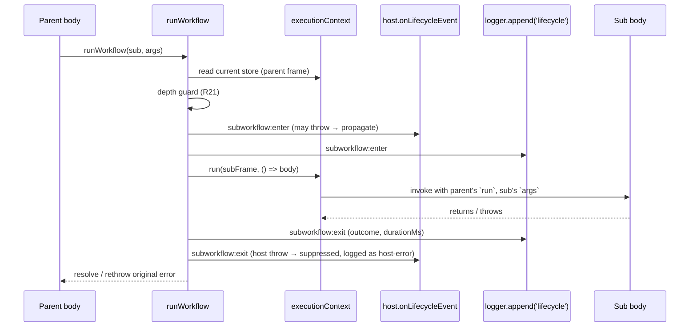

# feat: Subworkflows — inline-equivalent composition via `runWorkflow`

## Summary

Add a `runWorkflow(executor, args)` primitive so one `orch` workflow file can invoke another inline from within its body. The invoked artifact is the same `WorkflowExecutor` returned by `workflow(name, fn)`; the same file is usable either as a top-level CLI entry (`orch run simple-feature`) or as a sub-step inside a larger composition. Execution is inline-equivalent: one `runId`, one `RunState`, one log directory, one `captureLock`, one resume contract.

Two deliberate departures from literal inline equivalence ship with v1:

1. **`subworkflow:enter` / `subworkflow:exit` lifecycle events** so hosts and `lifecycle.ndjson` can render a visible boundary.
2. **Fresh ALS frame on entry** carrying a copy-by-value `workflowCwd`, an incremented `subworkflowDepth`, and an extended `subworkflowPath` — so a reusable sub using `createWorktree({ enter: true })` does not silently mutate its caller's cwd.

V1 also ships the **two-pane indented-gutter rendering** (R22–R26), a **depth bound** (R21, default 8), and a **sub-aware step cache key** so a cached step value inside one sub never silently replays inside another.

V1 explicitly defers `{ stepPrefix }` for multi-invocation reuse (see Scope Boundaries). Multi-invocation reuse — including invoking the same sub from sibling parallel branches — trips R20's `StepNameCollisionError`; this is the intended v1 behavior.

---

## Problem Frame

Today a workflow body is one async function. If the author wants to dispatch one of two distinct multi-step pipelines based on a runtime decision (e.g. a `decide` step that returns `'simple'` or `'complex'`), the only option is to inline both pipelines in a single workflow file and gate them with an `if`. Two forces push against this once the workflow grows:

1. **File size and readability.** A workflow with a decision + two ~6-step branches inlined is a single ~150-line function. The branches read as one big switch rather than two named units.
2. **CLI composability.** Authors want the artifact "ship a small feature" runnable both standalone (`orch run simple-feature`) and as a sub-step inside a larger orchestration. Today the author has to choose between "registered workflow" (runnable, not composable) and "helper function" (composable, not runnable).

*(The brainstorm's third force — Reuse via multi-invocation in a single run — is genuinely deferred to a future `{ stepPrefix }` overload per the locked v1 scope decision. v1 enables single-invocation extraction; multi-invocation reuse remains a deferred motivation.)*

The shared cost is that the author currently has to decide at write time whether a chunk of pipeline is "a workflow" or "a subroutine". v1 removes that decision for the single-invocation case.

---

## Vocabulary

These terms recur across the plan; pin meanings before the unit list to avoid the homonym hazards flagged in [`docs/solutions/two-pane-auto-attach.md`](../solutions/two-pane-auto-attach.md).

- **Workflow file** — the `.ts` file under `examples/<name>/index.ts` whose default export is a `WorkflowExecutor`.
- **`WorkflowExecutor`** — the object returned by `workflow(name, fn)`. Exposes `name`, `execute(deps)`, `resume(deps)`, plus a module-private body handle (see U2).
- **Workflow body** — the `WorkflowFn` the author writes (`async (run, args) => { ... }`).
- **Parent workflow** — the workflow whose `execute(deps)` was called by the CLI.
- **Sub** / **Subworkflow** — a workflow invoked via `runWorkflow(executor, args)` from inside another workflow's body. v1 keeps the public-facing term **"subworkflow"** but the contract is *inline composition*, not Airflow/Temporal-style encapsulation (the brainstorm's product-lens question was decided against renaming on the basis that R14's `subworkflow:enter`/`subworkflow:exit` events have already entered the wire format).
- **Sub frame** — the ALS store pushed when `runWorkflow` enters a sub.
- **Sub-path** — the chain of sub names enclosing a step, deepest last. Empty at the root. Persisted on `StepEntry.subPath` (U7).
- **Depth** — `subPath.length`. Root steps have depth 0; a step directly inside the first sub has depth 1.
- **`run`** (the closure) — the `RunFn` passed to a workflow body. The same closure object is reused inside a sub (R7); there is no per-sub `run`.
- **`run` (the run)** — the top-level CLI invocation, identified by `runId`. Independent of `runWorkflow`.
- **`Runner`** — a coding-agent CLI adapter under `src/runners/`. Independent of `runWorkflow`.
- **Inline composition** — the semantic posture chosen over isolated child-runs. Same `runId`, same state store, same logs, same `captureLock`.

---

## Requirements Traceability

| Origin ID | Plan unit | Notes |
|---|---|---|
| R1 `runWorkflow` exported | U5 | New module `src/core/run-workflow.ts`. Re-exported via `src/core/index.ts`. |
| R2 outside-scope guard | U5 | Mirrors `setWorkflowCwd`'s ALS-absence guard. |
| R3 `Promise<void>` return | U5 | Crossing the boundary travels via state-store cached step values or filesystem. |
| R4 generic `workflow<Args>` | U2 | Default `Args = WorkflowArgs` keeps every existing call site source-compatible. |
| R5 compile-time arg typing | U2 | Verified by `expect-type` tests on the factory and on `runWorkflow`. |
| R6 `Args extends WorkflowArgs` | U2 | Documented dual-role limit (see Scope Boundaries). |
| R7 shared `RunState.steps` | U5, U7 | Sub uses the parent's `run` closure → `runStepOnce` → `saveStep`. |
| R8 shared singletons | U5 | Sub frame inherits services by reference; only `workflowCwd`, `subworkflowDepth`, `subworkflowPath`, `insideParallel` are pushed by value or appended. |
| R9 per-step caching (now sub-aware) | U4 | Cache key folds sub-path; see Key Technical Decision §3. |
| R10 error propagation + host-error asymmetry | U5, U6 | Exit-suppress error is logged to `lifecycle.ndjson` as a `host-error` record per 2026-05-31 review. |
| R11 / R12 cwd frame isolation | U3, U5 | Copy-by-value `workflowCwd` at sub entry; detached writes drop into the dead frame (documented). |
| R13 parallel-guard inheritance | U3, U5 | `parallelDepth` / `homogeneousBranch` markers are read-only inherited. |
| R14 / R15 lifecycle events + depth | U6 | Two new variants in `StepLifecycleEvent`. Depth carried on events; sub-stack carried in ALS. |
| R16 plain-host divider; suppress in parallel | U6 | New switch arms; suppression keyed on `insideParallel`. |
| R17 lifecycle.ndjson records | U6 | `runWorkflow` itself appends; not the step emitter. |
| R18 sub doesn't know it's a sub | U2, U5 | Body handle is opaque to the author; the `WorkflowFn` signature is unchanged. |
| R19 same `WorkflowExecutor` shape | U2 | Symbol-keyed module-private body field is invisible to consumers. |
| R20 `StepNameCollisionError` before `saveStep` | U4 | Detected in `runStepOnce` before `saveStep` (moved from origin's `saveStep` location per KTD §6 to avoid ALS threading through the state-store port) so the colliding step's result is not persisted. |
| R21 `SubworkflowDepthError` | U5 | Default `maxDepth = 8`; override via `runWorkflow.config.maxDepth`. |
| R22–R26 two-pane gutter | U7, U8, U9 | Boundary rows + selection skip + nested stacking + depth-≥4 collapse + gutter-aware truncation. |
| AE1, AE2, AE3, AE4, AE5 | U5, U4, U2 | Behavioral integration tests + `expect-type` tests. |
| AE6 (rewritten) | U5 | Rewritten to use two *different* subs in a homogeneous-parallel block per Outstanding Questions resolution (see 2026-05-29 review). |
| AE7 | U5 | Heterogeneous-parallel guard case unchanged. |
| AE8 | U8 | Sequential composition pane snapshot. |
| AE9 | U9 | Parallel-suppression pane snapshot + `lifecycle.ndjson` assertion. |
| AE10 | U8 | Cursor-skip + Enter no-op on boundary rows. |
| AE11 | U8 | Nested stacking + exit-row alignment. |
| AE12 | U9 | Depth-overflow collapse + boundary-row compact form. |
| AE13 (new) | U9 | Sub-of-sub-inside-parallel renders flat (resolves 2026-05-31 design-lens R23 gap). |

---

## High-Level Technical Design

*This section illustrates the intended approach and is directional guidance for review, not implementation specification. Implementing agents should treat the sketches as context, not code to reproduce.*

### Invocation API surface

```
// caller side
await runWorkflow(simpleFeature, { prompt: '…' })          // R1, R3

// authoring side (unchanged signature, generic Args)
export default workflow<{ prompt: string; slug: string }>(  // R4, R5
  'simple-feature',
  async (run, args) => { ... },                             // R18
)
```

### Sub-entry contract (sequence)



### ALS sub-frame contents

| Field | Lifetime | Origin | Notes |
|---|---|---|---|
| `parallelDepth` | inherited (read-only) | parent | R13 — guard still fires |
| `homogeneousBranch` | inherited (read-only) | parent | R13 |
| `emitLifecycle` | inherited (reference) | parent | Single host port per run |
| `parallelBlockIdRef` | inherited (reference) | parent | Nested `parallel()` calls still mint unique block ids |
| `workflowCwd` | **copy by value** | parent at entry | R11, R12 |
| `subworkflowDepth` | parent's + 1 | new | R15, R21 |
| `subworkflowPath` | parent's + `[sub.name]` | new | R7 (cache key), R20 (collision detection), AE11 (projection grouping) |
| `insideParallel` | inherited or first-time-set | derived | True when *any* enclosing frame is inside a parallel branch; persisted on entry so descendants of a sub-of-sub-inside-parallel render flat (AE13) |
| `runFnRef` | populated at workflow-root construction | new | The parent's `run` closure; `runWorkflow` reads it to pass into the sub body (R7 inline-equivalence) |
| `loggerRef` | populated at workflow-root construction | new | The parent's `SessionLogger` (or undefined); `runWorkflow` reads it to append `subworkflow:enter`/`subworkflow:exit` records (R17) |

### Sub-aware cache key

`deriveStepKey(name, overrides, subPath)` extends today's pure function:

```
if (overrides.as) return overrides.as              // unchanged: explicit override wins
key = subPath.length === 0
  ? name
  : `${subPath.join('>')}/${name}`
if (vars-non-empty) key = `${key}:vars-${hash}`
return key
```

The `>` separator is illegal in `STEP_NAME_PATTERN` (lockstep with the existing `:vars-` separator), so the new key shape cannot collide with an existing valid step name. State-store layout is unchanged — `RunState.steps` keys just get longer when a step runs inside a sub.

**Workflow name validation (U2):** because the cache-key separator is built from `executor.name` segments, the `workflow(name, fn)` factory must reject names containing `>` (and the existing `:` reserved by `:vars-`). Without this validation, a sub named literally `foo>bar` would produce the same key as the chain `foo > bar > step` and silently collide. Validation lives in U2 alongside the generic-typing change; the rejected-name error is `Error('workflow name must match /^[a-z0-9][a-z0-9-]*$/; got: …')`.

---

## Output Structure

The plan adds new examples and one new core file. The structural shape:

```
src/core/
├── run-workflow.ts                 [new — U5]
├── workflow.ts                     [modified — U2 generic, U3 frame field, U4 cache key]
├── execution-context.ts            [modified — U3 fields]
├── errors.ts                       [modified — U1 new error classes]
└── index.ts                        [modified — re-exports]

src/state/
└── state-store.ts                  [modified — U7 StepEntry.subPath]

src/hosts/plain/
└── plain-host.ts                   [modified — U6 new switch arms]

src/hosts/two-pane/
├── lifecycle-choreographer.ts      [modified — U6 arms, U8/U9 boundary]
└── steps-view/
    ├── project-steps-view.ts       [modified — U8 boundary rows, U9 collapse]
    ├── steps-view-hooks.ts         [modified — U8 selection skip, U9 follow-live]
    ├── steps-view.tsx              [modified — U8 boundary render, U9 truncation]
    └── step-types.ts               [modified — U8 boundary row kinds]

src/observability/
└── status-loop.ts                  [modified — U6 arm]

examples/
├── feature/index.ts                [new — U10 parent dispatch demo]
├── simple-feature/index.ts         [new — U10 typed-args sub]
├── complex-feature/index.ts        [new — U10 contrast pair]
├── parent/index.ts                 [new — U10 cwd-isolation demo]
├── branch-isolated/index.ts        [new — U10 sub uses worktree]
├── ship-many/index.ts              [new — U10 parallel-of-different-subs demo]
├── ship-one/index.ts               [new — U10 single-invocation sub]
└── orch.config.ts                  [modified — U10 registry]

docs/public/
├── guides/subworkflows.md          [new — U11]
└── reference/api.md                [modified — U11]
```

The tree is a scope declaration; the implementer may adjust if implementation reveals a better layout.

---

## Implementation Units

### U1. Add `StepNameCollisionError` and `SubworkflowDepthError`

**Goal:** Two new named errors so R20 and R21 can throw with the existing `instanceof`/`name` sentinel pattern.

**Requirements:** R20, R21.

**Dependencies:** none.

**Files:**
- `src/core/errors.ts` (modify)
- `src/core/index.ts` (modify — barrel re-export)
- `tests/unit/core/errors.test.ts` (modify)

**Approach:**
- Mirror the existing class shape in `src/core/errors.ts` (constructor stores `readonly` fields, sets `this.name`, calls `super(message)` with a paste-ready message).
- `StepNameCollisionError(stepName: StepName, priorSubPath: readonly string[], attemptedSubPath: readonly string[])` — message names both call sites so the author can locate the collision without reading the stack.
- `SubworkflowDepthError(depth: number, maxDepth: number, subPath: readonly string[])` — message names the chain (`subPath.join(' → ')`) and the configurable bound.
- Neither is added to `executeWorkflowFn`'s `isStepLevelFailure` instanceof list (`workflow.ts:1388-1392`) — these are authoring-time bugs that should classify as `'crashed'`, not `'failed'`.

**Execution note:** none.

**Patterns to follow:** `RunNotFoundError`, `AskParallelError` in `src/core/errors.ts`.

**Test scenarios:**
- `StepNameCollisionError` includes the colliding step name and both sub-paths in its message.
- `SubworkflowDepthError` includes the depth, max, and chain in its message.
- Both classes' `.name` sentinels match `'StepNameCollisionError'` / `'SubworkflowDepthError'` so `instanceof` lookups remain robust across realms.

**Verification:** `bun run check` passes; barrel re-exports compile.

---

### U2. Make `workflow` generic with default `Args`; add module-private body handle

**Goal:** `workflow<Args extends WorkflowArgs = WorkflowArgs>(name, fn)` accepts a typed `Args`; the returned `WorkflowExecutor<Args>` carries an opaque body handle that `runWorkflow` can read but external consumers cannot.

**Requirements:** R4, R5, R6, R18, R19.

**Dependencies:** none.

**Files:**
- `src/core/workflow.ts` (modify lines 80–82, 262, 281–289, 1414–1435)
- `src/core/index.ts` (modify — generic re-export)
- `tests/unit/core/workflow-typing.test-d.ts` (new — `expect-type` tests)

**Approach:**
- Add a module-private symbol: `const bodyHandle: unique symbol = Symbol('orch.workflow.body')`. NOT exported from `src/core/index.ts`. `runWorkflow` reads it via a direct import of the symbol from `src/core/workflow.ts`.
- `WorkflowExecutor<Args extends WorkflowArgs = WorkflowArgs>` adds a single new property keyed by the symbol: `readonly [bodyHandle]: WorkflowFn<Args>`. TypeScript hides symbol-keyed members from autocomplete and from `Object.keys` enumeration — the external surface (`name`, `execute`, `resume`) is unchanged.
- `WorkflowFn<Args extends WorkflowArgs = WorkflowArgs> = (run: RunFn, args: Args) => Promise<void>`.
- `WorkflowDeps` keeps `args?: WorkflowArgs` for top-level invocation (CLI cannot type the args at startup time); the sub-side path goes through `runWorkflow`, which is what enforces the typed-args contract.
- Decision: option (b) from the brainstorm's Deferred-to-Planning list is **rejected** in favor of (c) the module-private handle. Rationale: keeps the executor a pure data carrier, lets `runWorkflow` own the entire ALS-frame/lifecycle contract in one place, and avoids encoding inline-invocation choreography on the executor itself.

**Execution note:** none.

**Patterns to follow:** generic-with-default factory pattern used by `step.define<TResult, TVars>` in `src/core/step.ts`.

**Test scenarios:**
- Covers AE5. Given `workflow<{ prompt: string; slug: string }>('s', fn)`, when a caller writes `runWorkflow(s, { prompt: 'x' })` (missing `slug`), TypeScript reports a compile-time error at the call site.
- Given `workflow('legacy', async (run, args) => {})` with no generic, the call still compiles and `args` is typed as `WorkflowArgs`.
- Given `workflow<{ prompt: string }>('p', fn)` (compatible with CLI), `orch run p` populates `args.prompt` and the body sees the typed shape.
- The symbol-keyed body field does NOT appear in `Object.keys(executor)` or in `for...in` enumeration.

**Verification:** All existing workflows in `examples/` and `tests/` compile without modification. `bun run check` green.

---

### U3. Extend `ExecutionContext` with sub-frame fields

**Goal:** Add the ALS fields that `runWorkflow`, the cache-key composer, and the projector all read.

**Requirements:** R8, R11, R12, R13, R15, R20, R23.

**Dependencies:** U1.

**Files:**
- `src/core/execution-context.ts` (modify lines 27–80)
- `src/core/parallel.ts` (modify `branchStore` construction at lines 168–180 — propagate the five new fields into each branch's store; see Approach)
- `tests/unit/core/execution-context.test.ts` (modify)
- `tests/unit/core/parallel-inherits-subworkflow-fields.test.ts` (new — assert a `runWorkflow` invocation inside a parallel branch sees the parent's `subworkflowPath` and `runFnRef`)

**Approach:**
- Add five new readonly fields to `ExecutionContext`:
  - `readonly subworkflowDepth?: number` (root: undefined ≡ 0)
  - `readonly subworkflowPath?: readonly string[]` (root: undefined ≡ [])
  - `readonly insideParallel?: true` (set when entering a sub whose parent frame had `parallelDepth > 0`; once true, propagated to all descendants)
  - `readonly runFnRef?: RunFn` (the parent's `run` closure; populated at workflow-root construction in `executeWorkflowFn` at `src/core/workflow.ts:1361-1370`; read by U5's `runWorkflow` to pass into the sub body)
  - `readonly loggerRef?: SessionLogger` (the parent's session logger; populated at workflow-root construction; read by U5's `runWorkflow` to append boundary lifecycle records)
- Add small reader helpers: `currentSubworkflowDepth()`, `currentSubworkflowPath()`, `isInsideParallel()` (mirroring `currentParallelDepth()` at `src/core/execution-context.ts:48-50`).
- `setWorkflowCwd`'s guard at lines 71–80 is unchanged — `parallelDepth` and `homogeneousBranch` still flow through inheritance.
- Root-frame construction (`workflow.ts:1361-1370`) extends the existing `executionContext.run({...})` literal to populate `runFnRef` and `loggerRef`. The lift is one-line; both fields are required for U5 to typecheck without `!` non-null assertions (CLAUDE.md rule 6).
- **`parallel()` `branchStore` propagation (adversarial review).** `src/core/parallel.ts:168-180` constructs each branch's `ExecutionContext` by enumerating fields, NOT by spreading `...outer`. Extend the constructor to also copy `runFnRef`, `loggerRef`, `subworkflowDepth`, `subworkflowPath`, and to derive `insideParallel: true` (always true inside a parallel branch, by definition). Without this, a `runWorkflow` invocation inside a parallel branch reads `parent.runFnRef === undefined` (trips U5's outside-scope guard) and `currentSubworkflowPath() === []` (breaks the sub-aware cache key — sibling parallel branches' sub-internal steps with shared names would collide on the wrong cache key). AE6 (rewritten), AE7, AE13, and the `ship-many` example all depend on this propagation.

**Execution note:** none.

**Patterns to follow:** existing `currentParallelDepth()` helper; the parallel branch-store inheritance template at `src/core/parallel.ts:168-180`.

**Test scenarios:**
- `currentSubworkflowDepth()` returns 0 outside any ALS scope and outside any sub.
- `isInsideParallel()` returns true when the ALS frame has `parallelDepth > 0` even if `insideParallel` is not yet set (covers the "parent frame inside parallel, sub not yet entered" case).
- The reader helpers handle the no-store case (no ALS frame) without throwing.

**Verification:** Existing parallel/cwd tests still pass.

---

### U4. Sub-aware cache key + R20 collision guard

**Goal:** Extend `deriveStepKey` to fold the active sub-path into the cache key; detect step-name collisions at `runStepOnce` before `saveStep` writes.

**Requirements:** R7, R9, R20.

**Dependencies:** U1, U3.

**Files:**
- `src/core/workflow.ts` (modify lines 345–360, `runStepOnce` around lines 1188–1326)
- `src/core/types.ts` (modify — widen `STEP_NAME_PATTERN` to permit `>`; raise `MAX_STEP_NAME_LENGTH` to 512)
- `src/state/state-store.ts` (modify — add `readonly subCallId?: string` to `StepEntry` for R20 detection per below; the existing `steps[entry.name]` keying naturally absorbs longer keys)
- `tests/unit/core/derive-step-key.test.ts` (new or modify)
- `tests/unit/core/run-step-once-collision.test.ts` (new)
- `tests/unit/core/types-step-name-pattern.test.ts` (new — regression that the widened pattern still rejects legacy-illegal chars and accepts `>`)

**Approach:**
- **Brand-validator update (adversarial review).** `STEP_NAME_PATTERN` at `src/core/types.ts:36` is widened from `/^[a-z0-9][a-z0-9:-]*$/` to `/^[a-z0-9][a-z0-9:>-]*$/` so cache keys like `simple-feature>plan` pass `stepName()` validation. `MAX_STEP_NAME_LENGTH` rises from 128 to 512 so realistic sub names at `maxDepth = 8` (e.g. `simple-feature > complex-feature > … > plan:vars-<hash>`) do not bust the cap. Add a regression test that a depth-8 chain with average 15-char sub names plus a vars hash validates.
- `deriveStepKey(name, overrides, subPath)` becomes the new signature. Order of folds:
  1. `overrides.as` wins (unchanged — explicit author override is sub-agnostic).
  2. If `subPath.length > 0`, prepend `${subPath.join('>')}/` to `name`.
  3. Append `:vars-<hash>` when vars non-empty (unchanged).
- `runStepOnce` reads `currentSubworkflowPath()` at entry and passes it to `deriveStepKey`. The `as`-override path explicitly bypasses sub-folding so authors can opt into the legacy cross-sub key by declaring `as:` (documented limitation).
- **R20 collision detection via sub-call-id (revised per adversarial review).** Each `runWorkflow` invocation mints a unique `subCallId` (a short opaque token; persisted on the sub frame's ALS store) and `runStepOnce` reads it from ALS at entry. At first write, `subCallId` is stored on `StepEntry`. On a subsequent write to the same key in the same execution, throw `StepNameCollisionError` when EITHER (a) `existing.subPath` differs from the current sub-path (the original different-scope case) OR (b) `existing.subPath` matches the current sub-path AND `existing.subCallId` differs from the current ALS sub-call-id AND this is NOT a resume (deps already discriminates execute vs resume). Case (b) is the "same sub invoked twice in one run" case the brainstorm names — the predicate `subPath !== subPath` alone misses it because both invocations share the same sub-path. The colliding step's result is NOT persisted; the sub's prior steps remain on disk.
- Cache-hit path is unchanged: the cache key now disambiguates by sub, so a step in `simple-feature` and a step of the same name in `complex-feature` populate distinct entries.

**Execution note:** Add a regression test BEFORE writing the cache-key change for the "decide-cached, reroute to different sub" hazard the 2026-05-31 review surfaced. The test fixes today's hazard contract so the cache-key change cannot silently reintroduce it.

**Patterns to follow:** today's `deriveStepKey` at `workflow.ts:345-360`.

**Test scenarios:**
- Given a step `plan` invoked at the root, the cache key is `plan` (back-compat).
- Given a step `plan` invoked inside `simple-feature`, the cache key is `simple-feature>plan`.
- Given a step `plan` invoked inside `outer` then `inner`, the cache key is `outer>inner>plan`.
- Given `as: 'override'` inside any sub, the cache key is `override` (explicit author override bypasses sub-folding).
- Given vars non-empty inside a sub, the cache key is `outer>plan:vars-<hash>`.
- Covers AE4. Given a parent's `decide` step cached as `'simple'` and `simple-feature` previously completed `plan` and `implement`, resume replays the cached `simple-feature>plan` and `simple-feature>implement` from disk without reinvoking the runner.
- Given the same sub invoked twice in a single run (second call would write `simple-feature>plan` again with the same sub-path), `runStepOnce` throws `StepNameCollisionError` — case (b) of the detection predicate, distinguished by `subCallId` even though `subPath` matches; the second step's result is NOT in `state.steps`.
- Regression: editing a parent body to reroute a cached `decide` value from `simple-feature` to `complex-feature` (where both have a `plan` step) does NOT replay `simple-feature>plan`'s value into `complex-feature>plan` — they are distinct keys.
- Brand-validator regression: `stepName('simple-feature>plan')` validates without throwing; `stepName('outer>inner>plan:vars-deadbeef')` validates; a name with a newline still throws (the widened pattern still constrains the alphabet).
- Length regression: a depth-8 chain of 15-char sub names + a 10-char step name + a `:vars-<16-hex>` suffix produces a key under 512 chars and passes `stepName()`.

**Verification:** All existing executor tests pass; new collision + sub-key tests pass.

---

### U5. The `runWorkflow` primitive

**Goal:** The new exported function. Pushes a fresh ALS sub-frame, enforces the depth bound, emits enter/exit lifecycle events, propagates errors per R10, and invokes the sub body via the module-private handle from U2.

**Requirements:** R1, R2, R3, R7, R8, R10, R11, R12, R13, R14, R15, R17, R18, R19, R21.

**Dependencies:** U1, U2, U3, U4.

**Files:**
- `src/core/run-workflow.ts` (new)
- `src/core/index.ts` (modify — add `runWorkflow` to barrel)
- `tests/unit/core/run-workflow.test.ts` (new)
- `tests/integration/core/run-workflow-shared-services.test.ts` (new)

**Approach:**
- Implementation file is intentionally separated from `workflow.ts` (already 1436 LOC; CLAUDE.md rule 5 caps at 300).
- API surface:
  ```
  export function runWorkflow<Args extends WorkflowArgs>(
    executor: WorkflowExecutor<Args>,
    args: Args,
  ): Promise<void>

  // Unexported default. The per-execution override travels via WorkflowDeps
  // (see below), NOT via a mutable module-level slot — keeps tests isolated
  // and lets concurrent in-process executions carry different bounds.
  const DEFAULT_MAX_DEPTH = 8
  ```
- **Per-execution `maxDepth` (revised per cross-persona review).** `WorkflowDeps` gains `readonly maxSubworkflowDepth?: number`. `executeWorkflowFn` snapshots `deps.maxSubworkflowDepth ?? DEFAULT_MAX_DEPTH` into an ALS field at workflow-root construction (alongside `runFnRef` / `loggerRef`); `runWorkflow`'s depth guard reads the snapshot, never a process-global. This makes the override per-execution (no test pollution, no concurrent-execution race) and removes the mid-run mutation hazard. The `runWorkflow.config.maxDepth` mutable namespace slot from the earlier draft is dropped.
- **Outside-scope guard (R2):** read `executionContext` store; if absent throw a clear `Error('runWorkflow() called outside an active workflow execution')`. Mirrors `setWorkflowCwd`'s guard.
- **Depth guard (R21):** read `currentSubworkflowDepth()`. Throw `SubworkflowDepthError` if `+1 > snapshot.maxSubworkflowDepth`. Throws *before* the enter event fires, so the parent's failure classification sees `SubworkflowDepthError` (which classifies as `'crashed'` per U1's deliberate omission from `isStepLevelFailure`).
- **Sub frame construction (R8, R11, R12, R13, R15, R23):**
  ```
  const parent = executionContext.getStore()!
  const subFrame: ExecutionContext = {
    ...parent,                                  // inherit parallelDepth, homogeneousBranch, emitLifecycle, parallelBlockIdRef
    workflowCwd: parent.workflowCwd,            // copy by value
    subworkflowDepth: (parent.subworkflowDepth ?? 0) + 1,
    subworkflowPath: [...(parent.subworkflowPath ?? []), executor.name],
    insideParallel: parent.insideParallel === true || (parent.parallelDepth ?? 0) > 0 || undefined,
  }
  ```
- **Enter event (R14, R15, R17):** synchronously emit `{ type: 'subworkflow:enter', name: executor.name, depth: subFrame.subworkflowDepth }`. Two fan-outs:
  - `parent.emitLifecycle?.(event)` — host port. If the host throws, the throw propagates and the sub does NOT run (R10's enter-throw-loud asymmetry).
  - `void deps.logger?.append('lifecycle', event).catch(noop)` — the executor's `logger` reference must reach `runWorkflow`. Since the sub-frame is constructed inside an ALS context that already carries `emitLifecycle`, the cleanest path is to stash a `loggerRef` on the ALS frame at workflow-root construction (one-line addition in `executeWorkflowFn`). Decision: add `loggerRef?: SessionLogger | undefined` to `ExecutionContext` in U3 (extended) so `runWorkflow` does not need a parallel deps argument.
- **Body invocation:** read `parent.runFnRef` (populated by U3's root-frame construction) into a local; throw the outside-scope error if absent (defensive guard, never reachable when called from inside a workflow body but required because the field is typed `RunFn | undefined`). Then `await executionContext.run(subFrame, () => executor[bodyHandle](runFn, args))`. R7 inline-equivalence falls out: the body's `run(step)` calls hit the same `runStepOnce`/`saveStep` chain as parent steps. No `!` non-null assertion is used — CLAUDE.md rule 6 is respected via an explicit guard.
- **Exit event (R10, R14, R15, R17):**
  - On success: emit `{ type: 'subworkflow:exit', name, depth, durationMs, outcome: 'completed' }` to host (errors suppressed → logged to `lifecycle.ndjson` as `host-error` record) and to `logger.append`.
  - On throw: capture the error, emit the exit event with `outcome: 'failed'`, then rethrow the original. R10's host-error suppression on exit applies.
- **Suppressed-host-error record (2026-05-31 review):** when the host throws on exit, append `{ type: 'host-error', source: 'subworkflow:exit', name, depth, message: String(err) }` to `lifecycle.ndjson` so the post-hoc trace exists.

**Execution note:** Implement the depth/error/lifecycle scaffolding test-first; the brainstorm specifies the contract precisely enough to drive RED tests before writing the implementation.

**Patterns to follow:** parallel branch-store construction at `src/core/parallel.ts:168-180`; root frame construction at `src/core/workflow.ts:1361-1370`; lifecycle.ndjson appends at `workflow.ts:1372-1378`.

**Test scenarios:**
- Covers AE3. Given any host, when `runWorkflow(simple, args)` completes, `onLifecycleEvent` receives `subworkflow:enter` before any `step:start` of the sub's steps and `subworkflow:exit` with `outcome: 'completed'` after all sub steps complete.
- Given the sub's third step throws a `StepError`, the host receives `subworkflow:exit` with `outcome: 'failed'` BEFORE the error propagates through `runWorkflow`.
- Covers AE1. Given the sub's third step throws a `StepError`, the parent's terminal status is `'failed'` (not `'crashed'`); `RunState.steps` contains the parent steps that ran and the sub steps that ran up to and including the failing step.
- Outside-scope guard: calling `runWorkflow` outside an active workflow execution throws a clear error.
- Depth guard: a chain of `maxDepth + 1` nested `runWorkflow` calls throws `SubworkflowDepthError` at the deepest call; the partial chain's enter events fire on the way down; the chain's exit events do NOT fire for the failed depth-N+1 call (because enter never fired). Parent classification is `'crashed'`.
- Enter-throw: when `host.onLifecycleEvent` throws on `subworkflow:enter`, the sub body does NOT run; the host's error propagates through `runWorkflow`; the parent classifier sees that error.
- Exit-throw: when `host.onLifecycleEvent` throws on `subworkflow:exit`, the host error is logged to `lifecycle.ndjson` as a `host-error` record and the sub's success outcome propagates to the parent.
- Covers AE2. Given a parent in `.orch/wt/parent-wt`, when the sub runs `createWorktree({ name: 'sub-wt', enter: true })` and then a step, then steps inside the sub observe `currentCwd() === .orch/wt/sub-wt`, and after `runWorkflow` returns, the parent observes `currentCwd() === .orch/wt/parent-wt`.
- Covers AE6 (rewritten per Outstanding Questions). Given a parent `parallel(['T-1','T-2'], async (t) => t === 'T-1' ? runWorkflow(shipA, args) : runWorkflow(shipB, args))`, when both branches run concurrently, both share the parent's `captureLock` (two Codex captures still serialize) and each branch's sub can call `setWorkflowCwd()` without tripping the parallel-depth guard.
- Covers AE7 (unchanged). Heterogeneous `parallel()` + `runWorkflow(sub)` + `setWorkflowCwd` inside the sub still throws the parallel-depth guard.
- Depth field on enter/exit reflects the actual nesting: a top-level `runWorkflow` reports `depth: 1`; a `runWorkflow` inside the sub's body reports `depth: 2`.
- Two sibling `runWorkflow` calls inside a `parallel()` block both report `depth = enclosingScope + 1` (the brainstorm's 2026-05-31 R8/R13/R15 adversarial: depth is a pushed-new value, not a mutation of an inherited counter).
- `lifecycle.ndjson` contains the matching enter/exit records for every `runWorkflow` call, including the rewritten AE6 parallel case.

**Verification:** All AE1–AE7 (with AE6 rewritten) pass as integration tests.

---

### U6. Extend `StepLifecycleEvent`; add host arms; write to `lifecycle.ndjson`

**Goal:** Two new variants on the typed union; switch arms in every typed consumer; new untyped `host-error` record support in `lifecycle.ndjson`.

**Requirements:** R14, R16, R17.

**Dependencies:** U5.

**Files:**
- `src/core/workflow.ts` (modify lines 144–175 — union extension)
- `src/hosts/plain/plain-host.ts` (modify lines 213–229, 231–254 — text + JSON arms)
- `src/observability/status-loop.ts` (modify lines 129–184 — early-return arm; sub events carry no `stepName`)
- `src/hosts/two-pane/lifecycle-choreographer.ts` (modify lines 101–229 — boundary handling; defers projection to U8/U9)
- `tests/unit/hosts/plain/plain-host-subworkflow-divider.test.ts` (new)
- `tests/unit/observability/status-loop-subworkflow.test.ts` (new)

**Approach:**
- Union additions (three new variants — `host-error` promoted to typed per adversarial review):
  ```
  | { readonly type: 'subworkflow:enter'; readonly name: string; readonly depth: number }
  | {
      readonly type: 'subworkflow:exit'
      readonly name: string
      readonly depth: number
      readonly durationMs: number
      readonly outcome: 'completed' | 'failed'
    }
  | {
      readonly type: 'host-error'
      readonly source: 'subworkflow:enter' | 'subworkflow:exit'
      readonly name: string
      readonly depth: number
      readonly message: string
    }
  ```
  Promoting `host-error` to a typed variant rather than an untyped append forces the TS exhaustiveness check across every consumer (`textLifecycle`, `jsonLifecycle`, `applyEvent`, choreographer, steps-view model tail), eliminating the silent-fallthrough hazard that the earlier draft's "documented JSON shape in docs/logging.md" approach reintroduces. The shape is also reconciled into `docs/public/reference/` for external `orch logs` consumers.
- Plain host text printer:
  - Sequential composition (when the event's `insideParallel` is not true — derived by reading `executionContext.getStore()?.insideParallel` at emit time AND piggybacking it on the event via an optional `insideParallel?: true` discriminator). Decision: pass `insideParallel` ON the event (cheap, eliminates ALS coupling in host code).
  - Renders `── ▶ subworkflow: <name> ──` on enter and `── ◀ subworkflow: <name> (<elapsed>) ──` on exit when `insideParallel !== true`.
  - Suppress both rows when `insideParallel === true` (R16's parallel-suppression rule).
- Plain host JSON printer emits both events unchanged (no rendering decision; just structured output).
- `applyEvent` in `status-loop.ts`: sub events have no `stepName`; early-return at the entry guard (around line 138 where `stepName` is destructured). Add an explicit arm for clarity rather than relying on the early-return; the TS exhaustiveness check requires it.
- Choreographer: route `subworkflow:enter`/`subworkflow:exit` to the existing emitter mechanism so the steps-view model picks them up via `lifecycle.ndjson` tailing. The projection-layer rendering rules live in U8/U9.
- `lifecycle.ndjson` records: `runWorkflow` already appends the events in U5. `host-error` is now a typed variant on `StepLifecycleEvent` (see Union additions above); plain-host text printer renders it as a diagnostic line (e.g. `── ! host-error on subworkflow:<phase> for <name>: <message> ──`) and JSON printer emits it as a structured record. Reconcile the new shape into `docs/public/reference/` and update `docs/logging.md` (internal) to point at the typed contract.

**Execution note:** none.

**Patterns to follow:** existing `textLifecycle` / `jsonLifecycle` arms in `src/hosts/plain/plain-host.ts:213-254`; `applyEvent` switch in `src/observability/status-loop.ts:129-184`.

**Test scenarios:**
- TS compile-time: removing a switch arm in `textLifecycle`/`jsonLifecycle`/`applyEvent` fails the exhaustiveness check (compile-error test via the `assertNever` pattern).
- Plain host sequential: `runWorkflow(simple, args)` produces `── ▶ subworkflow: simple-feature ──` then the sub's step lines then `── ◀ subworkflow: simple-feature (Xs) ──`.
- Plain host parallel: `parallel(['a','b'], (t) => runWorkflow(shipOne, ...))` (rewritten to use distinct subs for v1) produces NO `▶ subworkflow` divider lines; both sub's step lines render normally.
- Plain host JSON: every run produces JSON records for both `subworkflow:enter` and `subworkflow:exit`, including the `parallel` case.
- `applyEvent` does not mutate the per-step rollup on subworkflow events.

**Verification:** All host integration tests pass; plain host output matches the divider contract; no fallthrough lines (regression for the `· <type>` silent default).

---

### U7. Persist sub-path on `StepEntry`

**Goal:** Persist the sub-path each step ran under so the projector can group rows and resume reconstructs the boundary structure without re-reading `lifecycle.ndjson`.

**Requirements:** R7, R22, R25 (projection grouping).

**Dependencies:** U3, U4.

**Files:**
- `src/state/state-store.ts` (modify lines 7–70 — `StepEntry` shape; backward-compat default)
- `src/core/workflow.ts` (modify `runStepOnce` around line 1323 — populate `subPath` before `saveStep`)
- `tests/unit/state/state-store-subpath.test.ts` (new)

**Approach:**
- Add `readonly subPath?: readonly string[]` to `StepEntry`. Optional + undefined-treated-as-empty so existing on-disk `state.json` files still load. The state-store's `saveStep` is unchanged — it just writes the longer entry.
- `runStepOnce` reads `currentSubworkflowPath()` and copies it into the `StepEntry` before `saveStep`. Done in one place; no need to thread through every step-kind executor.
- Decision: option (a) from the brainstorm's Deferred-to-Planning list (extend `StepEntry`). Rationale: survives resume trivially; projector trivially groups; does not couple the projector to a second source file.

**Execution note:** none.

**Patterns to follow:** existing `StepEntry` shape in `src/state/state-store.ts:7-70`.

**Test scenarios:**
- An old `state.json` (no `subPath` field on entries) loads and projects as a flat list with `subPath = []` for every step.
- A step run inside `simple-feature` saves `subPath: ['simple-feature']`.
- A step run inside `outer > inner` saves `subPath: ['outer', 'inner']`.
- Resume of a partially-completed run with sub-path entries: subsequent step lookups in the same sub use the same `subPath` for projection.

**Verification:** All existing state-store tests pass; new sub-path persistence tests pass.

---

### U8. Two-pane: boundary rows, selection skip, nested gutter stacking

**Goal:** The projector emits `subworkflow-enter` and `subworkflow-exit` boundary rows derived from `StepEntry.subPath` transitions and live `subworkflow:enter`/`subworkflow:exit` events; selection skips them; nested subs stack `│ ` gutter columns additively.

**Requirements:** R22, R24, R25.

**Dependencies:** U6, U7.

**Files:**
- `src/hosts/two-pane/steps-view/step-types.ts` (modify — new `StepRow` discriminator)
- `src/hosts/two-pane/steps-view/project-steps-view.ts` (modify lines 33–193 — boundary insertion + gutter prefix)
- `src/hosts/two-pane/steps-view/steps-view-hooks.ts` (modify lines 41–129 — selection skip + follow-live policy)
- `src/hosts/two-pane/steps-view/steps-view.tsx` (modify around line 363 — boundary row render; follow-live banner update)
- `src/hosts/two-pane/steps-view/live-overlay.ts` (modify lines 35–69 — pass through sub events into overlay state)
- `tests/unit/hosts/two-pane/steps-view/subworkflow-boundary-projection.test.ts` (new — AE8, AE11)
- `tests/unit/hosts/two-pane/steps-view/subworkflow-boundary-selection.test.tsx` (new — AE10)

**Approach:**
- Extend `StepRow` with two boundary variants:
  ```
  | { readonly kind: 'subworkflow-enter'; readonly name: string; readonly depth: number; readonly glyph: '▼' }
  | { readonly kind: 'subworkflow-exit';  readonly name: string; readonly depth: number; readonly glyph: '✓' | '✗'; readonly durationMs: number }
  ```
- Projector iterates `RunState.steps` in insertion order; on each `subPath` transition (current step's `subPath` differs from previous), emit an enter row for each new sub appended and an exit row for each sub closed.
- Live boundary rendering: the steps-view model overlays in-flight subs by tailing `subworkflow:enter` / `subworkflow:exit` from `lifecycle.ndjson` (the model already tails this file at `steps-view-model.ts:89-110`). For a sub that has fired enter but not exit, the projector emits the enter row with `glyph: '▼'` and no exit row yet — the enter row stays "active" (the live overlay marks it).
- **Enter-row glyph policy (2026-05-31 design-lens decision):** the enter row shows `▼` (the down-arrow into the sub) for the duration the sub is active. The "active" state is read off the live overlay (sub fired enter, has not fired exit). On exit, the exit row appears below; the enter row's glyph stays `▼`. There is no in-between "all children complete but exit not yet fired" state because exit fires synchronously with sub-body return.
- **Replay-window policy (2026-05-31 design-lens decision):** during cache-hit replay, the executor synchronously emits all enter/exit events. The projector renders both rows in the first frame after replay; no partial state is observable.
- **Failure color (2026-05-31 design-lens decision):** `✗` glyph is the primary signal. Red is additive. NO_COLOR / color-blind terminals render the row with `✗` only.
- Selection skip (R24): `useStepsSelection.move(delta)` re-scans through boundary rows after each delta until it lands on a row whose `kind` is NOT `subworkflow-enter`/`subworkflow-exit`. `findLive`'s committed cursor uses the same skip predicate.
- **Selection-skip terminal conditions (design-lens review).** When the scan finds no selectable row in the requested direction (e.g. ↑ from the first selectable row when all rows above it are boundary rows), the cursor stays at its current position — a no-op delta. When `steps` contains no selectable rows at all (only boundary rows), `selectedName` is `undefined`. `findLive` uses the same skip predicate: `s.kind !== 'subworkflow-enter' && s.kind !== 'subworkflow-exit'`.
- **`committedFromView` fallback skip (design-lens review).** The existing fallback `steps[steps.length - 1]?.name` must also skip boundary rows — scan backwards from the last element and return the first row whose `kind` is neither `subworkflow-enter` nor `subworkflow-exit`. Without this, the committed cursor lands on a non-selectable row whenever the projected list ends in a boundary row (a sub that has fired enter but no child step has started yet), violating the invariant that the committed cursor always tracks a selectable row.
- Follow-live committed cursor (2026-05-31 design-lens decision): the cursor always points to the most recently active *selectable* row (child step rows only). While a sub is active and no child step has started yet, the committed cursor remains on the most recent pre-sub step.
- **`computeVisibleCount` policy (2026-05-31 design-lens decision):** boundary rows count as ordinary rows in the vertical budget. The depth bound (R21 = 8) caps the worst-case squeeze at 16 rows of boundaries.
- **Scroll-window cut behavior (design-lens review).** Boundary rows are NOT sticky in the scroll window. Slicing the visible list mid-sub is acceptable; the partial sub renders with whatever rows fit (an orphaned `▼` enter row at the top edge or an orphaned `✓`/`✗` exit row at the bottom edge is the documented behavior). No keepalive logic for boundary rows.
- **Empty-sub / interrupted-sub rendering (design-lens review).** An enter row whose matching exit row never fires (e.g. the sub was interrupted by `SubworkflowDepthError` thrown at depth N+1, which fires N enter events but no exit) stays as `▼ <name>` until the run terminates. At terminal status the projector synthesizes a `✗ <name>` exit row (with `durationMs` unknown — omit or render as `—`) so every enter row has a visible bound. An enter row with zero child step rows between it and its exit row renders adjacent to the exit row (the empty-sub case is visually compact, not blank).
- Enter on a boundary row is a no-op: no intent emitted, no right-pane change. No info banner — the no-op behavior is the contract; the brainstorm's AE10 "optionally" wording is dropped (commit to the no-op without an info banner so two implementers cannot independently render different UX).

**Execution note:** Pane-snapshot tests (AE8, AE11) fit the existing behavioral-DSL `snapshot.test.ts` shape; write them as RED tests against the projector before implementing the boundary insertion logic.

**Patterns to follow:** existing `project-steps-view.ts:33-193` projection loop; existing `preview-cursor.test.tsx` for the key-event + intent assertions; existing `useStepsSelection` skip logic (currently no skips — this is new).

**Test scenarios:**
- Covers AE8. Given a parent with steps `[parent-A, parent-B]` and `runWorkflow(simple, args)` between them, with `simple` declaring `[plan, implement]`, when the run reaches steady state, the steps view renders the six rows in the exact order specified by AE8; `RunState.steps` contains only `{ parent-A, plan, implement }` (boundary rows live in projected state, never persisted); follow-live committed cursor lands on `implement`, not on the `✓` exit row.
- Covers AE11. Given `runWorkflow(outer)` containing `runWorkflow(inner)` containing `[plan, implement]`, the rendered rows stack `│ ` columns correctly; the depth-2 inner exit row aligns at the depth-1 gutter (one less than its children).
- Covers AE10. Cursor `↓` from `child-2` lands on `parent-B`, skipping the `✓ sub` exit boundary; `↑` from `parent-B` lands on `child-2`; `⏎` while the cursor is forced to a boundary row emits no intent.
- Follow-live: while a sub is active and no child step has started, the committed cursor remains on the most recent pre-sub step.
- Boundary rows are visible under the live overlay before the corresponding step rows arrive (the enter event fires before any sub `step:start`).
- Selection-skip terminal: given the projected list `[▼ outer, ▼ inner, leaf, ✓ inner, ✓ outer]`, ↑ from `leaf` skips both enter rows and stays on `leaf` (no selectable row above); ↓ from `leaf` skips both exit rows and stays on `leaf` (no selectable row below). `selectedName === 'leaf'`.
- Selection-skip empty: given the projected list `[▼ outer, ✓ outer]` (empty sub), `selectedName` is `undefined`; ↑/↓/⏎ are all no-ops.
- `committedFromView` fallback: given the projected list `[parent-A, ▼ sub]` (sub fired enter, no child started), the committed cursor lands on `parent-A`, not on `▼ sub`.
- Empty-sub render: given an interrupted sub (enter fired, no children, no exit), the projector renders `▼ <name>` while running; at terminal status renders an adjacent synthesized `✗ <name>` row.

**Verification:** All AE8, AE10, AE11 pane-snapshot/keystroke tests pass.

---

### U9. Two-pane: depth-overflow collapse, gutter-aware truncation, parallel suppression

**Goal:** When effective depth ≥ 4 and pane width < 60, collapse the stacked gutter to `│N`; truncation budget for step names is gutter-aware; parallel-branch subs suppress all boundary rendering uniformly across the subtree.

**Requirements:** R23, R26, plus 2026-05-31 design-lens gutter-aware truncation decision.

**Dependencies:** U8.

**Files:**
- `src/hosts/two-pane/steps-view/project-steps-view.ts` (modify — collapse rule, parallel-suppression read of `insideParallel` from `StepEntry`)
- `src/hosts/two-pane/steps-view/steps-view.tsx` (modify — gutter-aware truncation around line 363 / `STEP_NAME_MAX`)
- `src/state/state-store.ts` (modify — add optional `insideParallel?: true` to `StepEntry`, populated by `runStepOnce` from ALS)
- `tests/unit/hosts/two-pane/steps-view/subworkflow-collapse.test.ts` (new — AE12)
- `tests/unit/hosts/two-pane/steps-view/subworkflow-parallel-suppression.test.ts` (new — AE9, AE13)

**Approach:**
- **R23 parallel suppression:** the brainstorm's adversarial flag (ALS `parallelBlockIdRef` reads truthy for any descendant) is RESOLVED by persisting `insideParallel: true` on `StepEntry` when the step ran inside a parallel branch (or transitively inside a sub-of-a-sub-inside-parallel). The projector reads `entry.insideParallel` to suppress boundary rendering uniformly across the whole sub subtree. This matches the brainstorm's "Suppression is uniform across the whole sub subtree" rule and AE13's requirement that sub-of-sub-inside-parallel renders flat.
- **R26 collapse rule:** when effective `depth >= 4` AND `paneCols < 60`, the prefix becomes the literal token `│N ` where N is the depth digit. Boundary rows for a depth-`d` sub render with the depth-`(d-1)` compact form (`│{d-1} ▼ <name>`) — matching their children at depth `d` (`│{d} step`). This is the AE12 contract.
- **Gutter-aware truncation (2026-05-31 design-lens decision; per-row-kind clarification per design-lens review).** `STEP_NAME_MAX = 30` minus the gutter cost, floored at 12. Gutter cost is per-row-kind:
  - Step rows, stacked form: `2 * effectiveDepth` (each `│ ` is 2 chars).
  - Step rows, compact form: 3 (`│N `).
  - Boundary rows, stacked form: `2 * effectiveDepth + 2` (the trailing `▼ ` or `✓ ` adds 2 chars after the gutter, before the name).
  - Boundary rows, compact form: 5 (`│N ▼ ` / `│N ✓ ` — 3 for the compact gutter + 2 for the glyph and space).
  Two implementers must converge on identical widths; the per-row-kind formula prevents one from applying the step-row cost to a boundary row and rendering a slightly different width.
- **AE13 (new, sub-of-sub-inside-parallel):** Given `parallel(['a'], (t) => runWorkflow(outer, args))` where `outer` calls `runWorkflow(inner, args)` and `inner` declares step `plan`, all of outer's and inner's boundary rows are suppressed; `plan` renders flat at the parent's gutter level.

**Execution note:** none.

**Patterns to follow:** `STEP_NAME_MAX` usage at `src/hosts/two-pane/steps-view/steps-view.tsx:54, 491`; the existing `computeVisibleCount` at `steps-view-layout.ts:54-63`.

**Test scenarios:**
- Covers AE9. Given `parallel(['T-1','T-2','T-3'], async (t) => runWorkflow(shipA-then-B-then-C, args))` — i.e. each branch invokes a different sub since v1 forbids reuse via collision — the pane shows the parallel rollup with three flat `plan` rows, NO `▼` enter glyph, NO `✓ sub` exit glyph, NO `│` gutter prefix; `lifecycle.ndjson` contains the three matching enter/exit records.
- Covers AE12. Given a chain `outer → mid1 → mid2 → leaf` (depth 4) and `leaf.plan` running, at pane width 50 the row begins with `│4 `; leaf's boundary rows render `│3 ▼ leaf` / `│3 ✓ leaf`. At pane width 80 the row uses the stacked form. At width 50 and depth 3 the row uses the stacked form (collapse needs BOTH conditions).
- Covers AE13. Sub-of-sub-inside-parallel renders all descendants flat; no `▼`/`✓` rows; `lifecycle.ndjson` records both subs' enter/exit.
- Gutter-aware truncation: a 25-char step name at depth 3 stacked form (gutter cost 6) renders with budget `min(25, 30 - 6) = 24` chars + ellipsis if truncated.
- Gutter-aware truncation floor: at depth 12 (hypothetical; capped by R21 = 8 in practice), budget floors at 12 chars.

**Verification:** AE9, AE12, AE13 pane-snapshot tests pass; existing parallel-rollup tests pass.

---

### U10. New examples

**Goal:** Add the seven examples the brainstorm names so the public guide and the demo CLI exercise the full surface.

**Requirements:** Public guide examples (Success Criteria bullet 4 — see Outstanding Questions resolution).

**Dependencies:** U5, U6.

**Files:**
- `examples/feature/index.ts` (new)
- `examples/simple-feature/index.ts` (new)
- `examples/complex-feature/index.ts` (new)
- `examples/parent/index.ts` (new)
- `examples/branch-isolated/index.ts` (new)
- `examples/ship-many/index.ts` (new — uses TWO different subs to honor v1 collision contract)
- `examples/ship-one/index.ts` (new)
- `examples/orch.config.ts` (modify — register all seven)
- `tests/integration/examples/subworkflows-smoke.test.ts` (new — `--dry-run`-style smoke; no real runner)

**Approach:**
- `examples/feature/` mirrors the brainstorm's "Parent dispatching to one of two subs" code sample verbatim.
- `examples/simple-feature/` declares `Args = { prompt: string }` (CLI-compatible per R6).
- `examples/complex-feature/` declares `Args = { prompt: string }` for symmetry; the body has a longer step chain so the dispatch demo is observable.
- `examples/parent/` and `examples/branch-isolated/` mirror the cwd-isolation example.
- `examples/ship-many/` uses TWO different subs (`shipA`, `shipB`) in a homogeneous parallel block; v1 collision contract makes this the correct shape (the brainstorm's original ship-one repetition trips R20).
- `examples/ship-one/` is the single-invocation sub.
- Register every example in `examples/orch.config.ts`.

**Execution note:** Smoke test exercises `runWorkflow` end-to-end with a fake runner so it stays under `bun run check` (no real CLI dependency).

**Patterns to follow:** existing `examples/*/index.ts` files; `examples/orch.config.ts` registry shape.

**Test scenarios:**
- Smoke: every example loads (`require`-time error coverage), its `WorkflowExecutor` resolves, its types compile.
- Smoke: `feature/index.ts` with `args.prompt = 'simple ...'` invokes `simple-feature`'s steps; with `'complex ...'` invokes `complex-feature`'s steps.
- Smoke: `parent/index.ts` returns with `currentCwd()` equal to the parent's worktree, not the sub's.
- Smoke: `ship-many/index.ts` runs both `shipA` and `shipB` concurrently without tripping the collision guard.

**Verification:** `bun run check` green; smoke tests pass.

---

### U11. Public docs (guide + reference)

**Goal:** Add a guide page for the subworkflows pattern and reconcile `docs/public/reference/api.md` with the new exports.

**Requirements:** Success Criteria bullet 4 ("the public guide presents three concrete extraction triggers").

**Dependencies:** U2, U5, U10.

**Files:**
- `docs/public/guides/subworkflows.md` (new)
- `docs/public/reference/api.md` (modify — `runWorkflow`, generic `workflow<Args>`)
- `docs/public/.vitepress/config.mts` (modify — guide nav entry)
- `docs/public/examples.md` (modify — link the new examples)

**Approach:**
- Guide structure:
  - When to extract (three triggers from Success Criterion 4: same sequence runs from more than one parent; workflow body exceeds the guide-chosen length threshold; author wants the sequence runnable via `orch run <name>` standalone).
  - The dual-role file pattern.
  - Typed `Args` declaration and the `extends WorkflowArgs` constraint.
  - The cwd/worktree scoping rule.
  - The single-invocation v1 limitation (multi-invocation reuse deferred; the collision guard catches reuse with a named error).
  - The depth bound and how to override.
- Quote signatures from `src/core/run-workflow.ts` and `src/core/workflow.ts` (the doc-writer skill's "quoted from `src/`" rule).
- Reconcile `api.md` against the new barrel exports (`runWorkflow`, generic `workflow<Args>`, `StepNameCollisionError`, `SubworkflowDepthError`).

**Execution note:** Use the `doc-writer` skill per CLAUDE.md.

**Patterns to follow:** existing pages under `docs/public/guides/`; existing reference signatures.

**Test scenarios:**
- `bun run docs:build` succeeds with no dead internal links.
- Guide signatures match the `src/` source (reconciled manually before commit).

**Verification:** docs:build green.

---

## Key Technical Decisions

1. **Inline-equivalent execution model with explicit sub-frame.** Same `runId`, state store, log directory, captureLock. The fresh ALS frame on entry is the only divergence — required by the Reuse motivation for the cwd-leak hazard, even though Reuse itself is deferred until `{ stepPrefix }`. *(See origin: docs/brainstorms/2026-05-28-feat-subworkflows-requirements.md — Key Decisions.)*
2. **Module-private body handle via unique symbol.** Picked option (c) from the brainstorm's three candidates (vs `body: WorkflowFn` field or `invoke(...)` method). Keeps the executor a pure data carrier, lets `runWorkflow` own the entire sub-entry contract in one place, and the symbol is hidden from external consumers. The brainstorm's mild preference for option (b) was reversed because adding `invoke(...)` to `WorkflowExecutor` would split the sub-entry contract across two files.
3. **Sub-aware step cache key with `>` separator.** `simple-feature>plan` is distinct from `complex-feature>plan` (resolves the 2026-05-31 resume hazard); `>` is not a valid `STEP_NAME_PATTERN` character so the new key shape cannot collide with an existing step name. `as:` overrides bypass sub-folding so authors can opt back into the legacy flat key.
4. **Depth carried in a pushed-new ALS field, NOT on `step:start`/`step:complete` events.** The brainstorm's R14 lifecycle-event-only question is resolved against carrying depth on every step event — the steps-view derives depth from `StepEntry.subPath`, the plain host gets the divider from enter/exit, and adding a field to every step event would inflate `lifecycle.ndjson` for no current consumer. Can be added later without breaking the wire format.
5. **`StepEntry.subPath` + `insideParallel` over lifecycle.ndjson reconstruction.** Option (a) from the brainstorm's deferred decision. Survives resume trivially; projector trivially groups; does not couple the projector to a second file.
6. **R20 collision detection at `runStepOnce`, not at `saveStep`.** Reading the sub-path from ALS at `saveStep` time would require threading state through the state-store port (which has no notion of workflows). Doing it in `runStepOnce` keeps the state-store oblivious and the check close to the cache-key derivation.
7. **R21 depth bound stays in v1, default 8.** Reworded the Scope Boundaries recursion entry to acknowledge R20 covers only step-name-overlap recursion; R21 covers disjoint-name recursion and the future `stepPrefix` case (Outstanding Questions, 2026-05-29 review).
8. **Suppressed exit-handler error logged to `lifecycle.ndjson` as a `host-error` record.** Resolves the 2026-05-31 R10 observability gap.
9. **AE6 rewritten to use two different subs.** v1's collision contract makes the original AE6 unsatisfiable; rewriting honors the locked single-invocation scope without losing the R8 (shared captureLock) + R13 (parallel-guard inheritance) coverage.

---

## System-Wide Impact

| Surface | Change | Notes |
|---|---|---|
| `src/core/` barrel | + `runWorkflow`, + `StepNameCollisionError`, + `SubworkflowDepthError`, generic `workflow<Args>` | All new exports are additive; the generic uses a default so existing imports are source-compatible. |
| `WorkflowExecutor` typing | Generic param with default | Source-compatible for every existing call site; consumers that imported `WorkflowExecutor` without a generic get `WorkflowExecutor<WorkflowArgs>` implicitly. |
| `StepLifecycleEvent` union | Two new variants | TS exhaustiveness check forces every typed consumer to gain a switch arm — no silent fallthroughs. |
| `StepEntry` | + `subPath?`, + `insideParallel?` | Optional fields; old `state.json` files still load. |
| `state.json` on disk | Step keys may be `outer>inner>name` | Resume of an in-flight run started before the upgrade and resumed after: the upgrade adds the sub-path to NEW step writes only; cached entries written under the pre-upgrade flat-name key continue to be readable. The cache miss for newly-keyed entries is harmless (the runner re-executes); document as a known transition behavior. |
| Plain host text output | New divider lines for sequential subs | Visible to anyone running with `--mode=plain`. Suppressed in parallel composition. |
| Plain host JSON output | New record types | JSON consumers that strictly switch on `type` may need to handle the new variants. |
| Two-pane left pane | New boundary rows + gutter prefix | Changes pane row count; existing screenshot tests need updating where they assert on row counts of runs containing subs. |
| `lifecycle.ndjson` | New record types: `subworkflow:enter`, `subworkflow:exit`, `host-error` | `orch logs` output gains new lines; post-hoc analysis tooling that strictly switches on `type` may need updating. |
| `docs/public/` | New guide + reference reconciliation | `bun run docs:build` is the gate. |
| `examples/` | Seven new examples | Wired into `examples/orch.config.ts`. |

**Affected parties:** workflow authors (new primitive), CLI users running multi-pipeline workflows (visible divider/gutter), post-hoc log analyzers (new event types), users on existing runs that resume across the upgrade (one-time cache misses for newly-keyed steps).

---

## Risk Analysis & Mitigation

| Risk | Severity | Mitigation |
|---|---|---|
| **Resume cache-key change strands in-flight runs.** A user with a partially-completed run upgrades, resumes, sees cache misses for steps that were previously cached. | Medium | Document the transition explicitly in the guide + release notes. The cache miss is harmless (the runner re-runs the step); no data loss. The alternative (preserving flat keys for legacy entries via a fallback read) is rejected — see Scope Boundaries. |
| **TS exhaustiveness gap.** A host adds a typed `StepLifecycleEvent` consumer that does not get a new switch arm during U6. | Low | The TS compiler catches every typed switch arm gap. Explicit `assertNever`/exhaustive default in every consumer (already the convention at `plain-host.ts:213-229`). |
| **Process-table cleanliness on SIGKILL mid-`runWorkflow`.** `runWorkflow` adds new long-lived async work (ALS frame retainers, captureLock waiters in nested parallel). | Medium | Per [`docs/solutions/real-tmux-suite-flakiness-leaked-puppets.md`](../solutions/real-tmux-suite-flakiness-leaked-puppets.md): probe original-parent liveness via `process.kill(pid, 0)`, never `process.ppid`. Add an integration test that SIGKILLs `orch` mid-`runWorkflow` and asserts `pgrep` cleanliness + tmux server cleanliness. |
| **Adversarial cwd contract from un-awaited detached writes.** Brainstorm R11 says detached writes drop into the dead frame and are silently lost; this matches existing `setWorkflowCwd` ALS contract but is easy to misuse. | Low | Document in the guide ("`createWorktree` and `setWorkflowCwd` calls inside a sub MUST be awaited; un-awaited calls silently lose their cwd writes"). No runtime detection in v1. |
| **Two-pane vertical squeeze from boundary rows.** Long sub chains squeeze the visible step rows. | Low | R21 depth bound = 8 caps the squeeze at 16 boundary rows; collapse rule (R26) recovers horizontal space. Vertical budget impact is bounded and acceptable. |
| **Author writes `runWorkflow(sub, args)` with `Args` requiring non-prompt fields, then runs `orch run sub` and gets undefined behavior.** | Low | Documented limitation in Scope Boundaries; CLI does not enforce. A future arg-passing mechanism is a separate brainstorm. |
| **`workflow.ts` already 1436 LOC; piling more on violates CLAUDE.md rule 5.** | Low | `runWorkflow` lives in its own file (`src/core/run-workflow.ts`); only thin generic-typing changes land in `workflow.ts`. |

---

## Scope Boundaries

### In scope for v1

- `runWorkflow(executor, args)` primitive, exported from `src/core/index.ts`.
- Generic `workflow<Args>` factory with default.
- Sub-aware step cache key.
- R20 `StepNameCollisionError` at `runStepOnce`.
- R21 `SubworkflowDepthError` with configurable bound (default 8).
- Two new `StepLifecycleEvent` variants + all typed consumer arms + `lifecycle.ndjson` records.
- R22–R26 two-pane indented gutter, parallel-branch suppression, depth-≥4 collapse, gutter-aware truncation, boundary-row selection skip + follow-live policy.
- Suppressed exit-handler error logged as `host-error` record.
- Seven new examples.
- Public guide page + reference reconciliation.

### Deferred to Follow-Up Work

- **`{ stepPrefix }` overload** for multi-invocation reuse. Today's R20 collision catches the same-sub-twice case with a clear error; if real workflows hit this, a future `runWorkflow(sub, args, { stepPrefix: 'first-' })` overload is a clean extension.
- **Per-sub log subdirectories** (e.g. `logs/agents/simple-feature/plan/`). v1 keeps the flat `logs/agents/<step>/` layout; the step name already disambiguates via the sub-aware cache key.
- **Carrying `depth` on `step:start` / `step:complete` events.** Added later without breaking the wire format if a future host needs it.
- **Public-guide "When to extract" checklist deepening.** The three-trigger checklist ships in U11; future revisions may add more triggers as patterns emerge.

### Deferred for later (origin doc)

- **Composite caching of an entire subworkflow.** Memoizing the whole sub on args match is a different feature.
- **Isolated sub-runs with their own `runId`.** A future "spawn a child run" primitive is its own brainstorm.
- **Returning structured values from a sub to its caller.** v1 sub returns `Promise<void>`; a typed return channel needs a separate design.
- **Renaming subworkflow boundary events.** Hosts ignore unrecognized events safely; custom rendering reads `name`/`depth` from the standard event.

### Outside this product's identity

- **Auto-namespacing of step names across sub invocations.** Resume keys steps by name today; auto-prefixing would change resume semantics for every refactor. Explicit `stepPrefix` is the future path.
- **Dual-role file for `Args` requiring non-prompt fields.** The CLI cannot populate the typed `Args` until a future arg-passing mechanism exists. Document as a known limitation; the file is sub-only in v1.
- **Cross-process subworkflows.** v1 is single-process inline composition.

---

## Dependencies / Assumptions

- The `executionContext` ALS mechanism (`src/core/execution-context.ts:31-40`) is the only seam needed for cwd scoping, depth carrying, sub-path carrying, and `runFnRef`/`loggerRef` access from `runWorkflow`.
- `WorkflowExecutor` will gain a module-private body handle via a unique symbol. The symbol is NOT exported from `src/core/index.ts` so external consumers cannot read it.
- `parallel()` already exposes `emitLifecycle` and a `parallelBlockIdRef` via ALS (`src/core/parallel.ts:168-180`). `runWorkflow`'s fresh frame inherits both by reference so nested `parallel()` calls inside the sub still emit `step:parallel-start` / `step:parallel-complete`.
- The plain host renders `lifecycle` events line-by-line (`src/hosts/plain/plain-host.ts:213-229, 231-254`). New variants need a small switch arm per printer; the existing pattern accommodates this trivially.
- The two-pane steps-view model already tails `lifecycle.ndjson` (`src/hosts/two-pane/steps-view/steps-view-model.ts:89-110`); adding new event variants to the tail consumer is a one-arm change.

---

## Outstanding Questions

These survive into implementation but do NOT block the plan. Listed for the implementer's awareness; resolutions can be deferred to PR review.

- **Failure-row red color: Ink color tag vs ANSI sequence?** U8 specifies `✗` is the primary differentiator; the exact Ink/chalk wiring is an implementation detail. Pick whichever already exists in the two-pane host's color palette.
- **`host-error` record key conventions in `lifecycle.ndjson`.** U5 names the fields; the exact key shape (`source: 'subworkflow:exit'` vs `phase: 'subworkflow.exit'`) can be picked at write time. Document in `docs/logging.md` once chosen.
- **Compact-form glyph for the depth-1 sub at width < 60.** AE12 only specifies depth ≥ 4. At depth 1 with a narrow pane, the stacked form costs 2 chars; the collapse rule's `depth >= 4` threshold does NOT trigger. Implementer should preserve today's narrow-pane behavior for non-sub rows.

---

## Success Criteria

- A workflow author can extract a contiguous range of steps from a workflow body into a new `workflow(...)` file and call it via `runWorkflow(extracted, args)` with no change to `RunState.steps` keys for steps that were NOT previously inside a sub, no change to log layout, no change to resume behavior for the extracted range, and the deliberate enter/exit divider rendered in plain and two-pane hosts. Steps that move under a sub get a sub-aware key (`<sub>>name`); this is the deliberate cache-key refinement, not an unintended drift.
- The same workflow file is runnable both via `orch run <name>` (for `Args = { prompt: string }`) and via `runWorkflow(import(...), args)` from another workflow (for any `Args extends WorkflowArgs`). Workflows whose `Args` requires non-prompt fields are sub-only until a future CLI arg-passing mechanism ships.
- A parent workflow that calls `runWorkflow` inside a homogeneous `parallel(...)` block successfully shares the parent's `captureLock` across branches; the parallel-guard `setWorkflowCwd` rule continues to fire in heterogeneous parallel.
- Resuming a run that crashed inside a sub replays the parent's pre-sub steps from cache, replays the sub's completed steps from cache (under their sub-aware keys), and resumes execution at the first incomplete sub step.
- The two-pane steps view renders the indented-gutter visual specified by AE8, AE9, AE10, AE11, AE12, AE13.
- `bun run check` and `bun run docs:build` are green.
- After v1 ships, the public guide presents three concrete extraction triggers (the U11 checklist).

---

*Origin: [`docs/brainstorms/2026-05-28-feat-subworkflows-requirements.md`](../brainstorms/2026-05-28-feat-subworkflows-requirements.md). The four scope decisions made before planning (defer `stepPrefix`, ship R22–R26, keep R21, sub-aware cache) and the technical decisions in §Key Technical Decisions are the load-bearing differences between this plan and the origin's earlier framings.*

---

## Deferred / Open Questions

### From 2026-06-01 review

Items the doc-review surfaced that need a human decision before implementation. They do not block reading the plan but each affects scope or premise; resolve in PR review or before kicking off the work.

- **Reuse force demoted without strategic acknowledgment** *(product-lens, P1).* The brainstorm framed Reuse as Force #1; v1's collision contract forced AE6 and the `ship-many` example to be rewritten with two different subs, and the public guide will document the single-invocation limit as fine print. Either elevate `{ stepPrefix }` into v1 scope so the canonical parallel-of-subs pattern works as users will reach for it, or reframe the Problem Frame so v1 clearly serves file-size + CLI-composability without leaning on Reuse imagery. Currently the primitive ships the rendering infrastructure (U6–U9) for a use case it cannot yet serve.
- **`runFnRef` / `loggerRef` on `ExecutionContext` vs. closure capture** *(scope-guardian, P1).* U3 stores the parent's `run` closure and `SessionLogger` on the ALS interface, which has exactly one consumer (U5). The brainstorm listed three candidates; option (a) is documented as adopted but the rationale for rejecting option (c) — pass `run` as a parameter to `runWorkflow`, captured in a closure built by `executeWorkflowFn` — is not recorded. Refusing (c) ties two implementation-internal closures to a public interface every host reads. If kept, KTD §2 should record why; if reversed, U3 drops the two fields and U5 takes `run` as a parameter (the defensive guard in U5 also dissolves).
- **U8 / U9 ship despite the origin's deferral candidate** *(scope-guardian, P1).* U8+U9 = 6 modified files + 5 new test files + a second schema change (`StepEntry.insideParallel`) for AE13. The brainstorm's 2026-05-31 review proposed shipping v1 with the plain-host divider only and letting the gutter return when real composition usage motivates it ("pane-only requirements do not block the core primitive"). The plan's Scope Boundaries lists R22–R26 as in-scope without rationale. Deferring U8/U9 cuts ~40% of v1 implementation files and removes the `StepEntry.insideParallel` schema field.
- **Rename "subworkflow" before the wire format ships** *(product-lens, P2).* Users from Airflow/Temporal/Prefect read "subworkflow" as isolated child execution; the actual contract is inline composition. `subworkflow:enter` baked into `lifecycle.ndjson` makes rename cost grow from one event type to every JSON consumer, every plain-host snapshot test, and every docs example. Decide before U6 lands: rename boundary events to contract-accurate (`composition:enter` / `compose:enter`) now, or commit in U11 to "subworkflow = inline composition" in orch's vocabulary so the mental-model mismatch is paid at adoption.
- **`ship-many` example models a deferred pattern** *(scope-guardian, P2).* `ship-many` is the canonical parallel example in U10; using `shipA` + `shipB` to dodge the collision teaches a pattern that becomes wrong the moment `{ stepPrefix }` ships. If the first deferred item above (elevate `{ stepPrefix }`) is rejected: rename `ship-many` to `parallel-distinct-subs`, add a prominent code comment that multi-invocation reuse requires the deferred overload, and update U11 accordingly. If `{ stepPrefix }` is elevated, the example becomes natural again.
- **AE13's `StepEntry.insideParallel` schema field** *(scope-guardian, P2).* AE13 was added during review and forced U9 to persist `insideParallel: true` on `StepEntry`. The origin R23 proposed live ALS-signal detection (`parallelBlockIdRef`), not a persisted field — that approach keeps the projector test surface entirely in-memory and avoids a second disk-format change. If U8/U9 are deferred (third item above) this dissolves; if U8/U9 ship, decide whether AE13 is worth a schema field or whether ALS-signal detection at projection time is acceptable.
