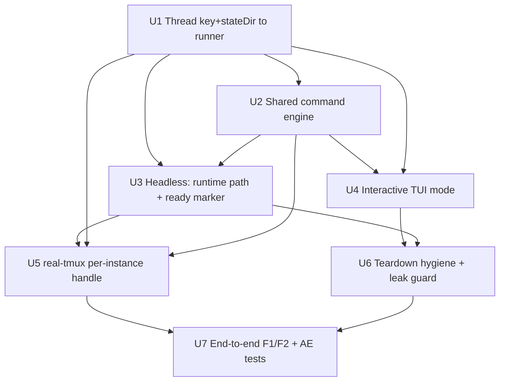

# feat: Predictable Externally-Driven Fake Agent

## Summary

Extend the existing `scripted-fake` puppet mode into a predictable fake agent that runs in **both** headless and interactive (TUI) modes, is addressable **per-instance** by its run-time cache key under the run's state dir, and emits a **filesystem ready-marker** when it is idle-waiting for input. The implementation threads the executor's run-time-derived step key into the runner at spawn, factors one shared command engine (`type_and_send` / `finish`) consumed by both modes, and gives the real-tmux harness a per-instance `agent(labelPath)` handle so high-level tests drive a real workflow deterministically and assert on the two-pane UI without racing a real agent.

---

## Problem Frame

Real coding-agent CLIs are non-deterministic to test against, so high-level two-pane UI coverage today is either avoided or flaky (env-gated Tier-4 real-CLI tests). The existing fakes only half-cover the need: `FakeRunner` is in-process and pre-scripted; `scripted-fake` puppet mode is externally drivable but headless-only, with no interactive TUI that blocks on external input and no readiness signal telling a driver the agent is actually waiting. See origin for the full pain narrative (`docs/brainstorms/2026-06-01-predictable-fake-agent-requirements.md`). Plan-specific framing: the project already carries a leaked-daemon scar (`docs/solutions/real-tmux-suite-flakiness-leaked-puppets.md`) that makes process-teardown hygiene a first-class requirement, not an afterthought.

---

## Requirements

**Core engine and modes**
- R1. One input/command engine shared across both modes; modes differ only in how output reaches the right pane (headless = NDJSON events via the transcript pipeline; interactive = the agent renders its own Ink TUI into the pane).
- R2. Command vocabulary is exactly `type_and_send` (append one line of output) and `finish` (end the step, optional exit/result code) for this version.
- R3. `type_and_send` and `finish` behave identically across modes and across input channels (control-file command vs. manual keystroke).

**Input channels and symmetry**
- R4. The engine accepts commands from two channels mapping to the same operations: the puppet NDJSON control file and real manual stdin.
- R5. Manual input parses into the same vocabulary: a bare line is `type_and_send` of that text; literal `q` or `exit` is `finish`.
- R6. Manual typing works in interactive (TUI) mode (manual typing in headless mode is out of scope).

**Addressing and isolation**
- R7. Each instance is addressable by a logical address derived from the step's cache key (`deriveStepKey`: sub-path + `as:` label + vars); its control transport lives under that run's state dir (`.orch/state/<runId>/test-control/<key>.ndjson`).
- R8. A driver holds a per-instance handle keyed by the same label/path the workflow author used; thin wrappers `typeAndSend(handle, text)` / `finish(handle, code?)` target that instance.
- R9. A parallel branch is individually addressable only when it carries a stable `as:` label, consistent with the existing cache-key + R20 collision-guard model.
- R10. The logical address (run + label-path) is kept separate from the transport (control file) so the transport can later change without changing addressing.
- R11. Two concurrent runs are isolated structurally via per-`runId` state dirs.

**Confirmation and readiness**
- R12. Each control-channel command produces an awaitable confirmation (reuse puppet's per-sequence `.ack`). Acks are best-effort for manual keystrokes.
- R13. The fake emits a readiness signal when rendered and idle-waiting, distinct from `step:start`.
- R14. Every instance tears down cleanly when its run ends, leaving no leaked tailing/daemon processes.

**Origin actors:** A1 (test author), A2 (autonomous QA agent — future, design must not preclude), A3 (fake agent instance), A4 (orch core / two-pane host)
**Origin flows:** F1 (drive a two-step workflow end-to-end), F2 (drive parallel instances without cross-talk)
**Origin acceptance examples:** AE1 (covers R3, R5), AE2 (covers R5), AE3 (covers R11), AE4 (covers R6), AE5 (covers R13), AE6 (covers R12)

---

## Scope Boundaries

- Real manual typing in headless mode is excluded — autonomous spawns have no stdin/PTY today.
- The screenshot/snapshot testing utilities and the autonomous QA agent itself are not built here. The address/transport split (R10) keeps the door open for the QA agent.
- No changes to real Claude/Codex runner behavior.
- No command vocabulary beyond `type_and_send` and `finish`.
- No socket/IPC transport now — file-based control only; the design must merely not preclude a later swap.
- Interactive-mode failure-code propagation (`finish(2)` → `step:failed` in a TUI step) is excluded — the two-pane host does not surface a PTY child's exit code yet. Interactive `finish` is clean-exit only; see Key Technical Decisions.

### Deferred to Follow-Up Work

- Autonomous QA agent that addresses instances over a non-file transport: future iteration; this plan only preserves the address/transport seam (R10, U1/U5).
- A richer manual-input vocabulary or a non-file readiness transport: future, behind the same address/transport split.
- Interactive-mode structured failure capture (wiring the host's `pane-died` exit code, the deferred "Phase D2" in `tmux-host.ts`): unblocks cross-mode `finish(code)` parity; separate work.

---

## Context & Research

### Relevant Code and Patterns

- `src/runners/scripted-fake/__entry.ts` — the spawned puppet driver. `runPuppet(script)` (`:171`) tails the NDJSON control file via cursor-slice (`PuppetReaderState`, `:132`), dispatches commands (`dispatchPuppetCommand`, `:210`), and writes per-sequence acks (`writePuppetAck`, `:267` → `${controlPath}.acks/${seq}.ack`). **`parentExited()` self-reap** (`:55-67`, `:186`) is the load-bearing leak fix — every blocking loop must keep it.
- `src/runners/scripted-fake/scripted-fake-runner.ts` — the `Runner` adapter. `supports.interactive = false` (`:61`) is the exact blocker the interactive mode removes. `buildCommand` (`:64`) returns `['bun', __entry]` and does **not** currently thread any per-instance address.
- `src/runners/scripted-fake/types.ts` — `PuppetScriptSchema` (`:97`, carries `controlPath`), `PuppetCommandSchema` discriminated union (`:175`); the schema is the cross-process contract, so any new command/signal extends both sides here.
- `src/core/workflow.ts` — `deriveStepKey(name, overrides, subPath)` (`:418`: `as:` wins flat; else `subPath.join('>')>name` then `:vars-<hash>`). The full key is known **only at step-run time** inside `runStepOnce` (`:1279-1280`), after the script JSON is frozen. R20 collision guard at `:1296-1309` (`StepNameCollisionError`). `StepLifecycleEvent` union at `:151-216`.
- `src/core/parallel.ts` — heterogeneous `parallel([run(A), run(B)])` branches run at the outer depth with no branch store; identity comes purely from each `run`'s `s.name` + `as:` (`workflow.ts:144-148`). Homogeneous `parallel(items, fn)` assigns a fresh store per branch (`:142-195`).
- `tests/helpers/behavioral-dsl/internal/subprocess.ts` — current control-path derivation: `resolvePuppetPaths` (`:510`) computes `<controlDir>/<stepName>.ndjson` at **launch time, keyed on bare step name** (`:521`). Test-side ack handshake: `createAgentControl.append` → `waitForAck` (`:536-594`).
- `tests/helpers/real-tmux/` — `mountTmuxHost` returns a `MountedHarness` (`workflow-driver.ts:43`) with `left`/`right` `PaneHandle`s, `runWorkflow(steps)` (`:189`), `sendKeys`, `teardown()` (`:213`, closes host+logger only — no child reaping). `HarnessStep` (`:30`) has no `as:`/script slot today.
- `src/hosts/two-pane/tmux-host.ts` — headless renders via `onRunnerEvent` → per-step ANSI tee + hidden `tail -F` pane (transcript pipeline). Interactive `runInteractive` (`:956`) spawns the runner argv as a **real PTY** in a hidden pane keyed on `spawn.stepName` (which is the derived `key`, `workflow.ts:726-730`), swaps it visible, and waits on `pane-died`.
- `src/runners/types.ts` — `Runner` port (`:119`: `buildCommand`/`parseEvents`/`extractStructuredOutput`/`toTranscriptLines`); `RunnerEventSchema` (`:24-47`) already accepts arbitrary `info` event types.

### Institutional Learnings

- `docs/solutions/real-tmux-suite-flakiness-leaked-puppets.md` — SIGKILL of orch leaves blocking puppets reparented to init, polling forever, piling up → ~8× suite slowdown. Fix is `parentExited()` probing the **captured spawn-time parent pid** (Bun caches `process.ppid`, so comparing ppid does NOT detect orphaning). Real-tmux has no launcher-side reaper, so self-reap is the only net. Directly load-bearing for R14.
- `docs/solutions/autonomous-transcript-rendering.md` — headless output reaches the pane through `logs/agents/<step>/formatted_output.ansi` + a hidden `tail -F` pane (a per-step long-lived process that also needs reaping). A driver asserting "the line appears" is really asserting against the durable ANSI tee.
- `docs/findings/2026-05-20-lifecycle-campaign-findings.md` and `docs/findings/2026-05-20-behavioral-batch-findings.md` — visible-pane assertions are racy under fast teardown; durable on-disk signals (`lifecycle.ndjson`, `state.json` `endedAt`, the ANSI tee) are the reliable oracle. Completion = **presence** of the `endedAt` entry, not a non-undefined return value. External tmux probe pane cache goes stale across `swap-pane` — resolve panes fresh per call. `tmux send-keys` needs `-l` for literal chars and must omit it for named keys (`NAMED_TMUX_KEYS`). `supports.interactive = false` (D-1) is the construction-time blocker this feature removes.
- `docs/solutions/interactive-mode-colors.md` — under two-pane, interactive runners spawn into a real PTY (`isTTY === true`); under the plain host they use inherited stdio (no PTY). The interactive fake's TUI must not assume a TTY universally — confirm the target host before fixing render assumptions.
- `docs/solutions/two-pane-auto-attach.md` — naming-homonym lesson: keep the readiness signal distinctly named from `step:start`, and the per-instance accessor distinctly named from the `left`/`right` pane handles (`agent(labelPath)` is good).

### External References

- None used — this is internal test infrastructure with strong existing local patterns.

---

## Key Technical Decisions

- **Readiness signal = filesystem ready-marker** (R13, user-confirmed). `__entry.ts` writes a `.ready` marker under the control dir when it first becomes idle-waiting; the driver awaits the marker's appearance. Durable and race-free (the Tier-5 findings prove pane scrapes are racy under fast teardown), mirrors the existing `.ack` pattern, requires no lifecycle-consumer churn, and the address/transport split keeps a future non-file transport open. Distinct from `step:start` by construction.
- **Resolve the control path at step-run time by threading the derived key** (R7, user-confirmed). The executor passes the run-time `deriveStepKey` result + the resolved run state dir to the runner at spawn; `__entry.ts` derives `controlPath` itself. `deriveStepKey` stays the single source of truth, which is correct for subworkflow and parallel-branch instances (whose `subPath`/`parallelDepth`/vars only exist at run time) and makes cross-run isolation structural. Re-deriving in the launcher was rejected — it duplicates key logic and cannot see run-time-only path components.
- **Logical address vs. transport filename** (R10). The logical address is the derived key (containing `>` and `:` separators). The transport filename is an **injective (collision-free) sanitized encoding** of that key — e.g. percent-encoding `>`/`:` rather than a lossy `replace(/[>:]/g, '_')`. The load-bearing property is **injectivity, not invertibility**: distinct keys MUST map to distinct filenames so two keys (`a>b` and `a:b`) cannot collide on the same control file (which would silently break R9/R11 isolation). **No unit decodes the filename back to a key** — U3 and U5 each independently apply the *identical forward encoding* to resolve the same file, so do not build a decode path (percent-encoding happens to be reversible, but reversibility is incidental; a collision-free hash would also satisfy the requirement). This honors R10, avoids `>`/`:` surprising downstream tooling, and keeps addressing unchanged.
- **One command engine, mode-injected output sink** (R1, R3). Factor the vocabulary + finish semantics + channel-agnostic parser into a single engine; the only mode-specific piece is where `type_and_send` output goes (NDJSON `emit` for headless vs. Ink render for interactive). This is the literal reading of R1 ("modes differ only in how output reaches the right pane").
- **Interactive `finish(code)` is clean-exit only for this version** (R2, R3 — scoped limitation). The two-pane interactive path returns `exitCode: 0` unconditionally because tmux's `pane-died` hook does not surface the child's exit code (`tmux-host.ts:1324-1327`, "Phase D2 will wire structured failure capture"). So a non-zero `finish(code)` produces `step:failed` **only in headless mode**; in interactive mode `finish` advances the workflow as a clean exit and the code is not propagated. R3's "identical across modes" holds for the happy path (which all acceptance examples use) but not for failure-code propagation. Wiring interactive failure capture is out of scope here (it depends on host work the plan does not schedule); see Scope Boundaries.
- **Reuse the existing ack mechanism verbatim** (R12) — do not invent a second confirmation scheme.
- **Backward compatibility for existing puppet callers.** Current behavioral-dsl tests bake `script.controlPath` keyed on bare step name. Since U1 threads the run-time key on **every** step (including behavioral-dsl callers), the fallback discriminator is **the presence of a baked `script.controlPath`, which wins** — runtime key-derivation engages only when no `controlPath` is baked. (Gating on "threaded key absent" would never fire, because U1 always provides it, so the baked path and the derived path would silently diverge and every `waitForAck` would time out.) U3's backward-compat scenario must drive a real behavioral-dsl puppet end-to-end (append + `waitForAck`), not merely assert that a baked path resolves.

---

## Open Questions

### Resolved During Planning

- [R13] Readiness shape — **filesystem ready-marker** (see Key Technical Decisions). A complementary `info` RunnerEvent for transcript visibility is deferred; the marker is the driver-facing contract.
- [R7] Control-path resolution timing — **deferred to step-run time**, derived from the threaded key under the run state dir.
- [R6] How a heterogeneous `parallel([...])` branch acquires its label end-to-end — via each branch's own `run(STEP, { as: 'a' })`; `as:` wins flat in `deriveStepKey`, so the derived key threaded in U1 is exactly the addressable label. No new labeling machinery needed; the constraint (stable `as:` required) is the existing R9/R20 model.

### Deferred to Implementation

- Exact env-var names for threading the key + state dir (e.g. `ORCH_STEP_KEY`, `ORCH_RUN_STATE_DIR`, and `ORCH_PARENT_PID` for the interactive self-reap — see U6) and the precise **injective (collision-free)** sanitization map for the transport filename (percent-encoding is the safe default — see Key Technical Decisions). Make a **shared constants module a named deliverable in U1's file list** (e.g. `src/runners/scripted-fake/addressing.ts` exporting the env-key names and the `encodeKey`/`<runStateDir>` formula) so U1/U3/U5/U6 cannot drift on names or encoding — a note that it is the "natural home" is not enough to guarantee three units agree.
- The exact `.ready` marker filename and whether it is rewritten on each return-to-idle or written once after initial render (AE5 only needs first-idle; the ack covers subsequent commands). Whichever shape, the entry MUST delete any pre-existing marker at spawn (before it can be idle) so a stale marker from a retried/resumed step in the same `runId` dir cannot make `waitForReady()` resolve before the new instance is actually idle. **Delete-at-spawn narrows but does not close the race:** the driver's `waitForReady()` polls the same dir concurrently, so a poll landing in the window between the new process starting and its delete completing still observes the stale marker and resolves early — the exact race the feature removes. **Recommended:** make readiness monotonic per-attempt — encode an attempt token (the spawn pid or an attempt counter) into the marker filename or its contents, and have `waitForReady()` accept only the marker matching the attempt it is driving. This removes the spawn-vs-poll window entirely instead of narrowing it. (Note: U4's interactive entry must perform the same spawn-time delete / attempt-token write — it is easy to omit when reusing "U3's marker contract.")
- Whether the interactive entry is a full Ink TUI or a minimal TTY stdin reader that renders lines — both satisfy R1/R6; pick the smallest that renders manual + control output and reaches idle observably.
- The precise teardown hook in the real-tmux harness that reaps the interactive PTY child and any tail process (U6 resolves the location; exact wiring is implementation).

---

## High-Level Technical Design

> *This illustrates the intended approach and is directional guidance for review, not implementation specification. The implementing agent should treat it as context, not code to reproduce.*

**One engine, two channels, two output sinks:**

```
            manual stdin (interactive only) ┐
                                            ├─► parse ─► { type_and_send(line) | finish(code?) } ─► ENGINE
   control file NDJSON (.../<key>.ndjson) ──┘                                                         │
                                                                          ┌──────────────────────────┤
                                          headless sink: emit NDJSON ◄────┘                          │
                                          interactive sink: render to Ink TUI ◄──────────────────────┘
   ENGINE on idle ─► write <control-dir>/<key>.ready        ENGINE on each control cmd ─► write .acks/<seq>.ack
```

**F1 driven end-to-end (interactive step 1 → headless step 2):**

```mermaid
sequenceDiagram
  participant T as Test driver (real-tmux)
  participant H as harness.agent(label)
  participant A as Fake instance (entry)
  participant P as orch two-pane host
  T->>P: runWorkflow([step1 interactive, step2 headless])
  A->>A: render, become idle
  A-->>H: write <key>.ready marker
  T->>H: waitForReady()  (awaits marker)
  T->>P: snapshot right pane (assert waiting state)
  T->>H: finish(step1)  -> append NDJSON, await .ack
  A-->>H: <seq>.ack
  P->>P: advance to step2 (headless)
  A-->>H: <key2>.ready marker
  T->>H: typeAndSend("hello") -> await .ack ; snapshot (assert line in pane)
  T->>H: finish() -> run reaches finished state
```

---

## Implementation Units



### U1. Thread the run-time step key and run state dir to the runner at spawn

**Goal:** Make the executor expose the run-time-derived `key` and the resolved run state dir to the runner at the moment it builds its command, on both the autonomous and interactive spawn paths, without changing real-runner behavior. This is the addressing foundation for R7–R11.

**Requirements:** R7, R11. **Enables:** R10 (this unit threads the *logical address*; the transport-side sanitized encoding is implemented in U3, and the driver-side use in U5).

**Dependencies:** None

**Files:**
- Modify: `src/core/workflow.ts` (autonomous `runRunner` call site near `:1028`; interactive `produceInteractiveStep` near `:726`)
- Modify: `src/runners/types.ts` (extend `RunnerContext` with an optional addressing field, OR document the agreed env keys carried via `ctx.env`)
- Modify: `src/services/process/merge-env.ts` consumers only if env-based (no new filtering — passthrough policy)
- Modify: **whichever component exposes the run state dir to the executor** — see the run-state-dir decision below (likely `src/core/workflow.ts` `WorkflowDeps` *or* the `StateStore` port + `FileStateStore`, plus `src/cli/deps.ts` and `tests/helpers/real-tmux/workflow-driver.ts` wiring)
- Test: `tests/unit/core/runner-addressing.test.ts` (new)

**Approach:**
- **DECISION REQUIRED — where does the executor get `<basePath>/<runId>`?** The executor cannot see the run state dir today: `WorkflowDeps` (`workflow.ts:233-305`) carries `runId` and `cwd` but no `basePath`/`stateBase`, and `StateStore`'s `#runDir` is private (`state-store.ts:475`). Only the host knows it (`tmux-host.ts:576`), and the runner-spawn path never consults the host. Pick one and add it to this unit's files: (a) thread a `basePath`/`stateDir` field into `WorkflowDeps`, or (b) add a public `runDir(runId)` accessor to the `StateStore` port and `FileStateStore`. Without this, "the executor passes the resolved run state dir to the runner at spawn" is unimplementable. See Open Questions.
- The key is already computed at `runStepOnce` (`workflow.ts:1280`) and passed as `spawn.stepName` to `runInteractive`. This is **not** a read-only exposure: both runner contexts set `env: {}` today (autonomous `runnerCtx` near `workflow.ts:1021`; interactive `buildCtx` near `:703`), and scripted-fake's `buildCommand` reads `stepName` from its construction-time **closure** (`scriptedFake({ stepName })`), not from run-time ctx. So this unit must (a) **write** the derived key + run state dir into both call sites' `ctx.env` (e.g. `ORCH_STEP_KEY`, `ORCH_RUN_STATE_DIR`, plus `ORCH_PARENT_PID` = orch's own pid, which the interactive self-reap in U6 needs because a tmux-spawned child's `process.ppid` is not orch), identically, and (b) change scripted-fake `buildCommand` to **prefer the run-time key from `ctx.env`** over the closure `stepName`. Prefer `ctx.env` threading so the passthrough env policy carries the values and real runners ignore them; an explicit optional `RunnerContext` field is the alternative — pick one and apply it to both paths so interactive and headless agree (today they diverge: autonomous reads bare `ORCH_LIFECYCLE_STEP_NAME`, interactive gets the derived key). Note `ORCH_PARENT_PID` is **not** a free choice: U6's interactive self-reap can only read it as an env var (a tmux-spawned child cannot see orch's pid otherwise), so at minimum the parent pid must travel via env — which is why threading all three values via `ctx.env` consistently is the recommended option.
- Do not change `deriveStepKey`. Do not alter env filtering — follow `mergeEnv` passthrough (CLAUDE.md runner env policy).

**Execution note:** Test-first — write the failing test asserting the addressing values reach a stub runner's `buildCommand` **via `ctx.env`** (not via the closure) on both paths before wiring.

**Patterns to follow:**
- `mergeEnv(process.env, extras, ctx.env)` env construction (`src/services/process/merge-env.ts`).
- Existing `spawn.stepName = key` threading for interactive (`workflow.ts:726-730`).

**Test scenarios:**
- Happy path: an autonomous step's runner `buildCommand` receives the derived key + run state dir matching `deriveStepKey`/the run's state dir.
- Happy path: an interactive step's runner receives the same addressing values, identical in shape to the autonomous path.
- Edge case: a step with `as: 'x'` surfaces key `x` (flat); a step inside a subworkflow surfaces the `subPath>name` key; a vars step surfaces the `:vars-<hash>` suffix.
- Integration: a real runner (e.g. ClaudeRunner) ignores the new addressing values and its `buildCommand` output is unchanged (no env leakage that alters argv).

**Verification:** Both spawn paths expose the run-time key + run state dir to `buildCommand`; real runners behave identically to before; `bun run check` green.

---

### U2. Shared command engine and channel-agnostic input parser

**Goal:** Factor a single engine in `scripted-fake` implementing the `type_and_send` / `finish` vocabulary and finish semantics, with a channel-agnostic parser that maps both control-file NDJSON lines and manual stdin lines to the same operations, and a mode-injected output sink. Satisfies R1–R5 at the engine level.

**Requirements:** R1, R2, R3, R4, R5

**Dependencies:** U1 — sequenced first because both units modify `__entry.ts` (merge-conflict risk if done in parallel); the engine logic itself does **not** consume U1's threaded key/env outputs, so the dependency is ordering-only, not data-flow.

**Files:**
- Create: `src/runners/scripted-fake/command-engine.ts`
- Modify: `src/runners/scripted-fake/types.ts` (extend `PuppetCommandSchema` with `type_and_send`; confirm `finish` mapping to the existing `complete`/`fail` terminal ops)
- Modify: `src/runners/scripted-fake/__entry.ts` (route puppet dispatch through the engine)
- Test: `tests/unit/runners/scripted-fake/command-engine.test.ts` (new)

**Approach:**
- Define the engine with two pure operations: `type_and_send(line)` (append one line to the injected output sink) and `finish(code?)` (terminate with optional exit/result code, reusing the existing terminal `complete`/`fail` path). The output sink is a constructor/param dependency: headless injects "emit NDJSON event"; interactive injects "render line into TUI".
- Define one parser used by both channels: control-file NDJSON → command; manual line → command where a bare line is `type_and_send(text)` and literal `q`/`exit` is `finish`. R5's manual parsing and R4's control parsing converge on the same command type.
- `type_and_send` is the new explicit vocabulary; keep existing puppet commands (`emit`, `write-file`, etc.) working — `type_and_send` is sugar over the headless emit sink and the interactive render sink. Extend `PuppetCommandSchema` (both sides — it is the cross-process contract).

**Execution note:** Test-first — the engine is pure and the highest-value unit to characterize before mode wiring.

**Patterns to follow:**
- Existing `dispatchPuppetCommand` / `parsePuppetCommand` (`__entry.ts:210`, `:251`) — refactor toward the engine, do not duplicate.
- Discriminated-union command schema (`types.ts:175`).

**Test scenarios:**
- Covers AE1. Happy path: `type_and_send("hello")` from the control channel appends exactly one line `hello` to the sink.
- Covers AE1, AE2. Happy path: manual bare line `hello` parses to `type_and_send("hello")`; manual `q` and manual `exit` each parse to `finish`.
- Happy path: `finish()` with no code terminates with default code; `finish(2)` terminates with code 2.
- Edge case: empty manual line, whitespace-only line, and a line that is literally `q ` (trailing space) — define and assert the exact parse outcome. Note the headless render path drops empty `info.text` (`scripted-fake-runner.ts:94-99` renders only non-empty strings) while a TUI would show a blank line, so the empty-line decision must keep headless and interactive output identical (reject in both, or render blank in both) to preserve R3.
- Edge case: control-channel and manual-channel produce identical engine ops for the same logical command (R3 symmetry).
- Error path: malformed control-file JSON line is rejected without crashing the engine (mirrors `safeParse` today).

**Verification:** Engine ops are mode-agnostic and channel-agnostic; existing puppet command behavior unchanged; `bun run check` green.

---

### U3. Headless mode: runtime per-instance control path + readiness marker

**Goal:** In the headless puppet path, derive the control path at step-run time from the threaded key under the run state dir, write the `.ready` marker on first idle, and keep the existing `.ack` confirmation and `parentExited()` self-reap. Satisfies R7, R10, R11, R12, R13 for headless.

**Requirements:** R7, R10, R11, R12, R13, R14

**Dependencies:** U1, U2

**Files:**
- Modify: `src/runners/scripted-fake/__entry.ts` (control-path resolution; `.ready` marker emission; engine integration)
- Modify: `src/runners/scripted-fake/scripted-fake-runner.ts` (`buildCommand` passes threaded addressing through; conditional path resolution)
- Modify: `src/runners/scripted-fake/types.ts` (make script `controlPath` optional / add fallback semantics)
- Test: `tests/integration/runners/scripted-fake-puppet-addressing.test.ts` (new or extend existing scripted-fake integration test)

**Approach:**
- **Fallback discriminator = baked `script.controlPath` wins** (see Key Technical Decisions). Because U1 threads the key on *every* step, "key absent" is unreachable for behavioral-dsl callers; gating on it would silently diverge the baked path from the derived path and time out every `waitForAck`. So: when `script.controlPath` is baked, use it; otherwise derive `controlPath = <runStateDir>/test-control/<sanitize(key)>.ndjson` and `ackDir = <controlPath>.acks` in `__entry.ts`.
- **Pin the `<runStateDir>` formula once, and use it identically in U3 (`__entry.ts` resolution) and U5 (`agent()` resolution).** `<runStateDir>` is `<basePath>/<runId>` where `basePath` is the host's state base — which in the real-tmux harness is `<fixture.stateBase>/.orch/state` (`workflow-driver.ts:103`), *not* the bare `cwd`/`stateBase`. **Do not copy behavioral-dsl's layout**, which is `<stateBase>/test-control/` with no `<runId>` segment (`subprocess.ts:92-93`) — an implementer who mirrors that example writes to a different directory than the host and every `waitForReady`/`waitForAck` times out.
- Apply the **injective** logical-address-vs-transport sanitization (Key Technical Decisions): reversibly encode `>` and `:` (e.g. percent-encode) for the filename only; the logical address (key) is unchanged. U5 must use the identical encoding.
- Emit the `.ready` marker (e.g. `<control-dir>/<sanitize(key)>.ready`) when the poll loop first reaches idle-waiting (after initial render, before/while awaiting commands). Distinct from `step:start`. **Delete any pre-existing marker at spawn** (before the loop can be idle) so a stale marker from a retried/resumed step in the same `runId` dir cannot make `waitForReady()` resolve early.
- Preserve the cursor-from-0 tail (commands appended before the agent is ready are not lost) and the per-sequence ack write. Keep `parentExited()` in the loop.

**Execution note:** Test-first against the on-disk contract (marker appears, ack appears, control file is read from cursor 0).

**Patterns to follow:**
- `runPuppet` tail + ack + self-reap (`__entry.ts:171-272`).
- State-dir layout `<basePath>/<runId>/...` (`tmux-host.ts:576`, `file-session-logger.ts:69`); `ORCH_STATE_BASE` honoring (`src/cli/deps.ts:78-83`).

**Test scenarios:**
- Covers R7. Happy path: a headless step with key `step2` writes/reads its control file at `<runStateDir>/test-control/step2.ndjson`.
- Covers R7, R10. Happy path: a key containing `>`/`:` (subworkflow/vars) yields a sanitized filename while the handle still resolves by logical key.
- Covers R10. Edge case: distinct keys `a>b` and `a:b` produce **distinct** transport filenames (injectivity — guards against silent control-file sharing).
- Covers AE6, R12. Happy path: appending a `type_and_send` line produces a matching `<seq>.ack`; the seq counter matches the test-side counter.
- Covers AE5, R13. Happy path: the `.ready` marker appears only after the agent is idle-waiting (not at `step:start`).
- Covers AE5, R13. Edge case: a stale `.ready` marker left in the same `runId` control dir (simulating a retry/resume) does **not** make `waitForReady()` resolve before the new instance reaches idle (asserts the spawn-time delete).
- Edge case: a command appended to the control file before the agent starts is still processed (cursor-0 tail).
- Covers R11. Integration: two runs with the same key write to distinct `<runId>` state dirs; neither sees the other's control file.
- Backward-compat: drive a real behavioral-dsl puppet **end-to-end** (append a command + `waitForAck`) with a baked `controlPath` — confirms baked-wins, not merely that a path string resolves.

**Verification:** Headless instances are addressable by run-time key under the run state dir; `.ready` and `.ack` files behave as specified; existing puppet tests pass; `bun run check` green.

---

### U4. Interactive (TUI) mode for the fake

**Goal:** Add an interactive mode where the fake renders its own TUI, reads manual stdin and the control file through the shared engine (U2), emits the `.ready` marker, and supports manual typing. Flips `supports.interactive` so the two-pane host spawns it as a real PTY. Satisfies R1, R3, R5, R6, R13 for interactive.

**Requirements:** R1, R3, R5, R6, R13

**Dependencies:** U1, U2

**Files:**
- Create: `src/runners/scripted-fake/interactive-entry.ts` (**separate file required** — `__entry.ts` is already ~323 lines, at the 300-line limit, so an interactive branch inside it would breach CLAUDE.md rule #5 with no headroom).
- Modify: `src/runners/scripted-fake/scripted-fake-runner.ts` (interactive flag at **construction time** — see Approach; `buildCommand` selects the interactive entry; `defaultView` for interactive)
- Modify: `src/runners/scripted-fake/types.ts` (interactive script/mode discriminator if needed)
- Test: `tests/integration/runners/scripted-fake-interactive.test.ts` (new)

**Approach:**
- **`supports.interactive` must be set at construction time, not as a runtime conditional.** `supports` is frozen at `defineRunner` time (`scripted-fake-runner.ts:61`) and the executor gates on `config.agent.supports.interactive` (`workflow.ts:589`) with no mode argument available — so one runner object cannot report `true` for an interactive step and `false` for an autonomous one. Add a per-instance factory option (e.g. `scriptedFake({ stepName, interactive: true })`) that bakes the flag; harness fixtures already build one runner per step, so an interactive step constructs an interactive runner and an autonomous step keeps `interactive: false`. This means two distinct runner constructions, not one mode-switching runner.
- The interactive entry runs as a TTY app (the two-pane host spawns it as a real PTY in a hidden pane — `tmux-host.ts:1036`). It reads manual stdin lines, parses them via the shared engine parser (R5), and also reads the control file (R4) — both feed the same engine. The `type_and_send` sink renders a line into the TUI (minimal Ink or a line-printing TTY reader — see deferred question); `finish` exits the process so the host's `pane-died` advances the workflow. Note the **interactive `finish(code)` clean-exit limitation** (Key Technical Decisions): the host returns exit 0 regardless, so a non-zero code is not propagated in interactive mode — wire `finish` to exit cleanly and do not rely on TUI failure codes.
- Two concurrent input loops run here (control-file poll like `runPuppet` + stdin reader); on `finish`, one loop must signal the other to stop. Both loops carry the self-reap check (see U6). **Cross-channel contract (DECISION — avoids a silent `waitForAck` hang):** serialize both loops through a single engine queue so a control-channel command already accepted is processed and its `<seq>.ack` written *before* a concurrently-arriving stdin `finish` terminates the process. Otherwise a driver that appended a control command and is awaiting its ack hangs forever when stdin `finish` wins the race. Add a U4 test for "control command awaiting ack + concurrent stdin `finish`" asserting the ack resolves (or a defined drop signal surfaces) rather than a silent timeout.
- Emit the same `.ready` marker on first idle (U3's marker contract reused) so a driver can `waitForReady` regardless of mode (R13 cross-mode).
- Flip `supports.interactive` to true when the runner is constructed/asked for interactive mode; keep headless `supports.interactive=false` semantics intact for the autonomous path.
- Do not assume a universal TTY: under two-pane it is a real PTY; the plain host has no PTY (`interactive-mode-colors.md`). Target the two-pane host for the high-level tests; degrade gracefully (or document the limitation) on the plain host.

**Execution note:** Test-first for the engine wiring; the PTY/TUI render is verified at the integration/e2e layer (U7).

**Patterns to follow:**
- Interactive PTY spawn + `pane-died` advance (`tmux-host.ts:956-1327`).
- `interactive-mode-colors.md` PTY-vs-inherited-stdio split; `FakeRunner` `supports.interactive=true` shape (`src/runners/fake/fake-runner.ts:40`).

**Test scenarios:**
- Covers AE1, R3, R5, R6. Happy path: manual `hello`↵ typed into the interactive instance renders exactly one `hello` line; the same via control-file `type_and_send` renders identically.
- Covers AE2, R5. Happy path: manual `q` (and `exit`) ends the step and the workflow advances.
- Covers AE5, R13. Happy path: the `.ready` marker appears once the interactive agent is idle-waiting after render.
- Edge case: manual input and control-file input interleaved — both reach the same engine, order preserved per channel.
- Integration: `supports.interactive` is true for the interactive runner so host construction does not fail (removes the D-1 blocker); headless construction still reports `interactive=false`.

**Verification:** Interactive instances render manual + control output identically to headless semantics (R3), support manual typing (R6), and emit readiness (R13); `bun run check` green.

---

### U5. real-tmux harness per-instance handle (`agent(labelPath)`)

**Goal:** Give the real-tmux harness a per-instance accessor `agent(labelPath)` returning an `AgentHandle` with `typeAndSend(text)` / `finish(code?)` / `waitForReady()`, resolving the control path from the run state dir + derived key and resolving the target pane fresh per call. Provides the driver-facing API for R8, R12, R13.

**Requirements:** R8, R9, R12, R13

**Dependencies:** U1, U2, U3 (U2 because the handle appends the `type_and_send` command variant U2 adds to `PuppetCommandSchema`)

**Files:**
- Create: `tests/helpers/real-tmux/agent-handle.ts`
- Modify: `tests/helpers/real-tmux/workflow-driver.ts` (`MountedHarness.agent(labelPath)`; extend `HarnessStep` to allow a scripted-fake/puppet agent with `as:` + `mode`)
- Modify: `tests/helpers/real-tmux/index.ts` (barrel export)
- Modify: `tests/helpers/real-tmux/README.md` (document the new accessor and handle API)
- Test: `tests/integration/real-tmux/agent-handle.test.ts` (new)

**Approach:**
- `agent(labelPath)` derives the same logical key the workflow author used (via `deriveStepKey` semantics — flat for `as:`, `subPath>name` otherwise) and the same sanitized transport filename U3 uses, scoped to the harness's `runId` state dir. Name it distinctly from `left`/`right` pane handles (`agent`, not a second `handle`). The handle is **bound to its harness instance's `runId`** — for the F2 concurrent-run case (U7) the test mounts two harnesses with distinct `runId`s and each harness's `agent()` resolves only that run's control files (this is what makes R11 isolation structural rather than coincidental).
- The handle reuses the existing append+`waitForAck` machinery (`subprocess.ts:536-594`) against the resolved `<key>.ndjson` + `.acks` dir; `waitForReady()` polls for the `.ready` marker.
- Thin wrappers `typeAndSend(handle, text)` / `finish(handle, code?)` target that instance (R8). When the handle needs to assert a pane, resolve the pane fresh (panes move on `swap-pane`).
- Extend `HarnessStep`/`runWorkflow` so a step can be backed by the puppet/scripted-fake agent in either mode with a stable `as:` label flowing into `deriveStepKey` (this is how F2 branches become addressable).

**Execution note:** Test-first against a single-step workflow before the multi-instance F2 cases in U7.

**Patterns to follow:**
- `createAgentControl` append + `waitForAck` (`subprocess.ts:536`); `REAL_TMUX_*` shared budgets (`fixture.ts`).
- Fresh per-call pane resolution (`workflow-driver.ts:137-160`); `NAMED_TMUX_KEYS` literal/named split (`keys.ts`).

**Test scenarios:**
- Covers R8. Happy path: `agent('s1')` resolves to the control file for key `s1`; `typeAndSend(handle, 'x')` appends and its ack resolves.
- Covers R12, AE6. Happy path: `typeAndSend`/`finish` resolve only after the instance processed the command (ack-gated).
- Covers R13, AE5. Happy path: `waitForReady()` resolves only after the `.ready` marker exists.
- Covers R9. Edge case: two parallel branches labeled `a`/`b` produce two distinct handles; an unlabeled identically-named parallel pair surfaces a collision (consistent with R20).
- Integration: a handle resolves its assert pane fresh and does not go stale across a `swap-pane`.

**Verification:** A test can obtain a per-instance handle by the author's label and drive exactly that instance; `bun run check` green.

---

### U6. Teardown hygiene and leaked-process guard

**Goal:** Guarantee every fake instance — the interactive PTY child and any per-step `tail -F` process — is reaped on run end / harness teardown, preserve `parentExited()` in the interactive idle loop, and add a process-count assertion so a leak fails loudly instead of degrading the suite. Satisfies R14.

**Requirements:** R14

**Dependencies:** U3, U4

**Files:**
- Modify: `src/runners/scripted-fake/interactive-entry.ts` (self-reap check in both interactive loops)
- Modify: `tests/helpers/real-tmux/workflow-driver.ts` (`teardown()` reaps interactive PTY child + tail processes; or confirm `host.teardown()` already kills hidden panes)
- Create: `tests/helpers/real-tmux/assert-no-leaks.ts` (process-count helper: `pgrep -fl scripted-fake` ⇒ expected count)
- Test: `tests/integration/real-tmux/teardown-leak-guard.test.ts` (new)

**Approach:**
- **The headless `parentExited()` pattern does NOT transfer to the interactive child.** The interactive fake is spawned **by tmux** into a hidden pane, so its `process.ppid` (captured as `SPAWN_PARENT_PID` in `__entry.ts:55`) is the tmux pane/server — not orch. Probing that pid stays alive after orch dies, so the self-reap loop would never exit → the exact leaked-daemon class (documented 8× slowdown) re-introduced. Resolve by **threading orch's pid in via env** (e.g. `ORCH_PARENT_PID`, set by the executor in U1's env write) and probing **that** in the interactive loops, instead of `process.ppid`. Both concurrent interactive loops (control-file poll + stdin) carry the check.
- **Primary reap = tmux pane kill; self-reap = the net.** On teardown the host's `unregisterSource` kills the pane. Confirm empirically that the `bun` interactive child actually terminates on the pane's signal (Bun's default SIGHUP disposition is not assumed — add a SIGHUP handler that exits if needed). If `MountedHarness.teardown()` (which today only closes host+logger) leaves the child or the per-step `tail -F`, add explicit reaping there.
- Provide a reusable leak assertion the new tests call after teardown. Note the guard is a **post-hoc sentinel**: it converts a silent leak into a loud failure but does not prevent one — the `ORCH_PARENT_PID` self-reap is the actual prevention.

**Execution note:** Characterization-first — assert the baseline process count is restored after teardown; this is the regression sentinel for the documented 8× slowdown.

**Patterns to follow:**
- `parentExited()` (`__entry.ts:55-67`, `:186`); `killSubprocess`/`reapTmuxServer` (`subprocess.ts:170-189`); diagnostic playbook in `docs/solutions/real-tmux-suite-flakiness-leaked-puppets.md`.

**Test scenarios:**
- Covers R14. Happy path: after a full interactive+headless run and `teardown()`, `pgrep -fl scripted-fake` reports zero instances and no orphaned bun children.
- Edge case: a run torn down while an instance is mid-idle (before `finish`) still leaves zero leaked processes.
- Integration: simulate **orch** death (kill the `ORCH_PARENT_PID` process, not the tmux pane parent) — the interactive child's loops exit within one budget interval. This is the scenario the naive `process.ppid` probe would miss.
- Integration: tmux pane kill terminates the `bun` interactive child (verifies the primary reap path / SIGHUP disposition).

**Verification:** Process count returns to baseline after every test; the leak-guard assertion passes; `bun run check` green.

---

### U7. End-to-end real-tmux tests (F1, F2) and acceptance examples

**Goal:** Prove the success criteria with high-level real-tmux tests: drive a two-step workflow (interactive then headless) to a finished state with no timing flakiness, and drive parallel branches and concurrent runs independently with no cross-talk. Covers F1, F2 and AE1–AE6 at the integration boundary.

**Requirements:** R1, R2, R3, R5, R6, R7, R8, R9, R10, R11, R12, R13, R14

**Dependencies:** U5, U6

**Files:**
- Create: `tests/integration/real-tmux/predictable-fake-f1.test.ts` (F1 two-step)
- Create: `tests/integration/real-tmux/predictable-fake-f2.test.ts` (F2 parallel + concurrent runs)
- Modify: `tests/helpers/real-tmux/README.md` (usage example for the new flows)
- Test: (the two files above are the tests)

**Approach:**
- F1: launch a two-step workflow (step 1 interactive, step 2 headless). Wait for step 1's `.ready`, snapshot (assert step 1 selected, fake visible), `finish` step 1 and await ack; wait for step 2's `.ready`, `typeAndSend` lines awaiting each ack, snapshot (assert lines in the right pane via the ANSI tee — the durable oracle), `finish`, assert the run reaches a finished state (`endedAt` present, not a non-undefined return value).
- F2: a workflow with `parallel([run(FAKE,{as:'a'}), run(FAKE,{as:'b'})])`; obtain handles `a` and `b`; send `to-a`/`to-b`; assert `a` shows only `to-a` and `b` only `to-b`. Separately, run two concurrent workflow runs with identically-labeled steps; `finish` one run's instance and assert the other run is unaffected.
- Gate with `canRunRealTmux`; use `REAL_TMUX_*` budgets; call the U6 leak guard after teardown.

**Execution note:** These are the acceptance tests — write them to assert against durable on-disk signals (`.ready`, `.ack`, ANSI tee, `endedAt`), never a bare pane scrape, per the Tier-5 findings.

**Patterns to follow:**
- `mountTmuxHost` + `runWorkflow` (`workflow-driver.ts:98-211`); durable-signal assertions from `docs/findings/2026-05-20-lifecycle-campaign-findings.md`; fresh pane resolution; `canRunRealTmux` skip predicate.

**Test scenarios:**
- Covers F1, AE5, AE6. Happy path: the two-step workflow runs to a finished state; every assertion is gated on a readiness/ack signal; repeated runs show zero timing flakiness.
- Covers AE4, R9. Happy path: parallel branches `a`/`b` receive only their own `type_and_send` text.
- Covers R6. Happy path: a bare line typed into the interactive pane via `tmux send-keys -l` (manual stdin, not the control channel) renders exactly once in the right pane — gated on `waitForReady` and asserted against the ANSI tee. This is the only scenario that exercises R6 through a real PTY; U4's unit-tier test cannot. (The old "AE4, R6, R9" label was wrong: the parallel-isolation test drives via the control channel and proves R9, not manual typing.)
- Covers AE3, R11. Happy path: two concurrent runs with identically-labeled steps are isolated — finishing one does not end the other. **Mount two harnesses with distinct `runId`s** (the socket is keyed `orch-<runId>` and `agent(labelPath)` is scoped to one harness's `runId`); assert `agent('s')` on harness A never resolves harness B's control file.
- Covers R14. Integration: post-teardown leak guard reports baseline process count for every test.
- Edge case: snapshot taken immediately after `waitForReady` reliably shows the agent in its waiting state (the race the feature exists to remove).

**Verification:** The two flows pass deterministically across repeated runs with zero leaked processes; the success criteria in the origin are met; `bun run check` green.

---

## System-Wide Impact

- **Interaction graph:** Touches the executor spawn path (`workflow.ts` runRunner + runInteractive), the scripted-fake runner + entry, the two-pane interactive PTY path, and the real-tmux harness. Lifecycle/choreographer is **not** touched (readiness is a filesystem marker, not a lifecycle event) — a deliberate decision to avoid the exhaustive-consumer churn.
- **Error propagation:** In **headless** mode, `finish(code)` maps to the existing terminal `complete`/`fail` ops and failure codes travel the runner-exit → `step:complete`/`step:failed` path. In **interactive** mode, the host returns exit 0 unconditionally (tmux `pane-died` carries no exit code), so a non-zero `finish` advances as a clean exit — interactive failure-code propagation is out of scope (Key Technical Decisions / Scope Boundaries). Malformed control lines are rejected without crashing (existing `safeParse` behavior).
- **State lifecycle risks:** Control files + `.ready`/`.ack` markers live under `<runId>` state dirs and are cleaned with the run. The chief risk is leaked processes (R14) — mitigated by U6 self-reap + leak guard.
- **API surface parity:** No public API (`src/index.ts`) change — this is internal test tooling. The only "API" added is the real-tmux harness `agent(labelPath)` accessor (test-helper surface). Real Claude/Codex runners are untouched and ignore the new addressing env (U1 test asserts this).
- **Integration coverage:** Cross-mode identical behavior (R3), cross-run isolation (R11), and parallel addressing (R9) are only proven at the integration layer (U7) — unit tests alone cannot prove the PTY/tee/teardown reality.
- **Unchanged invariants:** `deriveStepKey`, the R20 collision guard, the `.ack` mechanism, the headless transcript pipeline, and existing behavioral-dsl puppet callers all keep their current behavior (backward-compat fallback in U3).

---

## Risks & Dependencies

| Risk | Mitigation |
|------|------------|
| New interactive PTY child re-introduces the leaked-daemon flakiness (the documented 8× scar) — and the headless `process.ppid` self-reap does NOT work for it (tmux is its ppid, not orch) | U6: thread orch's pid via `ORCH_PARENT_PID` and probe **that** in both interactive loops (not `process.ppid`); tmux pane-kill as primary reap (verify SIGHUP terminates the child); `pgrep` leak guard after every test as a loud sentinel. |
| Key separators (`>`, `:`) collide distinct keys on disk if sanitization is lossy → silent control-file sharing (breaks R9/R11 isolation) | Injective/reversible encoding (percent-encode), identical in U3 and U5; U3 test asserts `a>b` ≠ `a:b` on disk. |
| Moving control-path resolution to run time breaks existing behavioral-dsl puppet tests (U1 threads the key on every step, so a "key absent" fallback never fires) | Fallback discriminator is **baked `controlPath` wins** (U3); backward-compat scenario drives a real behavioral-dsl puppet end-to-end (append + `waitForAck`). |
| Stale `.ready` marker from a retry/resume in the same `runId` dir makes `waitForReady()` resolve before the agent is idle (re-introduces the race) | Entry deletes any pre-existing marker at spawn; U3 test asserts a stale marker does not resolve `waitForReady()` early. |
| Interactive `finish(code)` silently drops the failure code (host returns exit 0) | Scoped out for this version (Key Technical Decisions / Scope Boundaries); `finish` wired as clean-exit; acceptance tests use only clean `finish`. |
| Interactive fake assumes a TTY that the plain host doesn't provide | Target the two-pane host (real PTY) for high-level tests; degrade/document on the plain host (per `interactive-mode-colors.md`). |
| Readiness/handle naming collides with existing `step:start` / `left`/`right` handles | Distinct names: filesystem `.ready` marker (not a lifecycle event) and `agent(labelPath)` accessor (per `two-pane-auto-attach.md` lesson). |
| Pane assertions race fast teardown | Assert against durable on-disk signals (`.ready`, `.ack`, ANSI tee, `endedAt`), never bare pane scrapes (Tier-5 findings). |

---

## Documentation / Operational Notes

- Update `tests/helpers/real-tmux/README.md` with the `agent(labelPath)` accessor and the F1/F2 driving patterns (U5, U7).
- Consider a short note in `docs/testing-strategy.md` on when to reach for the predictable fake vs. FakeRunner vs. real CLIs (internal doc — not public).
- No `docs/public/` change — the feature does not touch the public barrel (`src/index.ts`).
- Runner-policy reminder (CLAUDE.md): the modified scripted-fake runner keeps its TWO integration tests (mocked + real); env stays passthrough via `mergeEnv` (no filtering for the new addressing keys).

---

## Sources & References

- **Origin document:** [docs/brainstorms/2026-06-01-predictable-fake-agent-requirements.md](docs/brainstorms/2026-06-01-predictable-fake-agent-requirements.md)
- Related code: `src/runners/scripted-fake/__entry.ts`, `src/core/workflow.ts` (`deriveStepKey` `:418`, R20 `:1296`), `src/hosts/two-pane/tmux-host.ts` (`runInteractive` `:956`), `tests/helpers/real-tmux/workflow-driver.ts`, `tests/helpers/behavioral-dsl/internal/subprocess.ts`
- Related learnings: `docs/solutions/real-tmux-suite-flakiness-leaked-puppets.md`, `docs/solutions/autonomous-transcript-rendering.md`, `docs/solutions/interactive-mode-colors.md`, `docs/solutions/two-pane-auto-attach.md`, `docs/findings/2026-05-20-lifecycle-campaign-findings.md`, `docs/findings/2026-05-20-behavioral-batch-findings.md`
