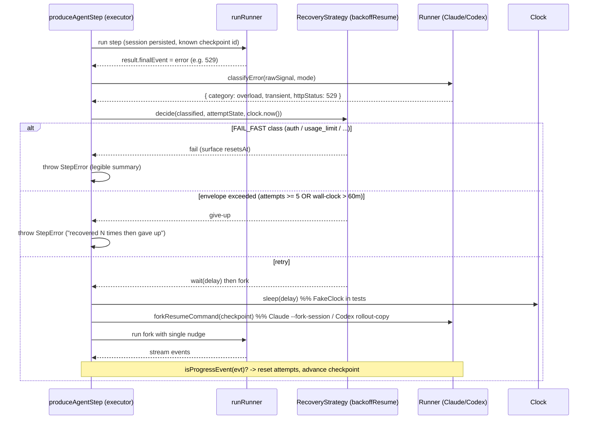

# feat: Agent error recovery — headless backoff-resume (Phase 1)

## Summary

Add a pluggable recovery layer to autonomous agent steps so a transient API failure (529/503 overload, 5xx) no longer kills the whole run. When a step's runner produces a terminal error, the executor classifies it by numeric HTTP status, and — under the default `backoffResume` strategy — waits, forks the session from the last clean checkpoint, sends exactly one "continue" nudge, and watches the forked stream for a real progress event before counting another failure. Bounded by an attempt ceiling, a wall-clock cap, and a per-attempt stall watchdog so a genuinely-down (or hung) server can never hold a run open indefinitely. Phase 1 is headless only (R1–R17, AE1–AE7); interactive recovery (R18–R23, AE8–AE10) is a separate Phase 2 plan.

---

## Problem Frame

Today a transient API failure inside an agent CLI is fatal to the entire run: a terminal `error` event (or non-zero exit) from any runner becomes a `StepError` thrown in `produceAgentStep` (`src/core/workflow.ts`), which propagates to the top-level catch in `executeWorkflowFn`, sets run `status: 'failed'`, and halts every remaining step. The captured reproduction `r-2026-05-29-102541-rm` (folded into the origin doc's Evidence section) shows a multi-hour autonomous workflow lost to ten HTTP 529 "Overloaded" retries that exhausted the CLI's own backoff — the agent had done nothing wrong and the server recovered minutes later. See origin: `docs/brainstorms/2026-06-02-feat-agent-error-recovery-requirements.md`.

---

## Requirements

This plan covers the **v1 / Phase 1 (headless)** requirement groups from the origin doc: R1–R17. The v2 / interactive groups (R18–R23) are explicitly out of scope here.

- R1. Recovery is a pluggable **strategy object** selected via a strategy-pattern seam; the executor invokes it at the agent-step error site and applies its verdict. Core never hard-codes retry logic.
- R2. Two strategies ship: `noRetry` (today's fail-fast) and `backoffResume` (the recovery loop in F1). Interface admits future strategies without core changes.
- R3. The strategy is fed by a **runner-and-mode detection adapter** that normalizes each runner's raw signal into one classified error: `{ category, transient|terminal, httpStatus?, serverRetryAfterMs?, resetsAt? }`. Strategy is detection-mechanism-agnostic.
- R4. A runner exposes recovery capabilities as **optional methods** (presence-as-capability, no `supports.*` flag): a fork-resume primitive, a detection mapping, and a progress-event predicate. A runner lacking the fork primitive degrades to resume-in-place with the no-stacking discipline (R7).
- R5. **Claude headless detection:** treat `api_retry` system events as informational (log, do not act); treat an `isApiErrorMessage` transcript record or a missing terminal event as the terminal recovery trigger. Classify from the numeric status (`error_status`/`api_error_status`), not the string label or `subtype`.
- R6. **Codex headless detection:** treat process **exit code 1 + `turn.failed`** as the authoritative terminal signal; the lossy `error` line is best-effort category string-matching only.
- R7. **No nudge stacking.** At most one nudge per forked attempt; never issue a recovery action while a prior one is in flight; a fresh nudge only after a confirmed progress event since the last nudge.
- R8. **Fork from the clean checkpoint.** Each attempt branches from the clean pre-recovery checkpoint, not the polluted tip. Under the headless single-invocation-per-attempt model the checkpoint does not advance mid-recovery (a clean `turn-complete` ends recovery by succeeding the step — see U7); on success the resumable session id is the last successful fork's id.
- R9. **Progress resets the counter.** A per-runner progress event resets `attemptsSinceProgress` to 0. (Claude: assistant/tool-use activity after resume, excluding the synthetic error turn; Codex: `item.completed` after resume — `item.started` is **excluded**, because a resumed turn emits `item.started` for processing the nudge itself before any model work, which would reset the counter on every attempt and defeat the ceiling. This narrows the origin doc's `item.started/updated/completed` to `item.completed` as a plan-time design decision; see U6.)
- R10. **Give-up envelope.** Stop and fail when `attemptsSinceProgress` reaches a ceiling (default 5) **or** total recovery wall-clock exceeds a cap (default 60 min), whichever first. On give-up, fail with a summary of attempts.
- R11. **Claude fork** uses native `--fork-session` with `--resume <id>` headless; the new session id is captured from the first `system/init` of the forked stream; the parent session is left untouched.
- R11a. **Codex fork** is emulated: copy the rollout JSONL to a new id'd path and rewrite the internal session metadata id, then `codex exec resume <new-id>`. Guarded by a rollout-format sanity check, pinned to the shipped Codex version, and degrading to resume-in-place (R7) on any copy/rewrite failure.
- R12. Classification & per-class policy keyed by numeric HTTP status first. Map: `529`/`503` → `overload` (retry); `500`/other `5xx` → `server_error` (retry); `429` → `rate_limit`/`usage_limit` (fail fast, surface reset); `401`/`403` → `auth` (fail fast); `billing`/`invalid_request`/`model_not_found` → fail fast; `unknown` → retry within envelope.
- R13. **Wait policy:** default per-class wait ≈ 5 min, honoring server retry-after/reset hint when present; configurable (incl. exponential option). Orch's wait is a second layer after the CLI's own backoff terminalizes.
- R14. **Opt-out default.** `backoffResume` is the default for every workflow. A step opts out with `recovery: noRetry()`; a workflow can set a different default; a step overrides the workflow default. All thresholds configurable.
- R15. The failure path is **legible**: a run that recovered then gave up states how many times it recovered, the error class, and total time spent.
- R16. Each agent step records a **recovery log**: one entry per attempt (error class, wait duration, fork/session id, outcome) persisted in run state + logs; the fork chain of session ids is recoverable from this log.
- R17. The strategy state machine is unit-tested deterministically with a **fake clock** and the **scripted-fake runner**. Edge integration (subprocess, fork file-copy) mocked only at `*Service`/runner-port seams.

**Origin actors:** A1 (Runner adapter), A2 (Recovery strategy — pluggable), A3 (Workflow executor). *(A4 Interactive monitor is Phase 2.)*
**Origin flows:** F1 (Headless backoff-resume). *(F2 Interactive detect-and-remediate is Phase 2.)*
**Origin acceptance examples:** AE1 (R5,R7,R8,R9), AE2 (R10), AE3 (R10,R13), AE4 (R9,R10), AE5 (R12), AE6 (R11a), AE7 (R14). *(AE8–AE10 are Phase 2.)*

---

## Scope Boundaries

- Interactive recovery is not touched. The interactive error site (`produceInteractiveStep`) has only an exit code, no parsed event stream; recovery there requires the Phase 2 detection layer.
- No waiting-until-reset on `rate_limit`/`usage_limit` — v1 fails fast and surfaces the reset time.
- No Codex app-server / codex-sdk transport for a supported `thread/fork` RPC; the rollout file-copy emulation is the v1 approach.
- No recovery for non-agent steps (`command` steps, validators) — only autonomous agent steps.
- No change to the CLI's own internal backoff; orch's recovery is a second layer applied after the CLI terminalizes.

### Deferred to Follow-Up Work

- **Phase 2 (interactive recovery)** — `StopFailure` hook (Claude), staleness poller, `screenshotPane()`, state classifier, send-keys remediation (R18–R23). Separate plan from the same origin doc.
- **Orphaned-session cleanup** — now that autonomous steps persist sessions (see Key Technical Decisions), session rollout files accrue under `~/.claude/projects/` and `~/.codex/sessions/` for steps that never recover. A periodic/age-based cleanup pass is a follow-up; not required for correctness. Tracked in Documentation / Operational Notes.

---

## Context & Research

### Relevant Code and Patterns

- **Runner port + optional-capability pattern:** `src/runners/types.ts` — `Runner` interface, `defineRunner()` with `RunnerAdapterSchema`. Existing optional methods `resumeCommand?` / `captureSessionId?` / `prepareAutoStop?` are the exact presence-as-capability precedent to mirror. **Add a matching `z.custom<...>(...).optional()` slot in `RunnerAdapterSchema` for each new optional method.** Note the mechanics precisely: `RunnerAdapterSchema` is a plain `z.object` (no `.strict()`) and `defineRunner` returns `Object.freeze(config)` (the original `T`), so a method *without* a slot is silently **stripped from the validated shape but survives at runtime** — it is not rejected. The slot exists to enforce the function-shape contract at the type level, not because `defineRunner` throws; forgetting it means the method works but is untyped/unvalidated, which is the failure to avoid. Capability is detected solely via `typeof runner.method === 'function'`.
- **`CaptureSessionIdContext` / `CaptureHandle` / `CaptureResult`** (`src/runners/types.ts`) — richest existing capability; the precedent for a fork primitive that needs services (`fs`, `clock`, `signal`) injected and returns a discriminated result. `CaptureResult` = `{ sessionId } | { error: 'ambiguous'|'empty'|'error' }`, mirrored in a `StepEntry` Zod enum — the precedent for keeping a recovery-outcome discriminant in sync with state.
- **Autonomous error site (the strategy seam):** `produceAgentStep` in `src/core/workflow.ts` — after `runRunner` returns, `if (result.finalEvent.type === 'error' || result.exitCode !== 0) throw new StepError(...)`. `result` (`finalEvent`, `exitCode`, `durationMs`), `config.agent`, and `runnerCtx` are all in scope.
- **Executor that consumes runner output:** `runRunner` in `src/runners/execute.ts` — spawns via `ProcessService`, line-frames stdout, calls `runner.parseEvents`, fires `onEvent`, returns `RunnerResult`. Does **not** throw on agent error — encodes it in `finalEvent`. Synthesizes a terminal error when no terminal event arrives.
- **Step lifecycle envelope:** `withStepLifecycle` (`src/core/step-lifecycle.ts`) wraps the produce-body; a throw becomes one `step:failed`. Retrying **inside** the produce-body keeps one clean lifecycle envelope per logical step.
- **Event model:** `RunnerEvent = TerminalEvent | InfoEvent` (`src/runners/types.ts`), `isTerminalEvent` guard. Claude parsing: `parseClaudeLine` (`src/runners/claude/claude-runner.ts`) — `result` envelope, `system/init` → `session-started` info event; `api_retry`/`assistant` currently pass through as opaque generic info events (no status extraction today). Codex parsing: `parseCodexLine` (`src/runners/codex/codex-runner.ts`) — `turn.completed`/`turn.failed`/`error`; `thread.started` → `session-started`.
- **Event fan-out / progress-predicate seam:** `makeAgentEventHandler` in `src/core/workflow.ts` already touches every event (sidecar, span, render).
- **Resume infra:** `ResumeRegistry` (`src/core/resume-registry.ts`, step-keyed); `captureCodexThreadId` (`src/runners/codex/capture-thread-id.ts`) — polls `~/.codex/sessions/YYYY/MM/DD/rollout-*.jsonl`, parses the first `session_meta` line, matches by `cwd`. This is the live precedent (and substrate) for the Codex emulated fork.
- **State store (v5):** `src/state/state-store.ts` — `RunStateV5Schema`, `StepEntry`. Additive-optional-field convention (`sessionId?`, `subPath?` added with **no `schemaVersion` bump**): add to interface, add `.optional()` to `StepEntrySchema`, add spread-when-defined in `rebuildSteps`. Logs land under `.orch/state/<runId>/logs/` (`docs/logging.md`).
- **Transcript sidecar:** `src/state/transcript-sidecar.ts` — `forStep` truncates on the first write of the process so a resumed step's folder reflects only the latest attempt. Relevant to fork-resume re-entry.
- **Services:** `ProcessService` (`src/services/process/`) — sole subprocess seam; `FsService` (`src/services/fs/fs-service.ts`) — file ops (`readFile`/`writeFile`/`rename`/`glob`/…; no `copyFile`, so copy = read+write, a natural id-rewrite point); `Clock` + `FakeClock` (`src/services/clock/`) — `now()`/`sleep(ms)` already injected as `WorkflowDeps.clock`, used in the Codex capture poll loop.
- **Step-option threading precedent:** `autoStop` on `AgentStepConfig` (`src/core/step.ts`) — declared on config + both `*StepInput` shapes, validated in `defineStep`, consumed in produce-bodies. The `recovery` option follows this exact path.
- **Argv builders:** `buildAutonomousArgv` in `src/runners/claude/claude-runner.ts` (currently emits `--no-session-persistence`, no `--session-id`) and `src/runners/codex/codex-runner.ts` (currently emits `--ephemeral`).

### Institutional Learnings

- `docs/sessions/error-handling/error-handling-claude-code-and-codex.md` — the canonical detection matrix. Claude headless: `api_retry` = informational (CLI self-retries up to `CLAUDE_CODE_MAX_RETRIES`, default 10); terminal = `isApiErrorMessage` record. Anthropic uses HTTP **529**; OpenAI/Codex uses **503 + `error.code: "server_is_overloaded"`** (literal "529" never appears in Codex). Codex `ServerOverloaded`/`UsageLimitReached` are **not** retried internally — they reach orch immediately. Version-dependent; pin to shipped CLI versions.
- `docs/handovers/2026-05-18-codex-capture-empty-timeout-handover.md` — Codex creates the rollout file empty at session start, then writes the first `session_meta` line **~9–11 s later**. An empty rollout is "not ready," not "absent." Directory uses UTC date math but the filename uses local time — watch both UTC and local day dirs at midnight. Never assume the rollout is populated right after spawn.
- `docs/plans/2026-05-13-001-feat-history-step-resume-plan.md` — `ResumeRegistry` is step-keyed; `Clock.sleep`/`FakeClock` already exist (do not add `setTimeout`); additive optional `StepEntry` fields, no `schemaVersion` bump; capture-error is a typed enum, not a heuristic.
- `docs/solutions/real-tmux-suite-flakiness-leaked-puppets.md` — any new scripted-fake loop that emits error-then-hangs must keep the `parentExited()` check (`kill(originalPid, 0)`, not `ppid` comparison) and reuse the shared real-tmux timeout budgets.
- `docs/plans/2026-06-01-001-feat-predictable-fake-agent-plan.md` — the scripted-fake command vocabulary (`type_and_send`/`finish(code?)`) is being standardized **the same week**; coordinate so the recovery tests can express a non-zero exit + `turn.failed`. (Headless Phase 1 is unaffected by that plan's interactive-exit-code limitation.)
- `docs/solutions/autonomous-transcript-rendering.md` — the synthetic Claude "API Error: 529 Overloaded" assistant turn **is** a `toTranscriptLines` event but is **not** progress; `isProgress` (R9) must exclude it. The sidecar replay path currently hard-codes the Claude formatter.
- `docs/issues/2026-05-26-arch-capturelock-misplaced-in-codex-runner.md` — rule #2 ("core never imports a concrete runner") is already strained by `workflow.ts` importing `createCaptureLock`. Keep fork/classify/isProgress as **optional `Runner` methods** so the executor invokes them through the port; any shared recovery primitive belongs in `src/services/` or `src/core/recovery/`, not under a runner.

### External References

External research skipped — the origin doc already captured source-grounded CLI behavior (confirmed against official docs, 2026-06), the codebase has strong local patterns for runners/resume/clock, and the detection matrix above is settled team knowledge.

---

## Key Technical Decisions

- **Reverse `--no-session-persistence` (Claude) and `--ephemeral` (Codex) unconditionally on the autonomous path.** Both flags were a "orch owns state via `StateStore`, skip redundant disk writes" optimization (Claude Phase-5 plan D12; Codex Phase-9 decision #10), made when the autonomous path never resumed itself. Fork-resume is the first autonomous feature that reads the session back, so the write stops being redundant. Persisting unconditionally (rather than gating behind a `recoverable` flag) keeps the argv simple and matches the existing precedent where Codex interactive *already* drops `--ephemeral` for resume. The strategy object still decides **whether** to fork; the runners simply stop suppressing the session files. Cost is bounded (session files the CLI writes in normal use) and addressed by the deferred cleanup follow-up.
- **Claude autonomous gains an orch-generated, unique-per-step `--session-id`.** To fork a known parent, the autonomous argv sets `--session-id <orch-generated-uuid>` (as interactive already does) so the checkpoint id is known up front — no post-spawn capture needed for Claude. Surfaced via the existing `system/init` → `session-started` info event. **Not "deterministic":** production mints a fresh `randomUUID()` per produce-body invocation (`generateSessionId` is unwired in production today), which is what keeps persisted ids collision-free. The id must be freshly minted on every produce-body invocation, including workflow-level re-execution — a reused id now collides on a *persisted* session where `--no-session-persistence` made reuse harmless (see Risks).
- **Codex autonomous gains session-id capture — up front, for every autonomous step.** Codex mints its own thread id, captured post-spawn by reusing `captureCodexThreadId` (already proven, fake-clock-testable). **Capture cannot be lazy:** a step is not known to be "recoverable" until it errors, and by then the ~9–11 s rollout-write window and the capture baseline are gone (capture must `await snapshotReady` *before* spawn). So the capture poll runs for every autonomous Codex step, including `noRetry()` ones — a real per-step cost on the Codex hot path that the plan accepts and documents. The capture must thread the per-workflow `CaptureLock` (today only wired into the interactive path) so concurrent recovering Codex steps serialize their capture windows. **The lock is necessary but not sufficient under same-`cwd` `parallel()`:** `captureCodexThreadId` matches rollout files by `meta.cwd === cwd`, and heterogeneous `parallel([run(A), run(B)])` branches share the same outer `cwd` (no worktree is entered), so two concurrent Codex steps both write `cwd`-matching rollouts — serializing the diff window does not tell which new file belongs to which step (the second capture sees both as new-and-cwd-matching → `ambiguous`). True disambiguation needs a per-branch `cwd`/worktree, or capturing the spawn-time file-set delta while holding the lock across the spawn. See Open Questions.
- **Recovery lives in a new `src/core/recovery/` module, not inline in `workflow.ts`** (already 1659 lines). The pure decision state machine (verdict given classified error + attempt state) is a separate, fake-clock-testable function from the I/O loop that forks and watches the stream.
- **The strategy seam wraps inside the produce-body** (before the `StepError` throw in `produceAgentStep`), keeping one `step:start`/`step:complete` lifecycle envelope per logical step.
- **Recovery capabilities are optional `Runner` methods** (`classifyError`, `forkResumeCommand`, `isProgressEvent`) with matching `.optional()` slots in `RunnerAdapterSchema`. Core invokes them through the port via `typeof === 'function'`, never importing a concrete runner. A runner missing `forkResumeCommand` degrades to resume-in-place.
- **Classify by numeric HTTP status; the string label is an untrusted tiebreaker.** Settled team knowledge — the captured 529 was labeled `rate_limit`/`server_error`/`subtype:"success"` in one stream. The classifier keys off `error_status`/`api_error_status` (Claude) and exit-code-1 + `turn.failed` + best-effort string match (Codex).
- **Recovery log is an additive optional `StepEntry` field, no `schemaVersion` bump** — follows the `sessionId?`/`subPath?` precedent (which already includes an array field, so an array-of-records is not novel). Two caveats the scalar precedents don't cover, both handled in U8: (a) the per-attempt `outcome` discriminant must be forward-tolerant (a `z.enum` rejects the *whole* state file on an unknown value, and Phase 2 shares this strategy and field — so a Phase-2-written value would break a Phase-1 load); (b) the give-up/fail paths throw *before* `saveStep` is reached, so the loop must persist a partial `StepEntry` before throwing or the failed-run recovery log is lost entirely (see Risks).

---

## Open Questions

### Resolved During Planning

- **Should session persistence be gated behind a `recoverable` flag or reversed unconditionally?** → Reversed unconditionally for the autonomous path (user decision). The two suppression flags were a soft disk-write optimization with no correctness/security basis; removing them is consistent with the existing Codex-interactive precedent. The strategy still gates whether a fork actually happens.
- **Does the `--ephemeral` conflict block R11a?** → No — resolved by the unconditional reversal above. Codex autonomous now writes a rollout to copy.
- **Where does the strategy intercept — step-level or runner-level?** → Step-level, inside `produceAgentStep`'s produce-body, before the `StepError` throw, to keep one lifecycle envelope.
- **Does a recovery log force a state-store version bump?** → No — additive optional field, per the documented convention.

**Resolved during the confidence pass (committed defaults; revisit only if implementation contradicts them):**

- **Checkpoint-advance trigger** (U7) — **decided: under the headless single-invocation-per-attempt model the checkpoint does NOT advance mid-recovery; every fork branches from the original pre-recovery checkpoint, and progress only resets the attempt counter, never the fork parent.** The earlier framing ("advance only on progress AND a clean `turn-complete` boundary") rests on a premise the event model contradicts: each forked `runRunner` invocation latches exactly one `TerminalEvent` (`turn-complete` | `error`), and `turn-complete` comes only from the process-ending envelope (Claude `result`, Codex `turn.completed`). So reaching `turn-complete` *is* the step's success exit — there is no in-recovery state where the checkpoint advances to a clean non-error tip *and* forking continues. AE4 (fork makes partial progress then dies before `turn-complete`) therefore re-forks from the original checkpoint; "advance on progress" had no reachable trigger. The top-level `StepEntry.sessionId` on success is the last successful fork's id (see U8). *(Revisit only if implementation surfaces a mid-stream turn-boundary observation `runRunner` does not provide today.)*
- **`outcome` enum forward-tolerance** (U8) — **decided: `z.string()` at the schema boundary with a branded/union type at the TypeScript level** (type-safe inside Phase 1, accepts forward unknown values at load) rather than a strict `z.enum`, so a Phase-2-written outcome cannot reject a whole Phase-1 state-file load.
- **Sidecar segmentation for fork-resume auditability** (U7/U8) — **decided: accept that the transcript sidecar does not survive a cross-process `orch resume` (the lower-complexity default); the persisted `recoveryLog` in `state.json` is the durable audit record for R16.** Document this as a known Phase 1 limitation rather than adding per-attempt sidecar markers now. (In-process the sidecar accumulates attempts correctly — the handle is memoized and `truncated` flips once per process; only `orch resume` truncates.)

**Still open — need resolution in their unit (decision depends on code not yet read):**

- **`CaptureLock` on the autonomous path** (U4/U6/U7): the per-workflow lock **must** thread into the autonomous capture path (no longer "maybe") — but threading alone does not disambiguate same-`cwd` `parallel()` Codex steps (capture matches by `cwd`). Decide the disambiguation strategy: per-branch worktree, capture the spawn-time file-set delta while holding the lock across the spawn, or declare same-`cwd` parallel Codex *recovery* unsupported in v1 (degrade to no-fork). Resolve in U6.
- **`runRunner` abort surface** (U7): does `runRunner` gain an `AbortSignal` parameter, or does the loop wrap it in an external clock-driven kill? Touches the `src/runners/execute.ts` signature; decide when wiring the watchdog.
- **No-stacking on the resume-in-place fallback** (U5/U6/U7): R7's no-stacking is primarily enforced by forking from a clean parent — but the fallback path (a runner with no `forkResumeCommand`, or a Codex fork that degraded) has no clean parent. The plan asserts "the no-stacking discipline still applies" but the mechanism without a fork is under-specified. Define how a single-nudge-per-confirmed-progress invariant is enforced on a polluted in-place session (e.g., gate the next nudge strictly on a since-last-nudge progress event and refuse to re-nudge otherwise). Resolve in the runner adapters / loop.

**Genuine execution-time discovery:**

- **Exact Codex rollout-on-disk layout and the minimal id-rewrite** for `codex exec resume` to load a copied rollout, plus the sanity-check predicate that gates the copy. Pinned to the shipped Codex version; depends on inspecting a live rollout (R11a).
- **How a server retry-after / `resets_at` hint is extracted per runner** and reconciled with the configured per-class wait (R13) — depends on observing real error envelopes.
- **The Claude transcript replay path hard-codes the Claude formatter** — if a fork-resume re-opens a Codex sidecar on replay it may mis-format; confirm once the loop is wired.
- **Exact wait-policy curve config surface** (flat ≈5 min vs exponential) — the default is flat per-class; the configurable curve shape is finalized when the strategy options type is implemented.

---

## High-Level Technical Design

> *This illustrates the intended approach and is directional guidance for review, not implementation specification. The implementing agent should treat it as context, not code to reproduce.*

**Component flow at the autonomous error site:**



**Strategy verdict (the pure, fake-clock-testable core):**

```
decide(classified, state, now) ->
  if classified.category in FAIL_FAST            -> { kind: 'fail', resetsAt? }
  if state.startedAt == null: state.startedAt = now
  if state.attemptsSinceProgress >= CEILING
     or now - state.startedAt > WALLCLOCK_CAP     -> { kind: 'give-up', summary }
  else                                            -> { kind: 'retry', delay: pickDelay(classified) }

onProgress(state) -> state.attemptsSinceProgress = 0    # checkpoint is NOT advanced mid-recovery (see U7) — turn-complete is the success exit
onErrorAgain(state) -> state.attemptsSinceProgress += 1   # re-enter decide, no nudge stacking; re-fork from the original checkpoint
```

---

## Implementation Units

Grouped into three phases by dependency. U-IDs are stable.

### Phase A — Foundation

### U1. Recovery strategy core (classified-error type, strategy interface, decision state machine, factories)

**Goal:** The pluggable strategy seam and the pure decision logic — types, the `RecoveryStrategy` interface, the deterministic verdict state machine, and the `noRetry()` / `backoffResume(opts)` factories. No subprocess or fs I/O.

**Requirements:** R1, R2, R7, R8, R9, R10, R12, R13, R17

**Dependencies:** None

**Files:**
- Create: `src/core/recovery/classified-error.ts` (the `ClassifiedError` type + category enum + FAIL_FAST set + status→category mapping)
- Create: `src/core/recovery/strategy.ts` (`RecoveryStrategy` interface, `noRetry()`, `backoffResume(opts)`, verdict state machine, `pickDelay`)
- Create: `src/core/recovery/index.ts` (module barrel)
- Modify: `src/core/index.ts` (re-export recovery barrel)
- Test: `src/core/recovery/strategy.test.ts`
- Test: `src/core/recovery/classified-error.test.ts`

**Approach:**
- `ClassifiedError`: discriminated/optional-field shape `{ category, transient|terminal, httpStatus?, serverRetryAfterMs?, resetsAt? }` modeled in the existing `CaptureResult`-style typed-discriminant idiom.
- Category→policy table (R12) as a single source of truth; FAIL_FAST = `auth | billing | invalid_request | model_not_found | rate_limit | usage_limit`; retry = `overload | server_error | unknown`.
- The verdict function takes `(classified, attemptState, now)` and returns `{ kind: 'fail' | 'give-up' | 'retry', delay?, resetsAt?, summary? }`. Pure — `now` is passed in, never read from a global; thresholds come from strategy options (ceiling default 5, wall-clock cap default 60 min, per-class wait default ≈5 min).
- `backoffResume(opts)` exposes `{ ceiling?, wallClockCapMs?, waits?: per-class, curve?: 'flat'|'exponential' }`; `noRetry()` returns the fail-fast verdict for any error.

**Patterns to follow:** `CaptureResult` typed-discriminant union (`src/runners/types.ts`); `Clock` injection (verdict takes `now`, loop uses `clock.sleep`).

**Test scenarios:**
- Happy path: an `overload` classified error with attempts=0 under the envelope → verdict `retry` with the default delay. *(Covers R12, R13.)*
- Edge case: `attemptsSinceProgress` exactly at the ceiling (5) → verdict `give-up`; one below (4) → `retry`. *(Covers AE2 / R10.)*
- Edge case: wall-clock elapsed just over the cap with attempts below ceiling → `give-up`. *(Covers AE3 / R10, R13.)*
- Happy path: `onProgress` resets `attemptsSinceProgress` to 0 and advances `checkpoint`; a subsequent error re-enters at attempt 1, never giving up on the ceiling while progress keeps resetting (wall-clock still applies). *(Covers AE4 / R9, R10.)*
- Error path: `usage_limit` (429 with reset info) → verdict `fail` immediately, `resetsAt` carried, no delay. *(Covers AE5 / R12.)*
- Error path: `auth` (401), `invalid_request`, `model_not_found` each → `fail` (no retry). *(Covers R12.)*
- Edge case: `unknown`/unclassifiable → `retry` within the envelope. *(Covers R12.)*
- Happy path: `noRetry()` returns `fail` for an `overload` (today's behavior preserved). *(Covers R2, AE7.)*
- Edge case: `pickDelay` honors a present `serverRetryAfterMs` over the configured per-class wait. *(Covers R13.)*

**Verification:** All branches of the verdict function are covered by fast unit tests using `FakeClock` (no real waits); `bun run check` green.

---

### U2. Step- and workflow-level `recovery` config threading

**Goal:** Let authors set `recovery: noRetry() | backoffResume(...)` on a step, set a workflow default, and override the workflow default per step. `backoffResume` is the resolved default when nothing is specified.

**Requirements:** R14

**Dependencies:** U1

**Files:**
- Modify: `src/core/step.ts` (`recovery?` on `AgentStepConfig`; add to **`AutonomousStepInput` only** — Phase 1's target; resolution precedence in `defineStep`)
- Modify: `src/core/workflow.ts` (`WorkflowDeps` gains an optional workflow-default strategy; resolve effective strategy per agent step)
- Modify: `src/index.ts` / `src/core/index.ts` (export `noRetry`, `backoffResume`)
- Test: `src/core/step.test.ts` (or the existing step-config test file)

**Approach:**
- Follow the `autoStop` threading *path* (config field → input shape → `defineStep` resolution) but **not** its placement or guard polarity — those are inverted for recovery. `autoStop` lives on `InteractiveStepInput` with a guard that rejects it on non-interactive steps; Phase 1 recovery applies to **autonomous** agent steps, so `recovery` lives on `AutonomousStepInput` (which carries no `autoStop` today) with a guard that rejects it on **non-agent** step kinds. Do not add `recovery` to `InteractiveStepInput` in Phase 1 — a no-op field there would smuggle Phase 2 API surface; Phase 2 adds it when `produceInteractiveStep` gains the strategy seam.
- Resolution precedence: step option > workflow default > built-in `backoffResume()`.
- Validation: a `recovery` option on a non-agent step type is rejected at definition time.

**Patterns to follow:** `autoStop` declaration + `defineStep` validation (`src/core/step.ts`); public barrel re-export discipline.

**Test scenarios:**
- Happy path: a step with no `recovery` resolves to `backoffResume()` default. *(Covers R14, AE7.)*
- Happy path: a step annotated `recovery: noRetry()` resolves to no-retry, overriding a workflow default of `backoffResume`. *(Covers R14, AE7.)*
- Happy path: a workflow default of `noRetry()` applies to a step that specifies nothing. *(Covers R14.)*
- Edge case: a step sets `recovery: backoffResume({ ceiling: 3 })` → the resolved strategy carries the override. *(Covers R14.)*
- Error path: `recovery` on a non-agent step → definition-time error. *(Covers R14.)*

**Verification:** Effective-strategy resolution is unit-tested across all precedence combinations; factories are importable from `src/index.ts`.

---

### U3. Runner recovery-capability optional methods (port + schema + context types)

**Goal:** Extend the `Runner` port with three optional capability methods and their context/result types, with matching `RunnerAdapterSchema` slots so `defineRunner` accepts them. No runner implements them yet.

**Requirements:** R3, R4

**Dependencies:** U1

**Files:**
- Modify: `src/runners/types.ts` (`classifyError?`, `forkResumeCommand?`, `isProgressEvent?` on `Runner`; their context/return types; matching `.optional()` slots in `RunnerAdapterSchema`)
- Modify: `src/runners/index.ts` (re-export new types)
- Test: `src/runners/types.test.ts` (or the existing `defineRunner` validation test)

**Approach:**
- `classifyError(rawSignal, mode) -> ClassifiedError` where `rawSignal` carries the terminal `RunnerEvent` + `exitCode` + any captured info events the adapter needs.
- `forkResumeCommand(ctx, checkpointSessionId, nudge) -> RunnerCommand | Promise<RunnerCommand>` (or a richer handle for Codex's file-copy — see U6). Models on `resumeCommand`'s signature, with a context carrying `{ fs, clock, lock, signal }` — the **full** `CaptureSessionIdContext` shape, not just `fs`. Codex's fork needs the `CaptureLock` (concurrent `~/.codex/sessions/` diffing) and the `clock` (poll the ~9–11 s rollout window), exactly as `captureSessionId` does today.
- `isProgressEvent(evt, { sinceResume }) -> boolean`.
- Each must get a `z.custom<...>((v) => typeof v === 'function').optional()` slot so the method is part of the validated shape. Without the slot the method is silently stripped from validation (the schema is a non-`strict` `z.object`) yet survives at runtime via `Object.freeze` — it works but is untyped, which is the trap to avoid.

**Patterns to follow:** `resumeCommand?` / `captureSessionId?` / `prepareAutoStop?` declarations + their `RunnerAdapterSchema` slots (`src/runners/types.ts`); presence-as-capability via `typeof`.

**Test scenarios:**
- Happy path: a runner declaring all three new methods passes `defineRunner` validation. *(Covers R4.)*
- Edge case: a runner declaring none of them passes validation and reads as "capability absent" via `typeof`. *(Covers R4.)*
- Error path: a malformed `classifyError` (non-function) is rejected by `defineRunner`. *(Covers R4.)*

**Verification:** `defineRunner` accepts/rejects the new optional methods correctly; types re-exported from the runner barrel; `tsc --noEmit` clean.

---

### U4. Enable autonomous session persistence on both runners

**Goal:** Make autonomous Claude and Codex runs persist a forkable session — Claude drops `--no-session-persistence` and sets a deterministic `--session-id`; Codex drops `--ephemeral`. This is the prerequisite that gives fork-resume something to fork from.

**Requirements:** R8, R11, R11a (foundational)

**Dependencies:**

> **⚠ HARD LANDING-ORDER DEPENDENCY (read before opening a PR): the Codex half of U4 must NOT ship without U6.** Despite the Phase A grouping, dropping `--ephemeral` (U4) must land in the **same PR** as U6's up-front thread-id capture + `CaptureLock` wiring. A PR that ships Phase A alone leaves autonomous Codex steps on `main` writing uncaptured, unserialized rollouts until Phase B lands. The Phase A/B grouping is for **reading order, not landing order**.

Claude argv change — U3 (for the runner-context shape the new methods share); otherwise independent. **Codex argv change — depends on U6** and must land in the same PR (see callout above): dropping `--ephemeral` without U6's up-front thread-id capture and `CaptureLock` wiring leaves a window where concurrent autonomous Codex steps write uncaptured, unserialized rollouts. The Codex half of U4 is **not** a Phase-A-standalone change. To make out-of-order landing fail loudly rather than race silently, add a runtime guard in the Codex autonomous capture path that throws a configuration error if the `CaptureLock` is absent.

**Files:**
- Modify: `src/runners/claude/claude-runner.ts` (`buildAutonomousArgv`: remove `--no-session-persistence`, add `--session-id <ctx.sessionId>`)
- Modify: `src/runners/codex/codex-runner.ts` (`buildAutonomousArgv`: remove `--ephemeral`)
- Modify: `src/core/workflow.ts` (`produceAgentStep`: mint a fresh `sessionId` per invocation via `deps.generateSessionId?.() ?? randomUUID()` and propagate into the autonomous `runnerCtx`, mirroring interactive)
- Modify: `docs/public/reference/runners.md` and `docs/plans/implementation-phases.md` (the documented autonomous argv changes)
- Test: `src/runners/claude/claude-runner.test.ts` (mocked integration)
- Test: `src/runners/codex/codex-runner.test.ts` (mocked integration)

**Approach:**
- Claude: autonomous argv sets `--session-id <orchSessionId>` (fresh per produce-body invocation) and omits `--no-session-persistence`. The id flows through the existing `system/init` → `session-started` info event. Must be freshly minted on every invocation including workflow re-execution (a reused id now collides on a persisted session — see Risks).
- Codex: autonomous argv omits `--ephemeral`; the thread id is captured post-spawn (wired in U6). Capture runs up front for *every* autonomous Codex step (lazy capture is impossible — the baseline must be snapshotted before spawn).
- This is unconditional (user decision) — `noRetry()` steps also persist now; the strategy decides whether to fork, not whether to persist.

**Execution note:** Update the two runners' mocked integration tests first to pin the new argv, then change the builders (characterizes the argv contract before editing it).

**Patterns to follow:** interactive `--session-id` wiring (`buildInteractiveArgv` + `ctx.sessionId`); env/argv assertions in the existing runner integration tests.

**Test scenarios:**
- Happy path (Claude): autonomous `buildCommand` emits `--session-id <uuid>` and does **not** emit `--no-session-persistence`. *(Covers R11.)*
- Happy path (Codex): autonomous `buildCommand` does **not** emit `--ephemeral`. *(Covers R11a.)*
- Edge case (Claude): the same orch session id appears in the argv and is the one surfaced via `session-started`. *(Covers R8, R11.)*
- Integration: `produceAgentStep` propagates a generated `sessionId` into the autonomous `runnerCtx` (asserted via the spawn record / `runnerCtx`). *(Covers R8.)*

**Verification:** Autonomous runs of both CLIs write a resumable session; argv snapshots in the mocked integration tests reflect the new flags; `docs/public/reference/runners.md` matches the builders.

---

### Phase B — Runner recovery adapters

### U5. Claude recovery adapter (classify, isProgress, fork-resume)

**Goal:** Implement Claude's three recovery capabilities: classify the terminal API error by numeric status, identify real progress events (excluding the synthetic error turn), and build the native `--fork-session` fork command.

**Requirements:** R5, R9, R11, R12

**Dependencies:** U3, U4

**Files:**
- Modify: `src/runners/claude/claude-runner.ts` (implement `classifyError`, `isProgressEvent`, `forkResumeCommand`)
- Create: `src/runners/claude/classify-error.ts` (status-extraction + mapping helper, to keep the runner file under budget)
- Modify: `src/runners/claude/claude-runner.ts` parsing (`parseClaudeLine`) so `error_status`/`api_error_status` and the `isApiErrorMessage` signal are surfaced rather than swallowed as opaque info events
- Test: `src/runners/claude/classify-error.test.ts`
- Test: `src/runners/claude/claude-runner.test.ts` (mocked integration: fork argv, progress predicate)

**Approach:**
- `classifyError`: read numeric `api_error_status`/`error_status` first; map per R12; treat `api_retry` as informational (never terminal); treat `isApiErrorMessage` or a missing terminal event as the terminal trigger. The `error` string and `subtype` are untrusted hints only. **Source of the status:** `runRunner` returns only `finalEvent`, and a missing-terminal stream synthesizes a status-less error event — so `classifyError` cannot recover `api_error_status` from `finalEvent` alone. The recovery loop (U7) accumulates the per-attempt info events through its `onEvent` wrapper and passes them into `classifyError` as part of `rawSignal`; U5's classifier depends on that seam and must not assume the status rides the terminal event.
- `isProgressEvent`: true for assistant/tool-use activity after resume; **false** for the synthetic `model: "<synthetic>"` "API Error…" assistant turn (per the transcript-rendering learning).
- `forkResumeCommand(ctx, checkpoint, nudge)`: build `claude -p <nudge> --resume <checkpoint> --fork-session --output-format stream-json --verbose ...`; the new id is read from the forked stream's first `system/init`.

**Patterns to follow:** `parseClaudeLine` envelope handling; `resumeCommand` argv construction; `mergeEnv` env policy; existing `ClaudeResult*` Zod schemas.

**Test scenarios:**
- Happy path: a `result` event with `api_error_status: 529` → `{ category: overload, transient, httpStatus: 529 }` despite `error: "rate_limit"` / `subtype: "success"`. *(Covers R5, R12.)*
- Edge case: `api_retry` system events alone → no terminal classification (informational). *(Covers R5.)*
- Edge case: a stream that ends with no terminal event → terminal trigger classified as `unknown`/retryable. *(Covers R5.)*
- Happy path: an `assistant` event after resume → `isProgressEvent` true. *(Covers R9, AE1.)*
- Edge case: the synthetic `<synthetic>` "API Error: 529" assistant turn → `isProgressEvent` **false**. *(Covers R9.)*
- Happy path: `forkResumeCommand` emits `--resume <id> --fork-session` and the new id is captured from `system/init`. *(Covers R11, AE1.)*
- Error path (status mapping): 503→overload, 500→server_error, 401→auth, 429→usage_limit/rate_limit. *(Covers R12.)*

**Verification:** Claude classify/isProgress/fork are covered by unit + mocked integration tests; a real integration test exists and auto-skips when the CLI is absent.

---

### U6. Codex recovery adapter (classify, isProgress, emulated fork, autonomous id capture)

**Goal:** Implement Codex's recovery capabilities: classify the terminal signal from exit-code-1 + `turn.failed`, identify progress from `item.*` events, capture the autonomous thread id, and emulate fork via a guarded rollout-copy that degrades to resume-in-place on failure.

**Requirements:** R6, R9, R11a, R12, R17

**Dependencies:** U3, U4

**Files:**
- Modify: `src/runners/codex/codex-runner.ts` (implement `classifyError`, `isProgressEvent`, `forkResumeCommand`; wire autonomous `captureSessionId`)
- Create: `src/runners/codex/fork-rollout.ts` (rollout copy + id-rewrite + format sanity check, via `FsService`)
- Modify: `src/runners/codex/classify-error.ts` (new) for status/string mapping
- Test: `src/runners/codex/fork-rollout.test.ts` (against `FakeFsService`)
- Test: `src/runners/codex/codex-runner.test.ts` (mocked integration: classify, progress, degrade path)

**Approach:**
- `classifyError`: authoritative terminal = exit code 1 + `turn.failed`; map `503`/`server_is_overloaded` → overload; best-effort string match on the lossy `error` line for other categories; default `unknown`→retryable. (Codex never emits literal "529".)
- `isProgressEvent`: true for **`item.completed`** after resume — **not** `item.started`. A resumed Codex turn emits `item.started` for *processing the nudge itself* before any model work succeeds; counting `item.started` as progress would reset the counter on every attempt even when the server then kills the turn (`turn.failed`), so the attempt ceiling would never trip. This is the Codex analogue of the Claude synthetic-error-turn exclusion (R9). Gate progress on output actually produced (`item.completed`), and add a test where `item.started`→`turn.failed` repeated N times still hits the ceiling.
- Autonomous id capture: reuse `captureCodexThreadId` (polls the rollout dir; tolerates the ~9–11 s empty-file window; checks both UTC and local day dirs). Add the missing capture-lifecycle debug log. **Runs up front for every autonomous Codex step** (the capture baseline must be snapshotted before spawn, so it cannot wait until a step is known to error), and **threads the per-workflow `CaptureLock`** (today wired only into the interactive path) so concurrent steps under `parallel()` don't mis-attribute rollout files. This means `produceAgentStep` must receive the `CaptureLock` the way `produceInteractiveStep` already does.
- `forkResumeCommand`: emulated — `fork-rollout.ts` runs a **format sanity check**, copies the checkpoint rollout JSONL to a new id'd path via `FsService` read+write, rewrites the `session_meta` id, then the command is `codex exec resume <new-id> <nudge>`. On any sanity-check/copy/rewrite failure, return a resume-in-place command instead (the no-stacking discipline from R7 still applies). Pinned to the shipped Codex version.

**Execution note:** Inspect a live Codex rollout file before finalizing the id-rewrite and sanity-check predicate (deferred-to-implementation item).

**Patterns to follow:** `captureCodexThreadId` polling + `session_meta` parsing (`src/runners/codex/capture-thread-id.ts`); `FsService` read/write/rename; `parseCodexLine` terminal-event handling.

**Test scenarios:**
- Happy path: exit code 1 + `turn.failed` with `error.code: "server_is_overloaded"` → `{ category: overload, transient }`. *(Covers R6, R12.)*
- Edge case: a non-zero exit with no `turn.failed` → terminal `unknown`/retryable. *(Covers R6.)*
- Happy path: an `item.completed` after resume → `isProgressEvent` true. *(Covers R9.)*
- Happy path: a well-formed rollout copies + rewrites the id; the resulting command is `codex exec resume <new-id>`. *(Covers R11a.)*
- Error path: a rollout that fails the format sanity check → `forkResumeCommand` returns a resume-in-place command, no crash. *(Covers AE6 / R11a.)*
- Error path: an `FsService` write failure during copy → degrade to resume-in-place. *(Covers AE6 / R11a.)*
- Edge case: capture tolerates an empty rollout file for the first poll iterations, then succeeds once `session_meta` is written. *(Covers R11a; guards the ~9–11 s delay.)*
- Integration: two concurrent autonomous Codex steps (under `parallel()`) each capture their own thread id without cross-attribution, given the shared `CaptureLock`. *(Covers the autonomous-path concurrency gap.)*

**Verification:** Codex classify/isProgress/fork-copy/degrade are covered by unit (`FakeFsService`) + mocked integration tests; a real integration test exists and auto-skips when the CLI is absent; the rollout-format assumption is pinned and documented.

---

### Phase C — Integration

### U7. Recovery loop at the autonomous executor seam

**Goal:** Wire the resolved strategy into `produceAgentStep`: on a terminal error, classify → consult the strategy → fail-fast / give-up / wait+fork+nudge+watch — re-invoking `runRunner` on the forked command and resetting on progress, all inside one lifecycle envelope.

**Requirements:** R7, R8, R9, R10, R17 (and F1, A3)

**Dependencies:** U1, U2, U3, U4, U5, U6

**Files:**
- Create: `src/core/recovery/loop.ts` (the I/O loop: orchestrates classify → decide → `clock.sleep` → fork via `runner.forkResumeCommand` → `runRunner` under a stall watchdog → progress via an `onEvent`-wrapper flag)
- Modify: `src/core/workflow.ts` (`produceAgentStep`: replace the bare `throw new StepError` with a call into the recovery loop when the resolved strategy is fork-capable; keep `noRetry` path identical to today)
- Modify: `src/runners/execute.ts` (`runRunner` accepts an `AbortSignal` / clock-driven kill so the loop's per-attempt watchdog can abort a hung fork)
- Modify: `src/core/recovery/index.ts` (export the loop)
- Test: `src/core/recovery/loop.test.ts` (FakeClock + scripted-fake runner)
- Test: `tests/integration/recovery-loop.integration.test.ts` (executor seam with FakeProcessService/scripted-fake)

- The loop maintains `{ attemptsSinceProgress, recoveryStartedAt, checkpoint }`. Per attempt: consult the strategy verdict; on `retry`, `clock.sleep(delay)`, build the fork command (R8 — from `checkpoint`, not the polluted tip), spawn exactly one nudge (R7 — never while a prior is in flight), and watch the resumed stream. A progress event resets `attemptsSinceProgress` to 0 (R9); a terminal error re-enters the loop (no nudge stacking); a `turn-complete` succeeds the step. **Checkpoint-advance rule (decided — see Open Questions): the `checkpoint` does NOT advance mid-recovery.** Each forked `runRunner` invocation latches exactly one terminal event (`turn-complete` | `error`), and `turn-complete` is the step's success exit — so there is no in-recovery state in which the checkpoint advances to a clean non-error tip while forking continues. Every fork therefore branches from the original pre-recovery checkpoint; progress only resets the attempt counter. A fork that progresses then dies before `turn-complete` re-forks from that same original checkpoint (bounded re-work), never from the polluted tip — which preserves R7/R8 without an advancing checkpoint.
- **Per-attempt side effects must be loop-aware.** Today `produceAgentStep` opens raw capture once (`truncateOnOpen`, closed in a `finally` after the *first* `runRunner`), writes one `spawns` span entry, and one `session.json` — all assuming a single `runRunner` per body. The loop re-invokes `runRunner` N times, so it must own these per attempt: extract a `runOneAttempt(ctx)` helper that opens/closes its own raw-capture scope and emits its own `spawns` entry, with `produceAgentStep` orchestrating the loop and emitting one *lifecycle* envelope. Without this, every forked attempt's raw stdout/stderr and spawn record are silently lost — the exact diagnostics a recovery debug needs.
- **Progress-detection seam:** `runRunner` (`src/runners/execute.ts`) consumes the whole stdout stream and returns only `finalEvent` — it surfaces per-event data exclusively through the `onEvent` side-effect callback, never as a stream the caller can watch incrementally. So "watch the resumed stream" means: pass an `onEvent` wrapper into `runnerDeps` that calls `runner.isProgressEvent(evt)` and sets a `sawProgress` flag for the *current attempt*, then reconcile that flag with the returned `finalEvent` after `runRunner` resolves. There is no mid-stream interception point; by the time `runRunner` returns the attempt is over. The implementer must not design a streaming API `runRunner` does not provide.
- **Progress is anchored to the current attempt's events**, not the accumulated transcript sidecar. The sidecar accumulates all attempts in one file (the handle is memoized, truncates once per process — see System-Wide Impact), so reading progress from it could let a prior attempt's stale events falsely reset the counter. The per-attempt `sawProgress` flag above is reset at each attempt's start.
- **Per-attempt stall watchdog (envelope completeness):** the give-up envelope (R10) is only consulted *between* attempts in the verdict function — it bounds the gaps, not the time *inside* an attempt. But `runRunner` blocks on `for await (const line of handle.stdout)` with no timeout, so a forked CLI that emits one progress event (resetting the counter) then hangs without erroring or closing stdout would hold the run open indefinitely, defeating the core "can never hold a run open indefinitely" promise. The loop must wrap each forked `runRunner` in a clock-driven watchdog (the wall-clock cap, or a per-attempt stall timeout) that aborts the attempt and re-enters the verdict. `runRunner` does not currently accept an `AbortSignal` — adding one (or a `clock`-driven kill) is part of this unit.
- A runner without `forkResumeCommand` uses resume-in-place with the same no-stacking discipline (R4/R7).
- The loop runs **inside** the produce-body so `withStepLifecycle` still sees one logical step. **On give-up/fail it persists a partial `StepEntry` (carrying the `recoveryLog`) via `saveStep` *before* throwing `StepError`** — because the top-level catch in `executeWorkflowFn` only calls `setStatus(failed)` and never `saveStep`, a naive throw would lose the recovery log for exactly the failed runs a human most needs to audit (see U8 + Risks). The legible message is wired in U8.
- No-op for `noRetry`: the existing `throw new StepError` path is preserved verbatim (no partial persist needed — there is no recovery log).

**Execution note:** Start from a failing integration test that scripts an error→nudge→progress→complete sequence on the scripted-fake runner; the scripted-fake puppet loop must keep the `parentExited()` teardown check and the shared real-tmux timeout budgets.

**Technical design:** See High-Level Technical Design (sequence diagram + verdict pseudo-code) — the loop is the I/O realization of that algorithm.

**Patterns to follow:** `runRunner` invocation + `makeAgentEventHandler` event fan-out (`src/core/workflow.ts`); `Clock.sleep` in the Codex capture poll loop; scripted-fake runner test substrate.

**Test scenarios:**
- Happy path: error (529) → fork → single nudge → first assistant event resets the counter; the thread contains exactly one nudge, not a stack. *(Covers AE1 / R5, R7, R8, R9.)*
- Edge case: five consecutive forked attempts each die before any progress → run fails on the 5th; no 6th attempt. *(Covers AE2 / R10.)*
- Edge case: an overload that never recovers → give-up when wall-clock passes the cap even though the attempt ceiling is not reached (FakeClock advances time). *(Covers AE3 / R10, R13.)*
- Happy path: recover → work → die, three times, progress between each → never gives up on the ceiling (wall-clock still applies). *(Covers AE4 / R9, R10.)*
- Integration: no nudge is issued while a prior recovery action is in flight (no-stacking). *(Covers R7.)*
- Integration: the fork branches from the advancing checkpoint, not the latest errored session. *(Covers R8.)*
- Integration: a runner without `forkResumeCommand` degrades to resume-in-place under the same envelope. *(Covers R4, R7.)*
- Happy path: `noRetry()` step → identical to today's fail-fast (one `StepError`, no waiting, no fork). *(Covers AE7 / R2.)*
- Error path: a fail-fast class (auth) inside the loop → immediate `StepError`, no wait, no fork. *(Covers R12.)*
- Integration: each forked attempt emits its own `spawns` span entry and its own raw-capture sink (no forked attempt's raw output is lost). *(Covers the loop-aware-side-effects risk.)*
- Integration: on give-up, a `StepEntry` carrying the `recoveryLog` is persisted via `saveStep` *before* the `StepError` propagates — the failed run's recovery log survives in `state.json`. *(Covers R16 on the failure path.)*
- Edge case: a stale progress event from a prior attempt does not reset the counter — only the current attempt's live events do. *(Covers progress anchoring.)*
- Edge case (AE4 / checkpoint-advance): a fork that emits progress then dies before `turn-complete` — the next fork branches per the checkpoint-advance rule decided in U7 (see Open Questions) without re-stacking the error turn. *(Covers R7, R8.)*
- Edge case (stall watchdog): a fork that emits one progress event then hangs (no further events, stdout never closes) is aborted by the per-attempt watchdog and re-enters the verdict; the run does not hang past the envelope. *(Covers R10 / the core "never hold open indefinitely" promise.)*

**Verification:** The loop's branches are provable by fast, deterministic tests (FakeClock, scripted-fake); the executor emits one lifecycle envelope per logical step; `bun run check` green.

---

### U8. Recovery log persistence + legible failure message

**Goal:** Persist a per-step recovery log (one entry per attempt) in run state and logs, and make the give-up/fail message legible (how many times recovered, error class, total time).

**Requirements:** R15, R16

**Dependencies:** U7

**Files:**
- Modify: `src/state/state-store.ts` (additive optional `recoveryLog?` on `StepEntry`; `.optional()` in `StepEntrySchema`; spread-when-defined in `rebuildSteps` — no `schemaVersion` bump)
- Modify: `src/core/recovery/loop.ts` (accumulate recovery-log entries; persist a partial `StepEntry` via `saveStep` before throwing on give-up)
- Modify: `src/core/workflow.ts` (thread the recovery log into `buildAgentEntry`; compose the legible `StepError` message on give-up; ensure the failure-path persist reaches `state.json` despite the catch's status-only behavior)
- Modify: `src/core/errors.ts` if the `StepError` message needs a structured recovery summary
- Modify: `docs/logging.md` (document the recovery-log location/shape)
- Test: `src/state/state-store.test.ts` (round-trip of `recoveryLog`; absent-field back-compat)
- Test: `src/core/recovery/loop.test.ts` (log entries + give-up message content)

**Approach:**
- Each log entry: `{ attemptIndex, errorClass, waitMs, parentSessionId, forkSessionId, outcome }`, plus a chain-root field recording the **original checkpoint** (the step's pre-recovery `sessionId` from U4). Because the checkpoint does not advance mid-recovery (R8/U7), every attempt forks from the *same* original `parentSessionId` until the step succeeds — so each entry still records its own `parentSessionId` explicitly for auditability, and they will all equal the chain-root until the successful attempt. State the invariant that the top-level `StepEntry.sessionId` of a recovered step equals the **last successful** `forkSessionId` (so `orch resume` resumes the right branch).
- `outcome` values: `progressed | errored-again | gave-up | completed`. **Forward-tolerant (decided — see Open Questions): `z.string()` at the schema boundary with a branded/union type at the TypeScript level** — type-safe inside Phase 1 code, but a Phase-2-written value cannot reject a whole Phase-1 state-file load (Phase 2 shares this strategy and field).
- Additive optional field, following the `sessionId?`/`subPath?` precedent: absent in old state files loads as `undefined`, never round-trips as `null`.
- **Persisted on the failure path:** the give-up/fail-fast paths persist a partial `StepEntry` (with the `recoveryLog` and a `gave-up` outcome) via `saveStep` from the loop *before* throwing — because `executeWorkflowFn`'s top-level catch only sets status and never calls `saveStep` (the throw bypasses the single `saveStep` at the end of a successful produce-body). Without this, the failed-run recovery log never reaches `state.json`, violating R16 for exactly the runs most in need of audit.
- On give-up, the `StepError` message states the recovery count, the dominant error class, and total recovery wall-clock so the new default is never silently surprising (R15).
- **Data-handling constraint for the persisted recovery artifacts.** The only server-supplied data that flows into the recovery log, the legible `StepError` message, and the `ClassifiedError` output surface is the numeric HTTP status and (for fail-fast reset classes) a formatted `resetsAt` timestamp. Raw server error bodies, provider-returned message text, and `Retry-After`/`resets_at` field values verbatim are **not** forwarded — `serverRetryAfterMs` is consumed internally by `pickDelay` only. `errorClass` carries the classified category label, never a free-text server string. Persisted recovery artifacts (`state.json`, the `.orch/state/<runId>/` tree, and the Codex rollout copy written in U6) are written owner-only (mode `0600`/`0700`), consistent with how the underlying CLIs treat their own session/credential files; this bounds exposure of the now-persistent session-ancestry data on shared-home or CI-archived environments.

**Patterns to follow:** `sessionId?` / `sessionIdCaptureError?` additive-field idiom (`src/state/state-store.ts`); `rebuildSteps` spread-when-defined.

**Test scenarios:**
- Happy path: a recovered-then-completed step persists a `recoveryLog` with one entry per attempt and the correct outcome sequence. *(Covers R16.)*
- Edge case: an old state file with no `recoveryLog` loads with `recoveryLog === undefined` (no `null`, no crash). *(Covers R16, back-compat.)*
- Edge case: a state file carrying an unknown future `outcome` value loads without rejecting the whole file (forward-tolerant). *(Covers the Phase-1/Phase-2 enum boundary.)*
- Happy path: the fork chain is reconstructable when a no-progress attempt sits between two forks — `parentSessionId` links resolve correctly, not position order. *(Covers R16, R8.)*
- Happy path: the top-level `StepEntry.sessionId` of a recovered step equals the last successful `forkSessionId`. *(Covers R16 + resume correctness.)*
- Error path: a gave-up step persists its `recoveryLog` to `state.json` even though the step ultimately threw `StepError`. *(Covers R16 on the failure path.)*
- Happy path: a give-up `StepError` message includes recovery count, error class, and total time. *(Covers R15.)*
- Edge case: a `noRetry` step persists no `recoveryLog` (field absent). *(Covers R16.)*

**Verification:** `recoveryLog` round-trips through `state.json`; old files load unchanged; the give-up message is legible; `docs/logging.md` documents the shape.

---

## System-Wide Impact

- **Interaction graph:** The strategy seam sits in `produceAgentStep`; the progress predicate is consulted on the current attempt's event stream. The interactive site (`produceInteractiveStep`) is untouched. `WorkflowDeps` gains an optional workflow-default strategy and (newly) the per-workflow `CaptureLock` must reach the autonomous path, not just interactive.
- **Error propagation:** A recovered step now succeeds where it previously threw `StepError`. A give-up still throws `StepError` (status `failed`), preserving the top-level catch classification in `executeWorkflowFn` — no new terminal status. The legible summary rides the `StepError` message. **Note the catch only calls `setStatus(failed)`, never `saveStep`** — so the loop must persist the recovery-log `StepEntry` before throwing (U7/U8).
- **State lifecycle risks:** Within one process the transcript sidecar **accumulates** all fork attempts in one file — the `forStep(key)` handle is memoized and `truncated` flips once per process, so attempts 2..N append rather than truncate (this is the desired behavior). The lossy case is **`orch resume`**: a fresh process truncates on first write, discarding pre-crash attempts. So the durable audit record on the failure path is the persisted `recoveryLog` (U8), *provided* it is saved before the give-up throw — and a per-attempt sidecar segment/marker (Open Question) is what would let the chain survive a resume. The recovery log is **not** durable "regardless" until the failure-path persistence is wired.
- **API surface parity:** `noRetry` / `backoffResume` factories are new public exports (`src/index.ts`); `docs/public/reference/api.md` and `runners.md` must be reconciled. The autonomous argv change is a behavior change documented in `runners.md` and `implementation-phases.md`.
- **Integration coverage:** Mocks alone won't prove the fork-from-checkpoint chain, the no-stacking invariant, per-attempt spawn/raw-capture, or concurrent Codex capture under `parallel()` — covered by the executor-seam integration tests with the scripted-fake runner.
- **Unchanged invariants:** `noRetry()` **Claude** steps behave as today except the session is now persisted (argv change). `noRetry()` **Codex** steps additionally gain an up-front thread-id capture poll (capture can't be lazy) — so the "byte-identical" framing holds only for Claude. The run-status state machine, the `StepError` type, and the top-level catch classification are unchanged.

---

## Risks & Dependencies

| Risk | Mitigation |
|------|------------|
| Codex rollout-on-disk format is undocumented and version-drifts; a point release silently breaks the file-copy fork | Format sanity check gates the copy; pinned to the shipped Codex version; degrade-to-resume-in-place on any failure (AE6); the app-server `thread/fork` RPC remains the documented upgrade path |
| Reversing `--ephemeral`/`--no-session-persistence` accrues orphaned session files for every autonomous step (not just recovered ones) | Accepted (user decision); the files are what the CLI writes in normal use; a periodic/age-based cleanup pass is a deferred follow-up |
| The synthetic Claude "API Error" assistant turn is mistaken for progress, defeating the give-up envelope | `isProgressEvent` explicitly excludes the `<synthetic>` turn; covered by a dedicated test (U5) |
| Codex thread-id capture races the ~9–11 s rollout-write delay, so the checkpoint id is missing at fork time | Reuse the proven `captureCodexThreadId` poll loop (tolerates the empty-file window, checks UTC+local day dirs); add the capture-lifecycle debug log |
| Scripted-fake puppets that emit error-then-hang leak and slow/flake the real-tmux suite | Keep the `parentExited()` (`kill(originalPid, 0)`) teardown check and the shared `REAL_TMUX_*` timeout budgets in any new puppet loop |
| Opt-out default silently changes behavior for existing workflows | The legible give-up message (R15) + the bounded envelope (R10) make the change visible and safe; `noRetry()` is a one-line opt-out |
| `produceAgentStep` / `workflow.ts` already exceed the 300-line budget | Recovery logic lands in `src/core/recovery/` and per-runner `classify-error.ts` / `fork-rollout.ts`; the seam in `produceAgentStep` is a small extracted call |
| **Recovery log lost on the failure path** — give-up/fail-fast/mid-kill throw before the single `saveStep` is reached (`executeWorkflowFn`'s catch only sets status), so the failed-run recovery log would never reach `state.json`, violating R16 for the runs most needing audit | U7/U8 persist a partial `StepEntry` (with `recoveryLog`) via `saveStep` from the loop *before* throwing; `saveStep`'s per-runId serializer + atomic temp-rename makes the extra write safe |
| **Per-produce-body single-shot side effects are not loop-aware** — raw capture closes after the first `runRunner`, and only one `spawns` span entry / one `session.json` are written, so a naive in-body loop loses every forked attempt's raw output and spawn record | U7 extracts a `runOneAttempt` helper that owns per-attempt raw-capture and spawn-log scope; the loop emits one *lifecycle* envelope but one *spawn record per attempt* |
| **`parallel()` + now-persistent Codex autonomous → concurrent rollout writes and snapshot-diff captures** (autonomous path has no `CaptureLock` today; `parallel()` has no default concurrency cap) | Thread the per-workflow `CaptureLock` into the autonomous capture path (U4/U6) to serialize capture windows. **Does not fully resolve same-`cwd` parallel** (capture matches by `cwd`) — see Open Questions; resolution is per-branch worktree, spawn-through-capture under the lock, or declaring same-`cwd` parallel Codex recovery unsupported in v1 |
| **Hung fork escapes the give-up envelope** — `runRunner` blocks on stdout with no timeout, so a fork that emits one progress event then hangs holds the run open indefinitely, defeating the core promise | U7 wraps each forked `runRunner` in a clock-driven per-attempt stall watchdog; `runRunner` gains an `AbortSignal` |
| **Codex `item.started` synthetic-progress trap** — counting `item.started` as progress resets the counter on the nudge itself before real work, so the attempt ceiling never trips | U6 gates Codex progress on `item.completed`, not `item.started`; tested with a repeated `item.started`→`turn.failed` sequence |
| **Persisted autonomous `--session-id` makes id reuse a disk collision** where `--no-session-persistence` made reuse harmless (retry, run-resume, or an injected `generateSessionId`) | Mint a fresh `randomUUID()` per produce-body invocation including on re-execution; strike "deterministic" from the design (U4) |
| **Checkpoint advance to a tip-polluted fork** — advancing the checkpoint on first progress means the next fork branches from a session whose tip is an error turn, re-introducing the pollution R7/R8 prevent (AE4) | Resolve the checkpoint-advance trigger as an explicit U7 decision (Open Questions); test the partial-progress-then-death case |

---

## Documentation / Operational Notes

- Reconcile `docs/public/reference/api.md` (new `noRetry`/`backoffResume` exports) and `docs/public/reference/runners.md` (autonomous argv now persists sessions) after the public barrels change. Run `bun run docs:build` (fails on dead internal links).
- Document the recovery-log location/shape in `docs/logging.md`.
- Update `docs/plans/implementation-phases.md` where it pins the autonomous Claude/Codex argv.
- **Operational:** autonomous steps now write session files under `~/.claude/projects/` and `~/.codex/sessions/`. Note the accrual; a cleanup follow-up is deferred (Scope Boundaries).
- **Known Phase 1 limitation:** the per-step transcript sidecar does not survive a cross-process `orch resume` (a fresh process truncates on first write), so the pre-crash fork attempts are visible in the transcript only within the original process. The durable cross-process audit record is the persisted `recoveryLog` in `state.json` (R16). Per-attempt sidecar markers are a possible future enhancement, not in Phase 1.

---

## Deferred / Open Questions

### From 2026-06-02 review

- **Give-up envelope is per-step, not per-run** — Risks & Dependencies / R10 / High-Level Technical Design (P2, product-lens, confidence 75)

  The give-up envelope is reasoned about and stored per-step: the loop maintains a per-step `recoveryStartedAt` and the verdict compares `now - state.startedAt > WALLCLOCK_CAP` (default 60 min). During a sustained provider outage a workflow with N autonomous steps fails the first step only after up to 60 min, then — because `backoffResume` is the opt-out default on every step — the next step starts, hits the same outage, and burns its own 60-min envelope, sequentially. The run's worst-case time-to-failure is therefore N × 60 min, not the 60 min an operator reading R10 would assume. The Risks row "Opt-out default silently changes behavior" cites the bounded envelope (R10) as the safety mechanism, but the bound it names is per-step; the run-level bound is unstated and is N times larger. **Decision needed:** add a run-level recovery budget (a workflow-wide wall-clock cap shared across steps), or explicitly state the per-step cap is intentional and document the N × cap run-level worst case in R10 / Risks.

  <!-- dedup-key: section="risks dependencies r10 highlevel technical design" title="giveup envelope is perstep not perrun" evidence="or now - state.startedAt > WALLCLOCK_CAP -> { kind: 'give-up', summary }" -->

- **Default trades fail-fast for delayed-fail on genuine outages** — Risks & Dependencies / R14 / R15 (P2, product-lens, confidence 75)

  The mitigations for the global opt-out default address making the change visible (R15 legible give-up message) and time-bounded (R10 cap), but not the failure-path latency the new default introduces for the genuine-outage case. Today a hard outage fails fast (the captured repro failed in ~3m39s); under `backoffResume`-by-default the same hard outage now waits the full envelope before failing. R15's legibility only helps after the failure surfaces — by then an operator has lost the fast "the provider is down" signal, and automated callers (CI, schedulers, dependent runs) that previously got a prompt non-zero exit now hang. **Decision needed:** acknowledge the fail-fast→delayed-fail trade as a deliberate positioning choice for the always-on default, and decide whether to tighten the default give-up posture (e.g., a shorter first-attempt fast-fail signal or a lower default envelope) so a genuine outage still surfaces quickly.

  <!-- dedup-key: section="risks dependencies r14 r15" title="default masks genuine outages with upto60min latency" evidence="`backoffResume` is the default for every workflow." -->

---

## Sources & References

- **Origin document:** [docs/brainstorms/2026-06-02-feat-agent-error-recovery-requirements.md](docs/brainstorms/2026-06-02-feat-agent-error-recovery-requirements.md)
- Detection matrix: `docs/sessions/error-handling/error-handling-claude-code-and-codex.md`
- Codex capture timing: `docs/handovers/2026-05-18-codex-capture-empty-timeout-handover.md`
- Resume/clock/state precedents: `docs/plans/2026-05-13-001-feat-history-step-resume-plan.md`
- Argv rationale: `docs/plans/2026-04-11-feat-phase-5-claude-runner-plan.md` (D12), `docs/brainstorms/2026-04-12-phase-9-codex-runner-brainstorm.md` (#10), `docs/brainstorms/2026-05-01-codex-runner-parity-brainstorm.md` (interactive `--ephemeral` drop precedent)
- Scripted-fake / test hygiene: `docs/solutions/real-tmux-suite-flakiness-leaked-puppets.md`, `docs/plans/2026-06-01-001-feat-predictable-fake-agent-plan.md`
- Transcript/sidecar: `docs/solutions/autonomous-transcript-rendering.md`
- Layering rule: `docs/issues/2026-05-26-arch-capturelock-misplaced-in-codex-runner.md`
- Key code: `src/core/workflow.ts` (`produceAgentStep`), `src/runners/types.ts`, `src/runners/claude/claude-runner.ts`, `src/runners/codex/codex-runner.ts`, `src/runners/codex/capture-thread-id.ts`, `src/state/state-store.ts`, `src/services/clock/`, `src/services/fs/fs-service.ts`
