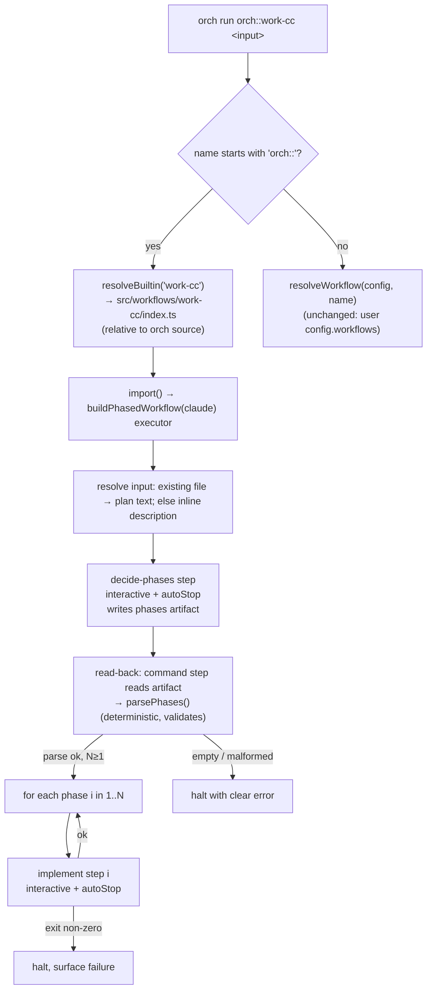

# feat: Default (built-in) workflows — `orch run orch::<name>`

## Summary

Ship a small fixed set of workflows *inside* orch that run via an `orch run orch::<name>`
namespace — no `.orch/` workflow authoring, no `config.workflows` entry. The first two,
`orch::work-cc` and `orch::work-codex`, share **one** parameterized phased-build pipeline and
differ only in the bound runner. The pipeline: an always-run interactive+autoStop decide step
picks a 1–4 phase breakdown and **emits it as a parseable artifact**, a deterministic read-back
step parses+validates that artifact into an ordered phase list, then a loop implements each phase
as one interactive+autoStop work step.

The friction this removes is **distribution and invocation**, not capability — every primitive
already ships (`autoStop`, file-based prompts, the `command` step, the decide-then-loop shape in
`examples/compound/index.ts`). This feature packages a ready-to-run pipeline and a resolver that
finds it without the user reconstructing it.

---

## Problem Frame

Today the only way to run a workflow is to author it: scaffold `.orch/`, write a TypeScript
workflow file, and register it in `config.workflows` (`src/config/index.ts:209` `resolveWorkflow`
looks the name up in that map and throws if it is absent). That ceremony is right for a bespoke
team pipeline but is a wall for someone who just wants to point orch at a plan and watch it build
in phases. `examples/compound/index.ts` already proves the exact decide-then-loop shape — it just
lives in `examples/` where a user must discover, copy, wire, and register it before the first run.

This plan adds (1) an `orch::` resolver branch that loads packaged built-ins from orch's **own
source tree** (bypassing the user's `config.workflows`), and (2) the packaged phased-build
pipeline plus its two runner-bound entry workflows.

---

## Scope & Key Decisions Confirmed With User

Three review-flagged forks were resolved before planning (origin "From 2026-06-02 review"):

1. **No phase-cut gate — pure autoStop.** The decide-phases step self-closes via `autoStop` and the
   implement loop starts immediately, honoring R5 and the "zero per-phase keystrokes" success
   criterion as written. A bad phase cut is recoverable only by killing the run; this risk is
   accepted for this iteration (see Risk Analysis R-1).
2. **Ship both variants.** `work-cc` **and** `work-codex` ship together off the single parameterized
   pipeline (R4). Marginal cost over one variant is small once the pipeline takes the runner as a
   parameter.
3. **Soft cap + validate, reword AE4.** The 1–4 ceiling is driven by the decide prompt (R7 heuristic).
   The read-back step validates the list is **non-empty and well-formed** (R8) and **warns** when it
   parses more than 4 phases, but does **not** truncate. AE4 / the Success Criteria are reworded so
   they assert the bias and the parse/validation guarantee, not an unenforceable hard cap. The reworded
   assertions this plan builds to (these supersede the origin AE4 and the matching Success Criterion):
   - **Reworded AE4:** "Given a small, single-concern change, decide-phases returns a single phase (not
     padded); given a large multi-concern change, it returns more phases and the prompt biases toward
     ≤4. The read-back parses/validates whatever count the agent emits — it guarantees a non-empty,
     well-formed list, not a hard ≤4 ceiling, and warns (does not fail) above 4."
   - **Reworded Success Criterion:** "Decide-phases is prompted to stay within 1–4 phases for ordinary
     work; the read-back guarantees a parseable non-empty phase list and surfaces a warning when the
     count exceeds 4." ("well-formed" = each block has a required non-empty title; description optional.)

---

## Requirements Traceability

| Req | Where addressed |
|-----|-----------------|
| R1 — built-ins packaged inside orch, no `config.workflows` entry | U1 (registry + locator), U5 (entry modules) |
| R2 — `orch::` prefix bypasses user map; bare names unchanged | U1, AE1 |
| R3 — read-only, run-in-place, no eject | U1 (resolves to source path, never copies) |
| R4 — two variants, one parameterized pipeline | U2 (factory), U5 (both bindings), AE2 |
| R5 — every agent step interactive + autoStop | U2 (decide), U4 (loop), U5 |
| R6 — decide always runs fresh, never honors pre-written phases | U3, AE3 |
| R7 — 1–4 phase bias from complexity heuristic | U3 (prompt) — soft cap per decision 3, AE4 |
| R8 — emit as parseable artifact; validate non-empty/well-formed; halt on bad parse | U3, AE (parse tests) |
| R9 — implement-only per phase; halt on non-zero before next phase | U4 |
| R10 — input is plan file or inline description | U2 (input handling), AE5 |

---

## Output Structure

New `src/workflows/` module (greenfield directory; per-unit `**Files:**` are authoritative):

```text
src/workflows/
  index.ts                   # public barrel: resolveBuiltin, isBuiltinName, BUILTIN_NAMES
  resolve-builtin.ts         # orch:: prefix detection + source-relative path resolution
  registry.ts                # name -> built-in module path map (work-cc, work-codex)
  phased-build/
    pipeline.ts              # buildPhasedWorkflow(runner): WorkflowExecutor — shared factory
    decide-prompt.ts         # decide-phases prompt text + artifact-format contract constants
    parse-phases.ts          # deterministic artifact parser + validation (no LLM)
  work-cc/
    index.ts                 # default export: buildPhasedWorkflow(claude(...))
  work-codex/
    index.ts                 # default export: buildPhasedWorkflow(codex(...))
```

The resolver branch is wired into the existing `src/cli/commands/load-workflow.ts`; no new CLI
command. The locator resolves paths relative to **orch's own source** via
`fileURLToPath(import.meta.url)` so it works both run-from-source (`bin: ./src/cli/main.ts`) and
when orch is installed/symlinked into a host project — orch has no build/dist step
(`package.json` `exports` points straight at `./src/index.ts`).

---

## High-Level Technical Design

*This illustrates the intended approach and is directional guidance for review, not implementation
specification. The implementing agent should treat it as context, not code to reproduce.*



**Runner parameterization.** `buildPhasedWorkflow(runner: Runner): WorkflowExecutor` returns a
`workflow(name, fn)` whose every agent `step.define` binds `agent: runner`. `work-cc/index.ts` calls
it with `claude({ bare: false, flags: ['--dangerously-skip-permissions'] })`; `work-codex/index.ts`
with the codex equivalent. Phase logic lives only in `pipeline.ts` — both variants inherit any change.

**Emit/parse contract (R8).** Because the decide step is interactive (`returns` is forbidden on
interactive steps, and the decision deliberately avoids the headless typed-JSON route), the agent
**writes a file**. Proposed delimiter format (directional — implementer may refine, but it must stay
LLM-writable and parseable by deterministic code):

```text
=== PHASE ===
<one-line title>
<free-text description, may span multiple lines>
=== PHASE ===
<title>
<description>
```

`parsePhases(text)` splits on the `=== PHASE ===` delimiter, trims, drops empty blocks, and returns
`{ title, description }[]`. It **throws a clear, run-halting error** on zero well-formed blocks, and
**logs a warning** (does not truncate) when the count exceeds 4. The decide prompt and the parser
share the delimiter constant from `decide-prompt.ts` so they cannot drift.

---

## Phased Delivery

The six units group into three dependency-ordered phases. Each phase is independently landable behind
`bun run check` and leaves the tree green. Complexity is moderate — three phases (not one, not six)
keep the substantial pipeline core isolated from the thin distribution and ship layers.

| Phase | Theme | Units | Delivers | Depends on |
|-------|-------|-------|----------|------------|
| **P1 — Resolver & invocation surface** | The `orch::` distribution mechanism: prefix detection + source-relative locator, bypassing `config.workflows`. Validatable with a placeholder built-in. | U1 | R1, R2, R3, **AE1** | — |
| **P2 — The phased-build pipeline** | The runner-agnostic core: `buildPhasedWorkflow` factory, input handling, the decide step + emit/parse/validate contract, and the per-phase loop with sentinel-based halt. Tightly coupled — the factory holds the U3/U4 steps. | U2, U3, U4 | R4 (single-source), R5, R6, R7, R8, R9, R10, **AE3, AE4, AE5** | P1 (soft — registry shape; integrates at P3) |
| **P3 — Variants & ship** | Bind Claude + Codex into the registry so P1's resolver points at real pipelines; user docs. Closes the loop end-to-end. | U5, U6 | R4 (both variants), **AE2**, newcomer success criterion | P1, P2 |

**Sequencing rationale.** P1 ships the invocation surface alone so the resolver contract (and its
dev-vs-installed path anchoring, R-3) is proven before any pipeline rides on it. P2 is the bulk of the
logic and is internally cohesive — input → decide → parse → loop is one chain that should land and be
tested together (splitting U3 from U4 would strand the emit/parse contract without a consumer). P3 is
pure wire-up + docs: it makes `orch run orch::work-cc|work-codex` real and is where the two runners'
asymmetry (R-6) and per-runner autoStop divergence get exercised. The open R9 decision (sentinel vs
best-effort re-scope) is resolved within P2, before P3 makes the variants runnable.

---

## Implementation Units

### U1. `orch::` resolver branch + built-in locator

**Phase:** P1 — Resolver & invocation surface.

**Goal:** Recognize the `orch::` prefix in `orch run` and resolve the remainder to a packaged
built-in loaded from orch's own source tree, bypassing the user's `config.workflows`. Bare names
resolve exactly as today.

**Requirements:** R1, R2, R3. Covers AE1.

**Dependencies:** none (can land with a single placeholder/fixture built-in; U5 supplies the real
entries).

**Files:**
- `src/workflows/resolve-builtin.ts` (new) — `isBuiltinName(name)`, `resolveBuiltin(name): Path`.
- `src/workflows/registry.ts` (new) — `BUILTIN_NAMES` and name→relative-module-path map.
- `src/workflows/index.ts` (new) — public barrel re-exporting the locator API.
- `src/cli/commands/load-workflow.ts` (modify) — branch on `isBuiltinName(name)` before
  `resolveWorkflow`; on built-in, set `workflowPath = resolveBuiltin(name)` and skip the config-map
  lookup; keep the existing `import()` + `isExecutorShape` validation path unchanged.
- `tests/unit/workflows/resolve-builtin.test.ts` (new).
- `tests/integration/cli/run-builtin.test.ts` (new) — end-to-end through `loadWorkflow`.

**Approach:**
- `resolveBuiltin` derives orch's source dir from `fileURLToPath(import.meta.url)` (NOT the user's
  cwd or `configDir`) and joins the registry's relative path. This is the load-bearing decision that
  makes built-ins work both run-from-source and installed (no dist build exists).
- Use the branded `path()` wrapper for the returned path (CLAUDE.md rule 9). Note `path()` rejects
  `..`; registry values are fixed internal constants, so traversal is structurally impossible.
- Unknown built-in name → throw a clear error listing `BUILTIN_NAMES` (mirror the existing
  "Unknown workflow … Available: …" message style in `resolveWorkflow`).
- `.orch/` is still required (config is still loaded for run state/mode — R3 / origin Dependencies).
  Do **not** weaken `loadConfig`; a built-in run with no `.orch/` surfaces the existing
  `ConfigLoadError`. Add a test asserting the message is intelligible for the `orch::` path.

**Patterns to follow:** `resolveWorkflow` / `loadWorkflow` in `src/config/index.ts:209` and
`src/cli/commands/load-workflow.ts:30`; branded `Path` usage; existing barrel convention
(`src/core/index.ts`).

**Test scenarios:**
- Covers AE1. A name with the `orch::` prefix resolves to the built-in source path and the user's
  `config.workflows` map is never consulted (assert via a config whose map would shadow/conflict).
- Covers AE1. A bare name (no prefix) resolves through `resolveWorkflow` exactly as today — a
  registered user workflow still loads; an unknown bare name still throws the existing error.
- `isBuiltinName` is true only for the `orch::` prefix and false for bare names, empty string, and a
  name that merely contains `orch::` mid-string.
- `resolveBuiltin('orch::work-cc')` returns a path under orch's source dir (assert it is anchored to
  `import.meta`-derived dir, not cwd) — guards the dev-vs-installed portability decision.
- Unknown built-in (`orch::nope`) throws an error naming the available built-ins.
- Integration: running an `orch::` name with a missing `.orch/` surfaces the existing config error,
  not a confusing locator error.

---

### U2. Shared phased-build pipeline factory + input handling

**Phase:** P2 — The phased-build pipeline.

**Goal:** Establish `buildPhasedWorkflow(runner)` — the single parameterized pipeline — and its
input-resolution front: an existing-file argument is loaded as the plan; otherwise the argument is
the inline description. Decide and loop steps are stubbed here and filled by U3/U4.

**Requirements:** R4 (single-source factory), R5 (interactive+autoStop shape established), R10.
Covers AE5.

**Dependencies:** U1 (registry shape so the factory's name is known) — soft; can develop in parallel
and integrate at U5.

**Files:**
- `src/workflows/phased-build/pipeline.ts` (new) — `buildPhasedWorkflow(runner: Runner): WorkflowExecutor`.
- `tests/integration/workflows/phased-build-input.test.ts` (new) — uses the predictable fake runner
  (see Patterns) to drive the pipeline deterministically.

**Approach:**
- The factory returns `workflow(<name>, async (run, args) => { … })`. Name is supplied by the caller
  (U5) so the two variants get distinct workflow names while sharing the body.
- **Input resolution (R10):** the workflow body has no direct service access (signature is
  `(run, args)`), so IO goes through a step. Resolve `args.prompt` via a `command` step
  (`cat <arg>`, `onFailure: 'continue'`): exit 0 ⇒ treat stdout as the plan text; non-zero ⇒ treat
  the argument as an inline description. This folds detect + load into one cached, resumable step and
  reuses the file-based-prompts notion of "existing file" without inventing a parallel detector.
  Pass the resolved text to the decide step as a `vars` value.
- Argument is passed as `argv` (not a shell string) — no shell-injection surface; a multi-line inline
  description simply fails the `cat` and is treated as inline (acceptable per AE5).
- **Detection is best-effort, not exact.** A bare exit-0/non-zero split also routes existing-but-
  unreadable paths, directories (`cat <dir>` → non-zero), and paths typed relative to a different cwd
  than the command step's resolved cwd into the "inline" branch silently. For a single-user CLI this
  is a usability papercut, but to keep AE5's "existing file → plan" contract honest, prefer a `test -f`
  probe (or surface "treating `<x>` as inline — not a readable file") over catting blindly, and note
  that relative paths resolve against the command step's cwd (the active worktree if one is entered,
  else the workflow cwd).
- Throw a clear usage error when `args.prompt` is undefined/empty (mirror
  `examples/compound/index.ts:80`).

**Patterns to follow:** `examples/compound/index.ts` (overall decide→loop shape, runner-tagging
helper, usage guard); `command` step API in `src/core/command.ts`; the predictable fake agent
(`docs/plans/2026-06-01-001-feat-predictable-fake-agent-plan.md`) for deterministic integration
tests; `parallel`/`as` not needed here.

**Test scenarios:**
- Covers AE5. Given the argument is a path to an existing file, the pipeline loads that file's
  contents as the plan text handed to the decide step.
- Covers AE5. Given the argument is not an existing path (inline description), the argument string
  itself is handed to the decide step as the plan text.
- Given an empty/undefined argument, the workflow throws a clear usage error before any agent step
  runs.
- The same `buildPhasedWorkflow` factory invoked with two different runner instances produces two
  executors with distinct names but identical step structure (guards R4 single-source).

---

### U3. Decide-phases step + emit/parse/validate contract

**Phase:** P2 — The phased-build pipeline.

**Goal:** The always-run interactive+autoStop decide step that produces a fresh 1–4 phase breakdown
and emits it as a parseable artifact, plus the deterministic read-back parser that validates the
artifact into an ordered phase list (halting on malformed/empty).

**Requirements:** R6, R7 (soft cap per decision 3), R8. Covers AE3, AE4.

**Dependencies:** U2 (factory + resolved plan text).

**Files:**
- `src/workflows/phased-build/decide-prompt.ts` (new) — the decide prompt template and the shared
  artifact-format constants (delimiter, artifact path).
- `src/workflows/phased-build/parse-phases.ts` (new) — `parsePhases(text): Phase[]` with validation.
- `src/workflows/phased-build/pipeline.ts` (modify) — wire the decide step + read-back command step.
- `tests/unit/workflows/parse-phases.test.ts` (new).
- `tests/integration/workflows/phased-build-decide.test.ts` (new) — fake runner scripted to write a
  known artifact; asserts the parsed phase list drives the loop.

**Approach:**
- **Decide step:** `mode: 'interactive'`, `autoStop: true`, `agent: runner`. Prompt (from
  `decide-prompt.ts`) instructs the agent to: analyze the input plan/description, choose **1–4**
  phases using the complexity heuristic ("how many changes, how many unrelated concerns"), **bias
  toward fewer**, reserve >4 for genuinely exceptional complexity, and write the breakdown to the
  agreed artifact path in the agreed delimiter format, then finish (autoStop closes the pane).
- **R6 fresh-decision framing:** the step receives the full input text as context and re-derives
  phases. It is told to **decide its own breakdown** and **not to copy any pre-written phase
  structure** present in the input. (The input content is unavoidably visible — "fresh" means
  re-derived, not blind. This reconciles R6/AE3 with the agent having the plan as input.)
- **Truncate-before-decide (REQUIRED — silent-corruption guard).** The interactive decide step
  returns `exitCode: 0` even if the agent writes nothing (the tmux host treats a clean/autoStop pane
  exit as success — `src/hosts/two-pane/tmux-host.ts:1327`, `exitCodeKnown: false`). With a fixed
  artifact path, a decide step that fails to write would let the read-back `cat` succeed against a
  **prior run's leftover file**, sail through R8 validation, and implement stale phases. To make the
  R8 safety net actually fire: a `command` step (`onFailure: 'halt'`) **deletes/truncates the
  artifact before the decide step runs**, so a non-writing decide yields an empty file → `cat`
  returns empty stdout → `parsePhases` throws on zero blocks → run halts. This converts decide-step
  failure into a detectable halt without needing the (unavailable) exit code.
- **Read-back:** a `command` step (`cat <artifact-path>`, `onFailure: 'halt'`) reads the artifact;
  `parsePhases` runs in the workflow body on the cached stdout (pure, deterministic, re-runs safely
  on resume). The decide prompt must instruct the agent to **finish writing the artifact before
  ending its turn** (autoStop fires on turn-complete and may hard-kill the pane); if flakiness
  appears, the read-back may tolerate a brief retry rather than assuming the write is durable the
  instant the pane closes.
- **Validation (R8):** `parsePhases` throws a clear, run-halting error when zero well-formed blocks
  parse; it `log`s a warning when count > 4 but does not truncate (decision 3). Title required and
  non-empty; description may be empty.
- **Artifact path:** a fixed `.orch/`-relative path (e.g. `.orch/phased-build-phases.md`). Combined
  with truncate-before-decide above, the fixed path is safe for sequential single-user runs.
  Run-scoped pathing (concurrent same-cwd runs) is deferred — see Deferred to Follow-Up Work and R-4.
- **R6 prompt caveat (decide variance):** the "decide fresh, don't copy pre-written phases" framing
  conflicts for the most likely input — a plan already phased by this toolchain's convention. The
  prompt must be explicit about the intent (re-derive a breakdown sized to *this* run; you may treat
  the input's structure as evidence of complexity but must not mechanically reproduce it) and this is
  a primary target of the R-2 format/adherence smoke test, since LLM behavior under the tension is
  not deterministic.
- Decide step has **no `returns`** — that is forbidden on interactive steps and is the whole reason
  for the artifact route; do not reintroduce typed JSON here.

**Technical design:** see the emit/parse contract sketch in High-Level Technical Design above
(directional, not a spec).

**Patterns to follow:** `examples/compound/index.ts:131` (the autonomous `count-phases` is the
*anti-pattern* to diverge from — ours is interactive+artifact, not autonomous+typed-return); the
`command` step for read-back; `autoStop` usage from
`docs/plans/2026-05-25-001-feat-interactive-auto-stop-plan.md`.

**Test scenarios:**
- Covers AE3. Given input that already contains a written phase breakdown, the decide step still runs
  and the pipeline uses the freshly-emitted artifact (assert the pipeline does not parse phases
  directly out of the input plan — verified via a fake runner that emits a different breakdown than
  the input contains).
- Covers AE4. `parsePhases` returns a single phase for a one-block artifact (not padded) and N phases
  for an N-block artifact; ordering is preserved.
- Covers AE4. `parsePhases` on a >4-block artifact returns all blocks and emits a warning (does not
  truncate, does not throw) — encodes the soft-cap decision.
- R8: `parsePhases` throws a clear error on empty input, whitespace-only input, and a file with the
  delimiter present but no non-empty blocks; the pipeline halts rather than proceeding with zero
  phases.
- `parsePhases` tolerates trailing/leading delimiters and blank lines between blocks (robustness of
  the deterministic format).
- Integration: decide step runs interactive with `autoStop: true` for the bound runner (assert the
  step config, and that the run completes unattended in the fake-runner harness).

---

### U4. Per-phase implement loop (implement-only, halt-on-failure)

**Phase:** P2 — The phased-build pipeline.

**Goal:** Loop the parsed phase list, running exactly one interactive+autoStop work step per phase
that implements that phase only. No commit, no validation. A failed phase halts the run before the
next phase starts.

**Requirements:** R9. (R5 reinforced.)

**Dependencies:** U3 (parsed phase list).

**Files:**
- `src/workflows/phased-build/pipeline.ts` (modify) — the loop.
- `tests/integration/workflows/phased-build-loop.test.ts` (new).

**Approach:**
- `for (let i = 0; i < phases.length; i++)` define an implement step (`mode: 'interactive'`,
  `autoStop: true`, `agent: runner`) whose prompt embeds the phase title+description and instructs
  the agent to implement **only this phase**, work autonomously, and **not** commit or run
  project validation (R9 — orch cannot know the host project's test/verify commands). Call
  `run(step, { as: \`phase-${i + 1}\` })` so each iteration caches independently (pattern:
  `examples/compound/index.ts:151`).
- **Halt-on-failure (R9) — the StepError-on-exit-code path does NOT cover agent failure.** Verified
  against the codebase: interactive autoStop steps **always return `exitCode: 0`**
  (`src/hosts/two-pane/tmux-host.ts:1324-1327` — "we treat a clean exit as exit 0 … Phase D2 will
  wire structured failure capture"; `exitCodeKnown: false` at `:1233`). The `StepError` throw at
  `src/core/workflow.ts:797` is gated on that exit code, so it only fires on a **pane/spawn crash**,
  never when the agent errors out, stalls, runs out of context, or implements nothing. The original
  "rely on default behavior" plan was falsified here. R9's "halt before the next phase rather than
  compounding failures" therefore needs an **explicit failure signal**, not the exit code.
- **Recommended mechanism — per-phase status sentinel (mirrors the decide artifact pattern):** the
  implement prompt instructs the agent, as its final action, to write a tiny status sentinel
  (e.g. `.orch/phase-<n>-status` containing `ok` on success, or a structured `done`/`blocked` line).
  A cheap `command` read-back after each phase step validates the sentinel exists and reads `ok`;
  anything else (missing, `blocked`, malformed) **halts the loop before phase n+1**. The loop
  truncates phase-<n>-status before the implement step (same stale-read guard as U3), so a
  no-write/crashed phase yields a missing/empty sentinel → halt. This is pipeline plumbing, not the
  "commit/validation/other work step" R9 excludes — R9 forbids project-specific verification
  (typecheck/tests), which this is not.
- **Honest fallback if the sentinel is rejected as too heavy:** re-scope R9 in this plan to
  *best-effort* halt (catches pane crashes only) and state plainly that agent-level phase failure is
  **not** detectable until the platform's "Phase D2" structured exit-code capture lands. Do not leave
  the plan implying R9 fully holds when it cannot. **This is a decision for the user** (see summary
  above the post-generation menu).

**Patterns to follow:** `examples/compound/index.ts:141-152` (dynamic `as:` loop); the decide
artifact read-back in U3 (sentinel mirrors it); `StepError` / `summarizeFailure` in `src/core/`.

**Test scenarios:**
- Given a 3-phase list, the loop runs exactly three implement steps in order, each interactive with
  `autoStop: true`, and the run completes with no human keystrokes (fake-runner harness).
- Each implement step's prompt is scoped to a single phase and contains no commit/validation
  instruction (assert the prompt text — guards R9 implement-only).
- (Sentinel mechanism) Given a phase whose agent writes a non-`ok` / missing sentinel, the read-back
  halts the run before the next phase's implement step runs (assert via a fake runner scripted to
  write a `blocked` sentinel on phase 2 of 3). This is the test that actually proves R9 — a test that
  only asserts "non-zero exit halts" would pass against the broken path and prove nothing, since
  interactive steps never return non-zero.
- (Sentinel mechanism) The status sentinel is truncated before each implement step so a stale prior
  sentinel cannot mask a current-phase no-write.
- Step cache keys are distinct per phase (`phase-1`, `phase-2`, …) so resume re-enters the correct
  phase.

---

### U5. The two entry workflows (`work-cc`, `work-codex`)

**Phase:** P3 — Variants & ship.

**Goal:** Bind Claude and Codex to the shared pipeline as the two packaged built-ins the resolver
loads. This is the unit that makes `orch run orch::work-cc` and `orch run orch::work-codex` real.

**Requirements:** R4, R5. Covers AE2.

**Dependencies:** U1 (registry/locator), U2–U4 (pipeline).

**Files:**
- `src/workflows/work-cc/index.ts` (new) — `export default buildPhasedWorkflow(claude({ bare: false, flags: ['--dangerously-skip-permissions'] }))`.
- `src/workflows/work-codex/index.ts` (new) — the codex equivalent. **Note: `claude` and `codex` are
  NOT option-symmetric.** `CodexOptions` is `{ model?, sandbox?, flags? }`
  (`src/runners/codex/codex-runner.ts:59`) — there is **no `bare`**, and the autonomy/permission
  posture is the `sandbox` field (default `'full-auto'`), **not** a `--dangerously-skip-permissions`
  flag. A flag allowlist (`assertFlagAllowed`, `codex-runner.ts:464`) throws at buildCommand time on
  unrecognized flags, so do not blind-copy the Claude flag set. **Decision the implementer must pin
  down (no greppable work-codex precedent exists — compound is Claude-only):** which `sandbox` mode
  gives the unattended phase loop write access (e.g. `'full-auto'` vs a bypass posture). Get this
  right or `work-codex` cannot write files autonomously.
- `src/workflows/registry.ts` (modify) — point `work-cc` / `work-codex` at the real entry modules.
- `tests/integration/workflows/builtin-variants.test.ts` (new).
- `tests/e2e/workflows/builtin-phased-build.e2e.test.ts` (new) — real CLIs, env-gated, auto-skipped
  when the CLI is missing (per CLAUDE.md runner test policy).

**Approach:**
- Each entry module is a thin default export that calls `buildPhasedWorkflow` with its runner. Both
  must construct runners that advertise the `prepareAutoStop` capability (Claude settings hook /
  Codex notify) — autoStop steps fail fast with `AutoStopUnsupportedError` otherwise.
- **Per-runner autoStop divergence is real (don't let "differ only in the runner" hide it).** The two
  autoStop mechanisms are implemented differently — Claude injects a per-run `.claude/settings.local.json`
  hook in cwd; Codex builds a per-run `CODEX_HOME` (symlink farm, flagged as a smoke-test risk in
  `docs/plans/2026-05-25-001-feat-interactive-auto-stop-plan.md`). Identical step *config* does not
  imply identical runtime reliability: `work-codex` can fail autoStop setup where `work-cc` succeeds.
  Each variant needs its own autoStop-path coverage; a skipped codex e2e must not be read as "codex
  variant validated."
- Confirm the workflow name passed into the factory satisfies `WORKFLOW_NAME_PATTERN`
  (`work-cc`/`work-codex` do).

**Patterns to follow:** `examples/compound/index.ts` runner construction; the Codex runner factory
and flags as used in existing examples/tests; `src/runners/index.ts` (`claude`, `codex`).

**Test scenarios:**
- Covers AE2. `orch::work-cc` and `orch::work-codex` resolve to executors whose step sequence and
  phase logic are identical; only the bound runner differs (assert step kinds/modes/autoStop flags
  match across both, runner identity differs).
- Both variants' agent steps are interactive with `autoStop: true` (no autonomous agent step in the
  pipeline).
- Integration: `orch run orch::work-cc <inline prompt>` drives the full decide→parse→loop happy path
  under the fake runner and completes unattended.
- e2e (env-gated, real CLI): `orch::work-cc` against a tiny real plan produces a phase artifact,
  parses ≥1 phase, and runs the first implement step; auto-skips when `claude`/`codex` is absent.
- A dedicated `work-codex` autoStop-setup smoke test (env-gated) exercises the Codex `CODEX_HOME`
  injection path so the codex variant is not "validated" only by structural config-equality tests.

---

### U6. User-facing documentation

**Phase:** P3 — Variants & ship.

**Goal:** Document the `orch::` namespace and the two built-ins on the public VitePress site so a
newcomer can discover and run them without reading source.

**Requirements:** Success criterion — "a new user can run … without authoring or registering any
workflow."

**Dependencies:** U1–U5 (behavior must be final).

**Files:**
- `docs/public/guide/<appropriate-page>.md` (new or modify) — how to run a built-in:
  `orch run orch::work-cc <plan-or-prompt>`, the two variants, file-vs-inline input, the phased
  behavior, and that built-ins are read-only/run-in-place (no eject this iteration).
- `docs/public/reference/<built-ins page>.md` (new) — reference entry for `orch::work-cc` /
  `orch::work-codex`.

**Approach:** Load the `doc-writer` skill first (CLAUDE.md docs rule). One concept per page, runnable
examples with imports shown, no forward references in the numbered guide. If this iteration changes
the public barrel `src/index.ts`, reconcile `docs/public/reference/api.md` (it should not — the
resolver is internal CLI wiring).

**Execution note:** docs-only; `bun run docs:build` is the gate (fails on dead internal links).

**Test scenarios:** `Test expectation: none -- documentation only; verified by \`bun run docs:build\`.`

---

## System-Wide Impact

- **CLI resolution path** (`src/cli/commands/load-workflow.ts`): one new branch before the existing
  config-map lookup. Bare-name behavior must remain byte-for-byte unchanged — guarded by U1 tests.
- **New `src/workflows/` module** with its own barrel (CLAUDE.md rule 7). The core (`src/core/`)
  must not import it; the dependency direction is CLI → workflows → core/runners.
- **Runners:** no runner changes. The pipeline only *consumes* `claude`/`codex` factories and the
  existing `prepareAutoStop` capability.
- **Public docs:** new built-ins are user-facing; U6 covers them. Public API barrel is unaffected
  (resolver is internal).

---

## Risk Analysis & Mitigation

- **R-1 — No checkpoint before unattended implementation (accepted).** Per decision 1, a bad phase
  cut runs to completion with no gate. *Mitigation:* invest the decide prompt (U3) in a strong
  complexity heuristic and bias-toward-fewer wording; document that the user can kill the run; revisit
  a confirm gate in a follow-up if real runs show bad cuts.
- **R-2 — Agent does not adhere to the artifact format.** The whole loop depends on the decide agent
  writing the agreed delimiter format. *Mitigation:* keep the format dead-simple and LLM-friendly;
  share the delimiter constant between prompt and parser; `parsePhases` halts with a clear error on
  malformed output (R8) rather than proceeding silently. Smoke-test adherence in the e2e (U5).
- **R-3 — Dev-vs-installed path resolution.** If `resolveBuiltin` anchored to cwd instead of orch's
  source, installed-orch runs would fail. *Mitigation:* anchor to `fileURLToPath(import.meta.url)`;
  U1 test asserts the resolved path is source-anchored.
- **R-4 — Fixed artifact path: stale-read corruption (single-run) + collision (concurrent).** The
  more dangerous case is **single-run correctness**, not just concurrency: because the decide step
  returns `exitCode: 0` even on no-write, a fixed non-run-scoped path lets a `cat` read a prior run's
  leftover phases and implement them silently. *Mitigation:* truncate-before-decide (U3) converts this
  to a clean halt. The remaining concurrent-same-cwd collision is accepted this iteration; run-scoped
  pathing is deferred (below).
- **R-5 — R9 halt-on-failure is not delivered by exit codes (verified gap).** Interactive autoStop
  steps always return `exitCode: 0` (`tmux-host.ts:1327`), so a failed *implement* phase silently
  advances the loop — the exact compounding-failure R9 forbids. *Mitigation:* the per-phase status
  sentinel mechanism (U4) provides the explicit failure signal; if that is rejected, R9 must be
  re-scoped to best-effort in this plan. **Open decision — see the summary above the post-generation
  menu.**
- **R-6 — Claude/Codex runners are not option-symmetric.** `codex()` has no `bare` and rejects
  unknown flags via an allowlist; the unattended write posture is the `sandbox` field. *Mitigation:*
  U5 pins the codex sandbox/flag choice explicitly rather than mirroring the Claude flag set.

---

## Scope Boundaries

Carried verbatim from origin (`docs/brainstorms/2026-06-02-feat-default-workflows-requirements.md`):

- `orch add` / `orch eject` / seeding built-ins into the user's `.orch/` for editing — excluded;
  built-ins are read-only run-in-place.
- Per-phase commits and per-phase validation (typecheck/tests) inside the built-in — excluded; the
  user owns commits and verification.
- A single-pipeline Claude+Codex cross-check variant (both agents per phase) — excluded; the two
  runners ship as separate variants the user chooses between.
- Parsing or honoring pre-written phases from the input plan — excluded; decide always decides fresh.
- A registry/marketplace for third-party built-ins, version negotiation, or rich `orch::`
  discovery/listing UX beyond what is needed to run the shipped variants — excluded.

### Deferred to Follow-Up Work

- **Run-scoped artifact path** for the phase breakdown (avoid collisions across concurrent same-cwd
  runs). Fixed path is fine for this iteration (R-4).
- **Optional phase-cut confirm gate** (revisit decision 1 if real runs produce bad cuts).
- **`orch::` discovery/listing UX** (e.g. `orch run orch::` listing the built-ins) — only the run path
  is needed now.

---

## Dependencies / Assumptions

- Relies on shipped features: `autoStop` for interactive steps, the `command` step, file-based
  prompts, and the decide-then-loop shape proven in `examples/compound/index.ts`.
- Assumes the target user has run `orch init` — `.orch/` must exist for run state and mode resolution
  (origin Dependencies). A truly empty directory is out of scope; the existing `ConfigLoadError`
  surfaces for the `orch::` path too (U1).
- `examples/compound/index.ts` and `examples/feature/index.ts` are reference precedent, not runtime
  dependencies.
- The env-merge helper lives at `src/services/process/merge-env.ts` (CLAUDE.md's `src/runners/_shared/`
  reference is stale) — relevant only if a built-in touches env wiring (it should not; runner
  factories handle env).

---

## Verification

- `bun run check` green (lint + typecheck + unit + mocked-integration) — the CLAUDE.md gate.
- `orch run orch::work-cc "<inline description>"` and `orch run orch::work-codex <plan-file>` each run
  decide→parse→loop unattended on the happy path under the fake-runner harness.
- A bare workflow name still resolves through `config.workflows` unchanged.
- A phase whose agent reports failure (non-`ok`/missing sentinel) halts the run before the next phase
  — proven via the sentinel test, not via an exit-code assertion (interactive steps never return
  non-zero).
- A decide step that writes nothing halts via the truncate-before-decide guard (empty file →
  `parsePhases` throws), not via a stale prior-run artifact.
- `bun run docs:build` green after U6.
- e2e (env-gated) exercises at least one real-CLI variant end-to-end and auto-skips when the CLI is
  absent.
