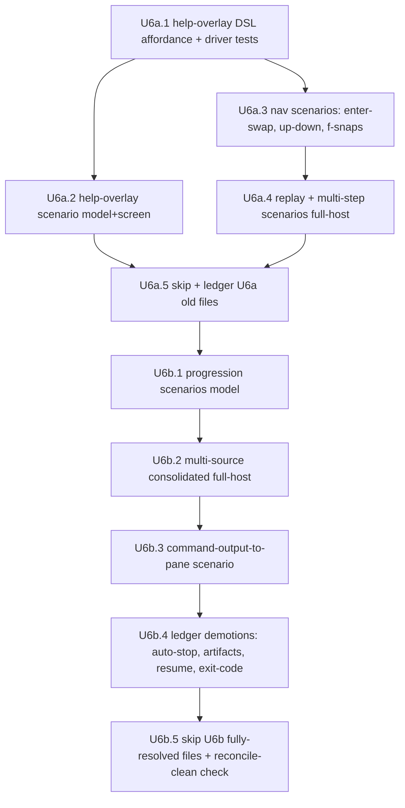

# refactor: Phase 6 (U6) — two-pane plumbing migration

> **This is the detailed phase plan for parent unit U6** of
> [`2026-06-05-001-refactor-testing-strategy-restructure-plan.md`](2026-06-05-001-refactor-testing-strategy-restructure-plan.md).
> It honours — and must not relitigate — the parent plan's decisions (§3), the
> DSL interfaces (§5), the decision rule (§6), the script ladder (§8), and the
> worked examples (§9). Where this plan adds a new affordance, it extends those
> interfaces in their established shape; it does not redesign them.
>
> **North star (inherited):** readability and maintainability over everything. A
> behaviour is written **once** as `scenario(meta, body)` and run at the
> fidelities it lists. Chrome literals stay co-located on Pane Objects. The
> migration is a **pruning re-derivation**, not a mechanical 1:1 port.

---

## 1. Summary

U6 migrates the **two-pane plumbing** feature surface — the behaviours where the
risk is *what the controller decides about the panes* or *whether the two panes
communicate*, not where bytes land (that was `screen`, U5) and not process
signals/teardown (that is U8). Concretely: **navigation** (up/down selection,
Enter-to-swap-transcript, `f`-snaps-to-live, help-overlay open/close),
**replay** (revisiting a completed step reuses its pane and shows the same
transcript), **progression** (live focus follows the newly-running step, the
glyph flips on completion), **multi-source** (many per-source sessions, no
split-window failure), and **command-step output reaching the right pane**.

Per the parent plan these re-derive across **`model`** (controller decisions) and
**`full-host:fake-agent`** (two-pane communication), with a small number of
**`screen`** byte twins where a new rendering surface appears (the help overlay).
`recorded-agent`/`real-agent` are not needed here — none of these behaviours
depends on realistic event-stream *shape* (those land in U9).

**Two forces make U6 larger than a single phase and justify pre-splitting it**
(parent §U5–U9 sizing rule: *"treat any cluster exceeding ~40 old cases or ~15
files as multiple phases … the split must be expressed in this plan"*):

1. **File count.** 16 in-scope old files (5 live tier-1 + 1 deferred tier-1 + 10
   live lifecycle), ~20 cases — over the ~15-file ceiling.
2. **Net-new infrastructure.** The **help overlay** has *no* DSL affordance today
   (verified: no `help-overlay` surface anywhere in `tests-new/dsl/`). Like U5,
   the load-bearing work is *extending the DSL so the behaviour is expressible at
   all* — new `PaneDriver` capabilities backed on both the `model` and real-tmux
   pane drivers, shipped test-first with driver-level tests, before any scenario.

So U6 is delivered as two ordered sub-phases:

- **U6a — Navigation & replay plumbing** (the infra-heavy half): help-overlay
  machinery + the nav/replay/multi-step scenarios on `model` + `full-host:fake-agent`
  (+ `screen` for the help-overlay byte twin).
- **U6b — Progression, multi-source, command & triage demotions** (the
  routing-heavy half): progression decisions on `model`, a consolidated
  multi-source `full-host` scenario, command-output-to-pane, and the **disciplined
  demotion** of the non-rendering cases (auto-stop coordination, per-step artifacts
  on disk, resume orchestration, command exit-code persistence) into U10–U13
  relocation — ledgered now, files left LIVE, exactly as U5 did.

This plan's unit IDs (`U6a.1` … `U6b.5`) are **plan-local** and distinct from the
parent's `U6`. The detailed migration ledger is the authoritative per-case record;
the routing table in §4 is this plan's directional commitment.

---

## 2. Problem frame & scope

**In scope (the 16 files U6 owns, per parent §U5–U9 table row U6).**

Tier-1 real-tmux integration (`tests/integration/hosts/two-pane/tier-1/`), all
currently **LIVE** under `describe.skipIf(!tmuxAvailable)` — capability-gated, not
migrated (the `skipIf`-vs-unconditional-`.skip` distinction reconcile depends on,
parent D15):

- `replay-revisit-reuses-pane.real.integration.test.ts`
- `replay-shows-same-transcript-as-live.real.integration.test.ts`
- `multi-step-right-pane-shows-latest.real.integration.test.ts`
- `many-sources-no-split-failure.real.integration.test.ts`
- `auto-stop.real.integration.test.ts`
- `interactive-pane-shows-prompt.real.integration.test.ts` (a single `it.skip`
  deferred placeholder — never executed)

Lifecycle behavioural subprocess (`tests/integration/lifecycle/`), all **LIVE**
under `describe.skipIf(!canRunRealTmux())`:

- `nav.enter-on-completed-step-swaps-right-pane-to-transcript.behavioral.real.test.ts`
- `nav.f-snaps-selection-back-to-live.behavioral.real.test.ts`
- `nav.help-overlay-opens-and-closes.behavioral.real.test.ts`
- `nav.up-down-moves-selection-without-detaching-live.behavioral.real.test.ts`
- `progression.live-focus-follows-newly-running-step.behavioral.real.test.ts`
- `progression.step-completes-glyph-flips-to-check.behavioral.real.test.ts`
- `progression.per-step-artifacts-land-on-disk.behavioral.real.test.ts`
- `resume.cached-steps-replay-with-cached-glyph.behavioral.real.test.ts`
- `command.output-streams-to-right-pane-and-exit-code-recorded.behavioral.real.test.ts`
- `per-source-sessions-10-step-walkthrough.real.test.ts`

**Out of scope (explicit non-goals).**

- `tier-1/autonomous-live-pane-shows-content.*` — **already migrated in U4**
  (`// MIGRATED →` marker + ledgered); U6 does not touch it.
- `tier-1/follow-live-returns-to-running-step.*`, `tier-1/view-mode-footer-reflects-mode.*`
  — **U4**; `tier-1/banner-*`, `tier-1/end-of-run-*` — **U5**;
  `tier-1/right-pane-shows-failure-summary.*` and all lifecycle `failure.*` /
  `signal` / `q-during` / `commit` / `worktree` / `ask` / `click-to-focus` /
  `close-stdin` / `*-sigint`/`sigterm`/`sighup` files — **U8**.
- Behaviour redesign. No orchestrator behaviour changes. Tests only.
- The relocation *target* files for demoted cases — those land in **U10–U13**.
  U6 ledgers the demotion and **leaves the demoted file LIVE** (its
  `// MIGRATED →` target must exist to satisfy reconcile rule 3, parent §U14).

**The triage filter (parent §6, the north star).** *"Would this test still pass
if the visible pane were empty / wrong / unformatted? If yes, demote or delete."*
Several nominal-U6 files answer **yes** — their risk is orchestration, disk
persistence, or a race, not the panes. U6 does not force them into two-pane
scenarios; it demotes them with a reason (§4).

---

## 3. Inherited decisions & affordance baseline

### 3.1 Decisions carried from the parent (do not relitigate)

| Parent decision | What it means for U6 |
|---|---|
| **D2** skip-as-migrated, keep forever | Old files become unconditional `describe.skip`/`it.skip` + `// MIGRATED → <path>` marker **only once every child case is ledgered** (D15). `skipIf` (capability) is *not* `.skip` (migrated). |
| **D8** selection by path | New scenarios live under `tests-new/{model,screen,full-host/fake-agent}/`; no env-var selection. |
| **D9** cassette boundary | Not exercised in U6 (no `recorded-agent` work). |
| **D10** co-located chrome literals | The new help-overlay chrome (title/hint) is a co-located constant on `LeftPane`, asserted via a semantic method, **never** imported from `src/`, never inline in a scenario. |
| **D11** typed-DSL gate | Every new affordance is added to the typed `PaneDriver`/`LeftPane`/app-surface so `tsc --noEmit` over `tests-new/` enforces it. |
| **D12** frozen baseline | Every `oldTestRefs` entry resolves against the **frozen** `baseline.json`; per-case identity (name/line/hash) comes from it, not a live scan. |
| **D15** case-granular ledger | A file is skipped only when **every** `it()`/`test()` case it holds has a ledger row (`port`/`merge`/`demote`/`drop` + reason). `many-sources` (2 cases) and `auto-stop` (4 cases) must each be fully ledgered. |

### 3.2 DSL affordance baseline (verified in `tests-new/dsl/`)

**Already real (reuse, do not rebuild):**

- `full-host:fake-agent` **static** mode (`createStaticFullHostApp` +
  `createRealTmuxPaneDriver`): `launch(spec)` runs the whole workflow,
  `complete(step)`, real `leftPane`/`rightPane` over real tmux. **Multi-step is
  fine in static mode** — the U4 single-handle limitation is *live-submode only*.
- `full-host:fake-agent` **live** submode (`liveDriven: true`, `app.agent.type/finish`)
  — single step handle (U4 limit). U6 uses it only for single-step interleave, if at all.
- `LeftPane` navigation: `selectStep`, `followLive`, `browseTo`,
  `assertStepSelected`, `assertGlyph`, `assertGlyphColor`, `assertPreviewCursorOn`,
  `assertStepVisible`/`Offscreen`, footer/banner/end-of-run assertions (U4/U5).
- `RightPane`: `assertShowsContent` (content escape hatch), `assertNoCaretEcho`.
- `model` driver virtual clock (`advanceTime`/`emitBanner`), forced `chalk.level=3`.

**Stubbed — must NOT be routed through:**

- `lifecycle` driver `leftPane`/`rightPane` are `notImplemented`. The nav/progression
  files *physically live* in `tests/integration/lifecycle/` but their **risk is
  two-pane plumbing/decision**, so U6 re-derives them on `model` + `full-host`,
  **not** the lifecycle driver. (Pane reads on the lifecycle driver remain a U8
  concern if ever needed.)

**Absent — must be added (the U6a infra):**

- **Help-overlay machinery.** No `openHelp`/`closeHelp`, no overlay assertion
  anywhere. New `PaneDriver` capabilities backed on the `model` pane driver and
  the real-tmux pane driver (for the `screen` twin), surfaced as semantic
  `LeftPane` methods with a co-located chrome literal.
- **Multi-source launch spec** (U6b) — a `FullHostSpec` shape that registers
  several per-source sessions; likely expressible by launching N steps but must be
  confirmed against `mountTmuxHost`. Treated as execution-time discovery (§7).
- **Command-step launch spec** (U6b) — a non-agent `command(...)` step whose
  stdout streams to the right pane. May need a small fixture extension; confirm
  against the host fixture (§7).

---

## 4. The per-case routing table (the spine of this plan)

This is the directional commitment. The implementing agent finalizes it as
case-granular ledger rows against the **frozen baseline**, applying the triage
rule. `→ U10–U13` means *ledger the demotion now, leave the file LIVE for
relocation*. Glyph: **port** = re-derive as a scenario; **merge** = covered by an
existing scenario, add `oldTestRefs`; **demote** = wrong category, route out;
**drop** = vacuous/never-ran, with reason.

### Sub-phase U6a — navigation & replay

| Old file (case count) | Risk / decision-rule category | Target | Disposition |
|---|---|---|---|
| `lifecycle/nav.up-down-…` (1) | selection moves while live glyph stays running → controller **decision** | `model` (overlaps U5 `selection`) | **port→model** (+ `oldTestRefs` to U5 selection group if it fully covers; else a focused decoupling scenario) |
| `lifecycle/nav.enter-…swaps-right-pane…` (1) | Enter on a completed step swaps the **right pane** to its transcript + footer flips → **two-pane communication** | `full-host:fake-agent` (right-pane swap) + `model` (footer-flip decision) | **port** — overlapGroup with the U4/U5 follow-live footer twin |
| `lifecycle/nav.f-snaps-…` (1) | `f` returns footer to live mode → footer **decision**, already covered | `model` (follow-live group) | **merge** into U4 follow-live + U5 footer hints; add a `full-host` snap-back twin only if it proves a distinct right-pane outcome |
| `lifecycle/nav.help-overlay-…` (1) | `?` opens overlay, `Esc` closes, step list survives → **what the controller shows** (model) + **does it paint** (screen) | `model` + `screen` (new overlapGroup `help-overlay`) | **port** — **requires new help-overlay affordance (U6a.1)** |
| `tier-1/replay-revisit-reuses-pane` (1) | revisiting a completed step shows the same transcript without respawning → **two-pane plumbing** | `full-host:fake-agent` | **port** (visible: revisit shows the same transcript); the white-box *pane-count* invariant → **drop** with reason (implementation detail, not a visible outcome — covered structurally by the driver's no-orphan regression test) |
| `tier-1/replay-shows-same-transcript-as-live` (1) | transcript persists in the right pane after the run ends → **two-pane communication** | `full-host:fake-agent` | **port** |
| `tier-1/multi-step-right-pane-shows-latest` (1) | right pane auto-advances to the new live step, prior stays warm → **two-pane plumbing** | `full-host:fake-agent` **static** (multi-step OK in static) | **port** |
| `tier-1/interactive-pane-shows-prompt` (1, `it.skip`) | deferred placeholder, never executed | — | **drop** with reason (never ran; the interactive *badge* render is U4 `launch.interactive-badge`; real interactive prompt **bytes** belong to a U9 `real-agent` smoke if desired). File becomes `describe.skip`. |

### Sub-phase U6b — progression, multi-source, command, demotions

| Old file (case count) | Risk / decision-rule category | Target | Disposition |
|---|---|---|---|
| `lifecycle/progression.live-focus-follows-newly-running-step` (1) | next step becomes running after prior completes → controller **decision** | `model` | **port→model** (overlaps U5 selection-tracks-live; merge if fully covered) |
| `lifecycle/progression.step-completes-glyph-flips-to-check` (1) | glyph flips to ✓ on completion → **glyph decision** | `model` (+ existing `screen` glyph twin) | **port→model / merge** into U5 `glyph--state-and-color` |
| `tier-1/many-sources-no-split-failure` (2) + `lifecycle/per-source-sessions-10-step-walkthrough` (1) | many per-source sessions; swap shows distinct content; no split-window failure → **two-pane plumbing at scale** | one consolidated `full-host:fake-agent` multi-source scenario | **port** (visible: each source's content swaps in) + **merge** the no-leak/teardown property into the U2 driver no-orphans regression (already proven) |
| `lifecycle/command.output-streams-to-right-pane-and-exit-code-recorded` (1) | **split risk**: output→right-pane is two-pane communication; exitCode-on-disk is orchestration | `full-host:fake-agent` (output reaches pane, a `new`-tagged scenario) **+** `→ U10–U13` for the exitCode-persistence half | **port** the pane half; **demote→integration** the persistence half; **file stays LIVE** until U10–U13 relocates the persistence assertion |
| `lifecycle/progression.per-step-artifacts-land-on-disk` (1) | session.json / events.ndjson land on disk → **persistence, not rendering** (passes if pane empty) | `→ U10–U13` | **demote→integration**; **file stays LIVE** |
| `lifecycle/resume.cached-steps-replay-with-cached-glyph` (1) | cached plan survives across runs, runner not re-invoked, execute re-runs → **resume orchestration** | `→ U10–U13` (orchestration) with a `model` note for the cached-glyph render (which also overlaps U8 cached-colour) | **demote→integration**; **file stays LIVE** |
| `tier-1/auto-stop` (4) | armed→signaled→terminated ordering; pane-exit race; non-armed ignores signal → **stop-channel coordination / race**, not rendering | `→ U10–U13` (host-coordinator integration with fakes) | **demote→integration** (all 4 cases); **file stays LIVE** |

**Outcome of §4.** Files **fully skipped in U6** (every case `port`/`merge`/`drop`):
the four nav files, the two replay files, `multi-step`, `interactive-pane`,
`progression.live-focus`, `progression.glyph-flip`, and the consolidated
`many-sources` + `per-source-10`. Files **left LIVE** (all cases `demote→U10–U13`):
`auto-stop`, `progression.per-step-artifacts`, `resume.cached-steps-replay`,
`command.output-streams` (its persistence half). This mirrors U5's honest
"left several in-scope files live rather than skip with un-ledgered children."

---

## 5. High-level technical design (directional)

> *Directional guidance for review — not implementation specification. The
> implementing phase refines names/shapes in its detailed ledgering where reality
> demands, honouring the parent §5 interfaces.*

### 5.1 Help-overlay affordance (the one genuinely new surface)

The overlay is a left-pane modal: `?` opens it, `Esc` closes it, the step list
must survive the toggle. It is a **rendering decision** (model: did the controller
choose to show the overlay?) with a **byte twin** (screen: do the overlay bytes
paint without corrupting the step list?). Shape, in the established layering:

```ts
// PaneDriver (driver-facing capability seam) — new methods
openHelp(): Promise<void>            // model: dispatch the help-open intent; real-tmux: send '?'
closeHelp(): Promise<void>           // model: dispatch help-close; real-tmux: send Esc
assertHelpOverlayVisible(): Promise<void>
assertHelpOverlayHidden(): Promise<void>
assertStepListIntact(stepCount: number): Promise<void>  // survival check after toggle

// LeftPane (semantic, driver-independent) — co-located chrome literal
private static readonly HELP = { title: '…', /* exact copy quoted from src/ render */ } as const
openHelp() / closeHelp()
assertHelpVisible() / assertHelpHidden()
assertStepListSurvives(stepCount: number)
```

Implemented on **both** the `model` pane driver (intent dispatch + projected
view-model inspection) and the real-tmux pane driver (`?`/`Esc` keystrokes +
captured-byte assertion) so the same scenario runs over `model` and `screen` under
`overlapGroup: 'help-overlay'`. **Shipped test-first** with driver-level tests
(U6a.1) before the help scenario (U6a.2).

### 5.2 Enter-to-swap and multi-step right-pane (likely reuse, confirm at execution)

`selectStep(step)` already drives arrow+Enter and commits the highlight; the host
swaps the right pane to that step's source as a consequence. The scenario asserts
the swap via the **content escape hatch** with per-step transcript markers the
test itself authored (`rightPane.assertShowsContent('plan transcript marker')`),
plus `leftPane.assertViewingHintVisible(step)` for the footer flip (a U5 chrome
method). **If** `selectStep` on the full-host driver does not already cause the
host to swap the visible right pane, a thin `app.viewStep(step)` convenience or a
driver wiring fix is added — flagged as execution-time discovery (§7), not a
redesign. Multi-step auto-advance uses **static** mode (run two steps,
`complete('plan')`, assert the right pane reflects the second).

### 5.3 Multi-source consolidation

`many-sources` (6 sources) and `per-source-10` (10 steps) prove the same plumbing
property — each per-source step lands in its own session and swapping shows
distinct content — at different scales. U6 consolidates them into **one**
`full-host:fake-agent` scenario at a representative scale (e.g. 3–4 sources, enough
to exercise swap-across-sessions without a slow 10-step real-tmux run). The
*no-split-window-failure / no-leak / teardown-reaps-every-session* property is
already guaranteed by the **U2 driver no-orphans regression tests**; U6 references
that rather than re-asserting it per scenario, and ledgers the old teardown
assertions as `merge`.

### 5.4 Sub-phase dependency graph



---

## 6. Implementation units

> **Autonomous execution protocol (parent §7).** Load `phase-implementer` + read
> the parent plan and the spec. Write scenarios first (the scenario *is* the
> test); for the new help-overlay affordance, write the **driver-level test
> first**. Update `tests-new/_migration/ledger.md` per old case touched. Wrap an
> old file `.skip` with a `// MIGRATED → <path>` marker only once **every** child
> case is ledgered (D15). Never delete an old test. Keep the blocking overlap
> report and `bun run check` green at every unit boundary.

### Sub-phase U6a — navigation & replay plumbing

#### U6a.1 — Help-overlay DSL affordance (test-first)

**Goal.** Add the help-overlay capability to the DSL so the behaviour is
expressible, backed on the `model` and real-tmux pane drivers, with driver-level
tests proving each before any scenario consumes it.

**Requirements.** Parent §5.5, §6; D10, D11. Closes the U5b-deferred "Esc/help
keymap mechanics" (`→U6` in the U5b ledger).

**Dependencies.** None (first U6 unit).

**Files.**
- `tests-new/dsl/panes/pane-driver.ts` — add `openHelp`/`closeHelp`/
  `assertHelpOverlayVisible`/`assertHelpOverlayHidden`/`assertStepListIntact`.
- `tests-new/dsl/panes/left-pane.ts` — semantic wrappers + co-located `HELP`
  chrome literal (copy quoted from the `src/` help-overlay render, never imported).
- `tests-new/dsl/drivers/model-driver.ts` (+ its pane driver) — model-side impl
  (intent dispatch + projected view-model inspection).
- `tests-new/dsl/drivers/real-tmux-pane-driver.ts` — `?`/`Esc` keystroke + byte
  capture impl (used by `screen`/`full-host`).
- `tests-new/dsl/drivers/__tests__/model-driver.test.ts` and the real-tmux pane
  driver test — **new driver-level tests** for open/close/overlay-visible/
  step-list-survives.
- `tests-new/dsl/__tests__/scenario.test-d.ts` — extend negative type tests if the
  surface adds a driver-family-specific method.

**Approach.** Find the help-overlay render in `src/hosts/two-pane/steps-view/**`
(the `?`/`Esc` keymap + overlay component). The co-located `HELP` literal is an
**independent** spec of the overlay's title/hint — it goes red on a production
wording typo. Model driver asserts the controller *selected* the overlay state;
real-tmux asserts the overlay bytes appear and the step list rows still render.

**Test scenarios (driver-level).**
- `openHelp()` then `assertHelpOverlayVisible()` passes; `closeHelp()` then
  `assertHelpOverlayHidden()` passes — on the `model` driver. *(happy)*
- After `openHelp()`→`closeHelp()`, `assertStepListIntact(n)` confirms all `n`
  step rows still render (the survival property). *(critical)*
- The `HELP` chrome literal is co-located, not imported from `src/`: changing the
  constant to a wrong value turns the assertion red (meta-test). *(critical, D10)*
- On the real-tmux pane driver, `openHelp()` sends `?` and the overlay bytes are
  captured; `closeHelp()` sends `Esc`. *(integration)*
- `teardown()` after an open overlay leaves no fixture residue. *(edge)*

**Verification.** `bun run typecheck` green with the new typed surface;
`bun run test:two-pane:fast` (model driver test) and `:screen` (real-tmux pane
driver test) green; no scenario consumes the affordance yet.

---

#### U6a.2 — Help-overlay scenario (`model` + `screen`)

**Goal.** Re-derive `nav.help-overlay-opens-and-closes` as one scenario run over
`model` + `screen` under `overlapGroup: 'help-overlay'`.

**Requirements.** Parent §6, §9.2/§9.4 shape; D10.

**Dependencies.** U6a.1.

**Files.**
- `tests-new/model/help-overlay--opens-and-closes.test.ts`
- `tests-new/screen/help-overlay--paint-bytes.test.ts` (the byte twin)
- `tests-new/_migration/ledger.md` — row for `nav.help-overlay-…`.

**Approach.** `drivers: ['model']` for the decision, a co-landed `['screen']` twin
for the bytes, sharing `overlapGroup`. `oldTestRefs:
['tests/integration/lifecycle/nav.help-overlay-opens-and-closes.behavioral.real.test.ts']`
— resolves against the frozen baseline.

**Test scenarios.**
- `Covers nav.help-overlay.` `?` opens the overlay (model: controller shows it;
  screen: overlay bytes paint), `Esc` closes it, the step list survives both. *(happy)*
- Width edge on `screen`: a narrow pane renders the overlay without corrupting the
  step rows. *(edge)* — left-pane bytes only.

**Verification.** `:two-pane:fast` + `:screen` green; overlap report green for
`help-overlay` (model has its screen twin).

---

#### U6a.3 — Navigation scenarios: enter-swap, up-down, f-snaps

**Goal.** Re-derive the three remaining nav behaviours.

**Requirements.** Parent §6; the follow-live overlapGroup (U4/U5).

**Dependencies.** U6a.1 (none strictly needed beyond existing nav affordances; the
enter-swap right-pane read is confirmed here — see §7).

**Files.**
- `tests-new/model/nav--up-down-keeps-live-running.test.ts` (or merge `oldTestRefs`
  into the U5 selection scenario if it fully covers the decoupling).
- `tests-new/full-host/fake-agent/nav--enter-swaps-right-pane-to-transcript.test.ts`
  (+ a `model` footer-flip assertion, overlapGroup `follow-live-view-mode`).
- `tests-new/_migration/ledger.md` — rows for the three nav files.

**Approach.** **up-down**: `model` scenario — `browseTo` moves the preview cursor,
`assertGlyph('<live>', 'running')` confirms the live glyph is untouched (selection
decoupled from live focus). **enter-swap**: `full-host:fake-agent` static —
`selectStep('plan')` after `complete('plan')`, then
`rightPane.assertShowsContent('<plan transcript marker>')` +
`leftPane.assertViewingHintVisible('plan')`. **f-snaps**: `merge` — add
`oldTestRefs` to the existing follow-live model/footer scenarios; add a distinct
`full-host` snap-back assertion only if it proves a right-pane outcome the existing
twins don't.

**Test scenarios.**
- `Covers nav.up-down.` Arrow keys move the preview cursor; the running step keeps
  its `running` glyph (decoupling). *(happy / decision)*
- `Covers nav.enter.` Enter on a completed step swaps the right pane to that step's
  transcript and flips the footer to viewing mode. *(integration / two-pane)*
- `Covers nav.f-snaps.` `f` from a viewing state restores the live footer
  (asserted via the merged follow-live group). *(happy)*

**Verification.** `:two-pane:fast` + `:full:fake` green; overlap report green;
ledger rows complete for all three.

---

#### U6a.4 — Replay & multi-step scenarios (`full-host:fake-agent`)

**Goal.** Re-derive replay-revisit, replay-same-transcript, and
multi-step-right-pane.

**Requirements.** Parent §6; static full-host multi-step (not the live single-handle).

**Dependencies.** U6a.3 (shared full-host patterns).

**Files.**
- `tests-new/full-host/fake-agent/replay--revisit-shows-same-transcript.test.ts`
- `tests-new/full-host/fake-agent/multi-step--right-pane-auto-advances.test.ts`
- `tests-new/_migration/ledger.md` — rows for the three tier-1 replay/multi-step
  files (the pane-count white-box → `drop` with reason).

**Approach.** **revisit**: run a step to completion, revisit it, assert the same
authored transcript marker appears (reuse implied by content identity); the
white-box pane-count invariant is `drop` (covered by the U2 no-orphans regression).
**same-transcript**: after the run ends, the right pane still shows both authored
lines. **multi-step**: static two-step run, `complete('plan')`, assert the right
pane reflects the second live step while the first stays warm (revisitable).

**Test scenarios.**
- `Covers replay-revisit.` Revisiting a completed step shows the same transcript;
  no duplicate content. *(integration)*
- `Covers replay-same-transcript.` After the run ends, both transcript lines remain
  in the right pane. *(integration)*
- `Covers multi-step.` Right pane auto-advances to the second step on completion of
  the first; the first remains revisitable. *(integration / plumbing)*

**Verification.** `:full:fake` green; overlap report green; ledger complete.

---

#### U6a.5 — Skip + ledger the U6a-resolved old files

**Goal.** Wrap the fully-resolved U6a old files in unconditional `.skip` with
`// MIGRATED →` markers; mark `interactive-pane` `drop`.

**Requirements.** D2, D15; reconcile rule 3 (target must exist).

**Dependencies.** U6a.2, U6a.4.

**Files (modify, `.skip` only).**
- The four `lifecycle/nav.*` files, the two `tier-1/replay-*`,
  `tier-1/multi-step-right-pane-shows-latest`, `tier-1/interactive-pane-shows-prompt`.

**Approach.** Convert each `describe.skipIf(!…)` to `describe.skip` with the
established marker form:
`// MIGRATED → tests-new/<path> (+ <twin>) — parent U6a.` Confirm every child case
has a ledger row first (D15). `interactive-pane` carries a `// DROPPED (U6a):
deferred placeholder, never executed — see ledger` note.

**Test scenarios.** *Test expectation: none — `.skip`/marker edits only; verified
by the gate staying green and the overlap report resolving every `oldTestRef`.*

**Verification.** `bun run check` green; the skipped files no longer execute;
overlap report resolves all U6a `oldTestRefs` against the baseline.

---

### Sub-phase U6b — progression, multi-source, command & demotions

#### U6b.1 — Progression scenarios (`model`)

**Goal.** Re-derive live-focus and glyph-flip as `model` decisions (merging into
U5 where already covered).

**Requirements.** Parent §6; U5 `glyph`/`selection-tracks-live` overlap.

**Dependencies.** U6a.5.

**Files.**
- `tests-new/model/progression--live-focus-and-glyph-flip.test.ts` (or `oldTestRefs`
  merged into the U5 scenarios if coverage is identical).
- `tests-new/_migration/ledger.md` — rows for the two progression files.

**Approach.** **live-focus**: after step 1 completes, step 2 is `running` (decision)
— assert via `assertGlyph`. **glyph-flip**: completed step shows ✓ — `assertGlyph('plan','done')`.
If the U5 `glyph--state-and-color` / `selection--auto-tracks-live` scenarios already
assert these transitions, `merge` (add `oldTestRefs`) rather than duplicate.

**Test scenarios.**
- `Covers progression.live-focus.` Step 2 flips to `running` after step 1 `done`. *(decision)*
- `Covers progression.glyph-flip.` Completed step renders the `done` glyph. *(decision)*

**Verification.** `:two-pane:fast` green; overlap report green; ledger complete.

---

#### U6b.2 — Multi-source consolidated scenario (`full-host:fake-agent`)

**Goal.** Consolidate `many-sources` + `per-source-10` into one full-host
multi-source scenario at a representative scale.

**Requirements.** Parent §6; U2 no-orphans regression (reused for the teardown property).

**Dependencies.** U6b.1.

**Files.**
- `tests-new/full-host/fake-agent/multi-source--each-source-swaps-distinct-content.test.ts`
- `tests-new/_migration/ledger.md` — rows for `many-sources` (2 cases) and
  `per-source-10` (1 case): `port` the visible swap, `merge` the no-leak/teardown
  into the U2 regression.

**Approach.** Launch 3–4 per-source steps; assert swapping the visible slot shows
each source's distinct authored content. **Do not** re-run a 10-step real-tmux
walkthrough — reference the U2 driver no-orphans/teardown regression for the
no-split/no-leak property (§5.3). Confirm the multi-source launch spec against
`mountTmuxHost` (§7).

**Test scenarios.**
- `Covers many-sources / per-source-10.` Each per-source step lands in its own
  session; swapping the visible slot shows distinct content across sources. *(integration / plumbing)*
- The no-split-window-failure / teardown-reaps-every-session property is asserted
  by the U2 driver regression (referenced, not duplicated). *(merge)*

**Verification.** `:full:fake` green under the §D6 concurrency ceiling; overlap
report green; ledger complete; `many-sources` + `per-source-10` skippable (all
cases ledgered).

---

#### U6b.3 — Command-output-to-pane scenario (`full-host:fake-agent`)

**Goal.** Prove a command-step's stdout reaches the right pane (the two-pane half
of `command.output-…`); the exitCode-persistence half is demoted (U6b.4).

**Requirements.** Parent §6; command-step fixture support (§7).

**Dependencies.** U6b.2.

**Files.**
- `tests-new/full-host/fake-agent/command--output-streams-to-right-pane.test.ts`
  (a `new`-tagged scenario — the visible behaviour, not a 1:1 of a single old case).
- `tests-new/_migration/ledger.md` — the `command.output-…` case row: `port` the
  pane half here, `demote→integration` the exitCode-persistence half.

**Approach.** Launch a `command(...)` step that emits known stdout; assert
`rightPane.assertShowsContent('<known line>')`. Confirm the host fixture supports a
non-agent command step (§7); if not, a small fixture extension is added (not a host
behaviour change).

**Test scenarios.**
- `Covers command.output (pane half).` A command step's stdout streams to the right
  pane. *(integration)*

**Verification.** `:full:fake` green; overlap report green; the case row records
both the `port` (pane) and `demote→integration` (exitCode) dispositions.

---

#### U6b.4 — Ledger the triage demotions (no scenarios)

**Goal.** Ledger the non-rendering cases as `demote→integration` (relocation in
U10–U13), leaving their files LIVE.

**Requirements.** Parent §6 triage rule; D15; reconcile rule 3.

**Dependencies.** U6b.3.

**Files (modify).**
- `tests-new/_migration/ledger.md` — rows for: `auto-stop` (4 cases),
  `progression.per-step-artifacts` (1), `resume.cached-steps-replay` (1), and the
  exitCode-persistence half of `command.output-…` (recorded in U6b.3).

**Approach.** Each demoted case gets a row: `demote→integration` + a reason that
names the orchestration/persistence/race risk and *why it is not a two-pane
rendering concern* ("would pass if the pane were empty"). The **files stay LIVE**
(capability `skipIf` unchanged) — U10–U13 relocates them and only then wraps them
`.skip` with a `// MIGRATED →` marker to a now-existing target. U6 must **not**
skip these files (reconcile rule 3 would fail on a non-existent target).

**Test scenarios.** *Test expectation: none — ledger rows only. Verified by the
overlap report resolving these `oldTestRefs` and by U6b.5's reconcile-discipline
check confirming no file with un-relocated demoted cases was skipped.*

**Verification.** Overlap report green; `bun run check` green; the four files
remain LIVE and capability-gated.

---

#### U6b.5 — Skip U6b-resolved files + reconcile-discipline check

**Goal.** Wrap the fully-resolved U6b old files `.skip`; confirm the demoted-file
discipline holds.

**Requirements.** D2, D15; reconcile rules 1–3.

**Dependencies.** U6b.1, U6b.2, U6b.4.

**Files (modify, `.skip` only).**
- `progression.live-focus-…`, `progression.step-completes-glyph-flips-…`,
  `many-sources-no-split-failure`, `per-source-sessions-10-step-walkthrough` —
  `describe.skip` + `// MIGRATED → … — parent U6b.`
- Leave `auto-stop`, `progression.per-step-artifacts`, `resume.cached-steps-replay`,
  `command.output-streams` **LIVE** (demoted; relocated in U10–U13).

**Approach.** Skip only files whose every case is `port`/`merge`/`drop` within U6.
Re-run the overlap report (blocking) and confirm: every U6 `oldTestRef` resolves;
no skipped file points to a non-existent target; no demoted-but-not-relocated file
was skipped.

**Test scenarios.**
- A spot-check that a demoted-only file (e.g. `auto-stop`) is **still LIVE** and not
  skipped (guards reconcile rule 3). *(critical, discipline)*
- *Test expectation otherwise: none — `.skip`/marker edits; gate + overlap report
  are the verification.*

**Verification.** `bun run check` green; `bun run test:two-pane` green; overlap
report green and **blocking**; the U6 ledger section is complete with a disposition
+ reason for every in-scope case; the four demoted files remain LIVE.

---

## 7. Execution-time discovery (deferred, not pretended-resolved)

These depend on touching real code and are resolved during implementation, not in
this plan:

- **Does `full-host` `selectStep` already swap the visible right pane?** If yes,
  enter-swap (U6a.3) needs no new affordance — only `rightPane.assertShowsContent`
  + `leftPane.assertViewingHintVisible`. If no, add a thin `app.viewStep(step)` or
  fix the driver wiring. Discover by reading the host's right-pane controller and
  the `createRealTmuxPaneDriver` selection path.
- **Multi-source launch spec shape.** Whether N per-source sessions are expressible
  by launching N steps in static mode, or whether `FullHostSpec` needs a `sources`
  field. Confirm against `mountTmuxHost` before U6b.2.
- **Command-step fixture support.** Whether the full-host fixture can run a
  non-agent `command(...)` step whose stdout streams to the right pane, or whether a
  small fixture extension is needed (test-infra only, no host behaviour change).
- **Exact help-overlay render location & copy** in `src/hosts/two-pane/steps-view/**`
  for the co-located `HELP` literal (U6a.1).
- **Whether `nav.up-down` / `progression.*` / `nav.f-snaps` are fully covered by
  existing U4/U5 scenarios** (→ `merge` with `oldTestRefs`) or need a focused new
  scenario. Decide per case against the live U5 scenarios.

---

## 8. Risks & mitigations

| Risk | Likelihood | Mitigation |
|---|---|---|
| **U6-R1 — Over-porting non-rendering cases.** auto-stop/artifacts/resume/exitCode get forced into two-pane scenarios that "pass if the pane is empty." | **High** | The §4 routing table demotes them up front; U6b.4 ledgers them `demote→integration` with a stated reason; the triage rule is the explicit filter. Biggest scope risk. |
| **U6-R2 — Routing through the stubbed `lifecycle` pane reads.** The nav/progression files live in `tests/integration/lifecycle/`, tempting a lifecycle-driver re-derivation. | Medium | §3.2 fixes the target as `model` + `full-host`; the lifecycle driver's `leftPane`/`rightPane` are `notImplemented` and out of scope here (U8). |
| **U6-R3 — Multi-step LIVE navigation hang (U4 single-handle limit).** | Medium | Replay/multi-step (U6a.4) use **static** mode, where multi-step is fine; the live submode is used only for single-step interleave, if at all. |
| **U6-R4 — Help-overlay infra regresses rendering** (net-new surface on two drivers). | Medium | U6a.1 ships **driver-level tests first** (open/close/visible/survives) on both `model` and real-tmux before any scenario; co-located chrome literal (D10) catches production typos. |
| **U6-R5 — Skipping a file whose demoted cases aren't relocated yet** (reconcile rule 3 fails on a missing `MIGRATED →` target). | Medium | U6b.4/U6b.5 keep demoted-only files **LIVE**; only `port`/`merge`/`drop`-complete files are skipped. U6b.5 spot-checks that `auto-stop` et al. remain live. |
| **U6-R6 — Partial-file skip (D15 green-but-incomplete).** `many-sources` (2) / `auto-stop` (4) skipped after one case. | Low | Case-granular ledger; skip only when every baseline case for the file has a row; overlap report resolves each `oldTestRef`. |
| **U6-R7 — Real-tmux flake on the new full-host scenarios** (multi-source, replay). | Low | Reuse the U2 driver predictability rules verbatim (unique socket, reaping, poll-and-resend); run under the §D6 concurrency ceiling; reference the no-orphans regression rather than re-running a 10-step walkthrough. |

---

## 9. Definition of Done (U6)

- Every in-scope case (§2) has a ledger row with a disposition + reason, keyed to
  the **frozen baseline**.
- New scenarios green at their levels: `bun run test:two-pane:fast`, `:screen`,
  `:full:fake` (under the §D6/D14 concurrency ceiling).
- The help-overlay affordance is typed, driver-level-tested on `model` + real-tmux,
  and consumed by a `model`+`screen` scenario under `overlapGroup: 'help-overlay'`.
- The blocking overlap report is green for every U6 group and resolves every U6
  `oldTestRef`.
- Files whose every case is `port`/`merge`/`drop` are unconditional `.skip` with
  `// MIGRATED →` markers; the four demoted-only files (`auto-stop`,
  `progression.per-step-artifacts`, `resume.cached-steps-replay`,
  `command.output-streams`) remain **LIVE** for U10–U13.
- `bun run check` green (modulo the pre-existing 5 `ENOENT` fixture failures under
  gitignored `.orch/` noted in U4/U5 — unrelated to this phase).
- `bun run typecheck` green with the new typed surface.
