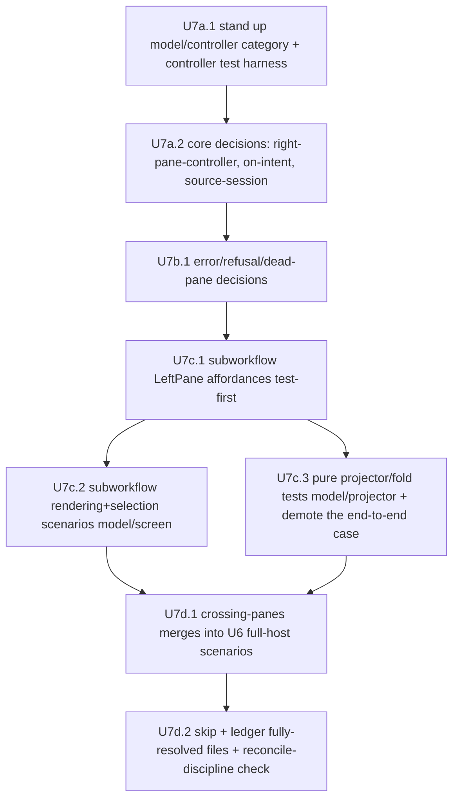

# refactor: Phase 7 (U7) — right-pane-controller, pane-map & subworkflow migration

> **This is the detailed phase plan for parent unit U7** of
> [`2026-06-05-001-refactor-testing-strategy-restructure-plan.md`](2026-06-05-001-refactor-testing-strategy-restructure-plan.md).
> It honours — and must not relitigate — the parent plan's decisions (§3), the
> DSL interfaces (§5), the decision rule (§6), the script ladder (§8), and the
> worked examples (§9). Where this plan adds a new affordance it extends those
> interfaces in their established shape; it does not redesign them.
>
> **North star (inherited):** readability and maintainability over everything. A
> behaviour is written **once** and run at the fidelities its *risk* demands.
> Chrome literals stay co-located on Pane Objects. The migration is a **pruning
> re-derivation**, not a mechanical 1:1 port. The bar is "make the *right* test
> easy to write and the *wrong* test hard to write" — which, for U7, means **not**
> forcing clean controller-decision class tests through a scenario/driver surface
> that adds ceremony and proves nothing extra.

---

## 1. Summary

U7 migrates the **right-pane-controller / pane-map** surface and the
**subworkflow steps-view** surface. The parent plan assigns it one row of the
U5–U9 cluster table (§7): *"`right-pane-controller*` (banner, failure-recovery,
dead-pane, session-lost), `source-session`, `resume-refusal`, `subworkflow`
(boundary, collapse, parallel-suppression)"* with target
*"`model/controller` (+ `full-host:fake-agent` where it crosses panes)."* That
row is the scope; this plan elaborates it into ordered, case-granular work.

**The defining insight — U7 is structurally unlike U5 and U6.** U5 migrated
*left-pane rendering* and U6 migrated *two-pane plumbing*; both re-derived
genuine pane behaviour through the scenario/driver DSL. **U7's ~86 cases across
14 files are overwhelmingly NOT pane-rendering tests.** They are:

1. **Right-pane-controller *decisions*** (≈63 cases): which source/session to
   swap to, banner wire-format, completion-banner suppression, dead-pane
   non-swap, session-lost containment, resume-refusal branch selection, intent
   dispatch. These are tested today as **plain class tests against
   `FakeTmuxService`** — they instantiate `createRightPaneController(...)`, drive
   it, and assert recorded tmux calls and projected controller state. **They
   never read a rendered pane.** By the parent's own triage rule (§6) — *"would
   this test still pass if the visible pane were empty / wrong?"* — the answer is
   **yes**, so they are **not** `screen`/`full-host` rendering tests.
2. **Subworkflow projection / fold logic** (≈11 cases): pure `projectStepsView`
   and `applySubworkflowEvent` row-emission on pure data — pure unit logic.
3. **Subworkflow left-pane rendering & selection** (≈11 cases): boundary-row
   glyphs, depth-overflow gutter collapse, cursor-skips-boundary — genuine
   left-pane `model` (and one `screen` byte twin) material.
4. **A single end-to-end execution case** (parallel-suppression #4) that runs a
   real workflow and asserts lifecycle records on disk — persistence, not
   rendering.

**This produces the one genuine design decision U7 must make, and which the
parent only labels.** The parent says target `model/controller`. The verified
DSL reality (§3.2) is that the `model` driver renders **only** the left-pane
`StepsView` — it has **no right-pane surface and no way to assert
right-pane-controller decisions**. There is no `ControllerApp` in the typed app
surfaces (parent §5.2), and inventing one to wrap `RightPaneController` +
`FakeTmuxService` would add a contrived `scenario(meta, body)` envelope around
tests that are already crisp class tests — the *opposite* of the North Star.

**Resolution (the `tmux-argv` precedent).** The parent already established that a
**category directory can hold plain non-`scenario()` tests**: `tmux-argv` is "a
plain unit test of `RealTmuxService` argv against `FakeProcessService` … it lives
in the taxonomy as a category … but does not use `scenario()`" (parent §5.2; see
`tests-new/tmux-argv/send-keys--escapes-metacharacters.test.ts`, which opens with
exactly that comment). **U7 applies the same pattern to `tests-new/model/controller/`:
plain `createRightPaneController` + `FakeTmuxService` class tests, no `scenario()`.**
This honours the parent's literal `model/controller` directory (§3.2, §4),
honours the decision rule's `unit` row ("isolated class logic, fakes at `*Service`"),
keeps every pane-map test inside the two-pane taxonomy (not bled into the
U10–U13 relocation tree), and avoids building a driver surface the design never
specified.

**Where U7 *does* touch the DSL** is narrow and real:

- **Subworkflow left-pane affordances** on `LeftPane` + both pane drivers
  (boundary rows, depth-collapse gutter, boundary-aware selection) — the only
  net-new DSL work, shipped test-first like U5/U6.
- **`full-host:fake-agent`** is touched **minimally**: most "crosses panes"
  behaviour (source swap shows distinct content) was already re-derived as
  full-host scenarios in **U6** (`nav--enter-swaps-right-pane-to-transcript`,
  `multi-source--each-source-swaps-distinct-content`,
  `replay--revisit-shows-same-transcript`). U7 mostly **`merge`s** its
  crossing-panes cases into those, adding a new full-host scenario only if a
  distinct *visible* right-pane outcome is genuinely uncovered (§7).

Because scope (~86 cases / 14 files) far exceeds the parent's pre-split ceiling
(*"treat any cluster exceeding ~40 old cases or ~15 files as multiple phases …
the split must be expressed in this plan"*), U7 is delivered as **four ordered
sub-phases**:

- **U7a** — `model/controller` category stand-up + core controller decisions
  (`right-pane-controller`, `right-pane-on-intent`, `source-session`).
- **U7b** — `model/controller` error / containment / refusal / dead-pane
  decisions (`banner`, `failure-recovery`, `session-lost`, `interactive-dead-pane`,
  `replay-dead-pane`, `resume-refusal`).
- **U7c** — subworkflow surface: left-pane rendering & selection → `model`
  (+ one `screen` collapse byte twin); pure projection/fold → plain
  `model/projector` tests; the one end-to-end case → `demote→integration`.
- **U7d** — crossing-panes merges into U6's full-host scenarios + the final
  skip/ledger/reconcile-discipline sweep.

Sub-phase IDs (`U7a.1` …) are **plan-local** and distinct from the parent's `U7`.
The case-granular migration ledger is the authoritative per-case record; the
routing table in §4 is this plan's directional commitment.

---

## 2. Problem frame & scope

### 2.1 In scope — the 14 files U7 owns (parent §U7 table row)

**Pane-map controller (`tests/unit/hosts/two-pane/pane-map/`, 9 files, ≈63 cases).**
All currently **plain unit tests** using `FakeTmuxService` (no real tmux):

- `right-pane-controller.test.ts` (≈17) — register/show/unregister, follow-live
  auto-advance, teardown, concurrent-register race.
- `right-pane-controller-banner.test.ts` (4) — `emitBanner` seq/view-mode wire-format,
  `setViewMode`, dismiss-banner.
- `right-pane-controller-failure-recovery.test.ts` (3) — Bug B stderr-bleed,
  Bug C completion-banner suppression.
- `right-pane-controller-interactive-dead-pane.test.ts` (4) — does-not-swap to a
  dead interactive resume pane; surfaces swap failure as an error banner; recovers
  by re-register.
- `right-pane-controller-replay-dead-pane.test.ts` (1) — does-not-swap to a dead
  pane of a torn-down per-source session.
- `right-pane-controller-session-lost.test.ts` (4) — socket-lost containment, no
  ghost map entry, canonical error shape.
- `right-pane-on-intent.test.ts` (≈8) — `onIntent('enter')` path selection
  (live-vs-replay, lookup miss, ANSI-tee preference, auto-advance-stop, interactive
  stays-replay).
- `resume-refusal.test.ts` (≈10) — which refusal text surfaces per
  registry/runner/session-id state; happy path; step-keyed lookup.
- `source-session.test.ts` (≈12) — `sanitizeSessionName` (pure), `createSourceSession`,
  `teardownSourceSession` determinism.

**Subworkflow steps-view (`tests/unit/hosts/two-pane/steps-view/`, 5 files, ≈25 cases).**

- `subworkflow-boundary-projection.test.ts` (≈8) — `projectStepsView` boundary-row
  emission, gutter stacking, deepest-first close, summary-total exclusion.
- `subworkflow-boundary-selection.test.tsx` (6) — ↑/↓ cursor skips boundary rows;
  Enter on boundary is a no-op.
- `subworkflow-collapse.test.tsx` (4) — depth-overflow compact `│N` gutter at
  depth ≥ 4 AND `paneCols < 60`.
- `subworkflow-parallel-suppression.test.ts` (4) — parallel branches suppress sub
  boundary rows (3 pure-projection cases + 1 end-to-end workflow-execution case).
- `applySubworkflowEvent.test.ts` (3) — overlay-fold keying by full subPath,
  `insideParallel` preservation, invalid-event rejection.

### 2.2 Out of scope (explicit non-goals)

- **Per-status colour / failed-glyph / failure-banner** — routed to **U8** by the
  U5 phase summary ("per-status colour … and the failed-glyph/failure-banner cases
  → U8"). U7 does not touch failure rendering.
- **`tui-overlay` parse/serialize and `adaptive-columns` threshold constant** —
  routed to **U10–U13** by the U5 phase summary (pure codec/policy `demote→unit`).
  Note: `right-pane-controller-banner` exercises the overlay *wire-format from the
  controller's side* (what the controller writes) — that is a controller decision
  (U7a/U7b), distinct from the overlay codec's own parse/serialize unit tests
  (U10–U13).
- **Lifecycle process behaviour** (signals, teardown, persisted status) — **U8**.
- Behaviour redesign. No orchestrator behaviour changes; tests only.
- The U10–U13 *relocation targets* for any `demote→integration` case — U7 ledgers
  the demotion and leaves the file LIVE (reconcile rule 3, parent §U14).

### 2.3 The triage filter (parent §6, the north star)

*"Would this test still pass if the visible pane were empty / wrong / unformatted?
If yes, demote or delete."* For U7 this filter is **load-bearing in the opposite
direction from U5/U6**: most U7 cases answer **yes** (they assert controller
*decisions* at the `FakeTmuxService` seam, not pane bytes), which is precisely why
they belong in the non-`scenario()` `model/controller` category rather than being
forced through `full-host` real-tmux scenarios. A test that asserts "controller
did **not** call `swapPane` to a dead pane" proves its point with an empty pane —
it is a decision test, and dressing it as a rendered-pane scenario would make it
slower, flakier, and no more honest.

---

## 3. Inherited decisions & affordance baseline

### 3.1 Decisions carried from the parent (do not relitigate)

| Parent decision | What it means for U7 |
|---|---|
| **D2** skip-as-migrated, keep forever | Old files become unconditional `describe.skip`/`it.skip` + `// MIGRATED → <path>` marker **only once every child case is ledgered** (D15). These files are already plain `describe(...)` (not `skipIf`), so the skip is a straight `describe.skip` flip. |
| **D8** selection by path | New tests live under `tests-new/model/controller/`, `tests-new/model/projector/`, `tests-new/model/`, `tests-new/screen/`, `tests-new/full-host/fake-agent/`. No env-var selection. `model/controller` and `model/projector` run in the **fast** bucket (no tmux). |
| **D9** cassette boundary | Not exercised in U7 (no `recorded-agent` work). |
| **D10** co-located chrome literals | New subworkflow chrome (boundary glyphs, compact `│N` gutter token) is a co-located constant on `LeftPane`, asserted via a semantic method, **never** imported from `src/`, never inline in a scenario. |
| **D11** typed-DSL gate | Every new `LeftPane`/`PaneDriver` affordance is typed so `tsc --noEmit` over `tests-new/` enforces it. `model/controller` plain tests are typechecked the same way (the tree is in `tsconfig` include). |
| **D12** frozen baseline | Every `oldTestRefs` resolves against the **frozen** `baseline.json`; per-case identity (name/line/hash) comes from it, not a live scan. |
| **D15** case-granular ledger | A file is skipped only when **every** child case has a ledger row (`port`/`merge`/`demote`/`drop` + reason). Mixed-disposition files (e.g. `subworkflow-parallel-suppression`: 3 port + 1 demote) stay **LIVE** until the demote target exists. |

### 3.2 DSL affordance baseline (verified in `tests-new/dsl/`)

**Already real (reuse, do not rebuild):**

- `FakeTmuxService` (`src/services/tmux/fake-tmux-service.ts`) — the `*Service`
  fake the old controller tests already use: records tmux calls, models pane
  ownership (`paneIdsForSession`, `markPaneDead`), and socket-lost
  (`markSocketLost`). **`model/controller` tests import it directly**, exactly as
  the old tests do. No new fake.
- `createRightPaneController` (`src/hosts/two-pane/pane-map/index.ts`) — a directly
  instantiable factory. No tmux, no rendering needed to test its decisions.
- `tmux-argv` non-`scenario()` category precedent
  (`tests-new/tmux-argv/*.test.ts`) — the exact pattern `model/controller` follows.
- `LeftPane` (`tests-new/dsl/panes/left-pane.ts`) — rich left-pane semantics
  (selection, glyphs, scroll, help overlay, banners, end-of-run). U7c **extends**
  it with subworkflow affordances; it does not rebuild it.
- `model` driver renders the real `<StepsView>` via the configurable Ink harness
  (`model-ink-harness.ts`) — backs all subworkflow left-pane rendering/selection.
- `full-host:fake-agent` static mode (`createStaticFullHostApp` +
  `createRealTmuxPaneDriver`) with a real `RightPane` over real tmux — already used
  by U6's crossing-panes scenarios.

**Verified absent / cannot be used (the crux):**

- **No right-pane surface on the `model` driver.** `ModelApp` exposes `leftPane`
  only (`tests-new/dsl/app-surfaces.ts`) — no `rightPane`, no controller-decision
  surface. The model driver renders `<StepsView>` (left pane) and nothing else.
  **Right-pane-controller decisions are therefore NOT `model`-scenario material**;
  they are plain `model/controller` class tests (§5.1).
- **`RightPane` is minimal** (`tests-new/dsl/panes/right-pane.ts`:
  `assertShowsContent`, `assertNoCaretEcho` only). U7 adds **no** right-pane
  semantic methods, because U7's right-pane work is decision logic at the fake
  seam (model/controller), not rendered-byte assertions. (If U7d finds a genuinely
  uncovered *visible* right-pane outcome, it adds one semantic method test-first —
  §7 — but the default expectation is `merge` into U6 scenarios.)

**Absent — must be added (the only net-new DSL work, U7c):**

- **Subworkflow left-pane affordances.** No boundary-row, depth-collapse, or
  boundary-aware-selection methods exist on `LeftPane`/`PaneDriver` today. New
  capabilities backed on the `model` pane driver (projected view-model inspection)
  and the real-tmux pane driver (for the one `screen` collapse byte twin), surfaced
  as semantic `LeftPane` methods with co-located chrome literals (boundary glyphs,
  compact `│N` token). Shipped **test-first** with driver-level tests (U7c.1)
  before any scenario consumes them.

---

## 4. The per-case routing table (the spine of this plan)

Directional commitment; the implementing agent finalizes it as case-granular
ledger rows against the **frozen baseline**, applying the triage rule. Glyphs:
**port** = re-derive (as a `model/controller` plain test, a `model`/`screen`
scenario, or a projector test, per target); **merge** = covered by an existing
scenario/test, add `oldTestRefs`; **demote** = wrong category, route out (file
stays LIVE); **drop** = vacuous/never-ran, with reason.

### Sub-phase U7a — controller core decisions → `model/controller` (plain tests)

| Old file (cases) | Risk / category | Target | Disposition |
|---|---|---|---|
| `right-pane-controller.test.ts` (≈17) | register/show/unregister, follow-live precedence, teardown, concurrent-register race — **controller decisions at the `FakeTmuxService` seam** (would pass with empty pane) | `model/controller/right-pane-controller.test.ts` (plain) | **port** the decision cases; **drop** any white-box pane-count invariant already covered by the U2 no-orphans driver regression (with reason); **merge** the visible-swap property into U6 full-host (`oldTestRefs`) — the *decision* (which session) stays here, the *visible swap* is U6 |
| `right-pane-on-intent.test.ts` (≈8) | `onIntent('enter')` path selection (live-vs-replay, lookup miss, ANSI-tee preference, auto-advance-stop, interactive-stays-replay) — **pure dispatch decisions** | `model/controller/right-pane-on-intent.test.ts` (plain) | **port** all (regression pins preserved with their run-ID references) |
| `source-session.test.ts` (≈12) | `sanitizeSessionName` (pure fn), create/teardown determinism — **pure helper logic** | `model/controller/source-session.test.ts` (plain) | **port** all (pure relocation + import fix; pruning only if a case is vacuous) |

### Sub-phase U7b — controller error / refusal / dead-pane decisions → `model/controller`

| Old file (cases) | Risk / category | Target | Disposition |
|---|---|---|---|
| `right-pane-controller-banner.test.ts` (4) | banner seq monotonicity, view-mode ordering, dismissal — **controller wire-format decision** (what it writes to the overlay) | `model/controller/right-pane-controller-banner.test.ts` (plain) | **port** all (distinct from the overlay *codec* tests, which are U10–U13) |
| `right-pane-controller-failure-recovery.test.ts` (3) | Bug B stderr-bleed, Bug C completion-banner suppression — **error-containment decisions** | `model/controller/right-pane-controller-failure-recovery.test.ts` (plain) | **port** all (regression pins) |
| `right-pane-controller-session-lost.test.ts` (4) | socket-lost containment, no ghost entry, canonical error shape — **error-containment decisions** | `model/controller/right-pane-controller-session-lost.test.ts` (plain) | **port** all (regression pin r-2026-05-22) |
| `right-pane-controller-interactive-dead-pane.test.ts` (4) | does-not-swap to a dead pane (asserted via `liveOwnedPanes`), surfaces swap-failure as error banner, recovers by re-register — **controller decisions at the fake's ownership seam** (passes with empty pane) | `model/controller/right-pane-controller-interactive-dead-pane.test.ts` (plain) | **port** all (regression pin r-2026-05-25). *Note: these are decisions, NOT full-host — the risk is "did the controller decide not to swap", assertable at the fake seam* |
| `right-pane-controller-replay-dead-pane.test.ts` (1) | does-not-swap to a dead pane of a torn-down session — **same decision class** | `model/controller/right-pane-controller-replay-dead-pane.test.ts` (plain) | **port** (regression pin Issue 3) |
| `resume-refusal.test.ts` (≈10) | which refusal text per registry/runner/session-id state; happy path; step-keyed lookup — **branch-selection decisions** | `model/controller/resume-refusal.test.ts` (plain) | **port** all (R8–R11, F6 regression pins) |

### Sub-phase U7c — subworkflow surface → `model` / `screen` / `model/projector`

| Old file (cases) | Risk / category | Target | Disposition |
|---|---|---|---|
| `subworkflow-boundary-projection.test.ts` (≈8) | `projectStepsView` row emission, gutter stacking, deepest-first close, summary-total exclusion — **pure projection logic on pure data** | `model/projector/subworkflow-boundary-projection.test.ts` (plain projector test) | **port** the pure-data invariants; for any case whose *risk* is that the boundary row visibly renders, add a `model` scenario twin (boundary glyph appears in the painted StepsView) |
| `subworkflow-collapse.test.tsx` (4) | depth-overflow compact `│N` gutter at depth ≥ 4 AND `paneCols < 60` — **genuine left-pane rendering at width/depth** | `model/subworkflow--collapse-gutter.test.ts` scenario (+ **one `screen` byte twin** for the compact-token bytes, `overlapGroup: 'subworkflow-collapse'`) | **port** — requires new `LeftPane` collapse affordance (U7c.1) |
| `subworkflow-boundary-selection.test.tsx` (6) | ↑/↓ cursor skips boundary rows; Enter on boundary is no-op — **selection decisions** | `model/subworkflow--selection-skips-boundaries.test.ts` scenario | **port** the decision cases (selection lands on selectable; Enter emits no intent); **drop/merge** any case the explorer flagged vacuous that is already covered by U5 selection scenarios (with reason) — requires boundary-aware selection affordance (U7c.1) |
| `subworkflow-parallel-suppression.test.ts` (4) | 3 pure-projection suppression cases + 1 end-to-end workflow-execution case (asserts lifecycle records on disk) | `model/projector/subworkflow-parallel-suppression.test.ts` (3) **+** `→ U10–U13` for the end-to-end case | **port** the 3 projection cases; **demote→integration** the end-to-end case; **file stays LIVE** until U10–U13 relocates the execution assertion |
| `applySubworkflowEvent.test.ts` (3) | overlay-fold keying by full subPath, `insideParallel` preservation, invalid-event rejection — **pure fold logic** | `model/projector/applySubworkflowEvent.test.ts` (plain) | **port** all (pure relocation + import fix) |

### Sub-phase U7d — crossing-panes merges + skip / ledger / reconcile sweep

| Work | Disposition |
|---|---|
| The "crosses panes" visible-swap properties from `right-pane-controller.test.ts` / `right-pane-on-intent.test.ts` | **merge** — add `oldTestRefs` to U6's existing `nav--enter-swaps-right-pane-to-transcript`, `multi-source--each-source-swaps-distinct-content`, `replay--revisit-shows-same-transcript` full-host scenarios. Add a **new** `full-host:fake-agent` scenario only if §7 discovery finds a distinct visible right-pane outcome genuinely uncovered. |
| Skip + ledger every fully-resolved U7 file; leave mixed/demote-LIVE files live | **skip** the `port`/`merge`/`drop`-complete files with `// MIGRATED →` markers; **leave LIVE** `subworkflow-parallel-suppression` (has the one demoted case). |

**Outcome of §4.** Files **fully skipped in U7** (every case `port`/`merge`/`drop`):
all 9 pane-map files, `subworkflow-boundary-projection`,
`subworkflow-boundary-selection`, `subworkflow-collapse`, `applySubworkflowEvent`.
Files **left LIVE** (mixed disposition with a not-yet-existing demote target):
`subworkflow-parallel-suppression`. This mirrors U5/U6's honest "left in-scope
files LIVE rather than skip with un-relocated children."

---

## 5. High-level technical design (directional)

> *Directional guidance for review — not implementation specification. The
> implementing phase refines names/shapes in its detailed ledgering where reality
> demands, honouring the parent §5 interfaces.*

### 5.1 `model/controller` as a non-`scenario()` category (the core decision)

Right-pane-controller tests instantiate the controller directly and assert its
decisions at the `FakeTmuxService` seam. They map **1:1** onto the `tmux-argv`
precedent — a category directory of plain `it()` tests, no `scenario()`, no
driver. The shape, mirroring `tests-new/tmux-argv/send-keys--escapes-metacharacters.test.ts`:

```ts
// tests-new/model/controller/right-pane-on-intent.test.ts  (directional)
import { describe, expect, it } from 'bun:test'
import { FakeTmuxService } from '../../../src/services/tmux/fake-tmux-service.ts'
import { createRightPaneController } from '../../../src/hosts/two-pane/pane-map/index.ts'

// `model/controller` is a CATEGORY, not a `scenario()`: the model driver renders
// only the left-pane StepsView, so right-pane-controller DECISIONS are asserted
// directly against the controller + FakeTmuxService seam (no tmux, no rendering).
// This is the same pattern as `tmux-argv`. The triage rule confirms it: these
// pass with an empty pane — the risk is the decision, not the bytes.

describe('RightPaneController.onIntent(enter)', () => {
  it('swaps to live, not replay, for a still-running step', () => {
    const tmux = new FakeTmuxService()
    const controller = createRightPaneController({ tmux, /* … */ })

    controller.onIntent({ type: 'enter', stepName: 'execute' })

    expect(tmux.lastSwap()).toMatchObject({ stepName: 'execute', mode: 'live' })
  })
})
```

**Why not a `ControllerApp` scenario surface?** Three reasons, all from the North
Star: (1) the parent §5.2 typed app surfaces define no controller surface, and
adding one is a redesign this plan must not make; (2) the model driver cannot back
it (no right-pane rendering); (3) wrapping a crisp `expect(tmux.lastSwap())…` in a
`scenario(meta, async (app) => …)` envelope adds ceremony and proves nothing the
direct assertion doesn't. The category directory **is** the taxonomy slot; the
plain test **is** the readable form.

**Test-infra note.** These are **relocation-with-pruning**, not re-derivation: the
old assertions are already at the right seam. The implementer copies the test
into `model/controller/`, fixes import depth (`../../../src/…`), applies the
triage rule (drop vacuous, merge duplicates, preserve regression-pin run-IDs as
comments), and ledgers each case. The **import-path parity discipline** from
U10–U13 (parent R10) applies: a wrong `../` count silently misresolves; the
implementer confirms each relocated file imports the *same `src/` symbols* as its
baseline original.

### 5.2 Subworkflow left-pane affordances (the only net-new DSL work)

Two genuinely-new left-pane rendering behaviours need affordances, in the
established `PaneDriver` → `LeftPane` layering with co-located chrome:

```ts
// PaneDriver (driver-facing capability seam) — new methods
assertSubworkflowBoundary(label: string, kind: 'enter' | 'exit'): Promise<void>
assertCollapsedGutter(step: string, depth: number): Promise<void>   // the compact │N token
// (selection already exists; boundary-skip reuses selectStep/browseTo + a new assertion)
assertSelectableSkipsBoundary(from: string, dir: 'up' | 'down', lands: string): Promise<void>

// LeftPane (semantic, driver-independent) — co-located chrome literals
private static readonly SUBWORKFLOW = {
  enterGlyph: '▼', exitGlyph: '✓', compactGutter: '│',   // exact copy quoted from src/ render
} as const
assertSubworkflowBoundaryVisible(label, kind) / assertCollapsedGutter(step, depth)
assertSelectionSkipsBoundary(from, dir, lands)
```

Backed on the `model` pane driver (projected view-model inspection — the bulk) and
the real-tmux pane driver (for the **single** `screen` collapse byte twin under
`overlapGroup: 'subworkflow-collapse'`). The compact `│N` token is a *rendering*
risk (does the gutter survive at depth ≥ 4 AND width < 60) — exactly the kind of
"does it paint" question that earns one `screen` twin. Boundary-row projection and
selection-skip are *decisions* — `model` only. **Shipped test-first** with
driver-level tests (U7c.1) before any scenario.

### 5.3 Pure projector / fold tests → `model/projector`

`projectStepsView` boundary emission, parallel suppression (the 3 pure cases), and
`applySubworkflowEvent` are pure functions on pure data — no Ink, no tmux. They go
in `tests-new/model/projector/` as plain tests (the parent's named `model/projector`
subdir, §4 output structure), the same non-`scenario()` shape as `model/controller`.
The triage rule keeps them honest: a pure row-ordering invariant *is* a unit test;
it does not become a rendered scenario.

### 5.4 Sub-phase dependency graph



---

## 6. Implementation units

> **Autonomous execution protocol (parent §7).** Load `phase-implementer` + read
> the parent plan and the spec. For `model/controller` and `model/projector`,
> the work is relocation-with-pruning of plain class tests (write the relocated
> test, prune per triage, ledger each case). For subworkflow rendering, write the
> **driver-level affordance test first**, then the scenario. Update
> `tests-new/_migration/ledger.md` per old case touched. Wrap an old file `.skip`
> with a `// MIGRATED → <path>` marker only once **every** child case is ledgered
> (D15); never delete an old test. Keep the blocking overlap report and
> `bun run check` green at every unit boundary.

### Sub-phase U7a — controller core decisions → `model/controller`

#### U7a.1 — Stand up the `model/controller` category + controller test harness

**Goal.** Establish `tests-new/model/controller/` as a non-`scenario()` category
(the `tmux-argv` precedent), with a small shared helper for building a
`createRightPaneController` + `FakeTmuxService` fixture, and a header-comment
convention explaining why these are plain tests.

**Requirements.** Parent §5.2 (`tmux-argv` precedent), §6 (decision rule `unit`
row + triage); D8, D11. Resolves the parent's `model/controller` label (§3.2, §4).

**Dependencies.** None (first U7 unit).

**Files.**
- `tests-new/model/controller/_support.ts` (or inline) — a minimal factory that
  wires `createRightPaneController` to a fresh `FakeTmuxService` and any overlay
  temp-file scaffolding the old tests used (reuse `tests-new/_support/` temp-dir
  helpers; do **not** import from `tests/`).
- `tests-new/model/controller/README` note **or** a header comment block — the
  "this is a CATEGORY, not a `scenario()`" rationale, mirroring
  `tests-new/tmux-argv/send-keys--escapes-metacharacters.test.ts`.

**Approach.** Read one old pane-map test to capture the exact controller
construction (options shape, overlay-path wiring, fake setup). Extract the
repeated setup into a tiny local helper so each relocated file reads as
Arrange-Act-Assert sentences (CLAUDE.md rule 4). No `scenario()`, no driver.

**Test scenarios.** *Test expectation: none for the helper itself beyond being
consumed by U7a.2 — it is scaffolding. The first relocated test (U7a.2) is its
proof.*

**Verification.** `bun run typecheck` green with the new category present;
`bun run test:two-pane:fast` discovers `model/controller/` (the bucket already
globs `tests-new/model`) and boots no tmux.

---

#### U7a.2 — Core controller decisions (`right-pane-controller`, `on-intent`, `source-session`)

**Goal.** Relocate-with-pruning the three core files into `model/controller/`.

**Requirements.** Parent §6; D2, D12, D15; import-path parity discipline (R10).

**Dependencies.** U7a.1.

**Files.**
- `tests-new/model/controller/right-pane-controller.test.ts`
- `tests-new/model/controller/right-pane-on-intent.test.ts`
- `tests-new/model/controller/source-session.test.ts`
- `tests-new/_migration/ledger.md` — rows for all three files' cases.

**Approach.** Per §5.1: copy each old test, fix import depth, apply triage. For
`right-pane-controller.test.ts`, **drop** any white-box pane-count invariant that
the U2 no-orphans driver regression already guarantees (ledger the drop with that
reason), and **merge** the visible-swap property into U6's full-host scenarios via
`oldTestRefs` (the *decision* — which session — stays here). Preserve every
regression-pin run-ID (`r-2026-05-11-…`, `r-2026-05-27-…`) as a comment.

**Test scenarios.**
- `Covers right-pane-controller decisions.` register/show/unregister and
  follow-live precedence assert the correct `FakeTmuxService` calls; concurrent
  register chains dst correctly. *(decision)*
- `Covers right-pane-on-intent.` enter on a running step → live not replay; lookup
  miss → no-op; ANSI-tee preferred for autonomous replay; auto-advance stops after
  opening an earlier step; interactive re-enter stays replay. *(decision, regression pins)*
- `Covers source-session.` `sanitizeSessionName` colon/dot/whitespace mappings,
  truncation+hash-suffix collision avoidance; create issues one `createSession`,
  never `splitPane`; teardown clears the ownership table. *(pure unit)*

**Verification.** `bun run test:two-pane:fast` green (incl. the new
`model/controller` tests); `bun run typecheck` green; each relocated file imports
the **same `src/` symbols** as its baseline original; ledger rows complete.

---

### Sub-phase U7b — controller error / refusal / dead-pane decisions → `model/controller`

#### U7b.1 — Error-containment, refusal, and dead-pane decisions

**Goal.** Relocate-with-pruning the six error/refusal/dead-pane files into
`model/controller/`.

**Requirements.** Parent §6; D2, D12, D15.

**Dependencies.** U7a.2 (shared category + helper).

**Files.**
- `tests-new/model/controller/right-pane-controller-banner.test.ts`
- `tests-new/model/controller/right-pane-controller-failure-recovery.test.ts`
- `tests-new/model/controller/right-pane-controller-session-lost.test.ts`
- `tests-new/model/controller/right-pane-controller-interactive-dead-pane.test.ts`
- `tests-new/model/controller/right-pane-controller-replay-dead-pane.test.ts`
- `tests-new/model/controller/resume-refusal.test.ts`
- `tests-new/_migration/ledger.md` — rows for all six files' cases.

**Approach.** Same relocation-with-pruning. The dead-pane files assert
"controller did **not** swap to a dead pane" via the fake's `liveOwnedPanes` /
`markPaneDead` ownership model — these are **decisions**, kept here, **not**
full-host (§2.3). The banner file tests the controller's *wire-format decision*
(seq/view-mode/dismissal it writes) — distinct from the overlay codec's
parse/serialize (U10–U13); ledger the boundary explicitly. Preserve all
regression-pin run-IDs and the R8–R11/F6 refusal-branch identifiers.

**Test scenarios.**
- `Covers right-pane-controller-banner.` monotonic seq; view-mode preserved across
  emit; dismissal writes null snapshot; no-op when overlay path omitted. *(decision)*
- `Covers failure-recovery.` no stderr.write on dispatch failure (Bug B); banner
  still surfaces on session-create failure; `suppressCompletionBanner` skips the
  completion banner but still flips view-mode (Bug C). *(decision, regression pins)*
- `Covers session-lost.` register/unregister after socket loss contains the error
  (no stderr bleed, no ghost map entry); canonical macOS error shape. *(decision, regression pin)*
- `Covers interactive-dead-pane.` does-not-swap to a dead interactive resume pane;
  surfaces swap failure as an error banner; does-not-swap on follow-live; recovers
  by re-register. *(decision, regression pin r-2026-05-25)*
- `Covers replay-dead-pane.` does-not-swap to the dead pane of a torn-down
  per-source session. *(decision, regression pin Issue 3)*
- `Covers resume-refusal.` each of the R8–R11 branches surfaces its distinct
  refusal text; the three `sessionIdCaptureError` variants are distinguished;
  happy path spawns without a refusal file; step-keyed lookup resolves
  same-named runners (F6). *(decision, branch coverage)*

**Verification.** `bun run test:two-pane:fast` green; `bun run typecheck` green;
same-`src`-symbol parity holds; ledger rows complete.

---

### Sub-phase U7c — subworkflow surface → `model` / `screen` / `model/projector`

#### U7c.1 — Subworkflow `LeftPane` affordances (test-first)

**Goal.** Add boundary-row, depth-collapse-gutter, and boundary-aware-selection
capabilities to the DSL so the subworkflow rendering/selection behaviours are
expressible, backed on the `model` and real-tmux pane drivers, with driver-level
tests proving each before any scenario consumes it.

**Requirements.** Parent §5.5, §6; D10, D11. Closes the U5b-deferred subworkflow
boundary/selection concerns.

**Dependencies.** None strictly (can run after U7b); kept here so the subworkflow
scenarios that depend on it land together.

**Files.**
- `tests-new/dsl/panes/pane-driver.ts` — add `assertSubworkflowBoundary`,
  `assertCollapsedGutter`, `assertSelectableSkipsBoundary` (names directional).
- `tests-new/dsl/panes/left-pane.ts` — semantic wrappers + co-located
  `SUBWORKFLOW` chrome literal (enter/exit glyphs, compact `│` token) **quoted from
  the `src/` steps-view render, never imported**.
- `tests-new/dsl/drivers/model-driver.ts` (+ its pane driver) — model-side impl
  (projected view-model inspection).
- `tests-new/dsl/drivers/real-tmux-pane-driver.ts` — byte-capture impl for the
  `screen` collapse twin.
- `tests-new/dsl/drivers/__tests__/model-driver.test.ts` and the real-tmux pane
  driver test — **new driver-level tests** for boundary/collapse/selection-skip.
- `tests-new/dsl/__tests__/scenario.test-d.ts` — extend negative type tests if the
  surface adds a driver-family-specific method.

**Approach.** Find the subworkflow boundary + collapse render in
`src/hosts/two-pane/steps-view/**` (the projector's boundary rows and the
`paneCols < 60` / depth ≥ 4 compact-gutter branch). The co-located `SUBWORKFLOW`
literal is an **independent** spec of the glyphs/token — it goes red on a
production wording change. Model driver asserts the controller projected the
boundary/collapse; the real-tmux pane driver captures the compact-token bytes for
the one `screen` twin.

**Test scenarios (driver-level).**
- `assertSubworkflowBoundary('child-sub', 'enter')` passes when the projected
  view-model contains the enter boundary row. *(happy)*
- `assertCollapsedGutter(step, 4)` passes at width 50 / depth 4 and the chrome
  literal is co-located (changing the constant to a wrong token turns the
  assertion red — meta-test). *(critical, D10)*
- `assertSelectableSkipsBoundary('live', 'up', 'parent-A')` confirms the cursor
  lands on the selectable row, skipping the boundary. *(decision)*
- On the real-tmux pane driver, the compact `│N` token bytes are captured at
  width 50. *(integration)*
- `teardown()` after these reads leaves no fixture residue. *(edge)*

**Verification.** `bun run typecheck` green with the new typed surface;
`bun run test:two-pane:fast` (model driver test) and `:screen` (real-tmux pane
driver test) green; no scenario consumes the affordance yet.

---

#### U7c.2 — Subworkflow rendering & selection scenarios (`model` + one `screen` twin)

**Goal.** Re-derive `subworkflow-collapse` and `subworkflow-boundary-selection`
(and any boundary-*rendering* cases from `subworkflow-boundary-projection`) as
`model` scenarios, with one `screen` byte twin for the compact gutter.

**Requirements.** Parent §6, §9.2/§9.4 shape; D10.

**Dependencies.** U7c.1.

**Files.**
- `tests-new/model/subworkflow--collapse-gutter.test.ts` (+ a `screen` twin
  `tests-new/screen/subworkflow--collapse-gutter-bytes.test.ts`, `overlapGroup:
  'subworkflow-collapse'`).
- `tests-new/model/subworkflow--selection-skips-boundaries.test.ts`
- `tests-new/_migration/ledger.md` — rows for `subworkflow-collapse`,
  `subworkflow-boundary-selection`, and the rendering subset of
  `subworkflow-boundary-projection`.

**Approach.** **collapse**: `model` scenario asserts the compact `│N` gutter at
depth ≥ 4 / width < 60 and the stacked-bar form at width 80 / depth 3 (both
conditions required); the `screen` twin asserts the compact-token *bytes* survive
real tmux. **selection-skip**: `model` scenario — ↑/↓ skips boundary rows and
lands on selectable; Enter on a boundary emits no intent; **drop/merge** any case
already covered by U5 selection scenarios (with reason — these were flagged
partly vacuous). Use co-located chrome from U7c.1.

**Test scenarios.**
- `Covers subworkflow-collapse.` compact `│4 ` token at width 50 / depth 4;
  stacked-bar at width 80 even at depth 4; stacked-bar at depth 3 / width 50
  (both conditions). *(rendering; screen twin asserts bytes)*
- `Covers subworkflow-boundary-selection.` ↑ from the live row skips the exit row
  and lands on a selectable; Enter on a boundary emits no intent; an all-boundary
  pane reports no selection. *(decision)*
- Boundary-*rendering* cases from `-projection`: the ▼/✓ boundary rows appear in
  the painted StepsView between parents. *(rendering)*

**Verification.** `:two-pane:fast` + `:screen` green; the blocking overlap report
green for `subworkflow-collapse` (model has its screen twin); ledger rows complete.

---

#### U7c.3 — Pure projector / fold tests → `model/projector` + demote the end-to-end case

**Goal.** Relocate the pure projection/fold cases as plain `model/projector` tests;
demote the one end-to-end execution case to integration (U10–U13).

**Requirements.** Parent §6 triage rule; D2, D12, D15; reconcile rule 3.

**Dependencies.** U7c.1 (so the rendering subset is already routed; the rest is pure).

**Files.**
- `tests-new/model/projector/subworkflow-boundary-projection.test.ts` (pure-data
  invariants not covered by the U7c.2 rendering twin).
- `tests-new/model/projector/subworkflow-parallel-suppression.test.ts` (the 3 pure
  suppression cases).
- `tests-new/model/projector/applySubworkflowEvent.test.ts`
- `tests-new/_migration/ledger.md` — rows for the three files; the
  `parallel-suppression` end-to-end case as `demote→integration`.

**Approach.** Plain relocation + import fix for the pure functions (the
`model/projector` category is non-`scenario()`, like `model/controller`). The
gutter-stacking / deepest-first-close / summary-total-exclusion invariants are
pure-data assertions on `projectStepsView`. The end-to-end
`parallel-suppression` case (runs a real `parallel()` workflow and asserts
lifecycle records on disk) is **persistence/execution, not rendering** — ledger it
`demote→integration` and **leave `subworkflow-parallel-suppression` LIVE** (its
demote target lands in U10–U13; reconcile rule 3 forbids a `// MIGRATED →` marker
to a not-yet-existing target).

**Test scenarios.**
- `Covers subworkflow-boundary-projection (pure).` gutter columns stack additively
  across nested subs; deepest-first close; boundary rows excluded from end-of-run
  totals; sibling same-leaf subs kept separate by full path. *(pure unit)*
- `Covers subworkflow-parallel-suppression (pure).` sub boundary rows suppressed
  for sub-of-parallel and transitively for sub-of-sub-inside-parallel; sequential
  subs outside parallel are NOT suppressed (negative control). *(pure unit)*
- `Covers applySubworkflowEvent.` keys sibling nested subs by full subPath;
  preserves `insideParallel`; rejects invalid events without mutating the overlay.
  *(pure unit)*

**Verification.** `:two-pane:fast` green (the new `model/projector` tests run with
no tmux); `bun run typecheck` green; ledger rows complete; the end-to-end case
recorded `demote→integration` and its file left LIVE.

---

### Sub-phase U7d — crossing-panes merges + skip / ledger / reconcile sweep

#### U7d.1 — Crossing-panes merges into U6's full-host scenarios

**Goal.** Account for the "crosses panes" visible-swap properties by merging into
U6's existing full-host scenarios; add a new full-host scenario only if §7
discovery finds a genuinely uncovered visible right-pane outcome.

**Requirements.** Parent §6 ("+ full-host where it crosses panes"); D12, D15.

**Dependencies.** U7a.2, U7b.1 (the decisions whose *visible* twin merges here).

**Files.**
- `tests-new/_migration/ledger.md` — `merge` rows adding `oldTestRefs` to U6's
  `nav--enter-swaps-right-pane-to-transcript`,
  `multi-source--each-source-swaps-distinct-content`,
  `replay--revisit-shows-same-transcript`.
- *(Only if §7 discovery requires)* one new
  `tests-new/full-host/fake-agent/<case>.test.ts` + a co-located `RightPane`
  semantic affordance shipped test-first.

**Approach.** For each controller-decision case whose *visible* counterpart is
"the swapped content actually appears in the right pane," confirm a U6 full-host
scenario already proves it and add `oldTestRefs` rather than authoring a duplicate.
Author a new scenario **only** when a distinct visible outcome (per the triage
rule) is uncovered — the default expectation is zero new full-host scenarios.

**Test scenarios.** *Test expectation: none beyond any single new scenario — this
unit is primarily `oldTestRefs` accounting. If a new scenario is authored, it
follows the §9.5 worked-example shape with a test-authored content marker via the
escape hatch.*

**Verification.** Overlap report green; every merged `oldTestRef` resolves against
the frozen baseline; `bun run check` green.

---

#### U7d.2 — Skip + ledger fully-resolved files + reconcile-discipline check

**Goal.** Wrap every fully-resolved U7 old file in unconditional `.skip` with
`// MIGRATED →` markers; confirm the demote-LIVE discipline holds.

**Requirements.** D2, D15; reconcile rules 1–3.

**Dependencies.** U7a.2, U7b.1, U7c.2, U7c.3, U7d.1.

**Files (modify, `.skip` only).**
- The 9 pane-map files, `subworkflow-boundary-projection`,
  `subworkflow-boundary-selection`, `subworkflow-collapse`,
  `applySubworkflowEvent` → `describe.skip` + `// MIGRATED → <path(s)> — parent U7.`
- Leave `subworkflow-parallel-suppression` **LIVE** (has the demoted end-to-end case).

**Approach.** Skip only files whose every case is `port`/`merge`/`drop` within U7.
These old files are plain `describe(...)` blocks (not `skipIf`), so the flip is a
straight `describe.skip`. Confirm every child case has a ledger row first (D15).
Re-run the blocking overlap report and confirm: every U7 `oldTestRef` resolves; no
skipped file points to a non-existent target; `subworkflow-parallel-suppression`
remains LIVE.

**Test scenarios.**
- A spot-check that `subworkflow-parallel-suppression` is **still LIVE** and not
  skipped (guards reconcile rule 3). *(critical, discipline)*
- *Test expectation otherwise: none — `.skip`/marker edits; the gate + overlap
  report are the verification.*

**Verification.** `bun run check` green; `bun run test:two-pane` green; overlap
report green and **blocking**; the U7 ledger section is complete with a disposition
+ reason for every in-scope case; `subworkflow-parallel-suppression` remains LIVE.

---

## 7. Execution-time discovery (deferred, not pretended-resolved)

These depend on touching real code and are resolved during implementation, not in
this plan:

- **Exact `createRightPaneController` options + overlay wiring** the old tests
  construct — read one pane-map test and the controller factory before authoring
  the U7a.1 helper. Confirm the overlay temp-file scaffolding has a `_support/`
  equivalent (no import from `tests/`).
- **Which `right-pane-controller.test.ts` cases are visible-swap `merge`s vs
  decision `port`s.** Decide per case against U6's live full-host scenarios; only a
  genuinely-uncovered visible outcome earns a new full-host scenario (U7d.1).
- **Exact subworkflow boundary/collapse render location & chrome copy** in
  `src/hosts/two-pane/steps-view/**` for the co-located `SUBWORKFLOW` literal
  (U7c.1) — including the precise `paneCols < 60` / depth ≥ 4 branch constants.
- **Which `subworkflow-boundary-selection` cases are decisions vs vacuous** —
  several were flagged as potentially covered by U5 selection scenarios; decide
  `port` vs `merge`/`drop` per case against the live U5 scenarios.
- **Whether `subworkflow-boundary-projection` has any case whose risk is genuinely
  *that the row renders*** (→ a `model` scenario twin in U7c.2) vs pure-data
  ordering (→ `model/projector` in U7c.3). Triage per case.
- **The `demote→integration` target shape** for the end-to-end parallel-suppression
  case — recorded as a ledger note; the actual relocation is U10–U13.

---

## 8. Risks & mitigations

| Risk | Likelihood | Mitigation |
|---|---|---|
| **U7-R1 — Over-engineering: forcing controller-decision class tests through a `scenario()`/driver surface.** The parent's `model/controller` label invites inventing a `ControllerApp`. | **High** | §5.1 fixes the target as a **non-`scenario()` category** (the verified `tmux-argv` precedent): plain `createRightPaneController` + `FakeTmuxService` tests. The model driver provably cannot render the right pane, so a controller scenario surface is both unbacked and ceremonial. This is the biggest design risk and is resolved up front. |
| **U7-R2 — Mis-routing dead-pane cases to `full-host`.** They "depend on the fake's pane-ownership model," tempting a real-tmux re-derivation. | Medium | §2.3 + §4: the *risk* is the controller's *decision* not to swap to a dead pane, asserted at the `FakeTmuxService` ownership seam (passes with an empty pane). They are `model/controller` decisions, not full-host. |
| **U7-R3 — Relocation silently misresolves imports** (`../../../../src` → `../../../src` depth change across the move). | Medium | The U10–U13 import-path parity discipline (parent R10) applies: each relocated file must import the **same `src/` symbols** as its baseline original; `bun run typecheck` + a same-symbol check, not just "gate green." |
| **U7-R4 — Skipping a mixed-disposition file before its demote target exists** (`subworkflow-parallel-suppression`, reconcile rule 3). | Medium | U7c.3/U7d.2 keep it **LIVE**; only `port`/`merge`/`drop`-complete files are skipped; U7d.2 spot-checks it remains live. |
| **U7-R5 — Subworkflow affordance regresses left-pane rendering** (net-new chrome on two drivers). | Medium | U7c.1 ships **driver-level tests first** (boundary/collapse/selection-skip) on both `model` and real-tmux before any scenario; co-located chrome literal (D10) catches production typos. |
| **U7-R6 — Partial-file skip (D15 green-but-incomplete).** A multi-case controller file skipped after porting a subset. | Low | Case-granular ledger keyed to the frozen baseline; skip only when every baseline case for the file has a row; the overlap report resolves each `oldTestRef`. |
| **U7-R7 — Losing a regression pin** in the pruning (the controller files carry run-ID-anchored bug fixes). | Medium | Every regression-pin run-ID (`r-2026-05-…`, Issue 3, R8–R11, F6, Bug B/C) is preserved as a comment on the relocated case; the triage rule prunes *vacuous* and *duplicate* cases, never a regression pin. |
| **U7-R8 — Boundary confusion between the controller's banner *wire-format decision* and the overlay *codec* tests** (U10–U13). | Low | §2.2 + §4 fix the split explicitly: the controller's "what it writes to the overlay" is U7b; the overlay's own parse/serialize is U10–U13. Ledger the boundary. |

---

## 9. Definition of Done (U7)

- Every in-scope case (§2.1) has a ledger row with a disposition + reason, keyed to
  the **frozen baseline**.
- Right-pane-controller decisions live in `tests-new/model/controller/` as plain,
  non-`scenario()` class tests (the `tmux-argv` precedent), fakes at the
  `FakeTmuxService` seam; pure projector/fold tests live in
  `tests-new/model/projector/`.
- The subworkflow rendering/selection affordance is typed, driver-level-tested on
  `model` + real-tmux, and consumed by `model` scenarios with one `screen` collapse
  byte twin under `overlapGroup: 'subworkflow-collapse'`.
- Crossing-panes visible outcomes are `merge`d into U6's full-host scenarios via
  `oldTestRefs` (new full-host scenarios only where §7 found a genuinely uncovered
  visible outcome).
- The blocking overlap report is green for every U7 group and resolves every U7
  `oldTestRef`.
- Files whose every case is `port`/`merge`/`drop` are unconditional `.skip` with
  `// MIGRATED →` markers; `subworkflow-parallel-suppression` remains **LIVE** (its
  one end-to-end case is `demote→integration` for U10–U13).
- New tests green at their levels: `bun run test:two-pane:fast` (the bulk —
  `model/controller`, `model/projector`, `model` scenarios) and `:screen` (the one
  collapse twin), under the §D6/D14 concurrency ceiling.
- Each relocated file imports the **same `src/` symbols** as its baseline original
  (import-path parity).
- `bun run check` green (modulo the pre-existing 5 `ENOENT` fixture failures under
  gitignored `.orch/` noted in U4/U5/U6 — unrelated to this phase).
- `bun run typecheck` green with the new typed subworkflow surface.
