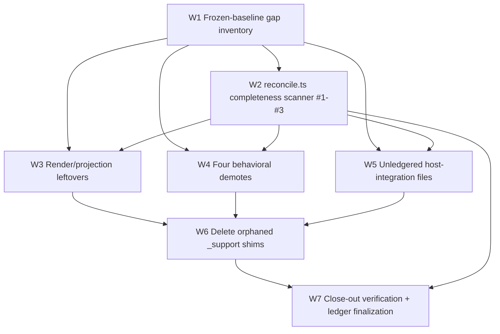

# refactor: Phase 14 — group-B closeout

> **Scope of this plan: Phase 14 only.** It elaborates the *group-B closeout* that
> the parent plan recommends in prose ("a group-B closeout phase between U13 and
> U14", parent §9 / ledger "Open accounting gap") but never numbered or detailed.
> Per Phase 13's own handoff ("the migration is **not** ready for U14
> reconciliation yet … these need a group-B closeout phase"), this is the genuine
> next phase. The parent plan's **U14 reconciliation is already spelled out in
> adequate detail** (parent §7 "Phase group D", §8 script ladder, §10 R13) — so it
> is **deliberately left as Phase 15**, not re-planned here. See *Scope boundaries*.

---

## 1. Summary

The strangler migration relocated/re-derived the whole `tests/` tree into
`tests-new/` across Phases 1–13. Phase 13 drained the last *relocatable* clusters
but, by design (D1/R3 forbid a relocation from re-deriving), left a set of
still-**LIVE** old two-pane / lifecycle test files un-`.skip`'d and — for many —
**un-ledgered**. The parent plan's U14 reconciliation check is built to fail
loudly on exactly these: against the **frozen U1 baseline** (D12) it will flag
every baseline `test` case whose owning file is not unconditionally `.skip` and
not `drop`-ledgered.

**Phase 14's job is to drive that gap to zero** — apply the two-pane triage rule
(parent §6) to every still-live old group-B case, give each a final disposition
(`skip-as-covered` / `re-derive` / `demote-relocate` / `drop`), author the minimum
genuinely-missing scenarios, ledger every case at case granularity, delete the now-
orphaned `_support` shims, and prove completeness with a frozen-baseline scanner.

**This phase is owned by a group-B-literate agent** that loads the two-pane
scenario/driver DSL (`tests-new/dsl/`) — *not* the relocation recipe (U10–U13). It
adds **no `src/` change** (it is test-only, mirroring U4–U9).

### Why this is bigger than the ledger's prose claims (motivating evidence)

The ledger's "Open accounting gap" section optimistically enumerates a small
"(a)+(b)" set. Reality, measured on the current tree:

- **355 old test files; 297 carry a `.skip`; ~58 are still LIVE.**
- A sample of LIVE files — `selection-tracks-view.test.tsx`, `header-rerender.test.tsx`,
  `two-pane-mocked.test.ts`, `right-pane-replay.integration.test.ts`,
  `lifecycle-choreographer.test.ts`, `replay-transcript.test.ts` — have **zero**
  references anywhere in `ledger.md`. They are not "kept LIVE with cases ledgered"
  (the D15 pattern); they are **wholly unaccounted**.

So the first unit is a precise, falsifiable inventory **from the frozen baseline**,
not from the prose gap list. The prose list is a floor, not the ceiling.

---

## 2. Problem frame & scope

**Problem.** U14 reconciliation (parent §7 "Phase group D") asserts every frozen-
baseline `test` case is either fully `.skip` in `tests/` or `drop`-ledgered. ~58
old files (group-B two-pane/lifecycle render, plumbing, and host-integration
surfaces) violate that today, many without a ledger row. Until they are
dispositioned, U14 cannot pass and the default gate cannot flip onto `tests-new/`.

**In scope (Phase 14).**
1. An exact, baseline-grounded inventory of every still-live group-B `test`/
   `type-test` case (W1).
2. A frozen-baseline completeness scanner that makes "is the gap closed?" a query
   (W2) — the falsifiable DoD oracle, and a forward-built subset of the parent's
   U14 `reconcile.ts`.
3. Disposition + close-out of every live group-B case across three clusters:
   render/projection leftovers (W3), the four non-relocatable behavioral demotes
   (W4), and the unledgered host-integration files (W5).
4. Deletion of the four orphaned `_support` shims once their last live old consumer
   is skipped (W6).
5. Final ledger accounting + green completeness scanner + green gate (W7).

**Out of scope — explicitly Phase 15 (parent U14).** Flipping the default `test`/
`check` onto `tests-new/`; promoting the completeness scanner to **blocking** and
extending it to the full 6-assertion `reconcile.ts` (overlap whole-suite, docs/skill
tier-grep, `MIGRATED →` target existence over the *whole* tree); the
`test:legacy-archive` rename; updating `docs/plans/implementation-phases.md` to
"landed". These are deferred — see *Scope boundaries* and the parent's §7/§8.

**Non-goals (carried from parent §2).** No change to what the orchestrator *does*;
no `src/` change; no mechanical 1:1 ports (closeout is a *pruning* re-derivation,
parent §10.2); no deletion of old tests (D2 — only `.skip` + marker).

---

## 3. Key decisions (Phase-14-local; inherit all parent D1–D15)

| # | Decision | Choice | Rationale |
|---|---|---|---|
| P14-D1 | **What "Phase 14" is** | The parent's recommended **group-B closeout**, not U14 reconciliation. U14 is Phase 15. | Phase 13 handoff + the live-file evidence: reconciliation is blocked and already well-specified; the closeout is the under-specified, blocking next work. The parent *calls for this phase* (§9) — Phase 14 executes the parent's own recommendation, it does not invent scope. |
| P14-D2 | **Inventory source of truth** | The **frozen U1 baseline** (`tests-new/_migration/baseline.json`), cross-referenced against live `.skip` ancestry and existing ledger rows — never the prose "(a)+(b)" list, never a live re-scan. | D12. The prose list is provably incomplete (6 files, 0 ledger refs). The baseline is the only falsifiable expected-set. **The baseline is never regenerated** (parent D12, Phase summaries). |
| P14-D3 | **Build the completeness scanner now, non-blocking** | Phase 14 builds `reconcile.ts` assertions **#1–#3** (skip-completeness, ledger-completeness, `MIGRATED →` target existence) against the frozen baseline and runs it non-blocking as the closeout's DoD oracle. Phase 15 makes it **blocking** and adds #4–#6 + the gate flip. | The closeout needs a falsifiable "gap == 0" check; that check *is* the core of the parent's `reconcile.ts`. Building it here makes the closeout self-verifying and reduces Phase 15 to gate-flip + whole-tree assertions. Splitting the risky gate-flip into its own phase respects the parent's "pre-split large/risky work" rule. |
| P14-D4 | **Disposition vocabulary** | Every live case ends as exactly one of `skip-as-covered` (a `tests-new/` twin already proves it — cite the path), `re-derive` (author the missing `model`/`screen`/`full-host`/`lifecycle` scenario), `demote-relocate` (a clean non-pane relocation into `tests-new/{unit,integration}/…`), or `drop` (vacuous/tautological — reason required). | Parent §6 triage rule + §10.2 pruning intent + D15 case granularity. Mirrors the U4–U9 recipe the closeout agent is fluent in. |
| P14-D5 | **Behavioral demotes (W4): re-derive at real fidelity, else skip-as-covered+drop** | For the 4 real-tmux/host files with no faithful fake substrate: if the genuine risk is end-to-end host behavior, **re-derive as a gated real-tmux `lifecycle`/`full-host:real-agent` scenario** (real fidelity *is* faithful, D8 gating keeps it off the default gate); otherwise `skip-as-covered` citing the existing component test + `drop` the end-to-end assertion with reason. **Do not** ship a green-but-unfaithful fake rewrite (the trap Phase 13 refused). | Parent §6 decision rule + ledger §(b). The closeout (unlike a U13 relocation) *is* permitted to re-derive; building a fake stop-channel/command-host substrate is not — that would be unfaithful. |
| P14-D6 | **Skip only when every child case is dispositioned (D15)** | A file is wrapped `describe.skip` / `it.skip` + `// MIGRATED → <path>` (or `// COVERED BY →` / `// DROPPED →`) **only once every one of its baseline cases has a ledger row**. Reuse the existing `scripts/skip-migrated-*.sh` pattern (add `skip-migrated-u14.sh`). | D15 green-but-incomplete trap; consistent with U7/U10–U13 mechanics already in the repo. |

---

## 4. Sequencing & dependency shape

W1 and W2 are the foundation (W2 also cross-checks W1). W3/W4/W5 are the three
disposition clusters and may proceed in parallel once W1+W2 land. W6 (shim deletion)
needs all three done. W7 is the falsifiable close.

> **Sizing.** This is a Deep, ~7-unit phase. W3 and W5 are the bulk (~40+ files
> combined). Per the parent's "split if large" rule, the **phase implementer may
> split W5 into W5a (`integration/hosts/two-pane-*.test.ts` — the 5 U12-flagged
> files + the flat host-integration set) and W5b (`integration/hosts/two-pane/**`
> nested plumbing)** if the cluster exceeds ~15 files of genuine disposition work.
> The split is pre-authorized here so the executor need not decide mid-run.

---

## 5. Implementation units

> **Execution posture (all units).** Test-only; no `src/` change. The closeout is a
> *pruning re-derivation* (parent §10.2): prefer `skip-as-covered`/`drop` over new
> scenarios; author a new scenario only when no `tests-new/` twin covers the genuine
> risk. Every old-file edit is constrained to `.skip` + marker (D2). Update
> `tests-new/_migration/ledger.md` for every case touched (D15).

### W1. Frozen-baseline gap inventory

**Goal.** Produce the authoritative, falsifiable list of every still-live old
group-B `test`/`type-test` baseline case, each tagged with a *proposed* disposition,
as a checked-in worksheet. This replaces the known-incomplete prose "(a)+(b)" list.

**Requirements.** Parent D12, D15, §9; P14-D2.

**Dependencies.** None.

**Files (create).**
- `tests-new/_migration/closeout-inventory.md` — one row per live baseline case:
  `old file | case name (baseline identity) | current skip state | existing ledger row? | proposed disposition | proposed new home / covering twin`.

**Approach.**
- Drive the file list from `baseline.json` (D12), filtered to group-B surfaces
  (`hosts/two-pane/**`, `integration/hosts/two-pane*`, `lifecycle/**`, `steps-view/**`,
  `pane-map/**`). For each, resolve **actual** unconditional-`.skip` ancestry (AST,
  not regex — distinguish `skipIf` capability gating from migrated `.skip`).
- Cross-reference each case against existing `ledger.md` rows to separate
  "ledgered-but-file-still-live" (D15 deferred) from "wholly unaccounted" (the
  surprise gap — e.g. the 6 zero-ref files in §1).
- Bucket each row into the W3 / W4 / W5 cluster and a *proposed* P14-D4 disposition.
  Proposed only — W3/W4/W5 confirm against the triage rule and the actual coverage.

**Patterns to follow.** `tests-new/_migration/snapshot.ts` (frozen-baseline AST walk
that never imports test files); `overlap-report.ts` (AST-parse, zero Bun registration);
the existing `ledger.md` row shape (parent §9.10).

**Test scenarios.** *Test expectation: none — this unit produces a checked-in audit
worksheet, not executable behavior. Its correctness is enforced downstream by W2's
scanner (the worksheet's live-case set must equal the scanner's unaccounted set).*

**Verification.** `closeout-inventory.md` exists; its set of "wholly unaccounted"
cases is non-empty and **exactly matches** W2's scanner output (the two are derived
independently and must agree — divergence means one is wrong).

---

### W2. Frozen-baseline completeness scanner (`reconcile.ts`, assertions #1–#3)

**Goal.** Make "is every baseline `test` case skipped-or-dropped?" a runnable query.
This is the closeout's DoD oracle and the forward-built core of the parent's U14
`reconcile.ts`.

**Requirements.** Parent §7 "Phase group D" reconcile assertions #1–#3, D12, D15,
R13; P14-D3.

**Dependencies.** W1 (the inventory is its first cross-check).

**Files (create).**
- `tests-new/_migration/reconcile.ts` — AST scan asserting, against the **frozen**
  baseline: **(1)** every `test` entry's owning file is unconditional `.skip`
  (resolving `describe.skip` ancestry/nesting) **or** the case is `drop`-ledgered;
  **(2)** every baseline case appears in `ledger.md` with a disposition (zero
  unaccounted); **(3)** every `MIGRATED →`/`COVERED BY →` target path exists and the
  target scenario back-references the old case via `oldTestRefs` (D15). Prints the
  unaccounted set and exits non-zero on findings, but is wired **non-blocking** this
  phase.
- `tests-new/_migration/__tests__/reconcile.test.ts` — the scanner's own unit tests.
- `package.json` — add `"reconcile": "bun run tests-new/_migration/reconcile.ts"`
  (a script entry only; **not** added to `check` this phase — that is the Phase 15
  gate flip, P14-D3 / Scope boundaries).

**Approach.**
- Reuse the `snapshot.ts` baseline parser and the `overlap-report.ts` AST-parse
  discipline (never import a scenario/test file — that registers Bun tests, parent
  §5.3). Resolve `skipIf` vs unconditional `.skip` by AST callee shape, **not** a
  `it(`/`test(` regex (parent §7 explicitly rejects the regex).
- Scope the *blocking-readiness* output to the group-B gap, but compute over the
  whole frozen baseline so Phase 15 can promote it unchanged.

**Patterns to follow.** `tests-new/_migration/snapshot.ts`; `overlap-report.ts`;
`import-parity.ts` (AST + on-disk path resolution).

**Test scenarios.**
- Planting a single non-skipped old baseline case → scanner reports it as
  unaccounted (non-zero exit). *(critical)* — `Covers parent §7 reconcile #1.`
- A `describe.skip`-wrapped case (incl. nested ancestry) → seen as skipped, **not**
  flagged. *(critical)*
- A `skipIf(...)`-gated case → **flagged** (capability gating is *not* migration —
  must not be mistaken for `.skip`). *(critical / edge)* — `Covers R13.`
- A baseline case absent from `ledger.md` → assertion #2 fails. *(critical)*
- A `MIGRATED → <path>` whose target file does not exist → assertion #3 fails;
  a target that exists but lacks the `oldTestRefs` back-reference → fails. *(error)*
- Run via AST parse, the scanner registers **zero** Bun tests (assert no `it()`
  fired during its own execution). *(edge)* — mirrors the overlap-report guarantee.
- Against the current tree, the scanner's unaccounted set equals W1's
  "wholly unaccounted" worksheet set. *(integration)*

**Verification.** `bun run reconcile` runs, lists the current unaccounted group-B
set, and its findings agree with W1. Scanner unit tests green. Not yet on the gate.

---

### W3. Disposition the render/projection leftovers (Category-B)

**Goal.** Close every still-live old two-pane *render/projection* case — the
`steps-view/*.test.tsx` spans-files set (`steps-view`, `steps-view-scroll`,
`steps-view-colors`, `steps-view-banner`, `selection-tracks-view`, `header-rerender`,
`scroll-no-clear-flicker`, `empty-steps-state`, `key-intent-mapping`,
`start-steps-view`, …), the `adaptive-columns` render case, and the
`integration/hosts/two-pane/**` rendering plumbing files.

**Requirements.** Parent §6 triage, §9 (a), §10.2, D10, D15; P14-D4, P14-D6.

**Dependencies.** W1, W2.

**Files.** New `model`/`screen` scenarios under `tests-new/{model,screen}/` **only
where a genuine twin is missing**; `.skip` + `// COVERED BY →`/`// MIGRATED →`/
`// DROPPED →` edits to the matching old files; ledger rows per case;
`scripts/skip-migrated-u14.sh` (list-driven, idempotent — clone of `skip-migrated-u13.sh`).

**Approach.**
- For each case apply the triage rule (*"would it still pass if the pane were
  empty/wrong/unformatted?"*). Most should resolve `skip-as-covered` — U5 (left-pane
  rendering), U6 (plumbing), and U7 (subworkflow/projector) already authored the
  `model`+`screen` twins; cite the exact `tests-new/` path in the ledger.
- `re-derive` only the genuinely-uncovered rendering risk (e.g. a `steps-view-colors`
  per-status colour or a `header-rerender` no-duplicate case with no existing twin) as
  a `model` projection scenario + co-landed `screen` byte twin under a shared
  `overlapGroup` (so the blocking overlap report stays green — D-P1).
- `drop` vacuous fake-tmux byte assertions (parent §9.10 example) with a reason.
- Chrome literals stay co-located on Pane Objects (D10); reuse existing `LeftPane`
  semantic methods built in U5/U6 — extend only if a real gap exists.

**Patterns to follow.** Phase 5 (`U5a/U5b`) left-pane re-derivation; Phase 6/7 plumbing
and projector relocation; `tests-new/dsl/panes/left-pane.ts`; the U7 `scripts/skip-migrated-u7.sh`.

**Test scenarios.** *Feature-bearing by re-derivation — the scenarios are the tests.*
Each authored scenario asserts a controller decision (`model`) and/or real-tmux bytes
(`screen`) for the genuinely-uncovered risk; each `skip-as-covered` row names the
covering twin; each `drop` carries a reason. Overlap report green for any new group.

**Verification.** `bun run test:two-pane:fast` + `:screen` green; overlap report green;
every W3 old file fully `.skip` *only because* every child case is ledgered (D15);
`reconcile.ts` no longer lists any W3 file as unaccounted.

---

### W4. Disposition the four non-relocatable behavioral demotes (Category-A)

**Goal.** Close the four real-tmux/host files Phase 13 left LIVE because they have
no faithful fake substrate: `tier-1/auto-stop.real.integration.test.ts`,
`lifecycle/progression.per-step-artifacts-land-on-disk.behavioral.real.test.ts`,
`lifecycle/resume.cached-steps-replay-with-cached-glyph.behavioral.real.test.ts`,
`lifecycle/command.output-streams-to-right-pane-and-exit-code-recorded.behavioral.real.test.ts`.

**Requirements.** Parent §6, §9 (b), D1/R3 (a relocation may not re-derive — but the
closeout may), D8 gating; P14-D5, P14-D6.

**Dependencies.** W1, W2.

**Files.** Per P14-D5: either a new **gated** real-tmux `lifecycle` / `full-host:real-agent`
scenario under `tests-new/{lifecycle,full-host/real-agent}/`, **or** a `skip-as-covered`
+ `drop` with the covering component test cited; `.skip` + marker on each old file;
ledger rows.

**Approach.** Decide per file using the decision rule:
- **auto-stop** (real-tmux `wait-for` stop-channel + PTY pane-exit race): the genuine
  risk is end-to-end host behavior. Default → `re-derive` as a gated
  `full-host:real-agent`/`lifecycle` scenario reusing the W1-of-Phase-9 `autoStop`
  `FullHostSpec` extension; **fallback** → `skip-as-covered` by
  `tests-new/unit/core/workflow-auto-stop.test.ts` + `drop` the end-to-end race
  assertion with reason if a faithful gated scenario proves disproportionate.
- **per-step-artifacts / resume / command** (disk persistence / resume orchestration /
  command-step pipe-pane — no host fixture exists in `_support/real-tmux/`): default →
  `skip-as-covered` citing the component twins (`file-session-logger`,
  `transcript-sidecar`, `resume-per-step-folder`) + `drop` the end-to-end host-wiring
  assertion with reason; `re-derive` only if the gated real-tmux scenario is cheap.
- **Forbidden:** building a fake stop-channel/command-host substrate and asserting
  against it (unfaithful — the trap Phase 13 refused, P14-D5).

**Patterns to follow.** Phase 9 `full-host:real-agent` gated smokes + the `autoStop`/
`mode:'interactive'` `FullHostSpec` extension; Phase 8 `lifecycle/side-effects/`
non-`scenario()` persistence relocation; the ledger §(b) table.

**Test scenarios.** *Re-derived where chosen — gated real-tmux scenarios auto-skip off
the default gate (D8), reachable only via `test:two-pane:full:real` / `:lifecycle`.*
Each `drop`/`skip-as-covered` row names the covering component test and a reason.

**Verification.** Each of the four files fully `.skip` + marker; any re-derived
scenario auto-skips without `tmux`+CLI and passes on a capable box; `reconcile.ts`
lists none of the four as unaccounted; ledger §(b) updated from "blocking U14" to a
resolved disposition.

---

### W5. Disposition the unledgered host-integration files

**Goal.** Close the surprise gap: the ~30 `integration/hosts/two-pane*` files with
**zero** ledger references (`two-pane-mocked`, `two-pane-interactive`,
`two-pane-sequential-runs`, `two-pane-failure-and-parallel`,
`two-pane-interactive-session-lost`, `right-pane-replay`, `right-pane-busy-gate`,
`right-pane-source-invariant`, `right-pane-live-output`, `resume-failure-mocked`,
`resume-launcher-mocked`, `kind-details`, `windows.real`, `wheel-*`, …) plus the
LIVE `unit/hosts/two-pane/*` set (`lifecycle-choreographer`, `replay-transcript`,
`replay-command-pane`, `session-lost-classification`, `stdio-capture`,
`await-interactive-pane-exit`, …).

**Requirements.** Parent §6, §10.2, D1/D2, D12, D15; the U12 flag (5 `two-pane-*`
files "still undispositioned against the frozen baseline"); P14-D4, P14-D6.

**Dependencies.** W1, W2.

**Approach.** Triage each against the decision rule — this cluster is mixed:
- **`full-host` plumbing already covered by U6** (source swap, replay-revisit,
  multi-step, busy-gate, session-lost) → `skip-as-covered`, cite the U6 full-host twin.
- **Plain non-pane class/integration tests mis-filed under `hosts/two-pane`**
  (`lifecycle-choreographer`, `session-lost-classification`, `stdio-capture`,
  `replay-transcript`, `kind-details` unit) — these are decision/codec/coordination
  tests that "pass if the pane is empty" → `demote-relocate` into
  `tests-new/{unit,integration}/hosts/two-pane/**` following the U10–U13 relocation
  recipe (copy + rewrite specifiers + `import-parity` guard + `.skip` old).
- **Vacuous fake-tmux byte assertions** → `drop` with reason.
- **Genuine real-tmux integration** (`windows.real`, `wheel-*.real`,
  `*-killed-externally`) → classify into `tests-new/integration/real-tmux/**` (gating
  preserved, R13) or `re-derive` as a `screen`/`lifecycle` scenario if pane-shaped.

> **Pre-authorized split (W5a/W5b).** If genuine disposition work exceeds ~15 files,
> split into **W5a** (flat `integration/hosts/two-pane-*.test.ts` + the unit
> `hosts/two-pane/*` relocations) and **W5b** (nested
> `integration/hosts/two-pane/**` plumbing). See §4 sizing note.

**Files.** `demote-relocate` copies into `tests-new/{unit,integration}/hosts/two-pane/**`
(+ `relocation-map.json` and `import-parity` entries); new `screen`/`lifecycle`
scenarios where re-derived; `.skip` + markers on every old file; ledger rows per case.

**Patterns to follow.** U10's `import-parity.ts` + `relocation-map.json` recipe; U7's
`model/controller` non-`scenario()` relocation for decision tests; Phase 6 full-host
plumbing coverage citations; `scripts/skip-migrated-u14.sh`.

**Test scenarios.** *Mixed:* `demote-relocate` rows are relocation-parity (same
assertions, new path — `import-parity` green); `re-derive` rows are new scenarios;
`skip-as-covered`/`drop` rows cite twin/reason. No semantic change to any ported body.

**Verification.** Every W5 old file fully `.skip` + marker with each child case
ledgered; `check:import-parity` green for any relocations; `reconcile.ts` lists no W5
file as unaccounted.

---

### W6. Delete the four orphaned `_support` shims

**Goal.** Remove the four D13 re-export shims (`make-step-entry`, `fake-host`,
`real-tmux`, `behavioral-dsl`) now that W3–W5 have skipped/relocated their last live
old consumers.

**Requirements.** Parent D13, R11, ledger "Shim lifecycle (PD6)"; P14-D6.

**Dependencies.** W3, W4, W5 (the last live consumer of each shim must be skipped first).

**Files (modify/delete).** Delete the old-path shim files under `tests/helpers/**`
(e.g. `tests/helpers/behavioral-dsl/index.ts`, `tests/helpers/make-step-entry.ts`,
`tests/helpers/fake-host*`, `tests/helpers/real-tmux/*` re-exports); confirm
`tests-new/_support/**` remains the single home and `@orch/test/*` resolves there.

**Approach.** For each shim, grep old `tests/**` for live (non-`.skip`) importers; a
shim is deletable only when that set is empty (R11). Delete, then re-run the old suite
(or confirm its importers are all `.skip`) so nothing breaks. The `cleanup-stale-tmux.ts`
bunfig preload reaches the reaper directly post-W6 (it already imports the `_support`
copy via shim → repoint to the direct path if the shim is removed).

**Patterns to follow.** `scripts/move-test-infra-to-support.sh`; ledger "Shim
lifecycle (PD6)" KEPT/deletable accounting.

**Test scenarios.** *Test expectation: none — mechanical infra cleanup. Correctness is
proven by W7's green gate (no unresolved import) and `check:import-parity`.*

**Verification.** No shim files remain at old paths; `bun run typecheck` and
`check:import-parity` green; old suite resolves with zero live shim importers.

---

### W7. Close-out verification + ledger finalization

**Goal.** Prove the group-B gap is closed and hand a clean baton to Phase 15.

**Requirements.** Parent §7 reconcile #1–#3, §9, D2, D12, D15; P14-D3.

**Dependencies.** W2, W3, W4, W5, W6.

**Files (modify).** `tests-new/_migration/ledger.md` — flip the "Open accounting gap"
section to **CLOSED** with the final per-cluster disposition counts;
`tests-new/_migration/closeout-inventory.md` — mark resolved.

**Approach.**
- Run `bun run reconcile` → it reports **zero** unaccounted group-B `test` entries
  (assertions #1–#3 pass over the group-B surface).
- Run the overlap report → green (every new `overlapGroup` has its twin).
- Run `bun run check` → green except the documented, pre-existing 5 `ENOENT` fixture
  failures under gitignored `.orch/` ([[orch-test-fixtures-under-gitignored-orch]]) —
  confirm those are the *only* reds and unrelated to this phase.
- Write the explicit **Phase 15 handoff** in the ledger: remaining `reconcile.ts`
  assertions (#4 overlap whole-suite, #5 `check`/`check:release` on `tests-new/`, #6
  docs/skill tier-grep), the gate flip, `test:legacy-archive` rename, and the
  `implementation-phases.md` "landed" record.

**Test scenarios.**
- `reconcile.ts` reports zero unaccounted entries across the group-B surface. *(critical)*
- A deliberately un-skipped W3/W4/W5 file (planted, then reverted) makes `reconcile.ts`
  go red — proving the close is *enforced*, not asserted. *(critical)*
- `bun run check` green modulo the documented pre-existing `ENOENT` reds. *(happy)*

**Verification.** `reconcile.ts` green over group-B; overlap report green; ledger gap
section CLOSED with counts; Phase 15 handoff written; `bun run check` shows only the
known unrelated `ENOENT` reds.

---

## 6. System-wide impact

- **The gate is unchanged this phase.** `test`/`check` still run both trees; the
  default-gate flip onto `tests-new/` is **Phase 15** (P14-D3). Phase 14 only *adds*
  `bun run reconcile` as a non-blocking script.
- **The frozen baseline is never regenerated** (D12). All accounting queries it.
- **No `src/` change** — test-only, like U4–U9. Any tempting "while we're here"
  `src/` fix (e.g. the long-open `cancelled`-on-signal status gap noted in Phases 2/8)
  is **out of scope** → parent's deferred follow-ups, not this phase.
- **Old `tests/` stays on disk forever, fully `.skip`** (D2). W6 only deletes
  re-export *shims*, never tests.

---

## 7. Risks & mitigations

| Risk | Likelihood | Mitigation |
|---|---|---|
| **R-A — The gap is bigger than W1 finds** (more unledgered files surface mid-W5). | Medium | W2's `reconcile.ts` is the independent oracle: W7 cannot pass until *it* reports zero, regardless of what W1 enumerated. W1 is a worksheet; W2 is the gate. |
| **R-B — `skip-as-covered` claims a twin that doesn't actually cover the risk** (false green). | High | Every `skip-as-covered` row must cite a concrete `tests-new/` path; `reconcile.ts` #3 asserts the target exists and back-references via `oldTestRefs`. The triage question ("would it pass if the pane were empty?") forces a real twin, not a hand-wave. Overlap report binds `model`↔`screen` twins. |
| **R-C — A behavioral demote (W4) gets an unfaithful fake rewrite** (the Phase 13 trap). | Medium | P14-D5 forbids it explicitly: re-derive at **real fidelity** (gated) or `skip-as-covered`+`drop` citing the component test. No fake stop-channel/command-host substrate. |
| **R-D — Relocation in W5 silently misresolves imports** (depth change). | Medium | Reuse U10's `import-parity.ts` guard for every `demote-relocate` row — same `src/` symbol set, on-disk resolution, no `tests-new → tests` imports. |
| **R-E — Deleting a shim (W6) breaks a still-live old consumer.** | Medium | R11 rule: delete a shim only when its live (non-`.skip`) importer set is empty; verify by grep before deletion and by green `typecheck`/`import-parity` after. |
| **R-F — Scope creep into the Phase 15 gate flip.** | Low | P14-D3 + Scope boundaries draw the line: `reconcile.ts` ships **non-blocking**, `check` is untouched, the flip is Phase 15. |

---

## 8. Scope boundaries

### Deferred to Phase 15 (the parent plan's `U14` reconciliation — already specified)
- Flip default `test`/`check` onto `tests-new/`; rename the all-`.skip` old tree to
  `test:legacy-archive` (parent §7 U14 Files, §8 ladder).
- Promote `reconcile.ts` to **blocking** and add assertions **#4–#6** (overlap green
  for the *whole* suite; `check`/`check:release` green pointing at `tests-new/`;
  docs **and** `.claude/skills/**` tier-grep clean repo-wide) — parent §7 U14 Approach.
- Update `docs/plans/implementation-phases.md` to record the restructure as landed
  (parent §12 DoD).

### Genuinely out of scope (parent non-goals / separate follow-ups)
- Any `src/` behavioral change, incl. the `cancelled`-on-signal status gap and the
  desired-vs-actual failure-bucket nuance (Phases 2/8 — recorded product questions).
- Re-deriving the dropped interactive mixed-step real-agent shape (Phase 9 deferred
  follow-up — needs an `interactiveStep(...)` harness that does not exist).
- Regenerating the frozen baseline (D12 — forbidden).

---

## 9. Definition of Done (Phase 14)

- `tests-new/_migration/closeout-inventory.md` exists and is marked resolved.
- `tests-new/_migration/reconcile.ts` (assertions #1–#3) exists, has green unit
  tests, and reports **zero** unaccounted group-B `test`/`type-test` baseline
  entries; it is wired as `bun run reconcile` **non-blocking** (not on `check`).
- Every still-live old group-B file is fully `.skip` + `// MIGRATED →` /
  `// COVERED BY →` / `// DROPPED →`, with **every child case ledgered** at case
  granularity (D15); ledger's "Open accounting gap" section flipped to CLOSED with
  per-cluster disposition counts.
- The four `_support` shims are deleted (no live old importer remains); `typecheck`
  and `check:import-parity` green.
- The overlap report is green; `bun run check` is green except the documented,
  pre-existing 5 `ENOENT` `.orch/` fixture reds.
- No `src/` file changed; the frozen baseline was not regenerated.
- A Phase 15 handoff (gate flip + reconcile #4–#6 + `implementation-phases.md`) is
  written into the ledger.
