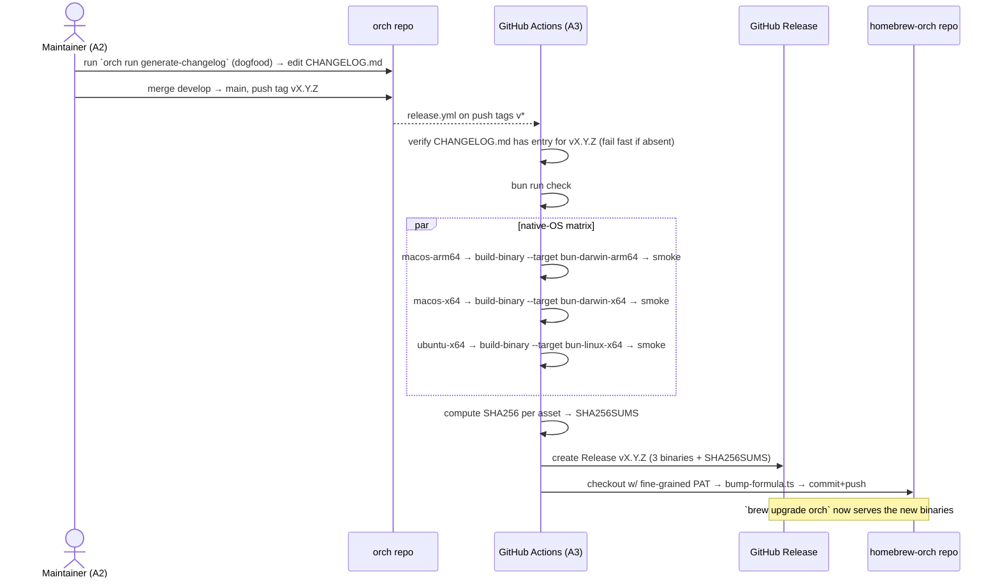

# feat: orch public release (packaging & distribution)

> Origin requirements doc: [`docs/brainstorms/2026-06-06-public-release-requirements.md`](../brainstorms/2026-06-06-public-release-requirements.md). This plan carries forward its Actors (A1–A3), Key Flows (F1–F3), Requirements (R1–R19), and Acceptance Examples (AE1–AE4). The binary-packaging gate is already **GREEN** — see [`docs/issues/2026-06-06-spike-compile-dynamic-import.md`](../issues/2026-06-06-spike-compile-dynamic-import.md). This release covers **packaging and distribution only**; orchestration logic, runner behavior, and the workflow DSL are strictly out of scope.

---

## Summary

Take `orch` from a private, clone-and-`bun link`-only project to a publicly installable CLI. The work spans four concern areas: (1) **repository hygiene & metadata** (MIT license, public README, semver `0.1.0`, conventional-commits enforcement); (2) **build & release tooling** (the spike's `scripts/build-binary.ts` is done; add a formula-bump script and the dogfooding changelog workflow); (3) **GitHub Actions pipelines** (PR gate, `v*`-tag release pipeline, docs-to-Pages deploy, all SHA-pinned); (4) **tap repo & operational rollout** (a separate `homebrew-orch` formula, branch/tag protection, fine-grained PAT, Pages enablement, name-availability check, flip to public).

The end state: a developer with no Bun/TypeScript knowledge runs `brew tap <maintainer>/orch && brew install orch` and executes a TypeScript workflow; the maintainer ships a new version by running one dogfooded changelog workflow and pushing a `v*` tag.

**Execution model — implement first, then hand off the manual ops.** This plan splits into two stages. **Stage A (automated)** is everything the implementing agent can do without remote access or irreversible side effects: all in-repo code, scripts, CI YAML, docs config, the tap formula *file*, and — as its final deliverable — a generated `docs/release-setup-guide.md` containing copy-pasteable, ordered instructions for everything else. **Stage B (operator-run)** is every step that needs GitHub remote access, a credential, local `brew`, or an irreversible flip (creating the tap repo, branch/tag protection, the PAT + secret, Pages enablement, the secret scan, making the repo public, and cutting the first release). The agent **does not perform any Stage B step**; it produces the guide and stops. The maintainer executes Stage B by following that guide. See [Execution Model](#execution-model) below for the full stage map.

---

## Problem Frame

`orch` is private and only usable via `bun link` / `bunx orch` inside a TypeScript project. There is no system-wide install path, no public docs site, and no release automation. The brainstorm validated the hard technical risk (a `bun build --compile` standalone binary *can* dynamically import the user's TypeScript workflows and resolve their bare `'orch'` imports with no Bun on `PATH`) via a spike that **passed** and left ready-to-fold artifacts. What remains is almost entirely **assembly and operations**: there is no `.github/` directory at all, no `LICENSE`, no `CHANGELOG.md`, `package.json` is still `0.0.0` / `private: true`, the README is a stale "Phase 0 scaffold" internal doc, VitePress has no `base` for a project-Pages subpath, and there is no commitlint, no tap repo, and no branch protection.

This is a **Deep** plan: cross-cutting (touches build, CI, docs, repo settings, a second repo), high-risk (a fine-grained cross-repo PAT, supply-chain integrity, irreversible "make public"), and operationally sequenced (the first `v*` tag must not fire until every pipeline and the tap are wired).

---

## Execution Model

The work divides into two stages with a hard boundary between them. The implementing agent runs **Stage A only** and then stops; the maintainer runs **Stage B** by following the guide the agent produced.

### Stage A — Automated (the agent does this)

Everything that is in-repo, reversible, and needs no remote credential or GitHub setting. Lands behind `bun run check` like any feature.

| Unit | Deliverable | Why it's Stage A |
| --- | --- | --- |
| U1 | `LICENSE` | static file |
| U2 | `package.json` metadata + `build:binary` | in-repo edit |
| U3 | `CHANGELOG.md` seed | in-repo file |
| U4 | `README.md` rewrite | in-repo file |
| U5 | `commitlint.config.mjs` + devDeps | in-repo file |
| U6 | VitePress `base: '/orch/'` | in-repo config |
| U7 | `scripts/bump-formula.ts` + test | in-repo script |
| U8 | `generate-changelog` workflow | in-repo workflow |
| U9 | `.github/workflows/pr.yml` | committed YAML (fires later, on the operator's PRs) |
| U10 | `.github/workflows/release.yml` | committed YAML (fires later, on the operator's tag) |
| U11 | `.github/workflows/docs.yml` | committed YAML (fires later, on push to main) |
| U12a | `dist-staging/homebrew-orch/Formula/orch.rb` + `README.md` (the tap files, authored locally) | file authoring only — **not** repo creation/push |
| **U14** | **`docs/release-setup-guide.md`** — the generated operator runbook | the agent's handoff artifact for Stage B |

The CI YAML (U9–U11) is *committed* in Stage A but only *executes* once the operator wires the repo in Stage B (protections, secret, Pages, public flip). Authoring them is Stage A; them firing is a Stage B outcome.

### Stage B — Operator-run (the maintainer does this, guided by U14)

Every step requiring remote access, a credential, local `brew`, or an irreversible action. The agent **must not** perform these — it documents them in `docs/release-setup-guide.md` (U14) with exact commands, expected output, and verification per step. These map to the requirements R1, R3, R3a, R3b, R8, R9 and to the cold-start in U12.

| # | Operator step | Access needed | Source unit |
| --- | --- | --- | --- |
| B1 | Name-availability check (brew core / npm / trademark) | local `brew`, web | R3b |
| B2 | Create the `homebrew-orch` GitHub repo | GitHub repo-admin | U12 |
| B3 | Push the staged tap files (B16 cold-start fills real SHAs first) | git push to new repo | U12 |
| B4 | Create `develop` branch; set as default PR target | GitHub repo-admin | U13 |
| B5 | Branch protection on `main` (PRs only, require U9 check) | GitHub repo-admin | U13 |
| B6 | Tag protection for `v*` (maintainer-only push; block force-push/delete) | GitHub repo-admin | U13 |
| B7 | Create fine-grained PAT scoped to `homebrew-orch` (Contents R+W, 1-yr expiry) | GitHub account settings | U13 |
| B8 | Store it as the `HOMEBREW_TAP_TOKEN` secret in `orch` | GitHub repo secrets | U13 |
| B9 | Enable GitHub Pages, source = "GitHub Actions" | GitHub repo-admin | U13 |
| B10 | Full-history secret scan (`gitleaks`/`trufflehog`) — **blocking gate** | local | U13 |
| B11 | **Make the repo public** — irreversible, only after B10 is clean | GitHub repo-admin | R1 |
| B12 | Cold-start: build 3 binaries locally, create a `v0.0.1-test` pre-release, hand-bump + `brew install`-validate the formula | local `bun`/`brew` + GitHub release | U12 |
| B13 | Cut the first release: confirm CHANGELOG `v0.1.0`, push `develop`→`main`, confirm Pages live, **then** push the `v0.1.0` tag | git push + tag | U13 |

The agent's job ends when U14's guide is written and `bun run check` is green. The guide is the contract that lets the maintainer complete Stage B without re-deriving any of the above.

---

## Output Structure

New and changed artifacts. The tap lives in a **separate repo** (`homebrew-orch`); its one file is shown under that repo's root. Everything else is in the main `orch` repo (repo-relative paths).

```
orch/  (main repo)  — ALL authored by the agent in Stage A
├── LICENSE                                   # NEW — MIT (U1)
├── CHANGELOG.md                              # NEW — seeded v0.1.0 entry + format header (U3)
├── README.md                                 # REWRITTEN — public audience (U4)
├── package.json                              # version 0.1.0, drop private, +build:binary (U2)
├── commitlint.config.mjs                     # NEW — @commitlint/config-conventional (U5)
├── orch.config.ts                            # +generate-changelog registration (U8)
├── scripts/
│   ├── build-binary.ts                       # EXISTS (spike) — reused as-is by CI
│   └── bump-formula.ts                        # NEW — rewrite formula url+sha256+version (U7)
├── workflows/
│   └── generate-changelog/
│       ├── index.ts                          # NEW — dogfooding changelog workflow (U8)
│       └── changelog.prompt.md               # NEW — predefined format + instructions (U8)
├── docs/
│   ├── public/.vitepress/config.mts          # +base: '/orch/' (U6)
│   └── release-setup-guide.md                # NEW — the Stage B operator runbook (U14)
├── dist-staging/
│   └── homebrew-orch/                         # NEW — tap files authored locally; operator pushes to the real repo (B2/B3)
│       ├── Formula/orch.rb                    # NEW — multi-platform binary formula (U12a)
│       └── README.md                          # NEW — brief tap usage (U12a)
└── .github/
    └── workflows/
        ├── pr.yml                            # NEW — PR gate (U9)
        ├── release.yml                       # NEW — v* release pipeline (U10)
        └── docs.yml                          # NEW — Pages deploy on main (U11)

homebrew-orch/  (separate repo — CREATED BY THE OPERATOR in Stage B, see U14 step B2)
└── Formula/orch.rb                           # populated by pushing dist-staging/homebrew-orch/ (B3)
```

The tap repo is **not** created by the agent. The agent authors the formula and tap README under `dist-staging/homebrew-orch/` so they are reviewable in the PR; the operator creates the real `homebrew-orch` repo and pushes those files in Stage B (B2/B3). The per-unit **Files** sections remain authoritative; this tree is a scope declaration, not a constraint.

---

## High-Level Technical Design

*The sketches below illustrate the intended approach and are directional guidance for review, not implementation specification. The implementing agent should treat them as context, not code to reproduce.*

### Release pipeline (F2) — what a `v*` tag triggers



### Dual entrypoint (already built by the spike)

```
bunx orch / bun link ──▶ src/cli/main.ts  (bare 'orch' resolves from host node_modules)
brew binary           ──▶ src/cli/bin.ts   (registers Bun.plugin resolver: 'orch' → embedded src/index.ts)
                          └─ scripts/build-binary.ts stubs react-devtools-core, compiles bin.ts
```

No change to this design is required — the plan **consumes** it. The release matrix's job is to prove it holds on `darwin-x64` and `linux-x64` (only `darwin-arm64` was compiled in the spike).

### Changelog workflow (R17) — single dogfooded Claude session

Per the maintainer's chosen approach: `orch run generate-changelog` launches **one autonomous Claude Code session** that runs its own bash (`git log`/`git tag`) to read commits since the last version tag and formats them into a predefined `CHANGELOG.md` structure via instructions in a bundled prompt. It mirrors the existing `workflows/new-feature/index.ts` shape (single `claude({ bare: false, flags: ['--dangerously-skip-permissions'] })` step). No `command(['git','log'])` DSL step — the agent reads commits itself.

```
workflow('generate-changelog', async (run, args) => {
  // args.prompt optionally carries an explicit range/version; default = "since last v* tag"
  step.define('changelog', {
    agent: claude({ bare: false, flags: ['--dangerously-skip-permissions', '--name', 'changelog'] }),
    promptFile: 'workflows/generate-changelog/changelog.prompt.md',  // format spec lives here
  })
})
```

---

## Requirements Traceability

| Requirement | Covered by | Notes |
| --- | --- | --- |
| R1 make repo public | U14 guide → operator (B11) | irreversible; documented step, agent does not flip |
| R2 MIT LICENSE | U1 | |
| R3 main protected / develop integration | U14 guide → operator (B4–B5) | |
| R3a tag push restricted; force-push/delete blocked | U14 guide → operator (B6) | |
| R3b pre-release name availability check | U14 guide → operator (B1) | brew core / npm / trademark |
| R4 public README | U4 | brew + direct Linux download path |
| R5 `--compile` per-platform binaries | U2 (script wrapper), U10 (matrix) | build script exists from spike |
| R6 binaries as release assets, consistent names | U10 | naming convention is a Key Decision |
| R7 TS workflows work from brew binary | U10 (smoke), spike (proven) | smoke = scaffold+run on each OS |
| R8 separate `homebrew-orch` repo | U12a (formula file) + U14 guide → operator (B2/B3) | agent authors files; operator creates+pushes repo |
| R9 `brew tap … && brew install orch` | U12a + U14 guide → operator (B12) | validated by operator at cold-start |
| R10 formula selects correct platform binary | U12 | `on_macos`/`on_linux` + `on_arm`/`on_intel` |
| R11 PR workflow (`check` + `docs:build` + commitlint) | U9, U5 | `permissions: contents: read` |
| R11a all third-party actions SHA-pinned | U9, U10, U11 | |
| R13 release workflow on `v*` | U10 | CHANGELOG gate, checksums, SHA256SUMS |
| R14 auto-bump tap formula via fine-grained PAT | U7, U10 | |
| R15 docs deploy to Pages on push to main | U11, U6 | `pages: write`, `id-token: write` |
| R16 `CHANGELOG.md` committed | U3 | |
| R17 dogfooding changelog workflow | U8 | single autonomous Claude session |
| R18 semver; initial `v0.1.0` | U2 | |
| R19 `package.json` version tracks tag; drop `private` | U2 | |

Acceptance Examples: **AE1**→U12 smoke; **AE2**→U10; **AE3**→U9; **AE4**→U8/U3.

---

## Key Technical Decisions

1. **Homebrew formula, not a cask, with `on_macos`/`on_linux` + `on_arm`/`on_intel` DSL blocks** *(resolves origin R10 open question)*. Per current Homebrew docs, each platform block carries its own `url` + `sha256`; the formula `bin.install`s the single downloaded binary renamed to `orch`. This decisively resolves the brainstorm's "DSL blocks vs runtime arch detection" question in favor of DSL blocks (per-target narrow binaries match `bun build --compile`'s one-binary-per-target output). Critically, the Sept-2026 Homebrew Gatekeeper tightening that blocks unsigned/unnotarized software applies to **casks only** — tap **formulae** do not get the `com.apple.quarantine` attribute, so our unsigned `--compile` binary installs and runs clean on macOS with no codesigning. This validates the entire brew path for v0.1.0 without an Apple Developer certificate.

2. **Native-OS build matrix, not cross-compilation** *(confirms origin R5 carry-over)*. Although `bun build --compile --target` can cross-compile, each binary is **built and smoke-tested on its own OS runner** (`macos-15` arm64, `macos-15-intel` x64, `ubuntu-24.04`). Reason: the spike only ever compiled `darwin-arm64`; a cross-compiled binary that is never executed is an unverified binary. Runner labels are pinned explicitly (`macos-latest` now means arm64; Intel needs `-intel` and is being retired Fall 2027) rather than `-latest`.

3. **Fan-out build → fan-in publish job topology.** Each matrix job uploads its own artifact; a single `publish` job (`needs: build`) downloads all three, assembles `SHA256SUMS`, and creates one Release. Only the publish job holds `contents: write`; build jobs are `contents: read`. The formula-bump job holds **no** `GITHUB_TOKEN` write scope — it authenticates to `homebrew-orch` with a fine-grained PAT (`HOMEBREW_TAP_TOKEN`, Contents:read+write, scoped to that repo only).

4. **Own the formula bump as a TypeScript script (`scripts/bump-formula.ts`), not chained `sed` or a third-party bump action.** Matches the repo's existing `scripts/build-binary.ts` convention and the maintainer's standing preference for reusable scripts over ad-hoc git/CLI pipelines. The script takes `--dist <dir>` of binaries-and-checksums (the bump job populates it by downloading the published Release assets and recomputing SHA256), and rewrites the three `url`/`sha256` pairs and the single `version` in `Formula/orch.rb` deterministically.

5. **Ship a user-facing `SHA256SUMS` release asset now; defer signing/provenance** *(maintainer decision; see [`docs/issues/2026-06-06-dist-binaries-no-signing-or-provenance.md`](../issues/2026-06-06-dist-binaries-no-signing-or-provenance.md))*. R13/R14 already compute checksums for the formula bump; surfacing them as a named asset is near-zero extra effort and gives direct downloaders an integrity signal. macOS codesign/notarization and SLSA provenance are tracked as a **post-v0.1.0** hardening pass, not launch-blocking.

6. **Changelog workflow = one autonomous Claude session driven by a bundled prompt** *(maintainer decision; resolves origin R17 open question)*. The agent runs its own `git` bash commands to read commits since the last tag and formats them into the predefined structure defined in `changelog.prompt.md`. It is a **maintainer-only, run-from-source workflow** — invoked via `bunx orch run generate-changelog` in a repo checkout; like `new-feature/index.ts` it imports orch via relative `../../src/...` paths, so it is **not bundled into or runnable from the brew binary** (and doesn't need to be — only the maintainer runs it, from source, at release time). The `v0.1.0` entry is hand-finalized as a prose summary per R17.

7. **Consistent release-asset naming: `orch-<os>-<arch>`** (`orch-darwin-arm64`, `orch-darwin-x64`, `orch-linux-x64`), plus `SHA256SUMS`. This single convention is shared by `build-binary.ts --outfile`, the release matrix, `bump-formula.ts`, and the formula `url`s — a drift here breaks the brew download, so it is fixed once here.

8. **All third-party *and* first-party `actions/*` pinned to full 40-char commit SHA** (R11a), each with a trailing `# vX.Y.Z` comment for legibility. SHA is the only immutable, unforgeable ref; Dependabot/pinact keep the comments fresh. Make it **machine-checkable**, not a review aspiration: a grep/`pinact verify` step (in the PR gate or `bun run check`) asserting every `uses:` in `.github/workflows/*.yml` matches `<owner>/<repo>@<40-hex> # v…`, so a mutable `@v4` tag fails CI.

---

## Implementation Units

Grouped into four dependency-ordered phases. U-IDs are stable and never renumbered.

### Phase 1 — Repository hygiene & metadata

These units are mutually independent and can land in any order (or parallel); none depends on CI.

### U1. MIT LICENSE

- **Goal:** Commit a standard MIT license at the repo root.
- **Requirements:** R2.
- **Dependencies:** none.
- **Files:** `LICENSE` (new).
- **Approach:** Standard MIT text. Copyright line: `Copyright (c) 2026 <maintainer>` (placeholder filled at execution). Update `package.json` `license` field is handled in U2.
- **Patterns to follow:** none (standard artifact).
- **Test scenarios:** Test expectation: none — static license file, no behavior.
- **Verification:** File present at root; GitHub recognizes it as MIT in the repo sidebar after publish.

### U2. package.json public metadata + `build:binary` script

- **Goal:** Make the package metadata public-ready and give CI a named build entrypoint.
- **Requirements:** R5 (script wrapper), R18, R19.
- **Dependencies:** none.
- **Files:** `package.json`.
- **Approach:** Set `"version": "0.1.0"`; remove `"private": true`; add `"license": "MIT"`; add `"build:binary": "bun scripts/build-binary.ts"` to `scripts` (CI calls it with `--target`/`--outfile`). Leave `bin`/`exports` unchanged (they point at `src/` for the dev/`bun link` path; the brew binary is a compiled artifact, not an npm install — npm distribution is explicitly out of scope, so `exports` pointing at `.ts` is fine). Do **not** add a `prepublishOnly` or npm-publish wiring.
- **Patterns to follow:** existing `scripts` block in `package.json`.
- **Test scenarios:** Test expectation: none — metadata only. (CI consumption is exercised by U10.)
- **Verification:** `bun run build:binary` produces `dist/orch`; `node -e`/`jq` confirms `private` is absent and `version` is `0.1.0`.

### U3. CHANGELOG.md seed + format spec

- **Goal:** Commit `CHANGELOG.md` with the `v0.1.0` entry and establish the structure the changelog workflow (U8) reproduces and the release gate (U10) checks for.
- **Requirements:** R16; defines the format consumed by R17.
- **Dependencies:** none.
- **Files:** `CHANGELOG.md` (new).
- **Approach:** Keep-a-Changelog-style header; one `## [0.1.0] - 2026-XX-XX` entry that **opens with a short prose summary of the most notable features** (the standalone-binary install path, brew tap, docs site) followed by `### Features` / `### Fixes` / `### Chores` groupings (per AE4). The exact prose is the maintainer's; this unit seeds the structure and a first draft. The release gate in U10 greps for `## [<version>]` or `## <version>`.
- **Patterns to follow:** Conventional-commits type names (`feat`→Features, `fix`→Fixes, `chore`→Chores) so U8's output and this seed agree.
- **Test scenarios:** Test expectation: none — documentation artifact. (The grep contract is tested in U10.)
- **Verification:** File present; the heading pattern the U10 gate greps for is present for `0.1.0`.

### U4. Public README rewrite

- **Goal:** Replace the stale "Phase 0 scaffold" internal README with a public-audience one.
- **Requirements:** R4.
- **Dependencies:** none (references U1 for the License section).
- **Files:** `README.md`.
- **Approach:** Sections: (1) what `orch` is and does (one-paragraph + the chaining-coding-agents pitch from the current intro, which is good); (2) **Install** — `brew tap <maintainer>/orch && brew install orch`, verify with `orch --help`, stated "no Bun required"; (3) **Direct binary download (Linux & macOS)** — download the `orch-<os>-<arch>` asset from the latest GitHub Release, then **verify integrity first** (`sha256sum -c` / `shasum -a 256 -c` against the downloaded `SHA256SUMS`) **before** `chmod +x` and placing on `PATH`. Only after the checksum matches, note the macOS direct-download Gatekeeper caveat (`xattr -d com.apple.quarantine ./orch`) with one sentence that this bypasses macOS's origin/tamper check and must follow — not precede — checksum verification on an unsigned binary; brew installs are unaffected (the macOS binaries are covered by R5/R6 even though R4 only mandated the Linux path); (4) **Usage** — `orch init`, `orch run <workflow>`, a couple of real invocations; (5) **Docs** link to the Pages site `https://<maintainer>.github.io/orch/`; (6) **Local development & testing** — condense the current `bun install` / `bun run check` / gates / `RUN_REAL_*` content (this is still accurate and useful for contributors); (7) **License** — MIT, link `LICENSE`. Remove the "Status: Phase 0 scaffold only" banner and the "Unlicensed" footer.
- **Patterns to follow:** the existing README's accurate dev-workflow section (lines 48–67) and docs section (69–86) — keep, don't rewrite.
- **Test scenarios:** Test expectation: none — README is excluded from the VitePress build (`srcExclude: ['**/README.md']`), so `docs:build` does not link-check it.
- **Verification:** Manual read; every command shown is real (`brew tap`, `orch --help`, `orch init`, `orch run`); no forward references to unbuilt features; download path matches U10's asset names and `SHA256SUMS`.

### U5. Conventional-commits enforcement (commitlint)

- **Goal:** Enforce conventional commits so the PR gate rejects non-conforming messages and the changelog workflow has structured input.
- **Requirements:** supports R11 (PR gate runs commitlint) and R17 (changelog input).
- **Dependencies:** none.
- **Files:** `commitlint.config.mjs` (new); `package.json` (add `@commitlint/cli` + `@commitlint/config-conventional` devDeps).
- **Approach:** `export default { extends: ['@commitlint/config-conventional'] }`. The PR workflow (U9) runs commitlint over the PR's commit range. **Decision to surface:** the repo's history contains non-conventional `agent:` prefixed commits; default config will reject `agent:` going forward. Either (a) accept that `agent:` commits stop (recommended — they were agent bookkeeping), or (b) add `agent` to `rules['type-enum']`. Default to (a); note in the plan, let execution confirm. No husky/local hook is added (CI is the gate; a local hook is optional developer convenience, out of scope).
- **Patterns to follow:** none in-repo (greenfield); standard commitlint setup.
- **Test scenarios:**
  - Happy path: `echo "feat: add x" | commitlint` exits 0.
  - Error path: `echo "broke everything" | commitlint` exits non-zero (no type).
  - Error path: `echo "agent: rebase" | commitlint` exits non-zero under default config (confirms the decision's consequence).
- **Verification:** `bunx commitlint --from <base> --to <head>` runs locally against a branch; the three cases above behave as listed.

### U6. VitePress base path for project Pages

- **Goal:** Configure the docs site to serve correctly under the `/orch/` subpath on GitHub Pages.
- **Requirements:** prerequisite for R15.
- **Dependencies:** none.
- **Files:** `docs/public/.vitepress/config.mts`.
- **Approach:** Add `base: '/orch/'` (leading + trailing slash, matches repo name) to the `defineConfig` object. Without it, all assets 404 on the project Pages URL. Leave `ignoreDeadLinks: false` untouched (that's the docs gate). If the repo is ever served from a custom domain or org root, `base` reverts to `/`.
- **Patterns to follow:** existing `config.mts` structure (lines 10–20).
- **Test scenarios:**
  - Happy path: `bun run docs:build` succeeds and emitted HTML references assets under `/orch/`.
  - Edge case: existing internal links still resolve (no dead-link regression from the base change).
- **Verification:** `bun run docs:build` green; spot-check `docs/public/.vitepress/dist/index.html` for `/orch/` asset prefixes.

---

### Phase 2 — Build & release tooling

### U7. `scripts/bump-formula.ts` — rewrite the tap formula

- **Goal:** A deterministic script that updates `homebrew-orch`'s formula with new per-platform URLs + SHA256s + version.
- **Requirements:** R14.
- **Dependencies:** U12 (defines the formula's exact shape the script edits — author together; the formula skeleton is the contract).
- **Files:** `scripts/bump-formula.ts` (new); `tests/unit/scripts/bump-formula.test.ts` (new).
- **Approach:** CLI flags `--version <x.y.z>`, `--dist <dir>` (where `SHA256SUMS` + binaries live), `--formula <path>` (default `Formula/orch.rb`). Parse `SHA256SUMS` (lines `<sha256>  orch-<os>-<arch>`), then rewrite the formula text: the single `version "…"`, and each platform block's `url "…/download/v<version>/orch-<os>-<arch>"` + `sha256 "…"`. Use anchored, per-platform replacements keyed by the asset name in the URL (not blind global replace) so the three blocks can't cross-contaminate. Pure string transform over file contents — **no git in this script** (the workflow does checkout/commit/push; per the "prefer scripts over complex git" convention the script owns the *edit*, the workflow owns the *git*). Exit non-zero with a clear message if a platform's checksum or block is missing.
- **Patterns to follow:** `scripts/build-binary.ts` (parseArgs CLI shape, `Bun.file`/`Bun.write`).
- **Test scenarios:**
  - Happy path: given a fixture formula + a `SHA256SUMS` with all three assets and `--version 0.2.0`, the output formula has the three `url`s pointing at `…/v0.2.0/orch-<os>-<arch>`, the three matching `sha256`s, and `version "0.2.0"`.
  - Edge case: re-running on already-bumped formula is idempotent (same output).
  - Edge case: a `sha256` value that shares a substring with another is replaced only in its own platform block (no cross-contamination).
  - Error path: missing `orch-linux-x64` line in `SHA256SUMS` → non-zero exit naming the missing platform.
  - Error path: formula missing an expected platform block → non-zero exit, formula left untouched.
- **Verification:** `bun test tests/unit/scripts/bump-formula.test.ts` green; running it against a real fixture produces a formula that `brew style` would accept (verified in U12).

### U8. `generate-changelog` orch workflow (dogfood)

- **Goal:** Ship the maintainer-invoked workflow that generates/updates `CHANGELOG.md` from commits since the last version — a real shipped usage example of orch (R17).
- **Requirements:** R17 (and AE4).
- **Dependencies:** U3 (the format it must reproduce).
- **Files:** `workflows/generate-changelog/index.ts` (new); `workflows/generate-changelog/changelog.prompt.md` (new); `orch.config.ts` (register `'generate-changelog'`); `tests/integration/workflows/generate-changelog.test.ts` (new, mocked-runner).
- **Approach:** Mirror `workflows/new-feature/index.ts`. A single autonomous step `agent: claude({ bare: false, flags: ['--dangerously-skip-permissions', '--name', 'changelog'] })` with `promptFile: 'workflows/generate-changelog/changelog.prompt.md'`. `args.prompt` optionally carries an explicit commit range or target version; when absent, the prompt instructs the agent to derive the range as "commits since the most recent `v*` tag" by running `git tag`/`git log` itself. `changelog.prompt.md` specifies: read commits since last version via bash; group by conventional-commit type into `### Features` / `### Fixes` / `### Chores`; open the entry with a short prose summary of the most notable features; write/prepend the entry into `CHANGELOG.md` under a `## [<version>] - <date>` heading matching U3's structure; do not commit. Set `process.env.IS_SANDBOX = '1'` as `new-feature` does — but verify at implementation whether `IS_SANDBOX` is an actual runtime constraint or merely the marker that lets Claude accept `--dangerously-skip-permissions`; if the latter, do not imply it is a guard. The workflow's docstring/README must state plainly that it launches a fully autonomous Claude session with unrestricted filesystem/shell access to the repo, so the maintainer knows the permission model before running it. **First-changelog bootstrap (A5):** the `v0.1.0` entry is **hand-authored prose** (already required by R17) precisely because the pre-`v0.1.0` history is not conventional-commit-clean (it contains `agent:` prefixes and typo'd types like `deafult`), so automatic type-grouping would silently drop/miscategorize commits. The workflow's automatic grouping is validated starting **`v0.2.0`**, over a clean conventional range — not against the v0.1.0 bootstrap. **Execution note:** start from a copy of `new-feature/index.ts` and strip to one step — the runner-wiring and prompt-file plumbing are the proven parts to reuse.
- **Patterns to follow:** `workflows/new-feature/index.ts` (runner construction, `bare: false`, `--dangerously-skip-permissions`, `process.env.IS_SANDBOX`); `src/workflows/phased-build/pipeline.ts` for promptFile usage; `orch.config.ts` registration shape.
- **Test scenarios (integration, mock only at the `ProcessService` edge per CLAUDE.md — no `mock.module`):**
  - Happy path: running the workflow with a `FakeProcessService` issues exactly one autonomous Claude step whose argv/prompt references the changelog prompt file and conventional-commit grouping.
  - Integration: the workflow resolves and registers via `orch.config.ts` (`orch dry-run generate-changelog` style preflight passes — workflow name is valid, prompt file exists on disk).
  - Edge case: invoked with an explicit `args.prompt` range, the range is forwarded into the assembled prompt.
  - Test expectation note: the *content quality* of the generated changelog (AE4's "publishable with minor editing") is a runner-output property not assertable with a fake; covered by manual maintainer verification, not an automated test.
- **Verification:** `bun run check` green including the new integration test; a real manual run (`orch run generate-changelog`) against the repo's own history produces an entry the maintainer can publish with minor edits (AE4).

---

### Phase 3 — GitHub Actions pipelines

All three workflows pin every action to a full commit SHA (R11a) and declare least-privilege `permissions`.

### U9. PR workflow

- **Goal:** Gate every PR on the full check suite, docs build, and conventional commits.
- **Requirements:** R11, R11a; AE3.
- **Dependencies:** U5 (commitlint config must exist).
- **Files:** `.github/workflows/pr.yml` (new).
- **Approach:** Trigger `pull_request` targeting `develop` or `main`. Top-level `permissions: contents: read`. Single `ubuntu-24.04` job: checkout (with `fetch-depth: 0` so commitlint sees the range) → `oven-sh/setup-bun` → `bun install --frozen-lockfile` → `bun run check` → `bun run docs:build` → `bunx commitlint --from ${{ github.event.pull_request.base.sha }} --to ${{ github.event.pull_request.head.sha }}`. **Never** set `RUN_REAL_CLAUDE` / `RUN_REAL_CODEX` / `RUN_REAL_E2E` (AE3) — only `bun run check` (unit + mocked integration) runs. **Security constraint (comment it in the YAML):** this workflow runs untrusted fork-PR code and MUST NOT reference any `secrets.*` — on a public repo `pull_request` gives fork PRs a read-only token with no secret access, which is correct; do **not** "fix" a perceived missing-secret by switching to `pull_request_target`, which exposes secrets to attacker-controlled code and is a known supply-chain attack vector. If a PR check ever genuinely needs a secret, isolate it in a separate `pull_request_target` job that does not check out fork code. Branch protection (U13) makes this a required status check.
- **Patterns to follow:** `package.json` scripts (`check`, `docs:build`); the best-practices digest's PR-job skeleton.
- **Test scenarios:**
  - Happy path: a PR with passing tests + conventional commits → workflow green, mergeable.
  - Error path (AE3): a PR with a failing unit test → workflow red; GitHub blocks merge (requires U13's required-check setting).
  - Error path: a PR commit message `broke it` (no type) → commitlint step red.
  - Edge case: a PR that adds a dead internal doc link → `docs:build` step red (`ignoreDeadLinks: false`).
- **Verification:** Open a throwaway PR against `develop` exercising each case above; confirm status and mergeability.

### U10. Release workflow (`v*` tag)

- **Goal:** On a `v*` tag, verify the changelog, build+smoke binaries on native runners, publish a Release with binaries + `SHA256SUMS`, then bump the tap formula.
- **Requirements:** R5, R6, R7, R13, R14, R11a; AE2.
- **Dependencies:** U2 (`build:binary` script), U3 (CHANGELOG to grep), U7 (`bump-formula.ts`), U12 (the formula file the bump job edits). Committing this YAML has no remote prerequisite; at *runtime* its bump job needs the operator-created `homebrew-orch` repo (Stage B / B2) and the `HOMEBREW_TAP_TOKEN` secret (B8) — both in place before the first tag is pushed (B13).
- **Files:** `.github/workflows/release.yml` (new).
- **Approach:** Trigger `push: tags: ['v*']`. Top-level `permissions: contents: read`. Jobs:
  1. **`changelog-gate`** (ubuntu): checkout; assert `CHANGELOG.md` contains a real entry for `${GITHUB_REF_NAME#v}` — not just that a `^## \[\?<version>` heading exists, but that its date is not the `XX` placeholder and the section body (between this heading and the next `## `) is non-empty. A bare/stub heading must not pass (otherwise the Release ships notes sliced from an empty section). Fail fast if absent or stub (gates the whole pipeline per R13).
  2. **`check`** (ubuntu): `bun install --frozen-lockfile` → `bun run check`.
  3. **`build`** matrix `needs: [changelog-gate, check]`, `fail-fast: false`, `permissions: contents: read`: `{ macos-15 / bun-darwin-arm64 / orch-darwin-arm64 }`, `{ macos-15-intel / bun-darwin-x64 / orch-darwin-x64 }`, `{ ubuntu-24.04 / bun-linux-x64 / orch-linux-x64 }`. Each: setup-bun → `bun install --frozen-lockfile` → `bun run build:binary --target <t> --outfile dist/<asset>` → **smoke test** (see scenarios) → `shasum -a 256 <asset> > <asset>.sha256` → `upload-artifact`.
  4. **`publish`** `needs: build`, `permissions: contents: write`: download all artifacts (`merge-multiple: true`) → concatenate `*.sha256` into `SHA256SUMS` → create the Release for the tag attaching the three binaries + `SHA256SUMS`, with release notes pulled from the matching `CHANGELOG.md` section. Publish must be **idempotent on re-run**: if a Release for the tag already exists (a retried run), update it (`gh release upload --clobber` / `gh release edit`) rather than failing — `gh release create` errors on a pre-existing tag. Prefer the pre-installed `gh release create` CLI (`--notes-file` from the changelog slice, zero third-party trust surface) over a third-party action; if a third-party action is used it is SHA-pinned.
  5. **`bump-formula`** `needs: publish`, `permissions: {}`: checkout `homebrew-orch` with `secrets.HOMEBREW_TAP_TOKEN` (fine-grained PAT). **Source the checksums from the published Release, not the build artifacts** — `gh release download <tag>` the three binaries from `<maintainer>/orch` (the bytes users will actually fetch), recompute SHA256 locally (this also closes the artifact-substitution window: a tampered intermediate artifact can't poison the formula because the formula's hashes are derived from the released bytes), then `bun scripts/bump-formula.ts --version ${GITHUB_REF_NAME#v} --dist dist --formula Formula/orch.rb` → `git commit -am "orch ${GITHUB_REF_NAME}" && git push`. The token must be referenced at **step** scope (`env:` on the checkout/push steps), never job-wide, to shrink the exposure window. This job is independently re-runnable against an already-published Release (see partial-failure recovery below).
- **Partial-failure recovery:** the realistic failure is publish succeeding (Release + assets live) but `bump-formula` failing (PAT expired, tap push rejected, transient 5xx) — leaving `brew upgrade` silently stuck on the old version while the Release page shows the new one. Detection signal: Release exists for the tag but the tap formula's `version` lags. Recovery: re-run the `bump-formula` job alone (it re-downloads from the Release and is idempotent). Document this signal + manual re-trigger in the release runbook (deferred follow-up).
- **Execution note:** Build the workflow incrementally and validate the matrix on a **pre-release tag in a fork or with the publish/bump jobs disabled** before the real `v0.1.0` — the cross-target build is the unverified-in-spike risk. The smoke test is the gate that closes the brainstorm's open carry-over.
- **Patterns to follow:** best-practices digest skeletons; asset naming Decision 7; `scripts/build-binary.ts` `--target`/`--outfile` interface.
- **Test scenarios (the workflow's own steps are the executable assertions; validate on a throwaway tag):**
  - Happy path (AE2): push `v0.0.1-test` → three binary assets + `SHA256SUMS` on the Release; `homebrew-orch` gets a commit updating url+sha256 for all three platforms.
  - Integration smoke (R7, closes carry-over): on **each** native runner, the freshly built binary passes a real end-to-end mini-flow, not just `--help` — mirror `scripts/spike/run-spike.sh`: `orch init` in a temp dir then `orch run <scaffolded>` exits 0. **Critical:** the smoke must run with Bun scrubbed from `PATH` — `setup-bun` put Bun on `PATH` for the whole job, so running in the default env proves nothing about the embedded-runtime guarantee. Mirror `run-spike.sh`'s `clean_path` construction AND its guard that *fails the job* if `command -v bun` still resolves on the scrubbed PATH (so the test can't silently pass with Bun present); the scrubbed PATH must still include `/bin:/usr/bin` for `/bin/sh`. This proves dynamic TS import + bare-`'orch'` resolution on `darwin-x64` and `linux-x64` with genuinely no Bun.
  - Integration smoke (built-in resolution risk): on the binary, a built-in workflow (`orch::`) must both **resolve AND import** (dry-run it) — not just resolve. The likely failure is not the resolver but that the built-in module (`src/workflows/*/index.ts`) was never embedded: `build-binary.ts` compiles `bin.ts`, which reaches built-ins only via a runtime string-joined `import()` that the bundler does not trace. If the dry-run throws ENOENT, the fix is an explicit embed list in `build-binary.ts`, not a resolver branch (see Risk R-3).
  - Error path (R13): push a tag whose version has no `CHANGELOG.md` entry → `changelog-gate` fails, no Release created, no formula bump.
  - Error path: a matrix leg fails to build → `fail-fast: false` lets others finish, but `publish` (`needs: build`) does not run, so no partial Release.
  - Edge case: re-running the workflow on the same tag is idempotent for the formula bump (U7 idempotency) and updates rather than duplicates the Release.
- **Verification:** A throwaway pre-release tag drives the full pipeline green with all three assets, `SHA256SUMS`, and a tap commit; the changelog-gate negative case blocks as specified.

### U11. Docs deploy workflow (GitHub Pages)

- **Goal:** Build and deploy the VitePress site to GitHub Pages on every push to `main`.
- **Requirements:** R15, R11a; success criterion "docs live immediately after first push to main".
- **Dependencies:** U6 (`base: '/orch/'`).
- **Files:** `.github/workflows/docs.yml` (new).
- **Approach:** Trigger `push: branches: [main]` + `workflow_dispatch`. `permissions: contents: read, pages: write, id-token: write`. `concurrency: { group: pages, cancel-in-progress: false }`. **build** job: checkout (`fetch-depth: 0` for `lastUpdated`) → setup-bun → `configure-pages` → `bun install --frozen-lockfile` → `bun run docs:build` → `upload-pages-artifact` with `path: docs/public/.vitepress/dist` (note: site root is `docs/public`, so dist is **under** it — not `docs/.vitepress/dist`). **deploy** job `needs: build`, `environment: github-pages` → `deploy-pages`. Pages source must be set to "GitHub Actions" in repo settings (U13).
- **Patterns to follow:** VitePress official deploy workflow; `docs:build` script; `srcExclude`/`ignoreDeadLinks` already configured.
- **Test scenarios:**
  - Happy path: push to `main` → site deploys; `https://<maintainer>.github.io/orch/` serves the built docs with working assets (validates U6's `base`).
  - Edge case: a push to `main` whose docs have a dead internal link → `docs:build` fails, deploy job skipped (no broken deploy).
  - Edge case: two pushes in quick succession → `concurrency` serializes, no overlapping deploy.
- **Verification:** First push to `main` yields a live Pages URL within minutes; asset paths resolve under `/orch/`.

---

### Phase 4 — Tap formula, operational rollout spec & operator guide

Stage A here authors the tap files (U12) and the operator guide (U14). U13 is the *spec* of the operator-run rollout — the agent does not execute it; it is executed in Stage B by the maintainer following U14.

### U12. `homebrew-orch` tap formula (file authoring; repo creation is operator-run)

- **Goal (Stage A):** Author the tap formula and tap README as in-repo, reviewable files so `bump-formula.ts` (U7) has its contract and the operator has exact bytes to push. Creating the repo, the cold-start hand-bump, and `brew install` validation are **Stage B operator steps** (B2/B3/B12), specified here and rendered as runnable instructions in U14.
- **Requirements:** R8, R9, R10; AE1.
- **Dependencies:** pairs with U7 (script edits this file); asset names from Decision 7 / U10.
- **Target repo:** `homebrew-orch` (separate GitHub repo under `<maintainer>`) — **created by the operator in B2**, not by the agent.
- **Files (authored in this repo, under a staging dir):** `dist-staging/homebrew-orch/Formula/orch.rb` (new); `dist-staging/homebrew-orch/README.md` (new, brief tap usage). These are the source-of-truth files the operator copies into the new `homebrew-orch` repo at B3.
- **Approach (Stage A — author the files):** Formula class `Orch < Formula` with `desc`, `homepage`, `version`, `license "MIT"`, and nested `on_macos { on_arm {url,sha256}; on_intel {url,sha256} }` + `on_linux { on_intel {url,sha256} }` blocks pointing at `…/releases/download/v<version>/orch-<os>-<arch>`. `def install` → `bin.install Dir["orch-*"].first => "orch"` (binaries are shipped raw, not tarballs). `test do` → `assert_match "orch", shell_output("#{bin}/orch --help")`. Seed the `url`/`sha256` with obvious placeholders (e.g. `version "0.0.0"`, `sha256 "0"*64`) so it's clear they are filled by the cold-start bump, never by hand. Co-validate the skeleton's block layout against U7's fixture so the script's anchored replacements match. Repo name **must** be `homebrew-orch` for the short `brew tap <maintainer>/orch` form (state this in the README and in U14).
- **Approach (Stage B — operator, documented in U14, do NOT execute here):** The cold-start procedure (resolves the chicken-and-egg where the automated bump needs both the tap repo AND a Release to exist): create the `homebrew-orch` repo (B2) and push the staged files (B3); build all three binaries locally via `build:binary`; upload them to a `v0.0.1-test` pre-release; run `bump-formula.ts` against the committed skeleton to fill **real** SHAs; `brew install`-validate that hand-bumped formula; only then push the `v0.1.0` tag (the automated bump then merely re-confirms what already works). U14 renders this as ordered, copy-pasteable commands.
- **Patterns to follow:** best-practices digest formula skeleton; the `bump-formula.ts` contract in U7 (block structure must match what the script's anchored replacements expect — co-design these two).
- **Test scenarios:**
  - **Stage A (automated):** the staged formula's block layout matches `bump-formula.ts`'s expected anchors — cross-checked against U7's fixture (this is the only U12 assertion the agent can run; the rest are operator-verified).
  - **Stage B (operator-verified, in U14):** AE1 — on macOS arm64 with Homebrew + no Bun, `brew tap <maintainer>/orch && brew install orch` then `orch run <workflow>` succeeds with no Bun prompt; `brew audit --new orch` and `brew test orch` pass; on Linux x64 the `on_linux`/`on_intel` block installs the linux binary.
- **Verification:** Stage A — the staged formula parses and its anchors match U7's fixture. Stage B (operator) — `brew install` from the tap on macOS arm64 (host) and one Linux box yields a working `orch`; `brew audit`/`brew test` green.

### U13. Operational rollout spec (Stage B — executed by the operator via U14, NOT by the agent)

- **Goal:** Define the ordered, irreversible/settings-level operations that turn the wired-up repo into a live public release. **The agent does not perform any of these.** This unit is the authoritative *specification* of the steps; its sole Stage A deliverable is that U14 renders every step below as an executable runbook entry. Correctness is demonstrated when the operator runs them (Stage B), last, after all code/CI/tap files are committed.
- **Requirements:** R1, R3, R3a, R3b.
- **Dependencies:** U9, U10, U11 (workflows must exist to be marked required / to fire), U12 (tap files must exist before B3/B12), U14 (the guide that renders these steps).
- **Files:** none in-repo — these are GitHub settings + one-time ops. Their documentation lives in `docs/release-setup-guide.md` (U14).
- **Approach (ordered — this is the spec U14 must reproduce verbatim as runnable steps):**
  1. **R3b name check** (do first, before anything public): confirm `orch` is not claimed in Homebrew core (`brew search orch` / core formula list), not taken on npm (even though npm dist is deferred, the name matters for R19/future), and no blocking trademark. If conflicted, surface to the maintainer before proceeding — this can invalidate the whole naming.
  2. Create `develop` branch from `main`; set `develop` as the default branch / default PR target (R3).
  3. Branch protection on `main`: no direct push, PRs only, require the U9 PR check to pass; protect `v*` tags so only the maintainer can push them and force-push/deletion is blocked on `main` and `v*` (R3, R3a).
  4. Create the fine-grained PAT scoped to `homebrew-orch` (Contents:read+write only) and store it as the `HOMEBREW_TAP_TOKEN` secret in the `orch` repo (consumed by U10's bump job). Set the **maximum 1-year expiry** and record a rotation reminder; treat any CI log that surfaces the token string as cause for immediate rotation. The release workflow references it only at step scope (U10 step 5), never job-wide.
  5. Enable GitHub Pages with source = "GitHub Actions" (so U11 deploys).
  6. **Secrets/history scan gate (blocking, before public flip):** run a full-history secret scan — e.g. `gitleaks detect --source . --log-opts="--all"` or `trufflehog git file://.` — over the entire repo history, not just the working tree. Block the public flip on a clean result; document any intentional false positive explicitly. This is a hard gate, not advisory: once public (R1), any credential ever committed (even in a deleted file) is permanently exposed.
  7. **Make the repo public (R1)** — irreversible; do this only once everything above is green, the secrets scan (step 6) is clean, and the README (U4) and LICENSE (U1) are committed.
  8. Cut the first release (sequence the two pipelines, don't fire them together): ensure `CHANGELOG.md` has the hand-authored `v0.1.0` entry (U3/U8) and the tap formula is hand-bumped + `brew install`-validated (U12 cold-start). Push `develop`→`main` **first** and confirm the docs deploy (U11) goes green / Pages is live; **then** push the `v0.1.0` tag (R18) so the release pipeline (U10) runs on its own rather than competing with the first docs deploy on a single push.
- **Patterns to follow:** F2 (release flow) and the brainstorm's branch-model decision.
- **Test scenarios:** Test expectation: none — repository settings and one-time ops, not code. Correctness is demonstrated by the Acceptance Examples (AE1–AE3) once the operator runs Stage B.
- **Verification (operator, post Stage B):** Direct push to `main` is rejected; a non-maintainer cannot push a `v*` tag; force-push to `main` is blocked; `brew tap <maintainer>/orch && brew install orch` works on a clean machine (AE1); pushing `v0.1.0` produces the Release + formula bump (AE2); Pages is live (AE/F3).

### U14. `docs/release-setup-guide.md` — the operator runbook (Stage A deliverable, the handoff)

- **Goal:** Produce the single document the maintainer follows to execute all of Stage B without re-deriving anything. This is the agent's final Stage A deliverable and the artifact that satisfies the user's requirement: *the project implements everything, then hands back precise instructions for the manual remote-access setup.*
- **Requirements:** operationalizes R1, R3, R3a, R3b, R8, R9 (the operator-run requirements); subsumes the previously-deferred `docs/release-runbook.md`.
- **Dependencies:** U7, U9, U10, U11, U12 (the guide references their concrete file paths, asset names, secret name, and job names — author U14 **last**, after those are settled, so every command and name in the guide is real, not a forward reference).
- **Files:** `docs/release-setup-guide.md` (new). Internal doc — **not** published to the VitePress site (it lives under `docs/`, excluded from `docs/public/`), so no `docs:build` link-check impact.
- **Approach:** Two parts.
  - **Part 1 — One-time setup (the B1–B13 sequence).** Each step gets: a heading (`### B5 — Branch protection on main`), the access it requires (e.g. "GitHub repo Settings → Branches"), the **exact commands or click-path** (prefer `gh` CLI commands the maintainer can paste — `gh repo create`, `gh api` for branch protection, `gh secret set HOMEBREW_TAP_TOKEN`, `gh release create v0.0.1-test --prerelease`, `gh repo edit --visibility public` — with the web-UI equivalent noted where the CLI is awkward), the expected result, and a one-line verification. Preserve U13's ordering exactly (name-check → develop → protections → PAT/secret → Pages → secret-scan → **public flip** → first release) and U12's cold-start (create tap repo → push staged files → local build → pre-release → hand-bump → `brew install`-validate → tag). Call out the two irreversible/blocking gates in bold: the secret scan (B10) must be clean before, and only before, the public flip (B11).
  - **Part 2 — Cutting a release (recurring).** The steady-state procedure mirroring F2: run `orch run generate-changelog` (U8) → finalize `CHANGELOG.md` → merge `develop`→`main` (confirm docs deploy) → push `vX.Y.Z` tag → watch `release.yml` → verify the Release assets + `SHA256SUMS` + the tap formula bump. Include the **partial-failure recovery** from U10 (Release published but `bump-formula` failed → re-run the `bump-formula` job alone; detection signal = Release exists but tap `version` lags).
  - Use real values throughout: the `orch-<os>-<arch>` asset names (Decision 7), `HOMEBREW_TAP_TOKEN`, `homebrew-orch`, `Formula/orch.rb`, the `gitleaks`/`trufflehog` commands, and `<maintainer>` as the one placeholder the operator fills in (note it at the top).
- **Patterns to follow:** the ordered-steps shape of U13's approach; F2 sequence diagram; `docs/logging.md`/`docs/testing-strategy.md` as examples of internal-doc tone (not published).
- **Test scenarios:** Test expectation: none — documentation artifact. (Its correctness is proven when the operator completes Stage B and the Acceptance Examples pass.)
- **Verification:** Every command in the guide is real and copy-pasteable; every file path, secret name, asset name, and job name matches the committed U7/U9/U10/U11/U12 artifacts (no drift, no forward reference to unbuilt features); the B1–B13 order matches U13; the irreversible/blocking gates (B10 → B11) are unmistakable. A maintainer who has never seen this plan can complete Stage B from the guide alone.

---

## System-Wide Impact

- **Developers / contributors (A1 internal):** conventional commits become mandatory on PRs (U5/U9); the `agent:` commit prefix stops working under default commitlint. PRs target `develop`, not `main` (U13). Surface this in the README contributing section.
- **End users (A1):** gain `brew install orch` and a direct-download path; never need Bun. The compiled binary embeds only orch's **public** API — a user workflow that deep-imports a dev-only module (e.g. `scriptedFake`) won't run from a brew binary (documented limitation, consistent with those examples being DEV-ONLY).
- **Maintainer (A2):** release becomes "run changelog workflow → merge → tag". One new secret (`HOMEBREW_TAP_TOKEN`) and one new repo (`homebrew-orch`) to steward.
- **Docs:** the site moves from build-only to deployed; the `base` change (U6) means local `docs:preview` now serves under `/orch/`. After any public-barrel change, still reconcile `docs/public/reference/api.md` + `runners.md` (CLAUDE.md rule) — unchanged by this work but worth noting since the binary embeds `src/index.ts`.
- **Two interacting external contract surfaces:** the **asset-name convention** (Decision 7) is shared across `build-binary.ts`, `release.yml`, `bump-formula.ts`, and `orch.rb` — a four-way contract. The **CHANGELOG heading format** is a contract between U3 (seed), U8 (generator), and U10 (gate grep).

---

## Risk Analysis & Mitigation

- **R-1 — Cross-target binary unverified (origin carry-over).** Only `darwin-arm64` was compiled in the spike. *Mitigation:* native-OS matrix (Decision 2) with a real `init`+`run` smoke test (U10), not `--help`; validate on a throwaway pre-release tag before `v0.1.0`.
- **R-2 — Fine-grained PAT scope/leak.** A token that can push to the tap is a supply-chain target — and because the same job recomputes the formula's SHA256s, a leaked token lets an attacker repoint `url` at a malicious binary *and* match its checksum. *Mitigation:* scope to `homebrew-orch` only, Contents:read+write, nothing else; 1-year max expiry with a rotation reminder (U13 step 4); referenced only at step scope; the bump job declares `permissions: {}` (no `GITHUB_TOKEN` write); never echo the token; rotate on any log exposure or suspicion.
- **R-3 — Built-in workflows may not be embedded in the binary.** `resolveBuiltin` anchors to orch's own source via `import.meta.url` and reaches `src/workflows/*/index.ts` only through a runtime string-joined `import()`. A bundler does not trace runtime-constructed import paths, so the built-in *modules themselves* may be absent from the `--compile` output — a larger gap than the resolver. The spike only proved *user-file* dynamic import. *Mitigation:* the U10 built-in smoke must resolve **and import** a built-in; if it ENOENTs, add an explicit entrypoint/embed list for the built-in modules to `build-binary.ts` (not merely a resolver branch). Scoped to packaging; discoverable only by running the smoke on a compiled binary.
- **R-4 — Unsigned macOS direct downloads hit Gatekeeper.** *Mitigation:* brew path is unaffected (formula, not cask — Decision 1); README documents the `xattr` workaround for direct downloads; signing deferred (Decision 5).
- **R-5 — Irreversible "make public" with secrets in history.** *Mitigation:* U13 step 6 is a **blocking** full-history secret scan (`gitleaks`/`trufflehog` over `--all`, not just the working tree) that gates the public flip; PAT lives in repo secrets, never committed.
- **R-6 — `bun install --frozen-lockfile` drift in CI.** If `bun.lock` is stale, every workflow fails at install. *Mitigation:* ensure the lockfile is committed and current as part of U2; CI uses `--frozen-lockfile` to make drift loud rather than silent.

---

## Scope Boundaries

### Deferred for later (carried from origin)

- npm / `bun add -g orch` distribution channel.
- homebrew-core official formula (requires broader adoption).
- macOS codesigning/notarization and SLSA provenance (Decision 5; tracked in the signing issue) — **post-v0.1.0 hardening**.

### Outside this product's identity (carried from origin)

- Linux package managers (apt, yum, pacman).
- Windows support.
- Changes to orchestration logic, runner behavior, or workflow DSL — this release is packaging/distribution only.
- Automated changelog commits on every CI run — the changelog workflow is maintainer-invoked before a release, never a continuous CI step.

### Deferred to follow-up work (plan-local)

- A local commit-msg git hook (husky) for conventional commits — CI is the gate; a local hook is optional DX, not required for this release (U5 notes this).

(The release runbook is **no longer deferred** — it is promoted to U14, `docs/release-setup-guide.md`, a required Stage A deliverable, because it is the handoff that makes Stage B executable by the operator.)

---

## Dependencies / Prerequisites

- **GREEN spike** ([`docs/issues/2026-06-06-spike-compile-dynamic-import.md`](../issues/2026-06-06-spike-compile-dynamic-import.md)) — `scripts/build-binary.ts`, `src/cli/bin.ts`, and the `main()` export are landed and are inputs, not work, for this plan.
- Conventional-commits discipline adopted going forward (U5).
- GitHub Pages available (free for public repos).
- Maintainer can create `homebrew-orch` under the same account/org as `orch` (U12) and a fine-grained PAT (U13).
- Bun ≥ 1.2 on all CI runners (`oven-sh/setup-bun`, SHA-pinned).

---

## Deferred to Implementation (execution-time unknowns)

- **commitlint `agent:` decision** (U5): default rejects it; confirm with maintainer whether to allow-list `agent` or let it lapse (plan default: let it lapse).
- **Built-in resolution in the binary** (R-3 / U10): whether `resolveBuiltin` needs a binary-aware branch is discoverable only by running the built-in smoke on a compiled binary.
- **Exact `release.yml` action SHAs** (U9–U11): pin the current release of each action at implementation time (`actions/checkout`, `oven-sh/setup-bun`, `actions/configure-pages`, `actions/upload-pages-artifact`, `actions/deploy-pages`, `actions/upload-artifact`, `actions/download-artifact`, and any release action).
- **Release-notes extraction** (U10): the exact mechanism to slice the matching `CHANGELOG.md` section for `gh release --notes-file` (awk/script) — minor, settle against real file shape.
- **`v0.1.0` CHANGELOG prose** (U3/U8): the maintainer-authored summary; the workflow drafts, the maintainer finalizes (AE4).
- **macOS Intel runner label** (U10): `macos-15-intel` is current but Intel macOS is being retired (Fall 2027) — confirm the live label at implementation time.
- **`IS_SANDBOX` semantics** (U8): confirm whether `process.env.IS_SANDBOX='1'` is an actual runtime sandbox constraint or only the marker that lets Claude accept `--dangerously-skip-permissions`. If the latter, the changelog workflow's session is fully unrestricted and the docstring must say so plainly — do not imply `IS_SANDBOX` is a guard.
