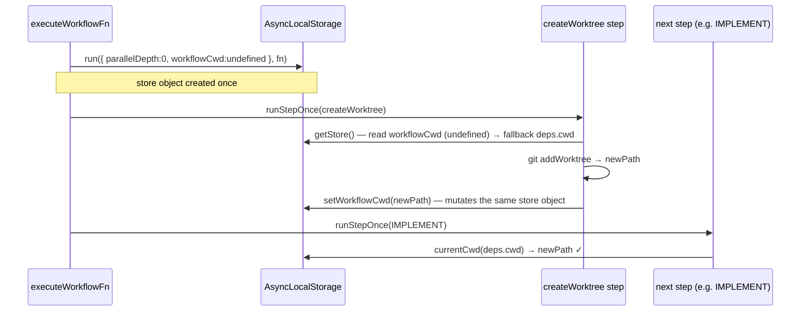

# `createWorktree()` step primitive

> The brainstorm at [`docs/sessions/orch-git-helpers/brainstorm.md`](./brainstorm.md) decides the *what* and *why*. This document derives the phased *how*.

## Overview

Add `createWorktree(branch, opts)` — a workflow DSL primitive that materialises a git worktree as a memoizable, resumable step. The step composes with everything that already exists (`run()`, `parallel()`, validators, resume) and follows the precedent set by `commit()` in Phase 10.

The shape:

```ts
// Required: `enter` — true switches the workflow's cwd, false keeps it.
await run(createWorktree('feat/foo', { enter: true }))
await run(IMPLEMENT)            // runs inside the worktree
await run(commit('done'))       // commits inside the worktree

// `enter: false` keeps the original cwd.
await run(createWorktree('feat/foo', { enter: false }))
```

Returns `Step<WorktreeResult>` where `WorktreeResult` is `{ path, branch, fromRef }`. Memoization is the single safety net for replay; conflict policy is strict.

## Problem Statement

Multi-branch workflows (research-in-parallel, work-in-isolation, review-against-baseline) need a worktree per branch. Today, authors either drop down to `Bash`-style escape hatches (which violate rule #1 — subprocess isolation) or run multi-CLI flows from outside `orch`. A first-class step removes both temptations:

- **Memoization comes free.** Replay/resume hits the cache; the worktree isn't recreated, `bun install` doesn't re-run.
- **State is auditable.** Worktree creation lands in `state.json` alongside other steps.
- **Composes with `parallel()`** — branches each create their own worktree, isolated by AsyncLocalStorage scope.
- **Mirrors the `commit()` precedent.** Same execution model, same security shape, same testing strategy.

## Proposed Solution

### User-facing API

```ts
import { createWorktree } from '@orch/core'

await run(createWorktree('feat/foo', { enter: true }))                        // off HEAD
await run(createWorktree('feat/foo', { enter: true, from: 'main' }))          // off main
await run(createWorktree('feat/foo', {                                         // sibling default
  enter: true,
  postCreate: ['cp $ORIGIN/.env .', 'bun install'],
}))
await run(createWorktree('feat/foo', {                                         // callback form
  enter: false,
  target: '/tmp/wts',
  postCreate: async ({ origin, target, exec }) => {
    await exec(['cp', `${origin}/.env`, `${target}/.env`])
    await exec(['bun', 'install'])
  },
}))
```

### Decisions inherited from the brainstorm (verbatim, kept here for self-contained review)

| # | Decision | Rationale |
|---|---|---|
| 1 | Single factory; `enter` is required (no default) | Side effect is explicit at every call site. One factory beats two. |
| 2 | cwd switch via `AsyncLocalStorage` | Reuses existing `executionContext`. No changes to runner contracts. |
| 3 | Target = parent dir; leaf is auto-named `<projectName>--<sanitizedBranch>` | Disambiguates layout; predictable paths. |
| 4 | Strict conflict policy | Memoization is the only replay safety net; no silent reuse. |
| 5 | `HEAD` by default; `from` overrides | Matches `git worktree add -b`. |
| 6 | No automatic teardown (v1) | User cleans up via `git worktree remove`. |
| 7 | `postCreate` hook (string[] sugar OR callback) | Sugar covers 90% of cases (`cp $ORIGIN/.env .`, `bun install`); callback is the escape hatch. |
| 8 | Reserved step-name prefix `worktree:` | Same shape as `commit:`. `enter` not part of identity. |
| 9 | Return type `WorktreeResult { path, branch, fromRef }` | JSON-serializable, fits `StepEntry.value`. |

### Open questions resolved in this plan

| # | Question | Resolution |
|---|---|---|
| 1 | Cache-hit verification (worktree path exists on disk)? | **No.** Strict, simple. Cache hit = cache hit. If user removed the worktree on disk, they must also clear state. Document in JSDoc. |
| 2 | `parallel()` × `enter: true` isolation | Each homogeneous branch gets its own ALS object (Phase 2). Mutation is per-branch. Heterogeneous form leaks (same gotcha shape as `parallelDepth`) — but cwd corruption is a higher-severity class than a missing roll-up event, so this plan adds a **hard runtime guard**: `setWorkflowCwd` throws when called outside a homogeneous-branch scope while `parallelDepth > 0`. Users must use the homogeneous form inside `parallel()`. |
| 3 | Branch sanitization rules | Lowercase → collapse `[^a-z0-9]+` to `-` → strip leading/trailing `-`. Reject empty result. **Mirrors `commit()` slug rules verbatim.** Add a one-line cross-reference comment in both `commit.ts` and `worktree.ts` so the next person doesn't write a third copy. Unicode normalization is *not* applied (parity with `commit()`); ligatures collapse, control chars strip — same as today. |
| 4 | Project name source | `git rev-parse --show-toplevel` then `basename`. New `GitService.repoRoot(cwd)`; basename computed in core. (Brainstorm line 122 listed `repoName` as a service method — **superseded** by basename-in-core; one method, derived in core.) |
| 5 | State persistence | `WorktreeResult` is JSON-serializable. No state-store changes; existing `StepEntry.value: unknown` accepts it. |
| 6 | Sandbox / nested git | Out of scope. Sibling target lands outside an outer parent repo — flag in JSDoc. |
| 7 | Partial-failure cleanup | Out of scope. Strict policy means user must `git worktree remove --force` and re-run. Documented. |
| 8 | Shell semantics for sugar form | Each line invoked via `/bin/sh -c <line>` with `ORIGIN` and `TARGET` as env vars. Single subprocess per line. Windows out of scope (track if it bites). |
| 9 | Workflow-level default `postCreate` in `orch.config.ts` | YAGNI. Every call passes its own. Revisit if duplication grows. |
| 10 | Cache-hit factoring for `enter: true` | **Generalized hook**, not a kind-specific branch in the dispatcher. Every step kind gets a `onCacheHit(cached, deps)` method. For `agent` it stays the existing `revalidateCachedValue` path; for `commit` it's a no-op; for `worktree` it calls `setWorkflowCwd(cached.path)` when `enter` is true. Dispatcher stays kind-agnostic by shape. |
| 11 | New error class for conflicts? | **No.** Throw `GitCommandError` directly with `branch`/`path` in the message body. The brainstorm line 155 explicitly says "clear `GitCommandError`"; introducing a `WorktreeConflictError` subclass purely for `instanceof` symmetry is decoration. Pre-flight detection (`branchExists`, `worktreePathExists`) emits a clearly-worded error; nothing else changes. |

## Technical Approach

### Architecture

#### `GitService` expansion (`src/services/git/git-service.ts`)

Five new methods. `repoRoot` and `worktreePathExists` are read-only; `addWorktree` is the only write.

| Method | Signature | Git command | Notes |
|---|---|---|---|
| `repoRoot` | `(cwd: Path) => Promise<Path>` | `git rev-parse --show-toplevel` | Absolute path of the working tree root. |
| `branchExists` | `(cwd: Path, branch: string) => Promise<boolean>` | `git show-ref --verify --quiet refs/heads/<branch>` | exit 0 = exists, 1 = absent, ≥2 = error. |
| `worktreePathExists` | `(cwd: Path, path: Path) => Promise<boolean>` | `git worktree list --porcelain` parsed for `worktree <path>` | More robust than `fs.exists` (catches registered-but-pruned). |
| `addWorktree` | `(cwd: Path, opts: { branch, path, fromRef }) => Promise<void>` | `git worktree add -b <branch> <path> <fromRef>` | Single method = single executor call. No follow-up `rev-parse`: the SHA isn't surfaced anywhere today (YAGNI; expose `WorktreeResult.headSha` later if a validator actually needs it). |

`WorktreeResult.fromRef` is the *requested* ref string ("HEAD" by default, or user-provided). The resolved SHA is not captured; if a future validator needs it, add a single `git rev-parse HEAD` follow-up at that point and surface it on `WorktreeResult.headSha`.

All methods follow existing `BunGitService` patterns: DI via `ProcessService`, `buildGitEnv()`, `redactStderr()`, throw `GitCommandError`.

**Argument safety:**
- `branch` is validated by the factory before reaching git (reject empty, control chars, leading `-`).
- `path` is built from validated components; passed via argv (no shell).
- `fromRef` is passed via argv; git itself rejects invalid refs.

#### `StepConfig` discriminated union (`src/core/step.ts`)

Add a third variant:

```ts
export interface WorktreeStepConfig {
  readonly kind: 'worktree'
  readonly branch: string
  readonly enter: boolean
  readonly fromRef?: string
  readonly target?: string                       // 'sibling' | relative | absolute
  readonly postCreate?: PostCreateHook
}

export type StepConfig<T = unknown> =
  | AgentStepConfig<T>
  | CommitStepConfig
  | WorktreeStepConfig

export type PostCreateHook =
  | ReadonlyArray<string>                        // sugar
  | ((ctx: PostCreateCtx) => Promise<void>)      // callback

export interface PostCreateCtx {
  readonly origin: Path                          // original repo root
  readonly target: Path                          // new worktree path
  readonly exec: (argv: readonly string[], opts?: { readonly cwd?: Path }) => Promise<void>
}

// Thrown by the `exec` wrapper on non-zero exit; lives in src/core/worktree.ts.
export class PostCreateExecError extends Error {
  readonly argv: readonly string[]
  readonly exitCode: number
  readonly stderr: string
}
```

`PostCreateExecError` gives callers something programmatically discriminable (vs an opaque `Error('exit 1')`). Hook callbacks can `catch (e) { if (e instanceof PostCreateExecError) ... }` if they want partial-failure handling, though strict policy still fails the step.

`step.define()` adds `worktree:` to the reserved-prefix list (currently `['commit:']`).

#### `WorktreeResult` + `createWorktree()` factory (`src/core/worktree.ts`, new file)

```ts
export interface WorktreeResult {
  readonly path: Path
  readonly branch: string                        // canonical, unsanitized
  readonly fromRef: string                       // 'HEAD' or user-provided ref
}

export interface CreateWorktreeOpts {
  readonly enter: boolean
  readonly from?: string
  readonly target?: string                       // default 'sibling'
  readonly postCreate?: PostCreateHook
}

export function createWorktree(
  branch: string,
  opts: CreateWorktreeOpts,
): Step<WorktreeResult>
```

Factory validations (all at construction time, mirror `commit()`):
- Non-empty, non-whitespace, no null bytes, no newlines.
- Branch sanitized to non-empty `[a-z0-9-]+` (otherwise throw with the same error shape as `commit()`).
- Total step name ≤ 128 chars (`worktree:` prefix accounted for; ≤ 119 slug chars).
- `postCreate` (if string[]) — every line is a non-empty string. Empty array allowed (no-op).
- `target` — if string and not the literal `'sibling'`, validated as a non-empty path.
- `from` — if present, non-empty and no whitespace.
- Returns frozen `Step` (matches `step.define()` and `commit()` behaviour).

Slugification is inline (YAGNI — same regex as `commit()`). Add a one-line cross-reference comment in both files (`// Slug rules mirror src/core/commit.ts:18-22 — keep in sync.`) so the next person doesn't write a third copy. If a third caller appears, extract.

Step name: `worktree:feat-foo`. `enter` is **not** part of the name — toggling it must not create two cache entries.

#### Scoped cwd via `AsyncLocalStorage` (`src/core/execution-context.ts`)

Today `ExecutionContext = { readonly parallelDepth: number }`. Add a mutable `workflowCwd?: Path` field — explicitly **not** `readonly` on this one field; the rest of the interface stays `readonly`:

```ts
export interface ExecutionContext {
  readonly parallelDepth: number
  workflowCwd?: Path           // mutated by setWorkflowCwd; readers use currentCwd()
  readonly homogeneousBranch?: true  // marker set by parallelHomogeneous wrapper
}
```

(The `homogeneousBranch` marker enables the hard guard below.) Two helpers:

```ts
// readonly read with fallback — used everywhere the executor reads cwd today
export function currentCwd(fallback: Path): Path
// scoped writer — throws if invoked outside a homogeneous-branch scope while parallelDepth > 0
export function setWorkflowCwd(path: Path): void
```

`setWorkflowCwd` mutates the current ALS store object. The store is created once per scope, so:
- Top-level workflow body — wrapped in `executionContext.run({ parallelDepth: 0, workflowCwd: undefined }, fn)` by `executeWorkflowFn`.
- Each homogeneous parallel branch — wrapped in a *fresh* store with `homogeneousBranch: true` and inheriting `workflowCwd` from the outer scope.
- Heterogeneous parallel branches — would otherwise share the outer scope (same gotcha as `parallelDepth`). **Hard guard**: `setWorkflowCwd` checks `(parallelDepth > 0 && !homogeneousBranch)` and throws `Error('createWorktree({ enter: true }) requires the homogeneous parallel form')`. Cwd corruption is too silent and too high-impact to leave on documentation alone.

Reads everywhere in `workflow.ts` change from `deps.cwd` to `currentCwd(deps.cwd)`. The grep needs to be re-run at Phase-2 implementation time and the count reconciled — the references list at the bottom of this plan cites 11 sites; the prose says 14; the implementer should grep fresh and confirm before editing. (Alternative considered and deferred: turn `WorkflowDeps.cwd` into a getter that does the ALS lookup internally — cuts the diff to 0 sites but conflates the dep shape with runtime state. Implementer's call.)



#### Executor branch (`src/core/workflow.ts` + `src/core/worktree.ts`)

`runStepOnce` adds a third case:

```ts
case 'worktree':
  result = await runWorktreeStep(deps, config, key, overrides)
  break
```

`runWorktreeStep` lives in `worktree.ts` next to the factory because they share types (`WorktreeStepConfig`, `WorktreeResult`, `PostCreateHook`) — **cohesion**, not file-budget bookkeeping. Keeping the worktree step's runner in `workflow.ts` would split a single concept across two files for no win. (`workflow.ts` is currently overrun against the 300-line guideline, but that's a separate cleanup that deserves its own plan; this plan does not justify itself by avoiding growth there.)

Sequence inside `runWorktreeStep`:

1. Reject `prompt` / `extraContext` / `extraPrompt` overrides (same as commit step).
2. Read `cwd = currentCwd(deps.cwd)` — the *current* repo root, may itself be inside a worktree from a parent step (nested-worktree case).
3. Resolve target path:
   - `repoRoot = await git.repoRoot(cwd)`; `projectName = basename(repoRoot)`.
   - `parent = resolveParent(target, repoRoot)` (sibling default → `dirname(repoRoot)`; relative → `path.resolve(repoRoot, target)`; absolute → as-is).
   - `targetPath = path.join(parent, `${projectName}--${sanitizedBranch}`)`.
4. Strict conflict checks (in order):
   - `await git.branchExists(cwd, branch)` → if true, throw `GitCommandError(0, '', `worktree: branch '${branch}' already exists`)`.
   - `await git.worktreePathExists(cwd, targetPath)` → if true, throw `GitCommandError(0, '', `worktree: path '${targetPath}' is already registered`)`.
   - (Synthetic `exitCode: 0` and empty `stderr` are honest about "no git command was run"; the message is the actionable signal.)
5. Create: `await git.addWorktree(cwd, { branch, path: targetPath, fromRef: from ?? 'HEAD' })`.
6. Run `postCreate` hook (see below). Failure inside the hook → propagate; the worktree on disk is left for the user to inspect (strict policy).
7. If `enter: true` → `setWorkflowCwd(targetPath)`.
8. Persist `StepEntry`:
   - `value = { path: targetPath, branch, fromRef: from ?? 'HEAD' }`
   - `validations: []`
   - no `preRunSnapshot`
9. Return the `WorktreeResult`.

**Cache-hit factoring** — generalized `onCacheHit`, not a kind-specific dispatcher branch.

Today `runStepOnce` has a small kind-aware path for the `agent`-only `revalidateCachedValue` (workflow.ts:959). Rather than adding a *second* kind-aware branch (one for agent revalidate, one for worktree cwd-restore), this plan extracts a uniform per-kind hook:

```ts
// Implemented in src/core/step.ts (or a tiny step-kinds module)
function onCacheHit(config: StepConfig, cached: StepEntry, deps: WorkflowDeps): void
// agent kind: triggers revalidateCachedValue (same effect as today)
// commit kind: no-op
// worktree kind: if config.enter === true, setWorkflowCwd(cached.path as Path)
```

The dispatcher calls `onCacheHit(config, cached, deps)` once on the cache-hit path — kind-agnostic by shape, exhaustive switch lives in one helper. This kills the "only kind-specific cache-hit hook in the codebase" smell and stops the next step primitive from accreting a third special case. Without the cwd-restore on cache hit, replay would skip the body but subsequent steps would run in the wrong cwd.

#### `postCreate` runner (`src/core/worktree.ts`)

```ts
async function runPostCreate(
  hook: PostCreateHook,
  ctx: { origin: Path; target: Path; processService: ProcessService },
): Promise<void>
```

Two paths:

- **Sugar form** (`string[]`) — for each line, spawn `['/bin/sh', '-c', line]` via `ProcessService` with `cwd: target`, env override `{ ORIGIN: origin, TARGET: target }` merged via `mergeEnv(process.env, ...)`. Lines run sequentially; first non-zero exit aborts. Drain stdout/stderr (line-framed) into the executor's structured spawn log so failures surface usefully.
- **Callback form** — call the user's function with `{ origin, target, exec }` where `exec(argv, opts?)` is a thin wrapper that calls `processService.spawn({ argv, cwd: opts?.cwd ?? target, env })` and rejects on non-zero exit. Workflow authors never import `child_process` — non-negotiable rule #1.

Failure model: any non-zero exit / thrown error → step fails (same shape as agent / commit failure). The strict policy means a retry sees the existing worktree path and errors; user must `git worktree remove --force <path>` and rerun, OR delete the run state and start fresh.

Memoization: the hook is part of the step's atomic outcome. Cache hit on replay skips creation **and** the hook. `bun install` doesn't re-run on resume. Important for fresh-machine resume: if state persists but the worktree dir was wiped (machine reinstall), the cache hit returns a stale path; this is the documented strict-mode tradeoff (Open Question 1 above).

Output streaming: the hook's subprocess output is captured the same way agent spawn logs are — through the existing `stepSpan.append('spawns', ...)` path. No new observability surface.

#### Conflict errors

No new error class. The pre-flight checks throw `GitCommandError` directly with a clearly worded message and synthetic `exitCode: 0` (since no git command actually ran). The brainstorm acceptance criterion (line 155) calls for "a clear `GitCommandError`" — that's what callers get. If a future caller needs to programmatically discriminate "conflict" from "git failed mid-operation", revisit.

#### `FakeGitService` expansion

```ts
setRepoRoot(cwd: Path, root: Path): void
setBranchExists(cwd: Path, branch: string, exists: boolean): void
setWorktreePathExists(cwd: Path, path: Path, exists: boolean): void
// addWorktree returns void; the fake just records that it was called and lets test
// scripts assert via the standard FakeGitService spy surface.
```

Same per-cwd map + setter pattern; unscripted lookups throw loud errors.

#### Barrel exports

`src/core/index.ts` adds: `createWorktree`, `WorktreeResult`, `CreateWorktreeOpts`, `WorktreeStepConfig`, `PostCreateHook`, `PostCreateCtx`, `PostCreateExecError`.
`src/services/git/index.ts` — no new exports (no new error class).

## Implementation Phases

Each phase is a PR-sized slice. Land in order. `bun run check` must pass at every phase boundary. **Phase count reduced from 8 → 5** after review feedback: the previous Phases 3+4+5 created a "broken main window" (Phase 3 landed a `throw 'not implemented'` switch case; Phase 4 landed a factory whose execution wired in Phase 5), and the previous Phase 8 (docs-only) is now a DoD item on Phase 3.

### Phase 1 — `GitService` port + `BunGitService` + `FakeGitService` expansion

**Files:** `src/services/git/git-service.ts`, `bun-git-service.ts`, `fake-git-service.ts`, `index.ts`.

**Tests (write first):**

`tests/unit/services/git/bun-git-service.test.ts`:
- `repoRoot returns the absolute path from git rev-parse --show-toplevel`.
- `repoRoot throws GitCommandError when git fails`.
- `branchExists returns true when show-ref exits 0`.
- `branchExists returns false when show-ref exits 1`.
- `branchExists throws GitCommandError when show-ref exits with code ≥ 2`.
- `worktreePathExists returns true when the path appears in git worktree list --porcelain`.
- `worktreePathExists returns false when the path is absent`.
- `addWorktree spawns git worktree add -b <branch> <path> <fromRef> with buildGitEnv applied`.
- `addWorktree redacts stderr on failure before throwing GitCommandError`.
- `addWorktree resolves to undefined on success (returns void)`.

`tests/unit/services/git/fake-git-service.test.ts`:
- `setRepoRoot scripts repoRoot returns`.
- `setBranchExists scripts branchExists returns per branch`.
- `setWorktreePathExists scripts worktreePathExists returns per path`.
- `unscripted addWorktree throws a loud error`.
- `scripted addWorktree resolves and records the spawn for assertion`.

**Definition of Done:** `bun run check` passes. No call sites in `src/core/` reference the new methods yet.

---

### Phase 2 — Scoped cwd via `AsyncLocalStorage` + hard guard

**Files:** `src/core/execution-context.ts`, `src/core/parallel.ts`, `src/core/workflow.ts`.

Changes:
- Extend `ExecutionContext`: add mutable `workflowCwd?: Path` and readonly `homogeneousBranch?: true` marker.
- Add `currentCwd(fallback)` and `setWorkflowCwd(path)` helpers. `setWorkflowCwd` throws if invoked outside a homogeneous-branch scope while `parallelDepth > 0` (hard guard against silent cwd corruption in heterogeneous parallel).
- `executeWorkflowFn` wraps `fn(run, args)` in `executionContext.run({ parallelDepth: 0, workflowCwd: undefined }, ...)`.
- `parallelHomogeneous` creates each branch's fresh store with `homogeneousBranch: true`, inheriting `workflowCwd` from the outer store at branch start.
- Replace all `deps.cwd` reads inside step execution paths with `currentCwd(deps.cwd)`. **Re-grep at implementation time and reconcile the count** (prose says 14, references list shows 11). Implementer may consider the alternative of a `WorkflowDeps.cwd` getter (cuts diff size, conflates dep shape with runtime state) — explicit decision to be recorded in the PR description.

**Tests:** `tests/unit/core/execution-context.test.ts` (new):
- `currentCwd returns the fallback when no store is active`.
- `currentCwd returns the fallback when workflowCwd is undefined inside an active store`.
- `currentCwd returns workflowCwd when set inside the store`.
- `setWorkflowCwd mutates the active store and persists across awaits inside the same scope`.
- `setWorkflowCwd in a homogeneous parallel branch does not leak to a sibling branch`.
- `setWorkflowCwd in a heterogeneous parallel branch throws (hard guard against silent cwd corruption)`.
- `parallel branches inherit outer workflowCwd at start`.

`tests/unit/core/workflow.test.ts` — extend the existing executor tests:
- `agent step reads currentCwd, defaulting to deps.cwd`.
- `agent step honors a workflowCwd set by an earlier step` (use a manual `setWorkflowCwd` at test setup; the worktree step is added in Phase 3).

**Definition of Done:** `bun run check` passes. Existing tests green. The cwd-read site count reconciliation is documented in the PR description.

---

### Phase 3 — `createWorktree()` end-to-end (factory + union + executor + postCreate + onCacheHit + docs)

**Files (added/changed in one PR):**
- `src/core/step.ts` — `WorktreeStepConfig`, `PostCreateHook`, `PostCreateCtx`, `PostCreateExecError`; `StepConfig` union; reserved-prefix list grows to `['commit:', 'worktree:']`; `onCacheHit(config, cached, deps)` per-kind dispatch helper (replaces existing kind-aware code on the cache-hit path).
- `src/core/worktree.ts` (new) — factory, `WorktreeResult`, `runWorktreeStep`, `runPostCreate`.
- `src/core/workflow.ts` — switch case for `'worktree'`; cache-hit path delegates to `onCacheHit(config, cached, deps)`.
- `src/core/index.ts` — barrel exports.
- `docs/getting-started.md` — one-paragraph example showing `createWorktree` + `commit` together. The example must be a real workflow file under `examples/` so it compiles in CI; the doc embeds it via include or copy-paste-with-a-link.
- `docs/plans/implementation-phases.md` — add a numbered phase block referencing this plan and the brainstorm.

**Why one PR**: previous draft split this into Phases 3 (union + temporary `throw 'not implemented'`), 4 (factory only), 5 (executor wiring). That created a window where `createWorktree` was importable but unrunnable — a real footgun, and a placeholder throw is not the kind of intermediate state we want on `main`. Cohesion (factory + runner + types) belongs together.

**Tests (write first):** all unit, all `FakeGitService` + `FakeProcessService`, no `mock.module`/`vi.mock`/`jest.mock`.

`tests/unit/core/step.test.ts` (extended):
- `step.define rejects names starting with the reserved worktree: prefix`.
- `step.define rejects both reserved prefixes (table-driven)`.
- `onCacheHit dispatches per kind: agent triggers revalidate, commit is no-op, worktree with enter:true calls setWorkflowCwd`.

`tests/unit/core/worktree.test.ts` (new) — factory:
- `derives step name from branch: feat/foo becomes worktree:feat-foo`.
- `config carries kind 'worktree'`.
- `preserves the original (unsanitized) branch in config`.
- `preserves enter, from, target, postCreate in config`.
- `returns a frozen Step object`.
- `// @ts-expect-error covers missing enter` (one-line type assertion in the test, no separate type-test framework).
- `throws for an empty branch`.
- `throws for a whitespace-only branch`.
- `throws for a branch containing null bytes`.
- `throws for a branch containing newlines`.
- `throws for an all-punctuation branch that sanitizes to empty`.
- `accepts a branch sanitizing to exactly 119 chars (the 128 - "worktree:".length cap)`.
- `accepts a branch sanitizing to exactly 1 char (lower boundary)`.
- `throws for a branch whose sanitized form exceeds 119 chars`.
- `lowercases the branch when building the slug`.
- `collapses slashes and other separators to single dashes`.
- `strips leading and trailing dashes from the slug`.
- `sanitizes branches with leading control chars to a clean slug (parity with commit())`.
- `sanitizes Unicode ligatures by lowercase-then-strip-non-ascii (parity with commit())`.
- `accepts postCreate as string array (sugar)`.
- `accepts postCreate as async callback`.
- `throws when postCreate string array contains an empty string`.
- `throws when from is whitespace-only`.
- `throws when target contains null bytes`.
- `throws when target contains newlines`.
- `accepts the literal target "sibling"`.
- `accepts target as a relative path`.
- `accepts target as an absolute path`.

`tests/unit/core/worktree-executor.test.ts` (new) — runner:

Happy paths:
- `creates a worktree at the sibling default and persists WorktreeResult to state.json`.
- `enter: true mutates the workflow cwd for subsequent run() calls`.
- `enter: false leaves the workflow cwd unchanged`.
- `from override drives git addWorktree fromRef argument`.
- `target as an absolute path resolves the leaf inside that directory`.
- `target as a relative path resolves the leaf relative to repoRoot`.
- `inside an active worktree (nested), createWorktree resolves repoRoot from currentCwd, not deps.cwd`.

Conflicts:
- `throws GitCommandError when branchExists returns true`.
- `throws GitCommandError when worktreePathExists returns true`.
- `does not call git addWorktree when a conflict is detected (negative boundary)`.

postCreate hook:
- `runs each sugar line via /bin/sh -c with ORIGIN and TARGET in env`.
- `runs sugar lines sequentially (second line waits for first to exit)`.
- `aborts subsequent sugar lines on first non-zero exit and fails the step`.
- `callback receives origin, target, and exec (cwd defaults to target)`.
- `exec wrapper rejects with PostCreateExecError on non-zero exit`.
- `step fails when postCreate callback throws`.
- `step does not call setWorkflowCwd when postCreate fails (cwd unchanged)`.

Memoization & cache-hit:
- `step is memoized on resume — replay returns cached WorktreeResult without calling git`.
- `cache hit with enter: true sets workflowCwd before the next run() call observes cwd`.
- `cache hit with enter: false does not mutate workflow cwd`.

Override rejection:
- `throws when prompt override is provided`.
- `throws when extraContext override is provided`.
- `throws when extraPrompt override is provided`.

Negative boundary:
- `does not invoke any Runner` (assert via `FakeRunner.invocationCount` stays at 0).

**Definition of Done:** `bun run check` passes. `runWorktreeStep` ≤ 60 lines; `worktree.ts` ≤ 300 lines (split if it overshoots — `runPostCreate` is the natural extraction). Roadmap entry landed; getting-started example landed and compiled in CI.

---

### Phase 4 — Integration test (mocked edges)

**Files:** `tests/integration/core/worktree-mocked.test.ts` (new).

Full workflow, `FakeGitService` + `FakeProcessService`, no internal mocks. Each scenario must add coverage that the unit suites in Phase 3 do not already prove (the reviewer feedback identified Phase 6/Phase 5 duplication; this trimmed list is the survivors).

Scenarios:
- `state.json shape: createWorktree(enter: true) followed by an agent step writes both StepEntry rows with expected shape`.
- `parallel(items, fn) — homogeneous branches each create their own worktree; branches do not see each other's cwd; final state.json holds N parallel entries`.
- `parallel branches that crashed mid-execution resume on a fresh process: each branch hits its cache and reapplies its cwd switch in its own ALS scope`.
- `resume crashed inside postCreate re-runs the entire step (strict — no partial cache)`.

**Definition of Done:** `bun run check` passes.

---

### Phase 5 — Integration test (real git, auto-skip when git missing)

**Files:** `tests/integration/core/worktree-real.test.ts` (new). Reuses `tempGitRepo()` from `tests/integration/core/commit-real.test.ts` — extract to `tests/helpers/temp-git-repo.ts` on first reuse.

Scenarios:
- `creates a real worktree at sibling location with branch off HEAD; git worktree list reflects it`.
- `from: "main" creates a worktree based off main`.
- `enter: true; subsequent commit step lands a commit on the new branch (verify with git log inside the worktree)`.
- `postCreate sugar with $ORIGIN and $TARGET expansion runs cp / touch and verifies file existence`.
- `pre-existing branch produces a clear GitCommandError`.
- `pre-existing worktree path produces a clear GitCommandError`.

(Note: cache-hit replay is covered by Phase 3 and Phase 4. The real-git layer should not re-prove memoization — when cache hits, no git is invoked, so the real layer has nothing to observe.)

`afterEach` removes worktrees with `git worktree remove --force` then deletes the temp dirs.

**Definition of Done:** `bun run check` passes. Auto-skips when `git --version` fails. No `RUN_REAL_*` env gate needed (this is git, not an LLM CLI — the `commit-real.test.ts` precedent runs unconditionally when git is present).

## Acceptance Criteria

(Type-system / lint / file-size constraints are enforced by `bun run check` and CLAUDE.md and are not restated here. This list is *runtime-observable* outcomes a reviewer must verify by reading tests or executing a workflow.)

### Functional Requirements

- [x] `GitService.repoRoot(cwd)` returns the worktree root absolute path.
- [x] `GitService.branchExists(cwd, branch)` distinguishes 0/1/error correctly.
- [x] `GitService.worktreePathExists(cwd, path)` parses `git worktree list --porcelain`.
- [x] `GitService.addWorktree(cwd, opts)` creates the worktree (returns void on success).
- [x] `createWorktree(branch, opts)` returns `Step<WorktreeResult>` with step name `worktree:<sanitized-branch>`.
- [x] Empty / whitespace / null-byte / newline branches throw at construction.
- [x] All-punctuation branch (sanitizes to empty) throws at construction.
- [x] Sanitized branch ≤ 119 chars (128 - `'worktree:'.length`).
- [x] `target` containing null bytes or newlines throws at construction.
- [x] `step.define('worktree:foo', ...)` throws (reserved prefix).
- [x] `enter: true` mutates ALS-scoped cwd for every subsequent `run()` call.
- [x] `enter: false` leaves ALS-scoped cwd untouched.
- [x] Cache-hit replay with `enter: true` reapplies `setWorkflowCwd(cached.path)` via the kind-agnostic `onCacheHit` dispatch (no kind-specific branch in `runStepOnce`).
- [x] `setWorkflowCwd` throws when called inside a heterogeneous-parallel scope (hard guard, not just docs).
- [x] Pre-existing branch → clear `GitCommandError` (no new error class).
- [x] Pre-existing worktree path → clear `GitCommandError`.
- [x] `postCreate` sugar runs each line via `/bin/sh -c` with `ORIGIN`/`TARGET` env vars.
- [x] `postCreate` callback receives `{ origin, target, exec }`; `exec` rejects with `PostCreateExecError` on non-zero exit.
- [x] Hook failure fails the step (and is *not* memoized).
- [x] Successful step (incl. hook) is memoized — replay skips both creation and hook.
- [x] Step rejects `prompt` / `extraContext` / `extraPrompt` overrides (same as commit step).
- [x] `parallel(items, fn)` homogeneous branches each create their own worktree without leaking cwd to siblings.
- [x] Nested case: a `createWorktree` invoked while another is active resolves `repoRoot` from `currentCwd`, not `deps.cwd`.

### Non-Functional Requirements

- [x] `runWorktreeStep` ≤ 60 lines (cited explicitly because it's the load-bearing function and a deliberate scope boundary).
- [x] `buildGitEnv()` is applied to every git operation; failure paths run `redactStderr()` before throwing.
- [x] `createWorktree()` JSDoc documents the four gotchas: secret-staging risk, stale-path-on-disk-wiped tradeoff, heterogeneous-parallel guard, nested-git/sibling-outside-parent-repo limitation.

### Quality Gates

- [x] `bun run check` green at every phase boundary.
- [x] Unit: GitService methods (Phase 1), execution-context helpers (Phase 2), factory + executor + onCacheHit (Phase 3).
- [x] Integration (mocked edges): state.json shape, parallel isolation, parallel resume, postCreate-failure resume (Phase 4).
- [x] Integration (real git, auto-skip without git): end-to-end including postCreate sugar and conflict paths (Phase 5).
- [ ] Each phase's PR description lists tests added at each layer.

## Surface area touched

- `src/services/git/git-service.ts` — port grows by 4 methods (`repoRoot`, `branchExists`, `worktreePathExists`, `addWorktree`).
- `src/services/git/bun-git-service.ts` — 4 new method implementations.
- `src/services/git/fake-git-service.ts` — 3 new setters (`setRepoRoot`, `setBranchExists`, `setWorktreePathExists`) + matching scripted gets; `addWorktree` is recorded but takes no scripted return value.
- `src/services/git/index.ts` — no new exports (no new error class).
- `src/core/execution-context.ts` — mutable `workflowCwd?: Path`, readonly `homogeneousBranch?: true`, `currentCwd` / `setWorkflowCwd` helpers (with hard guard against heterogeneous-parallel misuse).
- `src/core/parallel.ts` — homogeneous-branch wrapper sets `homogeneousBranch: true` on each branch's store and inherits outer `workflowCwd`.
- `src/core/step.ts` — `WorktreeStepConfig`, `PostCreateHook`, `PostCreateCtx`, `PostCreateExecError`; `StepConfig` union; reserved-prefix list grows; `onCacheHit(config, cached, deps)` dispatch helper.
- `src/core/worktree.ts` — **new file**: factory, `WorktreeResult`, `runWorktreeStep`, `runPostCreate`.
- `src/core/workflow.ts` — `executeWorkflowFn` wraps in ALS; switch case for `worktree`; cache-hit path delegates to `onCacheHit`; `deps.cwd` → `currentCwd(deps.cwd)` at all execution-path read sites.
- `src/core/index.ts` — barrel exports.
- `docs/getting-started.md` — one-paragraph example backed by a real workflow file in `examples/` so it compiles.
- `docs/plans/implementation-phases.md` — new phase block.

## Dependencies & Risks

**Dependencies:**
- Phase 6 `GitService` port (landed).
- Phase 8 `parallel()` (landed) — its ALS scope is the model the worktree step extends.
- Phase 10 `commit()` (landed) — same execution shape, same testing patterns. Read its plan (`docs/plans/2026-04-13-feat-phase-10-git-commit-primitive-plan.md`) before starting Phase 1.
- Phase 11 resume (landed) — memoization/replay semantics already wired.

**Risks:**

| Risk | Mitigation |
|---|---|
| **`workflow.ts` already 1058 lines** | All worktree-step logic lives in `worktree.ts` (cohesion, not budget — the file growth is incidental). The dispatcher only grows by one switch case + the existing kind-aware code is generalized into `onCacheHit`. CLAUDE.md rule is "warning, not error" with a comment. |
| **ALS mutation across heterogeneous parallel** | Hard runtime guard — `setWorkflowCwd` throws when `parallelDepth > 0 && !homogeneousBranch`. Cwd corruption is a higher-severity failure class than `parallelDepth`'s missing roll-up event; documentation alone is insufficient. JSDoc still recommends the homogeneous form. |
| **Cache-hit returning a stale path** | Strict by design (Open Question 1). Document in JSDoc + getting-started note. Future `verify-on-cache-hit` opt-in is plausible but YAGNI. |
| **postCreate fails after worktree creation** | Strict — leftover dir blocks retry until user `git worktree remove --force`. Document the recovery procedure. Acceptable for v1; revisit if it bites. |
| **Shell-based sugar form on Windows** | Out of scope. JSDoc says POSIX shell only; callback form is the cross-platform escape hatch. |
| **Branch-name sanitization collisions** (`feat/foo` and `feat-foo` both → `feat-foo`) | Acceptable. Step name is for cache identity; the unsanitized `branch` in the result preserves the original. Conflict policy throws if the second call hits the same target path. |
| **Slug-rule drift between `commit()` and `createWorktree()`** | Cross-reference comments in both files (`// Slug rules mirror src/core/commit.ts:18-22 — keep in sync.`). Extract on the third caller, not the second. |
| **Phase 3 PR is large** | Acknowledged tradeoff. Splitting into 3a/3b/3c was the original plan; reviewers flagged the broken-window risk between PRs (importable factory with no executor) as worse than a one-time large PR. Tests are written first; the PR is reviewable in passes by section. |

## Out of Scope

- Removing worktrees (future `removeWorktree(branch)` step).
- Pruning stale worktrees on workflow start.
- Pushing the branch to a remote.
- Switching back to the original cwd mid-workflow (would require `leaveWorktree()` or a scope block).
- Workflow-level default `postCreate` in `orch.config.ts`.
- Windows shell semantics for sugar-form `postCreate`.
- Cache-hit on-disk verification.
- Any change to `commit()`, validators, or runner contracts.

## References

### Internal

- Brainstorm: [`docs/sessions/orch-git-helpers/brainstorm.md`](./brainstorm.md)
- Phase 10 plan (precedent): [`docs/plans/2026-04-13-feat-phase-10-git-commit-primitive-plan.md`](../../plans/2026-04-13-feat-phase-10-git-commit-primitive-plan.md)
- `commit()` factory: `src/core/commit.ts:38-65`
- `StepConfig` union: `src/core/step.ts:44-49`
- Reserved prefix guard: `src/core/step.ts:56-93`
- Executor dispatch: `src/core/workflow.ts:948-994`
- Existing `runCommitStep`: `src/core/workflow.ts:894-942`
- `executionContext`: `src/core/execution-context.ts:1-19`
- Parallel branch ALS scope: `src/core/parallel.ts:117-119`
- `WorkflowDeps.cwd`: `src/core/workflow.ts:134`
- `cwd` reads inside the executor (count to be reconciled at Phase 2 implementation — prose says 14, list below shows 11; re-grep before editing): `src/core/workflow.ts:396, 408, 419, 452, 680, 702, 717, 736, 911, 927, 928`
- `BunGitService`: `src/services/git/bun-git-service.ts:57-173`
- `FakeGitService`: `src/services/git/fake-git-service.ts:17-96`
- `tempGitRepo()` precedent: `tests/integration/core/commit-real.test.ts:31-53`
- `phase-implementer` skill: `.claude/skills/phase-implementer/SKILL.md`
- `testing-strategy` skill: `.claude/skills/testing-strategy/SKILL.md`

### External

- [`git worktree`](https://git-scm.com/docs/git-worktree) — `add -b`, `list --porcelain` parsing.
- [`git show-ref`](https://git-scm.com/docs/git-show-ref) — `--verify --quiet` exit semantics.
- [Node `node:async_hooks` `AsyncLocalStorage`](https://nodejs.org/api/async_context.html) — store-mutation pattern across awaits.
- [Temporal Activity Replay](https://docs.temporal.io/workflow-execution/event) — same memoization invariant as Phase 10.

## Plan review

Three reviewers (DHH-style, Kieran-style, code-simplicity) ran in parallel. Below is what was integrated and what was rejected, with one-line reasons.

### Integrated

1. **Drop `WorktreeConflictError` subclass; throw `GitCommandError` directly** — DHH#1, Simplicity#5. Brainstorm line 155 already says "clear `GitCommandError`"; the subclass was decoration for `instanceof` symmetry. Saves a class, an export, and several test fixtures.
2. **Drop unused `headSha` return from `addWorktree`** (returns `void` now) — Kieran#7, Simplicity#2. Captured nowhere, surfaced nowhere; eliminates one extra `git rev-parse` subprocess call per worktree creation.
3. **Generalize cache-hit hook into kind-agnostic `onCacheHit(config, cached, deps)` dispatch** — Kieran#4, Simplicity#6, DHH#3. All three reviewers flagged the kind-specific cache-hit branch as a smell; uniform per-kind hook keeps `runStepOnce` honest and stops the next step primitive from accreting a third special case.
4. **Hard runtime guard against heterogeneous-parallel cwd leak** — DHH#12, Kieran#5. Cwd corruption is too silent and too high-impact for documentation alone; `setWorkflowCwd` throws when `parallelDepth > 0 && !homogeneousBranch`.
5. **Collapse old Phases 3+4+5 into a single Phase 3** — DHH#8, Kieran#9, Simplicity#4. Eliminates the broken-window state where `createWorktree` was importable but unrunnable (placeholder `throw 'not implemented'`).
6. **Fold old Phase 8 (docs) into Phase 3 DoD** — Simplicity#8. One paragraph + roadmap entry doesn't deserve a phase boundary.
7. **Trim acceptance criteria of type-system / lint tautologies** — DHH#9, Simplicity#7. `bun run check` and CLAUDE.md enforce file size, no-`any`, exhaustive switch, etc.; restating them is process noise.
8. **Drop redundant tests across unit / mocked-integration / real-git layers** — Kieran#2, DHH#10. Phase 4 (mocked integration) now lists only what unit + real-git layers don't already prove; Phase 5 (real git) drops the memoization scenario (when cache hits, no git is invoked, so the real layer has nothing to observe).
9. **Fix five weak test names that weren't full sentences** — Kieran#1.
10. **Add missing tests: cache-hit ordering, nested worktree, target null bytes / newlines, parallel resume, sanitization parity with `commit()`** — Kieran#3, Kieran#6.
11. **Reframe `runWorktreeStep` extraction justification — cohesion, not file-budget bookkeeping** — DHH#11.
12. **Note brainstorm's `repoName` superseded by basename-in-core** — DHH#14, Kieran#12. Prevents reopening the question during implementation.
13. **Make `workflowCwd` mutability explicit on the interface** — Kieran#10. Avoids `Object.assign`/`as any` shenanigans to work around `readonly`.
14. **Define `PostCreateExecError` with `{ argv, exitCode, stderr }`** — Kieran#11. Programmatic discriminator vs an opaque `Error('exit 1')`.
15. **Reconcile 14-vs-11 cwd-read site count at implementation time** — Kieran#14.
16. **Doc example must compile (back it with a real workflow file in `examples/`)** — Kieran#15. Bit-rot prevention.
17. **Cross-reference comments between `commit.ts` and `worktree.ts` slug rules** — DHH#15, Kieran#6. Extract on the third caller; cross-reference for the second.
18. **Drop separate type-test framework; one-line `// @ts-expect-error` covers missing `enter`** — Simplicity#13. The acceptance criterion "missing `enter` is a TS compile error" was implicitly enforced by `bun run check` anyway.

### Rejected

- **Default `enter: true`** (DHH#4) — directly contradicts brainstorm Decision #1 which mandates `enter` as required (no default) so the cwd side-effect is explicit at every call site. Disagreement with the brainstorm intent flagged for the human, but not silently applied.
- **Kill the `postCreate` sugar form, callback-only** (DHH#5) — directly contradicts brainstorm Decision #7, which kept both forms intentionally because the sugar covers ~90% of cases (`cp $ORIGIN/.env .`, `bun install`). The plan's incremental cost of supporting sugar is small (~15 LOC) and bounded.
- **Inline `runPostCreate` rather than extracting it** (Simplicity#3) — cohesion argument keeps the extraction; the post-create runner is a distinct concept worth naming.

### Discuss-only (recorded, not silently applied)

- **Drop `worktreePathExists` and rely on `git worktree add`'s own error** (Simplicity#1) — possible simplification, but pre-flight detection gives a uniformly worded error path; brainstorm acceptance line 155 calls for "a clear `GitCommandError`". Keeping the pre-flight; flagged for implementer to revisit if it bites.
- **Drop the `'sibling'` literal sentinel; default to `dirname(repoRoot)` when `target` omitted** (Simplicity#10) — minor refinement; brainstorm Decision #3 illustrates the literal but doesn't strictly mandate it. Keeping the literal so the API is self-documenting; flagged.
- **Turn `WorkflowDeps.cwd` into a getter that reads ALS internally** (Simplicity#12) — implementer's call recorded in the plan; cuts diff size to 0 sites but conflates `WorkflowDeps` shape with runtime state.
- **Rename `currentCwd` / `setWorkflowCwd` to shorter forms** (DHH#2) — taste; current names are clear and the helpers are imported sparingly.
- **`target` API redesign — split into `target?: Path` and a builder** (DHH#6, partly Simplicity#10) — touches the brainstorm's Decision #3 contract; not silently applied.
- **`WorktreeResult` is barely earning its return value; consider returning `void`** (DHH#7) — brainstorm Decision #9 explicitly defines the return shape; the result is consumed in tests and observability. Keeping.
